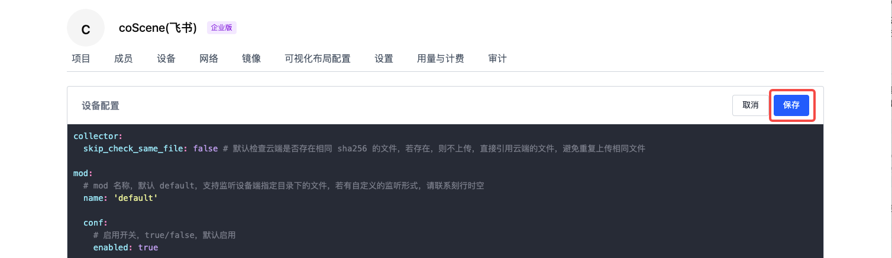

# 设备配置

## 简介

<div style={
{ 
    padding: '12px 16px', backgroundColor: '#EFF6FF', borderRadius: '4px',  border: '1px solid', borderColor: '#2563EB', color: '#111827' }
}>
<p style={{margin: 0}}>🤖 权限：**仅组织管理员**可编辑设备配置信息</p>
</div>
<br />

设备配置用于统一管理数采客户端及项目中的相关数采信息，主要包含以下内容：
1. **设备注册信息**
   - 用于预定义设备 ID 的获取位置
   - 仅在设备首次注册时生效

2. **监听与采集信息**
   - 定义监听目录、采集目录
   - 与手动采集、规则采集配合使用

3. **设备属性信息**
   - 定义项目规则中可使用的 topic
   - 定义从设备文件中读取附加信息

注意：除设备注册信息外，其他配置项均支持自动更新。已启用的设备客户端会每隔 1 分钟自动同步云端配置。

## 入口

在组织管理页面的「设备」分页，点击【设备配置】按钮，即可进入配置编辑界面。此处使用 yaml 语言进行编辑操作。


完成配置后点击【保存】，配置将对全组织已启用客户端的设备生效。



## 设备配置内容详解 {#device-collector-format}

主要对 5 个模块进行设置：

| 模块名称                    | 功能描述                                                       |
| --------------------------- | -------------------------------------------------------------- |
| 数据收集器设置（collector） | 上传数据前检查云端是否存在相同文件       |
| 存储设置（mod）             | 设备 ID 存放位置；监听目录；客户端初始化监听时间范围；采集目录 |
| 设备事件属性（device）      | 事件的属性值                                                   |
| 规则触发话题（topic）       | 规则触发话题                                                   |
| 上传管理器（upload）       | 上传管理器                                                   |

示例模板如下：

```yaml
collector:
  skip_check_same_file: false # 默认检查云端是否存在相同 sha256 的文件，若存在，则不上传，直接引用云端的文件，避免重复上传相同文件

mod:
  # mod 名称，默认 default
  name: 'default' 

  conf:
    # 启用开关，true/false，默认启用
    enabled: true 
    
    # 假设机器端存在 /home/coscene/example.yaml 文件，其内容为
    # serial_num: 1234
    #
    # 则对应的配置，在机器注册阶段会读取 example.yaml 的 serial_num 字段的值（1234）作为机器的唯一标识码
    sn_file: /home/coscene/example.yaml
    sn_field: serial_num
    
    # （用于规则采集）设备端的监听目录，作为项目中规则的监听目录
    listen_dirs: 
      - /home/bag/

    # （用于规则采集）当前时间距离文件更新时间超出 {skip_period_hours} 小时的时候，文件不会被监听
    skip_period_hours: 2

    # （用于手动采集与规则采集）设备端的采集目录，作为项目中手动采集与规则采集的指定目录
    collect_dirs: 
      - /home/bag/
      - /home/log/

    # （用于规则采集）递归遍历所有子文件夹设置，针对监听目录和采集目录，是否遍历填写目录下的所有嵌套子文件夹，默认为否
    recursively_walk_dirs: true

    # （用于手动采集）手动采集时指定上传额外文件，支持文件夹和文件，填写绝对路径；支持特定的时间变量模版
    # 若在文件夹路径后加 `/`，则会直接上传该路径下的所有文件
    # 若不在文件夹路径后加 `/`，则会上传该文件夹
    additional_files:
      - /home/just2004noetic/Downloads/testcase
      - /additional_files/{{start_time.format('YYYY-MM-DD')}}/log/

# （用于规则采集）假设机器端存在 /home/coscene/device.yaml 文件，其内容为
# soft_version: v1.0
#
# 则设备触发规则后，将读取 device.yaml 文件中的 soft_version: v1.0 作为生成事件的属性值
# 若要查看事件统计面板，请联系刻行时空
device:
  extra_files:
    - /home/coscene/device1.yaml
    - /home/coscene/device2.yaml

# （用于规则采集）话题，作为项目中规则触发话题的选项来源，以缩小规则匹配的范围
# 假设存在 /error_code 话题
topics:
  - /error_code

# 上传管理器相关配置
upload:
  rate_limit: 5MB
```

### 数据收集器设置（collector）

此模块用于设置是否对待上传的数据进行检查，相同 sha256 的文件会被跳过上传，直接引用云端的文件，减少数据上传量，提升数据采集效率。

```yaml
collector:
  skip_check_same_file: false # 默认检查云端是否存在相同 sha256 的文件，若存在，则不上传，直接引用云端的文件，避免重复上传相同文件
```

### 存储设置（mod）

主要负责设置设备端数据的存储地址相关信息：

- `name`：名称默认名称 `default`。

- `enabled`：启用开关，`true/false`，默认启用。

- `sn_file`：
  - 选填项
  - 假设机器端存在对应文件（如 `/home/coscene/example.yaml`），其内容包含设备唯一标识码（如 `serial_num: 1234`），则在机器注册阶段会读取该文件指定字段的值（`1234`）作为机器的唯一标识码。

- `sn_field`：
  - 选填项
  - 对应标识码字段名

- `skip_period_hours`：用于规则采集，若当前时间距离文件更新时间超出设定时间，文件不会被监听。

- `recursively_walk_dirs`：用于规则采集，当监听和采集目录存在子文件夹，是否遍历嵌套子文件夹中的文件。默认为否，只读取当前文件夹下的一级所有文件

- `listen_dirs`：
  - 用于规则采集
  - 选填项
  - 设备端的监听目录，作为项目中规则的监听目录
  - 若不使用监听文件的方式，可在设备端安装 [coListener](https://github.com/coscene-io/coListener/tree/cpp) 实时监听设备端 topic 数据

- `collect_dirs`：设备端的采集目录，作为项目中手动采集与规则采集的指定目录。

- `additional_files`：
  - 用于手动采集
  - 选填项
  - 手动采集时，支持补充采集额外的文件信息（如地图、日志等）。支持填写文件夹以及文件绝对路径，文件夹会递归遍历所有的子文件
  - 路径支持模版变量信息，如 `/home/{{start_time.format('YYYY-MM-DD')}}/log`, 模版变量在采集任务中会替换成对应的采集任务时间信息，依据选择的采集开始和截止时间修改，变量会绑定更新，渲染为对应的值。具体的语法请参考 [模板语法使用](#模板语法使用)
  - 若在文件夹路径后加 `/`，则会直接上传该路径下的所有文件；若不在文件夹路径后加 `/`，则会上传该文件夹

```yaml
mod:
  # mod 名称，默认 default
  name: 'default' 

  conf:
    # 启用开关，true/false，默认启用
    enabled: true 
    
    # 假设机器端存在 /home/coscene/example.yaml 文件，其内容为
    # serial_num: 1234
    #
    # 则对应的配置，在机器注册阶段会读取 example.yaml 的 serial_num 字段的值（1234）作为机器的唯一标识码
    sn_file: /home/coscene/example.yaml
    sn_field: serial_num
    
    # （用于规则采集）设备端的监听目录，作为项目中规则的监听目录
    listen_dirs: 
      - /home/bag/

    # （用于规则采集）当前时间距离文件更新时间超出 {skip_period_hours} 小时的时候，文件不会被监听
    skip_period_hours: 2

    # （用于手动采集与规则采集）设备端的采集目录，作为项目中手动采集与规则采集的指定目录
    collect_dirs: 
      - /home/bag/
      - /home/log/

    # （用于规则采集）递归遍历所有子文件夹设置，针对监听目录和采集目录，是否遍历填写目录下的所有嵌套子文件夹，默认为否
    recursively_walk_dirs: true

    # （用于手动采集）手动采集时指定上传额外文件，支持文件夹和文件，填写绝对路径；支持特定的时间变量模版
    # 若在文件夹路径后加 `/`，则会直接上传该路径下的所有文件
    # 若不在文件夹路径后加 `/`，则会上传该文件夹
    additional_files:
      - /home/just2004noetic/Downloads/testcase
      - /additional_files/{{start_time.format('YYYY-MM-DD')}}/log/
```

### 设备事件属性（device）

假设机器端存在特定文件（如 `/home/coscene/device.yaml`，内容为 `soft_version: v1.0`），则设备触发规则后，将读取该文件中的指定内容（如 `soft_version: v1.0`）作为生成事件的属性值。还可通过 `extra_files` 配置其他相关文件。

```yaml
# （用于规则采集）假设机器端存在 /home/coscene/device.yaml 文件，其内容为
# soft_version: v1.0
#
# 则设备触发规则后，将读取 device.yaml 文件中的 soft_version: v1.0 作为生成事件的属性值
# 若要查看事件统计面板，请联系刻行时空
device:
  extra_files:
    - /home/coscene/device1.yaml
    - /home/coscene/device2.yaml
```

### 规则触发话题（topics）

话题作为项目中规则触发话题的选项来源，可缩小规则匹配的范围，提高监听效率。例如，假设存在 `error_code` 话题，可进行如下配置：

```yaml
# （用于规则采集）话题，作为项目中规则触发话题的选项来源，以缩小规则匹配的范围
# 假设存在 error_code 话题
topics:
  - error_code
```

### 上传管理器（upload）

用于控制上传过程中部分功能，例如上传速度限制。

```yaml
upload:
  # 控制上传上限速度，0MB 表示不限速，支持单位 MB，MiB，KB，KiB
  rate_limit: 5MB

```

---
## 模板语法使用
模板语法是一种动态生成字符串的强大工具，特别适用于根据时间范围动态生成文件路径和文件名。基于 [Handlebars](https://handlebarsjs.com/) 模板引擎，集成了 [Day.js](https://day.js.org/) 时间处理库。

通过掌握这些模板语法，您可以轻松创建动态的文件路径和文件名，大大提高数据管理的灵活性和自动化程度。 

### 支持的变量

目前支持以下两个时间变量：

- `start_time` - 当前采集任务的开始时间
- `end_time` - 当前采集任务的结束时间

基本模板格式：

```
{{变量名.format('格式字符串')}}
```

示例：

```javascript
// 基本用法
'{{start_time.format("YYYY-MM-DD")}}'
// 输出: "2021-01-01"

// 组合使用
'data/{{start_time.format("YYYY")}}/{{start_time.format("MM")}}/file.log'
// 输出: "data/2021/01/file.log"
```

### 时间格式化
基于 [Day.js 格式化文档](https://day.js.org/docs/en/display/format)，支持以下格式：

| 格式 | 输出 | 描述 |
|------|------|------|
| `YYYY` | 2021 | 四位年份 |
| `YY` | 21 | 两位年份 |
| `MM` | 01-12 | 月份（补零） |
| `M` | 1-12 | 月份 |
| `DD` | 01-31 | 日期（补零） |
| `D` | 1-31 | 日期 |
| `HH` | 00-23 | 小时（补零） |
| `H` | 0-23 | 小时 |
| `mm` | 00-59 | 分钟（补零） |
| `m` | 0-59 | 分钟 |
| `ss` | 00-59 | 秒（补零） |
| `s` | 0-59 | 秒 |

格式化示例：

```javascript
// 日期格式
'{{start_time.format("YYYY-MM-DD")}}'          // 2021-01-01
'{{start_time.format("YYYY/MM/DD")}}'          // 2021/01/01
'{{start_time.format("MM-DD-YYYY")}}'          // 01-01-2021

// 时间格式
'{{start_time.format("HH:mm:ss")}}'            // 10:30:00
'{{start_time.format("HH-mm")}}'               // 10-30

// 组合格式
'{{start_time.format("YYYY-MM-DD HH:mm:ss")}}' // 2021-01-01 10:30:00
'{{start_time.format("YYYYMMDD_HHmmss")}}'     // 20210101_103000

// 按年月日组织的文件夹结构
'logs/{{start_time.format("YYYY")}}/{{start_time.format("MM")}}/{{start_time.format("DD")}}'
// 输出: logs/2021/01/01

// 时间范围文件夹
'data/{{start_time.format("YYYY-MM-DD")}}_to_{{end_time.format("YYYY-MM-DD")}}'
// 输出: data/2021-01-01_to_2021-01-02
```

### 参考文档

- [Handlebars 官方文档](https://handlebarsjs.com/guide/)
- [Day.js 官方文档](https://day.js.org/docs/en/display/format)
- [Day.js 格式化选项](https://day.js.org/docs/en/display/format#list-of-all-available-formats)

---

通过以上详细步骤和说明，管理员可全面、准确地对设备数采客户端进行配置，确保设备数据采集工作的高效运行。

如有任何疑问，请随时联系我们获取支持。
