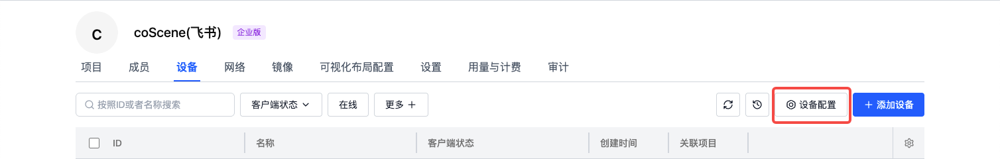

# 设备配置

## 简介

<div style={
{ 
    padding: '12px 16px', backgroundColor: '#EFF6FF', borderRadius: '4px',  border: '1px solid', borderColor: '#2563EB', color: '#111827' }
}>
<p style={{margin: 0}}>🤖 权限：**仅组织管理员**可编辑设备配置信息</p>
</div>
<br />

设备配置用于统一管理数采客户端及项目中的相关数采信息，主要包含以下内容：
1. **设备注册信息**
   - 用于预定义设备 ID 的获取位置
   - 仅在设备首次注册时生效

2. **监听与采集信息**
   - 定义监听目录、采集目录
   - 与手动采集、[规则采集](../use-case/data-diagnosis/1-intro.md)配合使用

3. **设备属性信息**
   - 定义项目规则中可使用的 topic
   - 定义从设备文件中读取附加信息

注意：除设备注册信息外，其他配置项均支持自动更新。已启用的设备客户端会每隔 1 分钟自动同步云端配置。

## 入口

在组织管理页面的「设备」分页，点击【设备配置】按钮，即可进入配置编辑界面。此处使用 yaml 语言进行编辑操作。



完成配置后点击【保存】，配置将对全组织已启用客户端的设备生效。


## 设备配置内容详解 {#device-collector-format}

主要对 4 个模块进行设置：

| 模块名称                    | 功能描述                                                       |
| --------------------------- | -------------------------------------------------------------- |
| 数据收集器设置（collector） | 上传数据前检查云端是否存在相同文件       |
| 存储设置（mod）             | 设备 ID 存放位置；监听目录；客户端初始化监听时间范围；采集目录 |
| 设备事件属性（device）      | 事件的属性值                                                   |
| 规则触发话题（topic）       | 规则触发话题                                                   |

示例模板如下：

```yaml
collector:
  skip_check_same_file: false # 默认检查云端是否存在相同 sha256 的文件，若存在，则不上传，直接引用云端的文件，避免重复上传相同文件

mod:
  # mod 名称，默认 default，支持监听设备端指定目录下的文件，若有自定义的监听形式，请联系刻行时空
  name: 'default' 

  conf:
    # 启用开关，true/false，默认启用
    enabled: true 
    
    # 假设机器端存在 /home/coscene/example.yaml 文件，其内容为
    # serial_num: 1234
    #
    # 则对应的配置，在机器注册阶段会读取 example.yaml 的 serial_num 字段的值（1234）作为机器的唯一标识码
    sn_file: /home/coscene/example.yaml
    sn_field: serial_num
    
    # 设备端的监听目录，作为项目中规则的监听目录
    listen_dirs: 
      - /home/bag/

    # 当前时间距离文件更新时间超出 {skip_period_hours} 小时的时候，文件不会被监听/采集
    skip_period_hours: 2

    # 设备端的采集目录，作为项目中数据采集任务与规则采集的指定目录
    collect_dirs: 
      - /home/bag/
      - /home/log/

# 假设机器端存在 /home/coscene/device.yaml 文件，其内容为
# soft_version: v1.0
#
# 则设备触发规则后，将读取 device.yaml 文件中的 soft_version: v1.0 作为生成事件的属性值
# 若要查看事件统计面板，请联系刻行时空
device:
  extra_files:
    - /home/coscene/device1.yaml
    - /home/coscene/device2.yaml

# 话题，作为项目中规则触发话题的选项来源，以缩小规则匹配的范围
# 假设存在 /error_code 话题
topics:
  - /error_code
```

### 数据收集器设置（collector）

此模块用于设置是否对待上传的数据进行检查，相同 sha256 的文件会被跳过上传，直接引用云端的文件，减少数据上传量，提升数据采集效率。

```yaml
collector:
  skip_check_same_file: false # 默认检查云端是否存在相同 sha256 的文件，若存在，则不上传，直接引用云端的文件，避免重复上传相同文件
```

### 存储设置（mod）

主要负责设置设备端数据的存储地址相关信息：

- `name`：名称默认名称 `default`，支持监听设备端指定目录下的文件，如有自定义监听形式，请联系刻行时空。

- `conf`：启用开关，`true/false`，默认启用。

- `sn_file`：
  - 选填项
  - 假设机器端存在对应文件（如 `/home/coscene/example.yaml`），其内容包含设备唯一标识码（如 `serial_num: 1234`），则在机器注册阶段会读取该文件指定字段的值（`1234`）作为机器的唯一标识码。

- `sn_field`：
  - 选填项
  - 对应标识码字段名

- `skip_period_hours`：若当前时间距离文件更新时间超出设定时间，文件不会被监听/采集。

- `listen_dirs`：
  - 选填项
  - 设备端的监听目录，作为项目中规则的监听目录
  - 若不使用监听文件的方式，可在设备端安装 [coListener](https://github.com/coscene-io/coListener/tree/cpp) 实时监听设备端 topic 数据，

- `collect_dirs`：设备端的采集目录，作为项目中数据采集任务与规则采集的指定目录。

```yaml
mod:
  # mod 名称，默认 default，支持监听设备端指定目录下的文件，若有自定义的监听形式，请联系刻行时空
  name: 'default' 

  conf:
    # 启用开关，true/false，默认启用
    enabled: true 
    
    # 假设机器端存在 /home/coscene/example.yaml 文件，其内容为
    # serial_num: 1234
    #
    # 则对应的配置，在机器注册阶段会读取 example.yaml 的 serial_num 字段的值（1234）作为机器的唯一标识码
    sn_file: /home/coscene/example.yaml
    sn_field: serial_num
    
    # 设备端的监听目录，作为项目中规则的监听目录
    listen_dirs: 
      - /home/bag/

    # 当前时间距离文件更新时间超出 {skip_period_hours} 小时的时候，文件不会被监听/采集
    skip_period_hours: 2

    # 设备端的采集目录，作为项目中数据采集任务与规则采集的指定目录
    collect_dirs: 
      - /home/bag/
      - /home/log/
```

### 设备事件属性（device）

假设机器端存在特定文件（如 `/home/coscene/device.yaml`，内容为 `soft_version: v1.0`），则设备触发规则后，将读取该文件中的指定内容（如 `soft_version: v1.0`）作为生成事件的属性值。还可通过 `extra_files` 配置其他相关文件。

```yaml
# 假设机器端存在 /home/coscene/device.yaml 文件，其内容为
# soft_version: v1.0
#
# 则设备触发规则后，将读取 device.yaml 文件中的 soft_version: v1.0 作为生成事件的属性值
# 若要查看事件统计面板，请联系刻行时空
device:
  extra_files:
    - /home/coscene/device1.yaml
    - /home/coscene/device2.yaml
```

### 规则触发话题（topics）

话题作为项目中规则触发话题的选项来源，可缩小规则匹配的范围，提高监听效率。例如，假设存在 `error_code` 话题，可进行如下配置：

```yaml
# 话题，作为项目中规则触发话题的选项来源，以缩小规则匹配的范围
# 假设存在 error_code 话题
topics:
  - error_code
```

---

通过以上详细步骤和说明，管理员可全面、准确地对设备数采客户端进行配置，确保设备数据采集工作的高效运行。

如有任何疑问，请随时联系我们获取支持。
