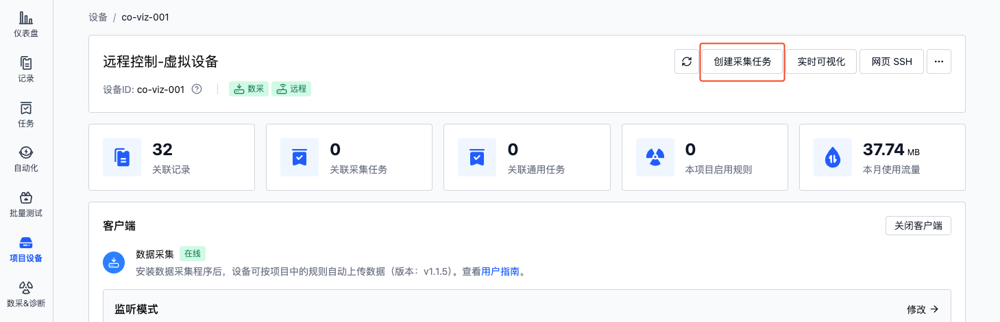
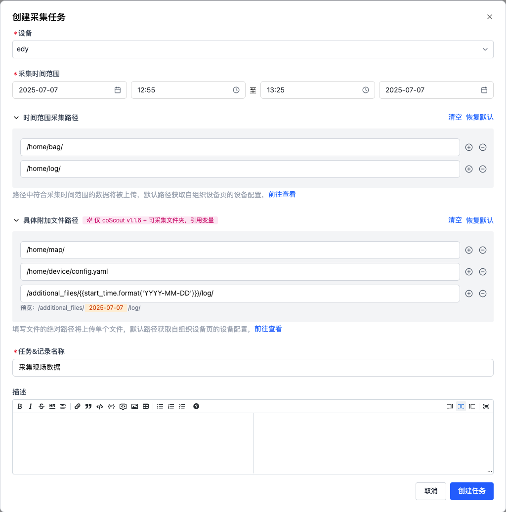
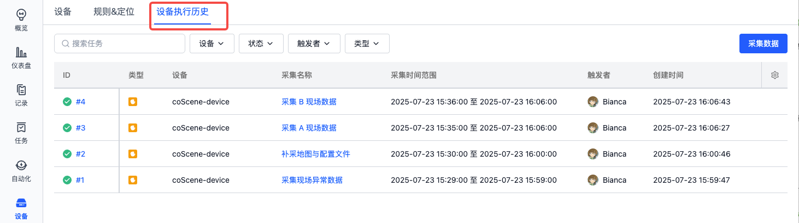
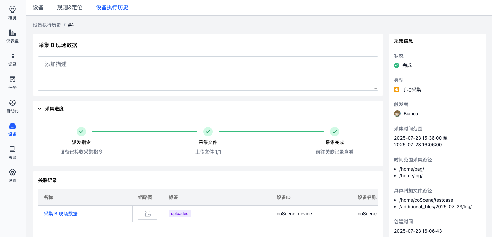
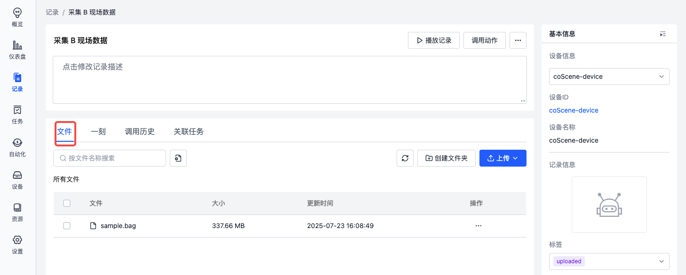
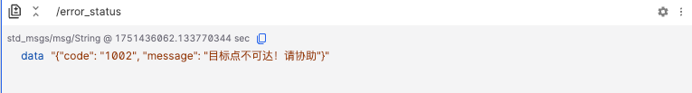
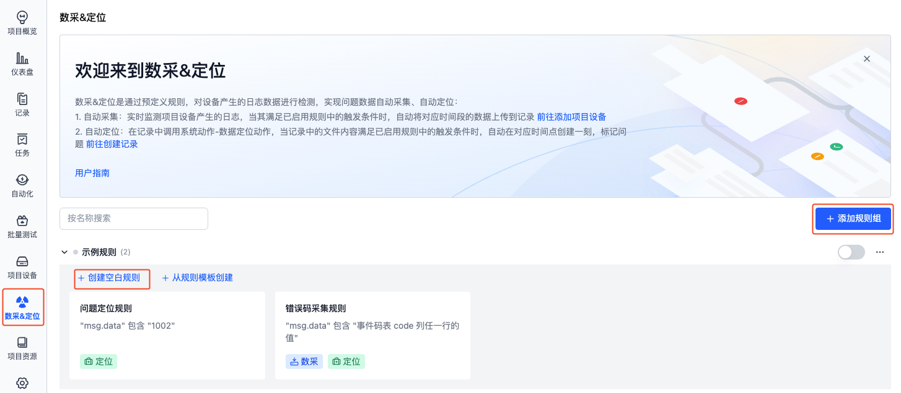
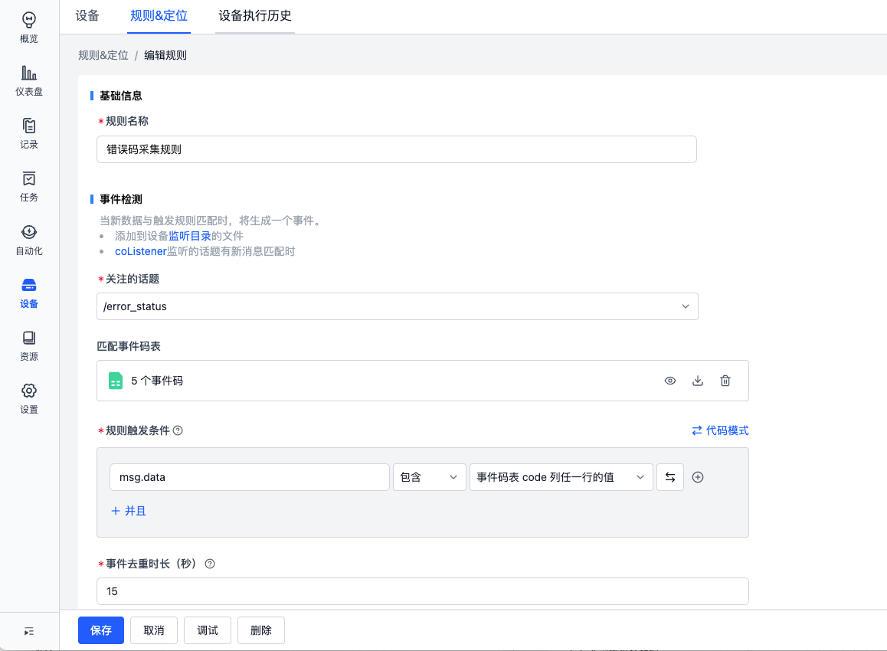
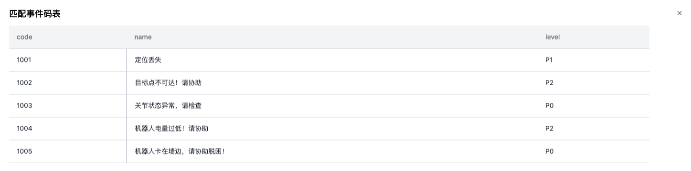
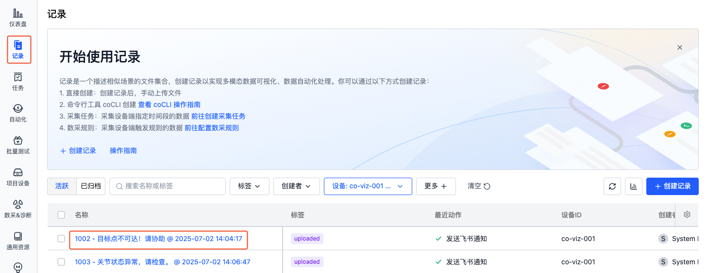

# 采集设备数据

平台提供多模式数据采集能力，以支持不同场景的数据获取需求。包括：

1. **手动采集**
   - 自由指定采集时间范围与目标路径
   - 适用于：问题排查、定向数据抓取、临时数据分析
2. **规则引擎驱动采集**
   - 实时监测设备消息流，动态触发采集
   - 适用于：事件码、阈值告警、异常监测，实现无人值守自动化采集
3. **可视化联动采集**
   - 结合实时图像与三维界面，即时启停采集
   - 适用于：场景联动采集，灵活控制采集时间

## 手动采集 {#manual-collection}

> 前提条件：已完成设备注册与启用，且将设备添加到项目中，详见[添加设备](./2-create-device.md)

手动采集是指从设备上采集已存在文件，例如：日志文件、图片文件、配置文件等。

1. 在项目设备页面，选择设备，点击采集数据

   

2. 选择需要采集的时间范围、采集路径、采集名称与记录名称，开始采集

   

    - **采集时间范围**
      - 时间判断依据：文件的创建时间与最后修改时间
      - 注：部分文件系统可能无法获取文件创建时间，仅根据最后修改时间判断文件是否在时间范围内
    - **时间范围采集路径**
      - 输入需要根据时间范围进行采集的绝对文件路径，如：`/home/bag/`，系统将采集该路径下（包括子文件夹）所有符合时间范围的文件
      - 建议在[组织设备配置](./4-device-collector.md#数据收集器设置collector)中，将该路径设置为默认采集路径`collect_dirs`，以便后续无需手动输入
    - **具体附加文件路径**
      - 输入需要额外采集的绝对文件路径(文件夹/文件)，与时间范围无关，如：`/home/map/`、`/home/device/config.yaml`，系统将采集整个文件夹中的文件或指定的文件
      - 建议在[组织设备配置](./4-device-collector.md#数据收集器设置collector)中，将该路径设置为默认采集路径`additional_files`，以便后续无需手动输入
    - **采集名称&记录名称**
      - 采集名称：用于标识该次采集
      - 记录名称：用于标识该次采集将数据保存到的记录

3. 采集过程中，可在设备执行历史中查看采集进度

   
   

4. 采集完成后，数据将自动上传至记录中

   
   

## 规则引擎驱动采集

> 前提条件：已完成设备注册与启用，且将设备添加到项目中，详见[添加设备](./2-create-device.md)

系统会根据设备所属项目中的规则，监听设备消息流，采集触发规则时间点前后一段时间的数据，如：

- **监听话题（topic）采集**：实时监听设备 topic，当消息触发规则时，自动上传数据
- **监听 bag/mcap 采集**：当 bag/mcap 写入完成时，对文件内容进行规则匹配，自动上传数据

### 数据格式

详见[特定数据格式](../use-case/data-diagnosis/3-add-rule.md#特定数据格式)

### 配置监听/采集目录

> 仅组织管理员可配置

在组织管理-设备-设备配置中，输入需要监听与采集的目录，即：`listen_dirs`、`collect_dirs`。如需监听 topic 进行采集，则增加定义 `topics`。详见[设备配置](./4-device-collector.md#device-collector-format)

### 监听 topic 采集

以监听设备端 topic `/error_status` 为例，当该 topic 的 `data` 字段中出现事件码 `1001 ~ 1005` 时，自动采集该时间点前 5 分钟后 1 分钟的数据，保存到记录。消息内容如下：

    

1.  确认已在设备端安装并启用话题监听器（[coListener](https://github.com/coscene-io/coListener/tree/cpp)），该节点是 ROS 套件中的一部分，若已安装并启用 ROS node，则无需再次安装：
    - 查看 [coListener 安装教程](../client/2-apt-source-install.md)
    - 启用 coListener

      ROS1：

      ```
      roslaunch colistener colistener.launch
      ```

      ROS2：

      ```
      ros2 launch colistener colistener.launch.xml
      ```

2.  在项目中添加并启用规则
    - 在项目的「设备-规则&定位」页面，添加规则

      
      

    - 输入事件检测信息
      - 关注的话题：选择需要监听的 topic `/error_status`
      - 事件码表：上传符合格式的 csv/json 文件，用于判断 topic 消息中是否包含 `code` 列中的内容，如下图：

        

      - 规则触发条件：mag.data 包含事件码表 code 列任一行的值
        - 若 data 字段为数组，则可切换为「代码模式」，输入： msg.data.exists(x, x.code.contains(scope.code))，示例消息如下：

          ```
          {
            "events_count": 3,
            "events_info": [{
              	"code": "10031",
            		"msg": "camera disconnected",
            		"level": "p1"
            	},
            	{
              	"code": "20256",
              	"msg": "navigate to workstation failed",
              	"level": "p2"
              },
              {
              	"code": "30221",
              	"msg": "low battery",
              	"level": "p1"
              }
            ]
          }
          ```

      上述信息表示：监听 topic `/error_status`，判断其字段 `data` 的消息中，是否包含关键词 `1001 ~ 1005`

    - 采集数据
      - 时间范围：
        - 采集 `collect_dirs` 中，在触发时间点前 5 分钟，后 1 分钟的文件
        - 时间判断依据：根据文件内容获取起止时间
      - 记录：用于标识每次采集将数据保存到的记录
        - 如：`code: {scope.code}-name: {scope.name}`，当触发了事件码`1002`时，本次采集的数据将生成一条名为「code:1002-name:目标点不可达！请协助」的记录
    - 关键时刻定位
      - 当数据上传到记录后，自动在触发时间点「创建一刻」，标记关键时刻，便于后续分析问题
    - 启用规则
      - 规则启用后，项目设备才会使用该规则进行数据监听

      

3.  查看采集结果

    当设备端监听的 topic 发出的消息触发规则时，将自动上传数据到记录中

        

### 监听 bag/mcap 采集

同监听 topic 采集的 2-3 步骤，无需使用 coListener。

注意：仅支持监听完整的 bag/mcap，暂不支持监听与采集 bag.active。如需采集完整的 bag 文件，可将采集数据的时间范围设置为「采集后 n 分钟」，等待 bag 写入完成后进行采集。

## 可视化联动采集

详见[异构机器人数据采集工厂](../use-case/5-heterogeneous-robot-data-factory.md)

## 了解更多

- [添加规则](../use-case/data-diagnosis/3-add-rule.md)
- 采集完成后自动发送通知
  - [创建发送通知的动作](../6-automation/3-create-action.md#添加http-请求步骤创建动作)
  - [当采集完成后触发动作](../6-automation/4-trigger.md#collect-status-change)
- [可视化回放数据](../viz/1-about-viz.md)
