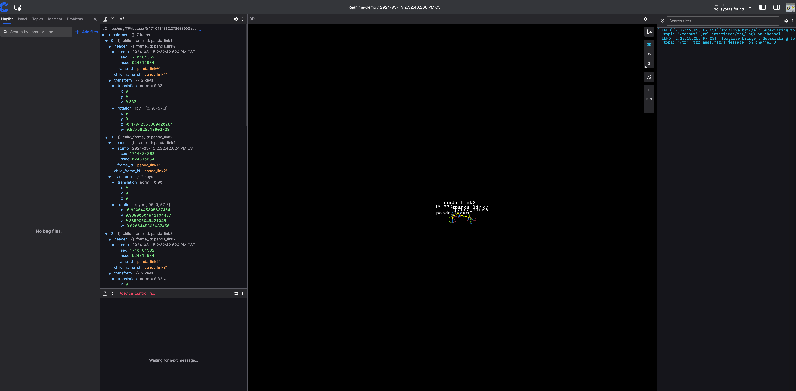
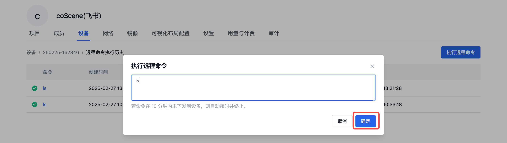

# 远程连接设备

在刻行时空平台可以实时远程操作设备，例如远程下发命令，SSH 连接等操作，提升运维能力。

## 前提条件

1. 设备端已经安装刻行时空相关的设备端程序，详见[设备端安装](./2-create-device.md#add-device-from-device)。
2. 组织管理员已经启用设备，允许进行远程控制设备，详见[设备启用](./3-manage-device.md#enable-device)。
3. 设备已添加到项目中，详见[分配设备到项目](./3-manage-device.md#assign-devices-to-projects)。

## 实时可视化{#realtime-visualization}

> 前提条件：
>
> 确认已在设备端安装并启动  [coBridge](https://github.com/coscene-io/coBridge) 组件：coBridge 是一个独立的 ROS 节点，负责通过 WebSocket 协议将设备数据实时传输到前端。该节点是 ROS 套件中的一部分，若已安装并启用 ROS node，则无需再次安装
> 
> - 查看 [coBridge 安装教程](../client/2-apt-source-install.md)
> - 运行与启动：
> 
> ```bash
> # for ros 1 distribution
> roslaunch cobridge cobridge.launch
>
> # for ros 2 distribution
> ros2 launch cobridge cobridge_launch.xml
> ```
>
> - 强烈建议使用 coBridge 源码编译出可执行文件([编译流程文档](https://github.com/coscene-io/coBridge/blob/main/README.zh-CN.md))，将其整合进机器人软件中，并在机器人启动脚本添加启动命令。
> 
> - coBridge 节点启动后，配合 virmesh 映射的外网地址及端口，可在网页端实现订阅机器人 topic，下发 service 等操作，实现对机器人的远程实时可视化。

在「项目-设备」页面查看设备，当客户端状态为在线时，设备会出现【实时可视化】的按钮，点击之后即可查看机器的实时情况。


在实时可视化页面，通过配置三维、原始消息、服务调用、远程操纵等面板，可以更直观地调试设备。详见[面板介绍](../viz/4-panel/1-panel-overview.md)。



## 网页 SSH

在「项目-设备」页面查看设备，当客户端状态为在线时，设备会出现【网页 SSH】按钮，点击后即可在网页中 SSH 连接机器。


网页 SSH 支持文件上传与下载，详见 [Trzsz 文件传输工具](https://trzsz.github.io/cn/)：
- 上传本地文件到远程设备：`trz file1`
- 下载远程设备文件到本地：`tsz file1 file2 file3`

## 远程命令

在「项目-设备」页面查看设备，当客户端状态为在线时，点击【远程命令】按钮，即可对设备下发命令，执行特定的任务。若要对多台设备同时下发命令，参见[批量执行命令](./6-batch-device-operations.md#batch-remote-command)。


点击【执行远程命令】按钮，在弹窗中输入需要执行的命令，点击【确认】后，即可在设备上执行命令。



等待命令执行成功后，可以看到日志结果。


## 端口号映射

当机器端没有公网 IP 时，用户无法直接访问机器的端口，而「端口号映射」功能可将机器端的端口进行转发，使得可以被用户在公网进行访问。例如可以将机器端运行的服务暂时暴露，本地连接进行调试等操作。


示例：添加端口映射，在本地浏览器请求映射后的地址，从而查看机器端 `~` 目录下的文件。步骤如下：

1. 网页端配置 9000 端口映射
   

2. 通过网页 SSH 在机器端执行 `python3 -m http.server 9000 -d ~` 启动简易 HTTP Server
   

3. 在浏览器中请求相关地址，发现列举了机器端 `~` 目录下的所有文件信息
   

4. 查看机器端的日志信息，发现浏览器的请求已经转发到了机器端，并且返回了 200 标识请求成功。
   
