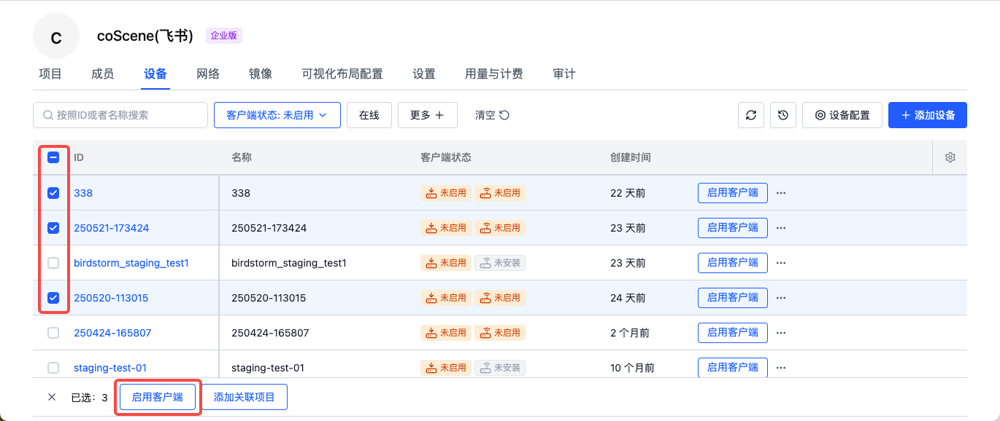
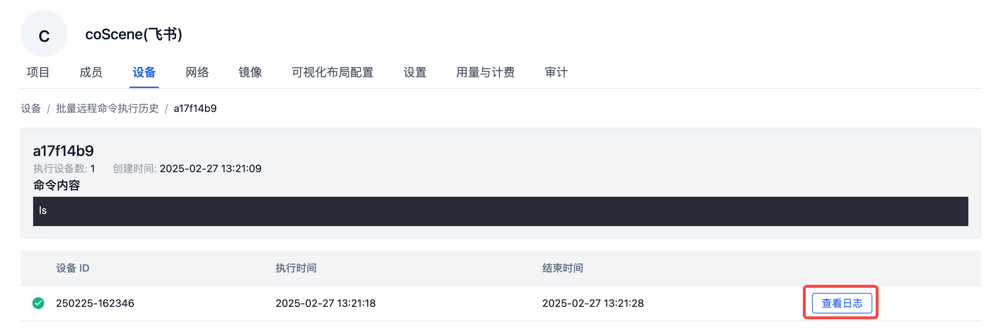

# 批量操作设备
可以同时选择多台设备，进行批量操作。

## 准入数采 {#data-collection-access}
管理员可以选择多台未准入数据采集的设备，点击【准入数采】按钮，批量准入设备。

## 添加关联项目 {#add-associated-projects}
选择需要添加的设备，点击【添加关联项目】按钮，选择需要添加的项目，点击【添加】按钮，即可将设备添加到项目中。

添加成功后在项目设备中查看。

## 批量执行远程命令 {#batch-remote-command}
选择远程在线的设备，点击【批量执行远程命令】按钮，输入需要执行的命令，点击【确定】按钮，即可批量执行命令。
若命令在10分钟内未下发到设备，则自动超时并终止。

等待执行完成后，点击【查看日志】按钮，即可查看执行结果。

查看批量远程命令执行历史

