# 快速开始

## 登录刻行时空

刻行时空的使用角色分为管理员和普通用户，你可以按照角色，创建或进入组织。

### 管理员

1. 通过浏览器访问[刻行时空平台 https://www.coscene.cn/](https://www.coscene.cn)，点击右上角的【快速登录】，进入登录界面。

   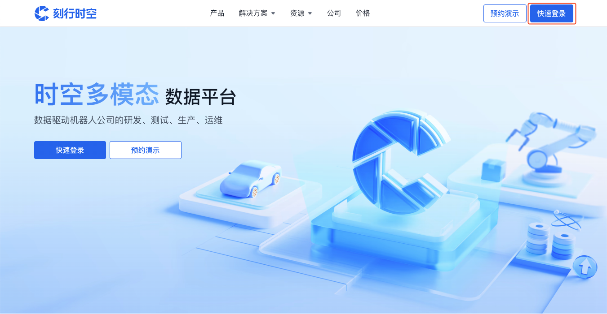

2. 选择登录方式进入平台：邮箱、飞书、钉钉或谷歌企业邮箱。

   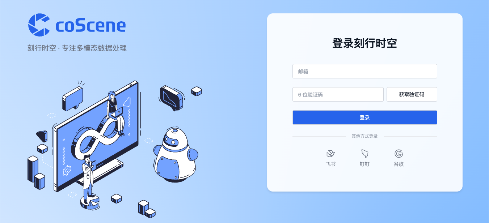

3. 填写「组织名称」与「组织 ID」，勾选「同意」，点击【创建组织】按钮。

   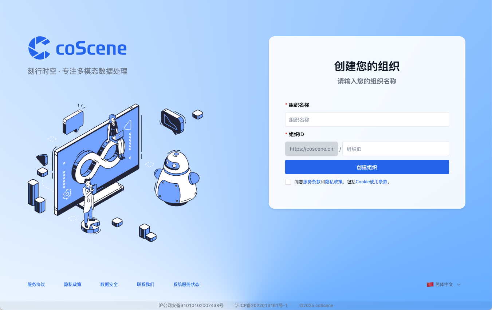

4. 创建成功后，将自动进入组织首页。可以开始[管理你的组织](../collaboration/organization/1-organizations.md)啦。

### 普通用户

> 首先请联系组织管理员，邀请你加入组织。

1. 通过浏览器访问[刻行时空平台 https://www.coscene.cn/](https://www.coscene.cn)，点击右上角的【快速登录】，进入登录界面。

   

2. 选择与你组织一致的登录方式（邮箱、飞书、钉钉或谷歌企业邮箱）进行登录。

   

3. 选择组织后，即可进入组织，开始你的数据之旅啦。

   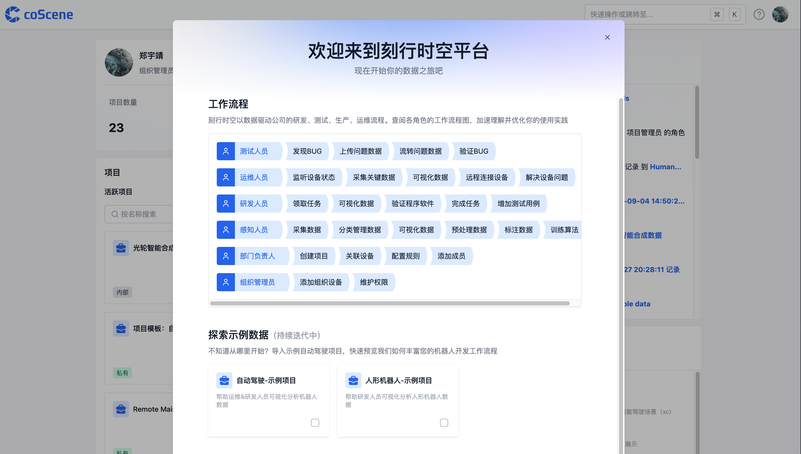

## 管理多模态数据

### 创建项目

项目是数据管理的单元，对于数据的存储、管理、隔离和应用都发生在项目级别。一个项目可以是一个部门、一个项目组或一个业务线。更多关于项目的介绍，请参考[项目](../collaboration/project-collaboration/1-project.md)。

在主页上点击"创建项目"按钮，然后按照指引步骤完成项目创建。


### 创建记录并上传文件

记录是一个描述相似场景的文件集合，用于存储、管理、可视化数据。一条记录中可以存放设备发生一次故障时产生的数据、设备执行一次任务时产生的数据、待标注的一小段数据集，如 ROS Bag、日志、地图、配置文件、图片与视频等。更多关于记录的介绍，请参考[记录](../collaboration/record/1-quick-start-record.md)。

1.  在项目左侧边栏，选择「记录」，点击【创建记录】按钮。

        

2.  在弹窗中输入记录的名称等相关信息，点击【创建】按钮。

        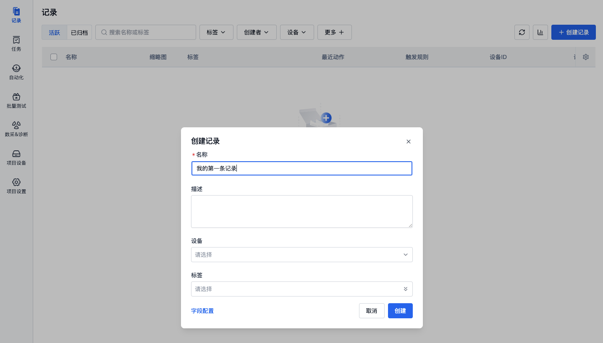

3.  创建完成后，自动进入记录详情页，点击【上传】按钮上传 bag/mcap 文件，或点击[下载示例文件](https://coscene-artifacts-prod.oss-cn-hangzhou.aliyuncs.com/docs/example/viz/scene-0001.mcap)后上传。

        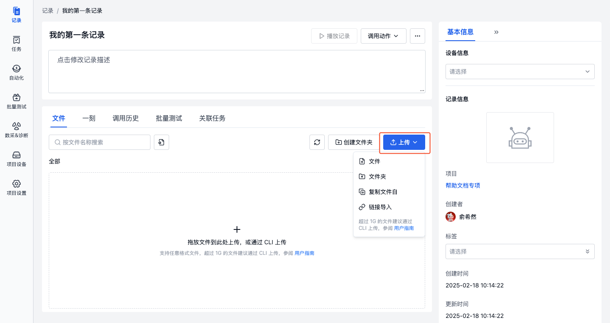

### 可视化播放记录

数据可视化界面通过可配置的「面板」和「布局」，将设备数据以直观的可视化方式呈现，助力用户高效分析与诊断各类问题。更多关于可视化的介绍，请参考[可视化数据](../viz/1-about-viz.md)。

1.  在记录中上传 bag/mcap 后，点击【播放记录】，进入可视化页面。

        

2.  在可视化页面的布局栏中，选择【从文件导入】，导入<a href="https://coscene-artifacts-prod.oss-cn-hangzhou.aliyuncs.com/docs/example/viz/nuScenes.json" download="nuScenes.json">示例布局</a>。

        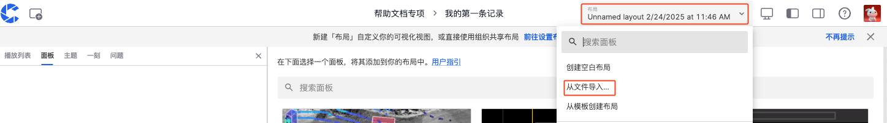

3.  点击底部【播放】按钮开始播放数据。可以通过切换不同的面板（如三维图、曲线图、状态转换图、表格等）来查看数据。更多面板使用说明，请参考[面板介绍](../viz/4-panel/1-panel-overview.md)。

        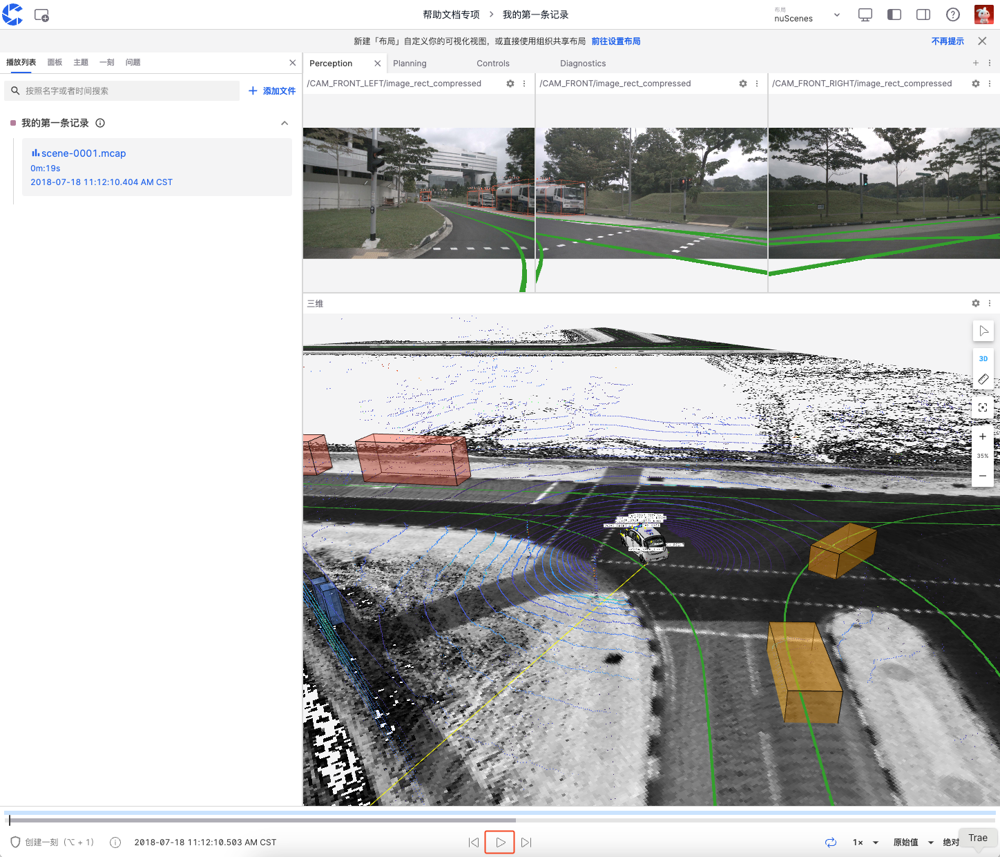

### 创建并分享一刻

在可视化界面播放数据时，你可以通过创建「一刻」来标记重要的时间点或时间段。「一刻」可以帮助你追踪关键数据变化（如设备异常、性能波动）等值得关注的信息，方便后续查看和分析。更多关于一刻的介绍，请参考[一刻](../viz/5-create-moment-viz.md)。

1.  在可视化播放记录时，点击左下角【创建一刻】，可标记一刻的起点。

        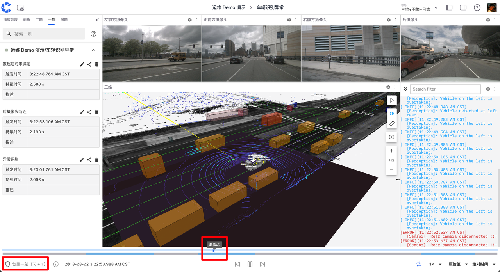

2.  再次点击【创建一刻】以标记一刻的终点。此时会自动弹出创建一刻的窗口，蓝色区域表示一刻的时间范围。

        

3.  填写相关信息后，点击【创建一刻】即可完成。在左侧的一刻面板中查看当前记录的所有一刻。

        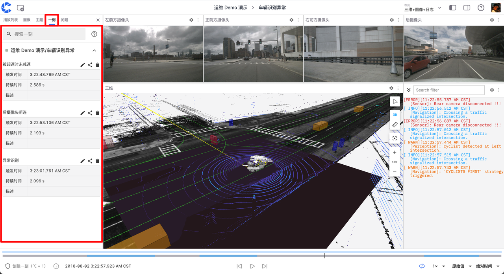

4.  点击分享按钮可将当前一刻的链接分享给其他成员，方便协作分析。

        

## 远程连接设备

设备可以与真实设备建立联系，详见[设备](../device/1-device.md)

### 添加设备

> 前提条件：支持 Linux 设备，arm64 和 x86_64 架构

1.  通过右上角「我的」，进入「组织管理-设备」页面，点击【添加设备】按钮。

        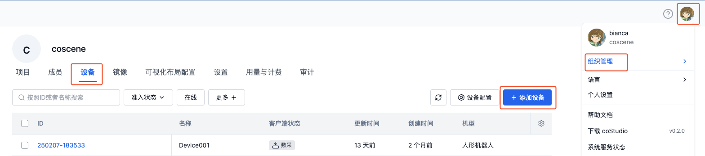

2.  在弹框中，选择【系统生成 ID】，勾选【远程控制】，点击【复制】按钮，复制安装命令。

    - 若要使用自定义的 ID，参见[设备 ID 配置](../device/2-create-device.md#设备-id-配置)
      

3.  在真实设备上打开 shell 终端，执行安装命令，设备端出现 `Installation completed successfully 🎉` 即表示安装成功。

4.  等待 1-2 分钟，设备会自动展示在设备列表中。联系组织管理员，准入设备的使用权限。

    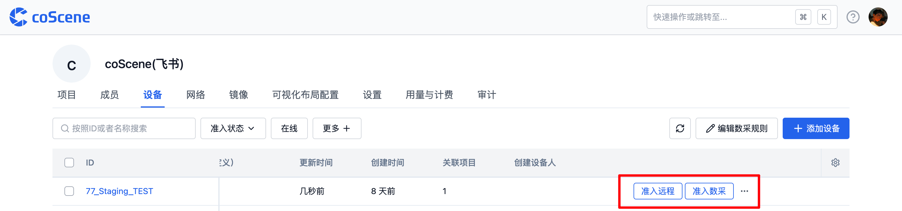

### 网页 SSH

当设备准入后，在「组织管理-设备」页面找到该设备，点击【网页 SSH】按钮即可在浏览器中打开新标签页，远程连接到设备。更多详情请参考[网页 SSH](../device/5-device-remote-control.md#网页-ssh)。

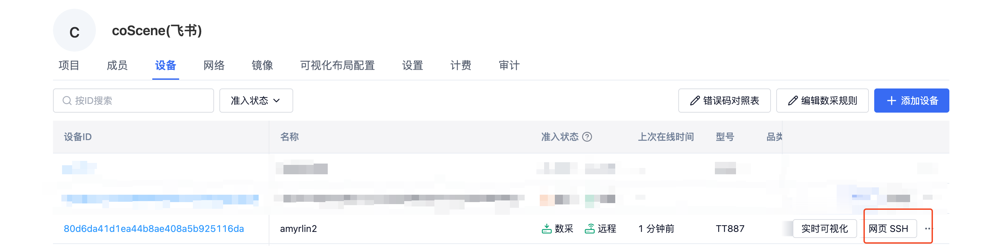


### 实时可视化

> 前提条件：
>
> 1. 安装 coBridge 组件
>    - coBridge 是一个独立的 ROS 节点，负责通过 WebSocket 协议将设备数据实时传输到前端
>    - 支持的 ROS 版本：
>      - ROS1：<u>Noetic Ninjemys</u>、<u>Melodic Morenia</u>
>      - ROS2：<u>Foxy Fitzroy</u>、<u>Galactic Geochelone</u>、<u>Humble Hawksbill</u>
>    - [查看 coBridge 源码（C++）](https://github.com/coscene-io/coBridge)
> 2. 启动 coBridge 节点后，即可在网页端查看设备的实时数据

当设备准入后，在「组织管理-设备」页面找到该设备，点击【实时可视化】按钮即可在浏览器中实时查看设备的运行状态和数据。更多详情请参考[实时可视化](../device/5-device-remote-control.md#实时可视化)。

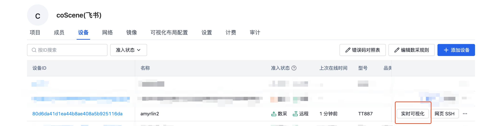

在实时可视化页面，通过配置三维、原始消息、服务调用、远程操纵等面板，可以更直观地调试设备。更多详情请参考[面板介绍](../viz/4-panel/1-panel-overview.md)。

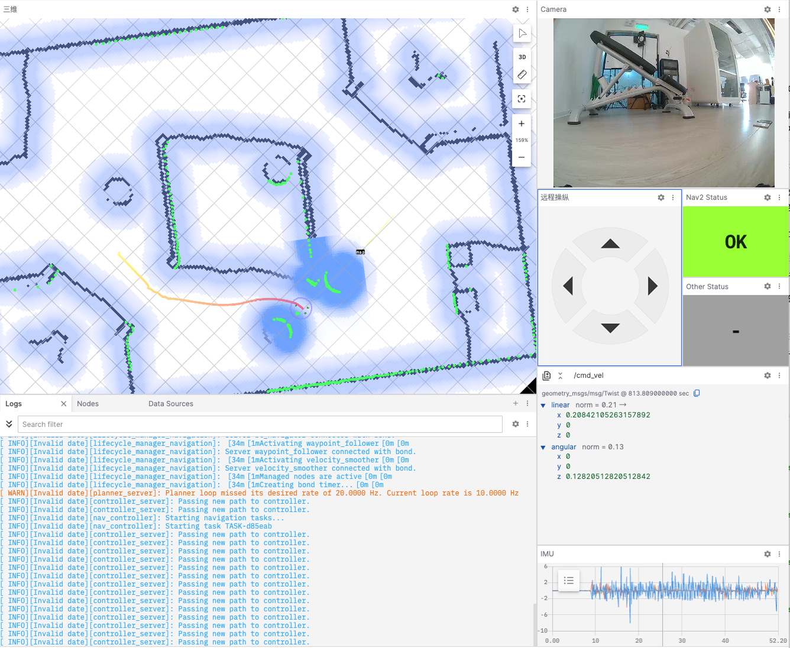

## 采集设备数据

设备可以与真实设备建立连接，作为数据采集的目标对象。在相关记录中，能够额外添加设备信息，进而实现对该设备上传数据的精准检索与全面统计，详见[设备](../device/1-device.md)。

### 添加设备

> 前提条件：支持 Linux 设备，arm64 和 x86_64 架构。

1.  通过右上角「我的」，进入「组织管理-设备」页面，点击【添加设备】按钮。

        

2.  在弹框中，选择【系统生成 ID】，点击【复制】按钮，复制安装命令。

    - 若要使用自定义的 ID，参见[设备 ID 配置](../device/2-create-device.md#设备-id-配置)
      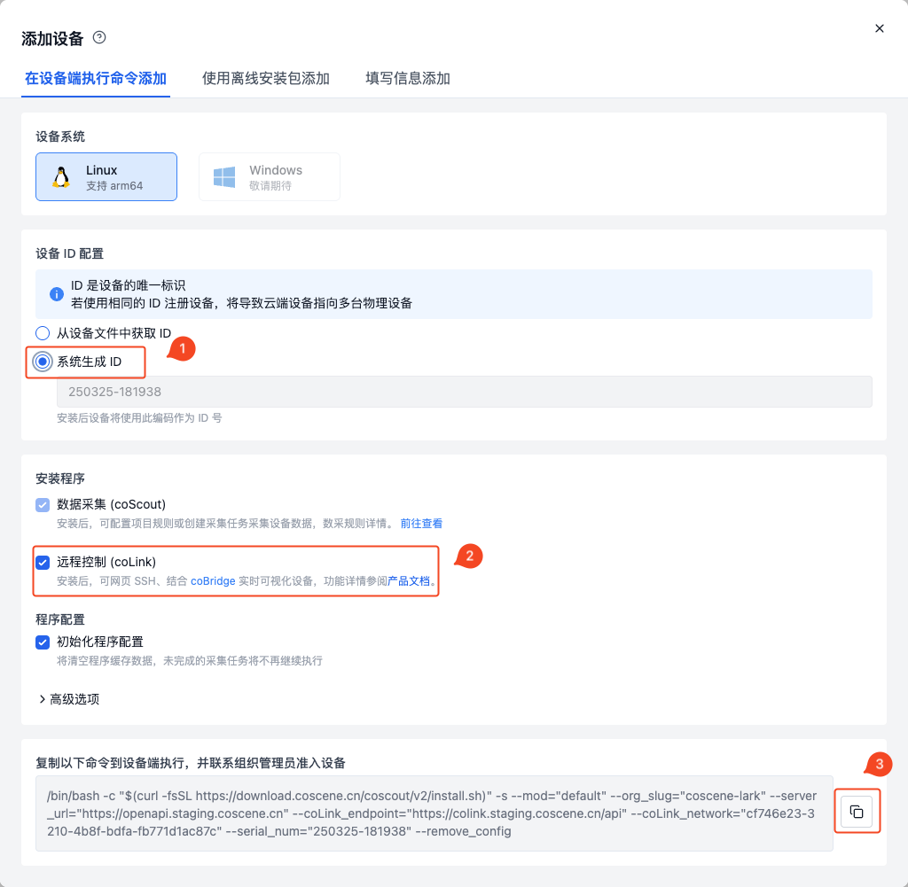

3.  在真实设备上打开 shell 终端，执行安装命令，设备端出现 `Installation completed successfully 🎉` 即表示安装成功。

4.  等待 1-2 分钟，设备会自动展示在设备列表中。联系组织管理员，准入设备的使用权限。

    

### 手动采集数据

1. **将设备添加到项目**：进入「项目设备」页，点击【添加设备】按钮，选择需要采集数据的设备。

   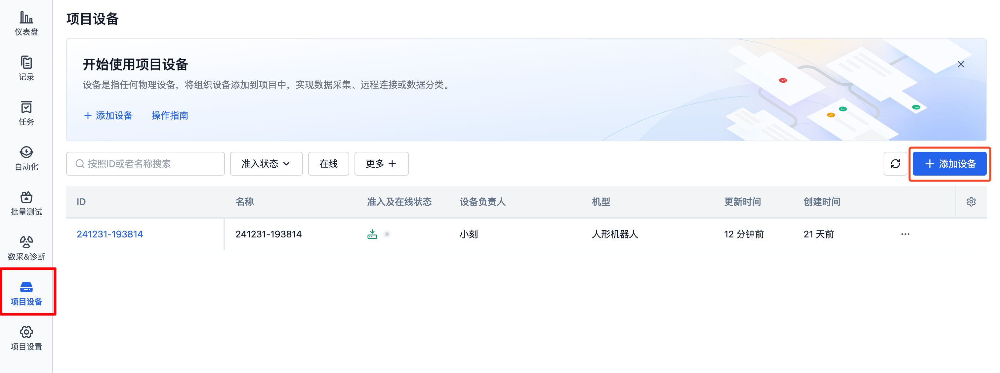

2. **配置采集目录**：进入组织设备配置页，设置采集目录 `collect_dirs` 为设备上存储数据的目录，如：`/home/bag/` 和 `/home/log/`。

   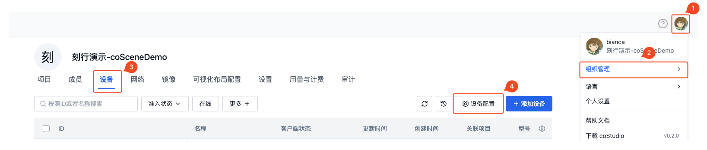

   ```yaml
   mod:
     name: 'default'
     conf:
       enabled: true
       # 设备端的采集目录，作为项目中数据采集任务与规则采集的指定目录
       collect_dirs:
         - /home/bag/
         - /home/log/
   ```

3. **创建采集任务**：进入「项目-任务-采集任务」页面，创建采集任务。

   - 选择要采集数据的设备
   - 选择要采集的时间范围：在目标数据路径下，采集「文件更新时间」在指定时间段内的文件
   - 目标数据路径：默认值取自设备配置中的 `collect_dirs`，也可以自定义路径。若填写为文件夹，则采集该文件夹下符合时间范围的文件；若填写为文件，则采集该文件。
   - 任务名称：自定义名称

     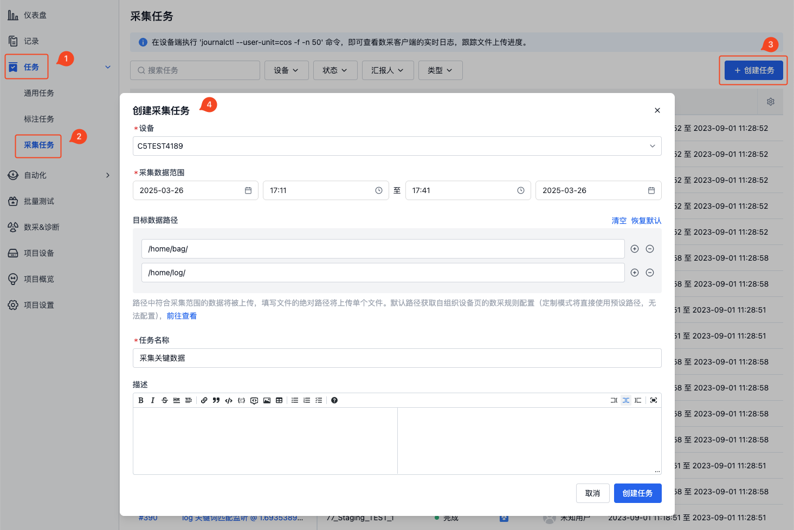

4. **查看采集结果**：进入「项目-任务-采集任务」页面，点击任务名称查看采集结果，采集完成的数据将自动保存到记录中。

   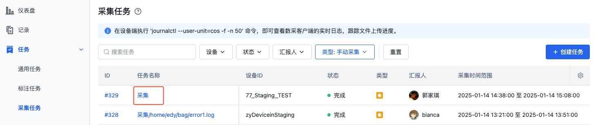
   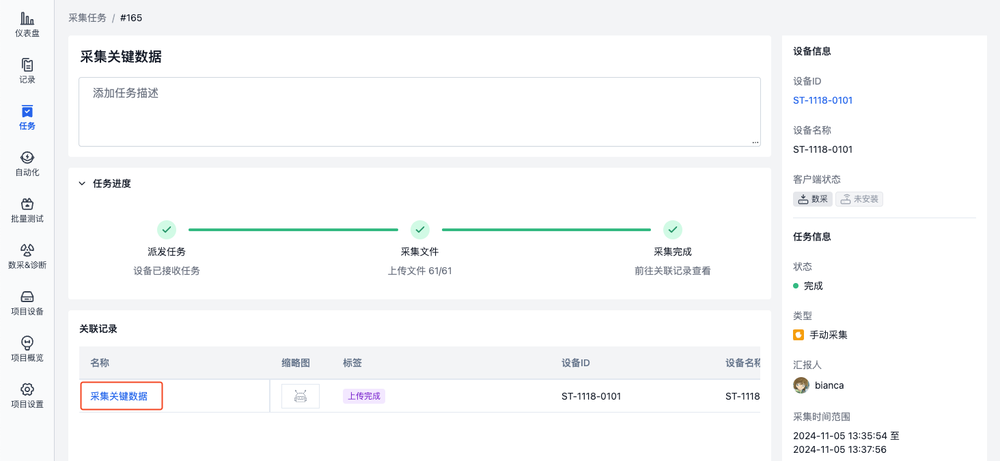

### 自动采集数据

自动采集数据是通过预定义的规则持续监测设备日志，在触发特定条件时自动采集相关数据，从而实现设备故障的自动分析和潜在风险的预警。详情请参考[数采&诊断](../use-case/data-diagnosis/3-add-rule.md)。

1. **将设备添加到项目**：进入「项目设备」页，点击【添加设备】按钮，选择需要采集数据的设备。

   

2. **配置监听与采集目录**：进入组织设备配置页，设置监听目录`listen_dirs` 与采集目录 `collect_dirs`

   

   ```yaml
   mod:
     name: 'default'
     conf:
       enabled: true
       # 设备端的采集目录，作为项目中数据采集任务与规则采集的指定目录
       collect_dirs:
         - /home/bag/

       # 设备端的监听目录，作为项目中规则的监听目录
       listen_dirs:
         - /home/bag/

       # 设置文件监听的时效性：若文件的最后更新时间距离当前时间超过 2 小时，则不会被系统监听
       skip_period_hours: 2
   ```

3. **创建规则**：进入「项目-数采&诊断」页面，创建规则。

   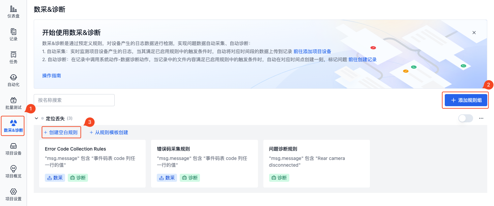

4. **定义规则**：定义规则的触发条件和采集行为。以下是一个示例规则，当检测到 mcap 文件中 /spawn_entity node 状态为 inactive 时，自动上传数据：

   - mcap 文件中的消息：

     

   - 规则名称：检测 /spawn_entity node 状态
   - 事件匹配条件：msg["nodes"][3]["state"] 包含 INACTIVE
   - 触发操作：采集数据、诊断数据

     - 采集数据：采集触发时间点前后一段时间的数据，保存到记录中；采集目录为设备配置中的 `collect_dirs`；文件的时间取自文件的时间戳，若需采集的时间段与文件有交集，则将上传整个文件
     - 诊断数据：在触发时间点创建一刻

     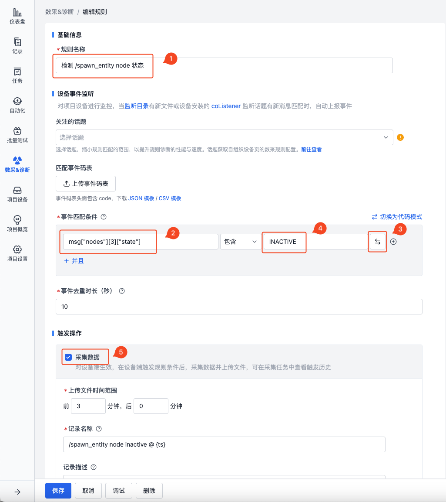
     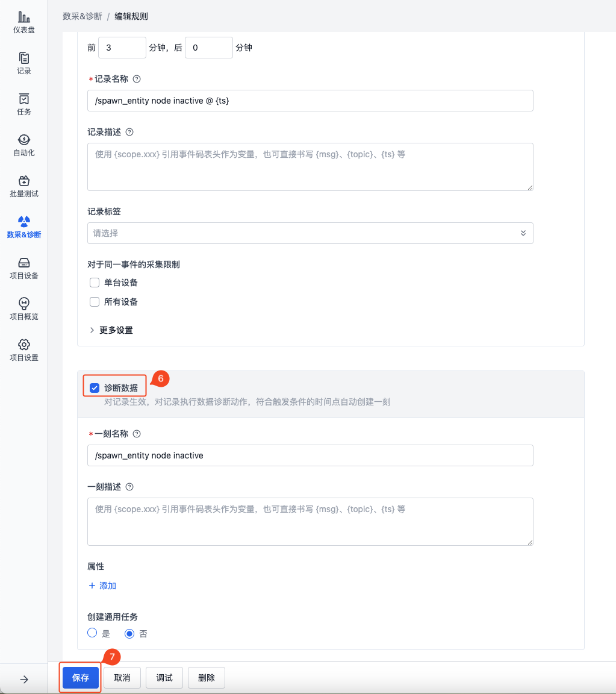

5. **确认规则**：确认规则已启用，且目标设备已拉取到最新的规则配置。

   - 启用规则组：点击规则组右侧的启用按钮

     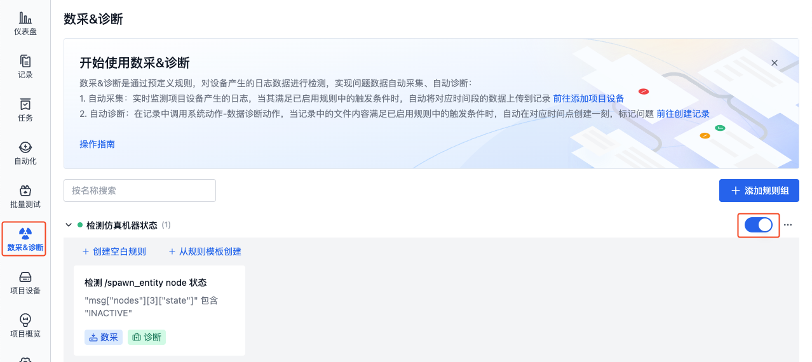

   - 在设备端执行以下命令，查看是否拉取到最新的规则配置，即出现关键词 `Updated rules`、`listen_dirs`、`collect_dirs`

     ```bash
     # 查看数采客户端日志
     tail -f ~/.local/state/cos/logs/cos.log
     ```

     

6. **触发规则**：在设备的 `listen_dirs` 与 `collect_dirs` 目录下，创建 mcap 文件，触发规则

   - 在设备端，进入 `listen_dirs` 与 `collect_dirs` 目录，执行命令下载 [mcap 文件](https://coscene-artifacts-prod.oss-cn-hangzhou.aliyuncs.com/sample_data/rule_sample.mcap)

     ```bash
     # 进入 listen_dirs 目录
     cd /home/bag/
     # 下载 mcap 文件
     wget https://coscene-artifacts-prod.oss-cn-hangzhou.aliyuncs.com/sample_data/rule_sample.mcap
     ```

   - 执行命令查看数采客户端日志，查看是否触发规则并上传数据，即出现关键词 `triggered`、`upload all files successfully`

     ```bash
     # 查看数采客户端日志
     tail -f ~/.local/state/cos/logs/cos.log
     ```

     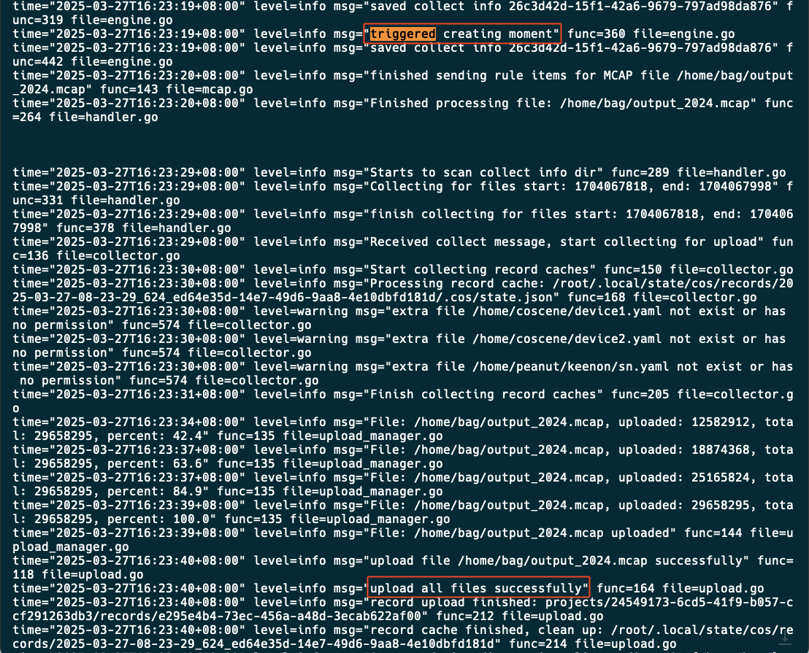

7. **查看采集结果**：在「项目-记录」页面，查看设备自动创建的记录。点击记录名称进入详情，查看文件与一刻信息。通过播放记录，在[可视化](../viz/1-about-viz.md)页面查看采集的数据。

   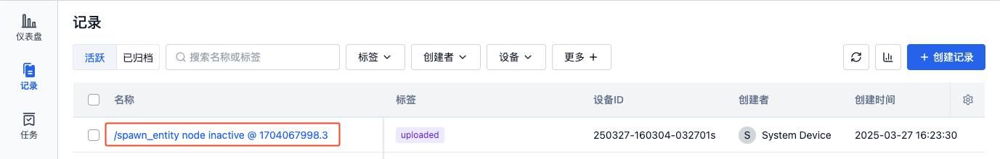
   | 内容 | 示例 |
   | :---: | :---: |
   | 文件 |  |
   | 一刻 |  |

## 了解更多

- [自动化处理数据](../workflow/1-quick-start-workflow.md)
- [更新日志](https://docs.coscene.cn/changelog)
