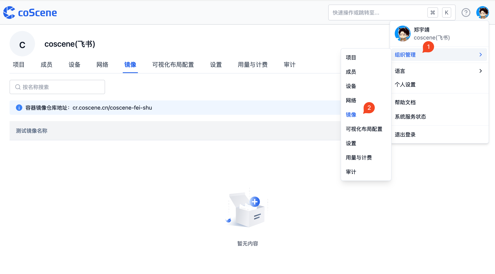
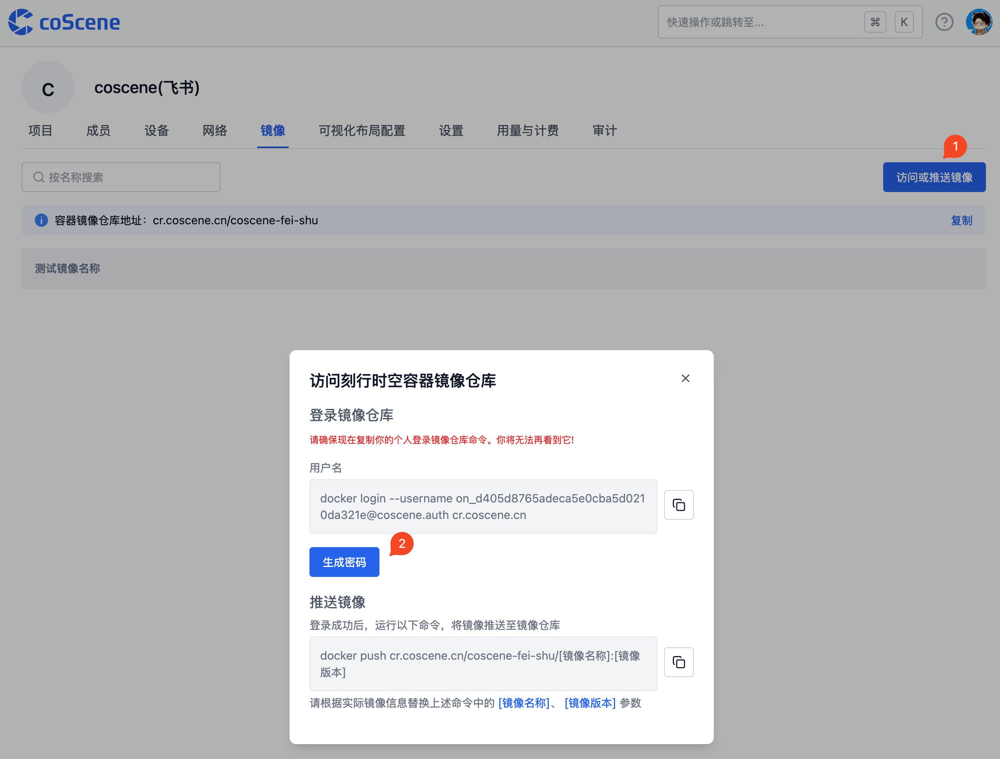
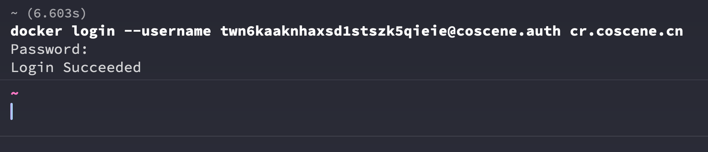

# 推送镜像

准备好镜像之后，我们可以选择将镜像推送到 DockerHub 这样的镜像服务或者使用刻行时空的镜像仓库

## 推送镜像至 Docker Hub

可以查看对应的文档[推送镜像至 Docker Hub](https://docs.docker.com/docker-hub/repos/#pushing-a-docker-container-image-to-docker-hub)。

## 推送镜像至刻行时空镜像仓库

### 1. 认证和登录刻行时空的镜像仓库

登录刻行时空平台，在右上角用户设置下拉面板中，选择[【组织管理】-【镜像】](https://coscene.cn/org/images)。

在镜像页面中，选择访问或推送镜像，获取认证所需的信息

返回命令行，使用刚才获取的登录命令和密码登录刻行时空仓库

完成认证之后，就可以使用 `docker push` 将镜像推送到刻行时空的镜像仓库了。
