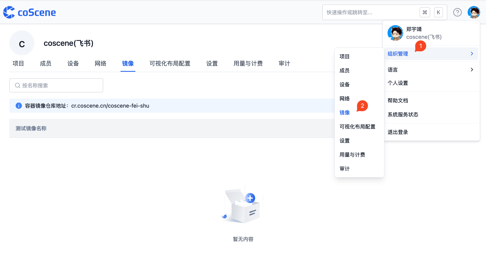
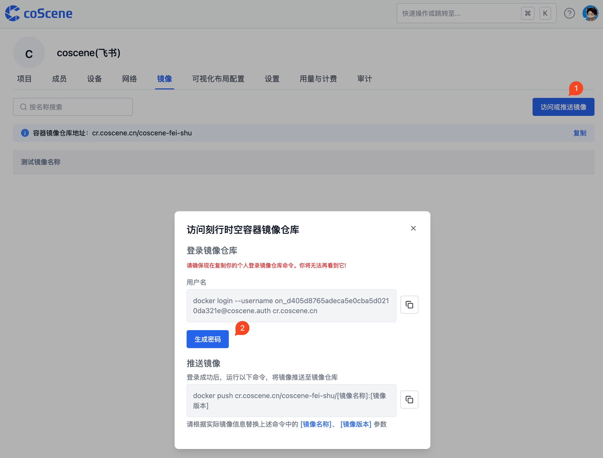

# 推送镜像

准备好镜像之后，我们可以选择将镜像推送到 DockerHub 这样的镜像服务或者使用刻行的镜像仓库

## 推送镜像至 Docker Hub

可以查看对应的文档[推送镜像至 Docker Hub](https://docs.docker.com/docker-hub/repos/#pushing-a-docker-container-image-to-docker-hub)。

## 推送镜像至刻行镜像仓库

每个组织都会自动分配一个刻行镜像仓库，地址通常为 `cr.coscene.cn/<org-slug>`。推送镜像前，需要先在本地 Docker 登录该镜像仓库。

### 1. 使用 coCLI 登录刻行镜像仓库（推荐）

确认已经完成 [coCLI 登录](../developers/cocli/1-cli-install.md#登录) 后，运行：

```bash
cocli registry login
```

`cocli` 会根据当前 profile 的 OpenAPI endpoint 推断镜像仓库地址，并调用本机 Docker 完成登录。登录完成后，即可将镜像打上组织仓库地址并推送：

```bash
docker tag local-image:latest cr.coscene.cn/<org-slug>/local-image:latest
docker push cr.coscene.cn/<org-slug>/local-image:latest
```

### 2. 在网页端生成登录凭证

登录刻行平台，在右上角用户设置下拉面板中，选择[【组织管理】-【镜像】](https://coscene.cn/org/images)。



在镜像页面中，选择访问或推送镜像，获取认证所需的信息



返回命令行，使用刚才获取的登录命令和密码登录刻行仓库


完成认证之后，就可以使用 `docker push` 将镜像推送到刻行的镜像仓库了。
