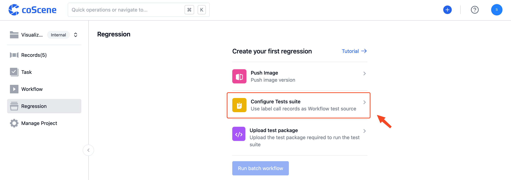
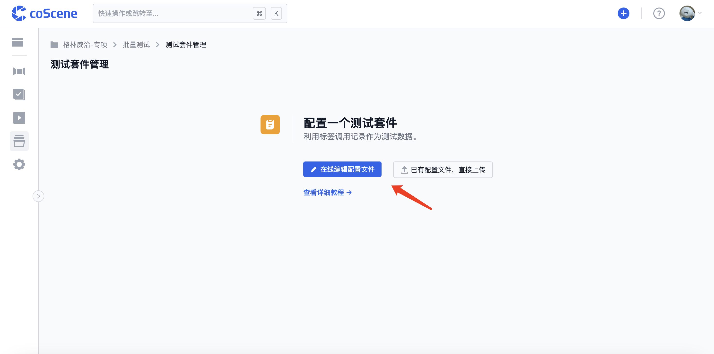
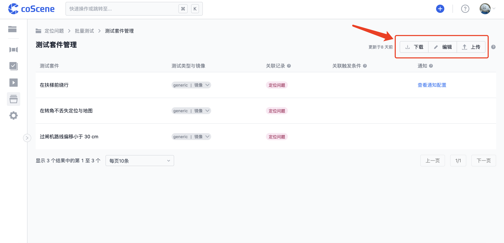
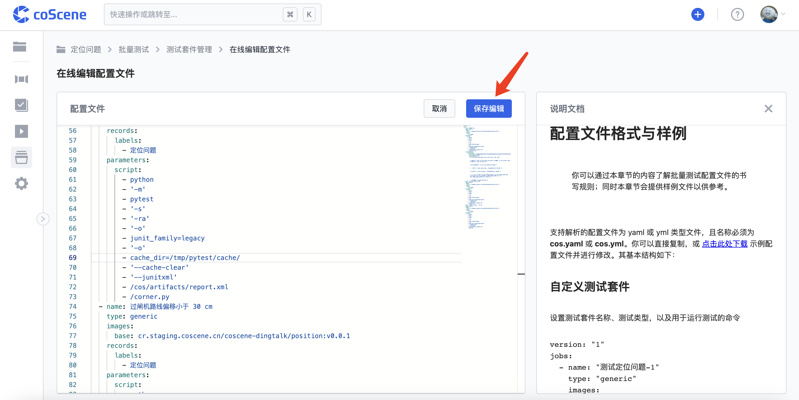
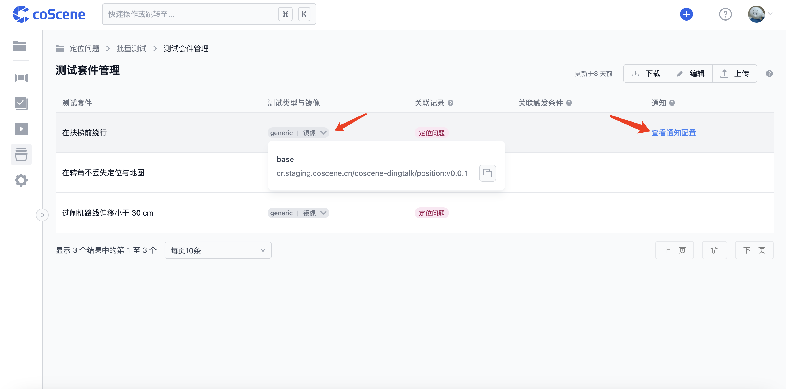

# 管理测试配置

> 了解配置文件的编写与上传/编辑，以及查看解析出的测试套件信息。

## 1. 准备配置文件

配置文件为一个名称为 cos.yaml 或 cos.yml 的文件，其具体格式与规则请参见 [配置文件格式与样例](../regression/9-yaml-sample.md)。

 

## 2. 上传与编辑配置文件

1. 点击进入「批量测试」-「测试套件管理」页面：

- 首次上传测试套件

  

- 非首次上传测试套件

  

 

2. 直接从本地选择配置文件上传或者在线编写配置文件：

 

你可以在「批量测试-测试套件管理」页面右上角点击下载/编辑/上传配置文件

 

其中你可以点击「编辑」在线编辑配置文件，在修改配置文件内容后点击「保存编辑」以更新配置文件：

 

## 3. 查看测试套件信息

格式与内容符合规范的配置文件解析完毕后，测试套件管理页面会显示解析出的测试套件及相关信息。

你可以点击某些列内容查看详细信息，例如你可以点击「测试类型与镜像」列查看与复制镜像地址，点击「查看触发条件」查看该测试套件对应的自动触发条件，点击「查看通知配置」查看该测试套件对应的通知模版内容等：

 
