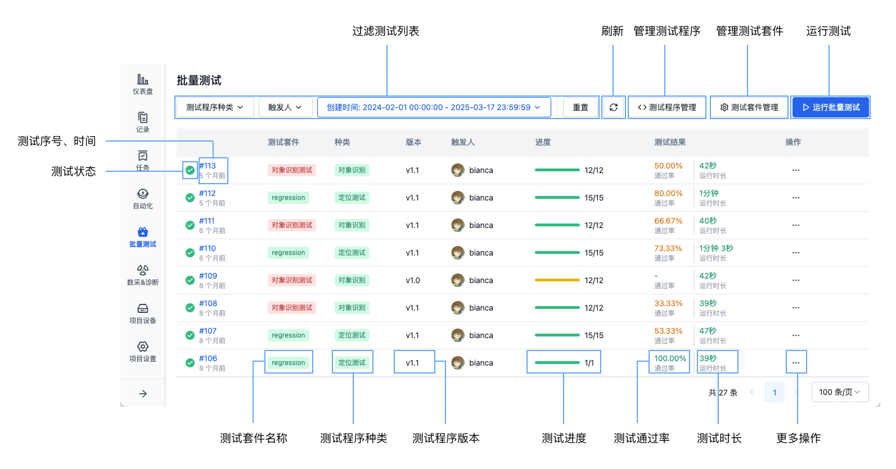
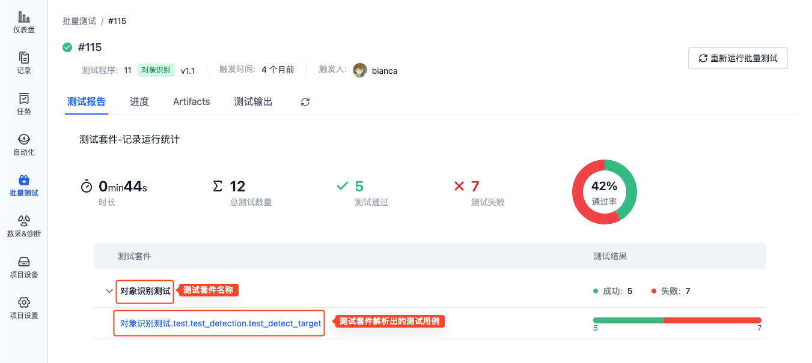
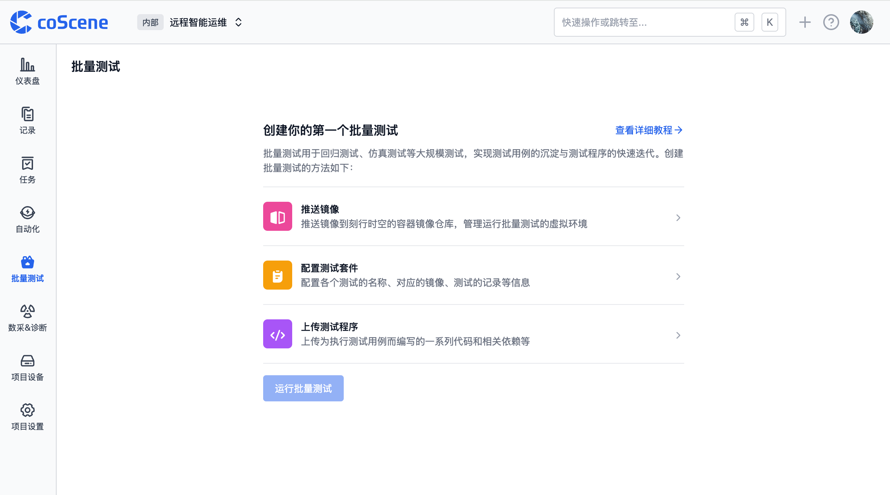

# 关于批量测试

批量测试是一种并行执行多个测试任务的自动化解决方案，主要用于回归测试、仿真测试等大规模测试场景。平台提供完整的测试资源管理能力，支持镜像、数据集、测试套件与测试程序的统一管理，可在项目中一站式完成测试执行、状态监控及结果分析。

## 基本信息
### 概念说明

| 名称 | 说明 |
| --- | --- |
| 镜像 | 运行批量测试的虚拟环境 |
| 测试套件 | 一组相关联的测试用例集合，通常针对特定功能或场景进行测试 |
| 测试程序 | 为执行测试用例而编写的一系列代码和相关依赖 |
| 测试用例 | 运行批量测试过程中执行的具体任务，通常从相应的测试报告中解析出 |

批量测试任务的执行流程如下：
1. 选择测试套件，将其预设的镜像作为测试环境
2. 将测试程序、测试数据（[记录](../../collaboration/record/1-quick-start-record.md)）和测试套件的配置参数导入测试环境
3. 系统为测试套件关联的每条记录创建独立的子测试任务
4. 所有子测试任务完成后，系统自动汇总结果并生成测试报告

### 系统目录
批量测试支持的目录结构如下：
| 名称     | 目录           |
| -------- | -------------- |
| 测试程序   | /cos/bundles   |
| 记录     | /cos/files     |
| Artifact | /cos/artifacts |
| 测试输出 | /cos/outputs   |

## 批量测试界面
### 批量测试列表页

- **测试序号**：测试的唯一标识，依次递增，点击后可查看详情
- **测试时间**：测试开始的时间，鼠标悬停可查看具体时间
- **测试状态**：测试的当前状态，包括队列中、运行中、已完成、无结果。其中：
   - 「已完成」表示测试已完成（不表示测试用例的执行成功与否）
   - 「无结果」表示测试未解析出结果，查看[如何输出测试结果](./6-status-and-output.md)
- **测试套件名称**：测试所选的测试套件名称，详见[测试套件](./3-config-management.md)
- **测试程序种类、版本**：测试所选的测试程序种类与版本，详见[测试程序](./4-test-bundle-management.md)
- **测试进度**：一个测试包含多个子测试任务，鼠标悬停可查看具体进度
- **测试通过率**：测试通过的数量占总数的比例。
   - 计算公式：1 个测试套件用于计算通过率的数值 = 测试套件解析出的用例数 × 关联记录数
- **测试时长**：测试总时长
- **操作**：
   - 取消运行
   - 重新运行批量测试
   - 下载 Artifacts
   - 下载测试输出

### 批量测试详情页
- **测试报告**：展示测试的运行时长、测试数量、测试通过率、测试结果等信息

   

   - 测试套件解析出的测试用例：1 个测试套件可解析出多条用例，每条用例有对应的执行结果
   - 点击测试用例名称可查看具体结果

- **测试进度**：展示每个子测试任务的执行状态，可在子测试任务详情中查看对应的执行日志、Artifact 与测试输出
- **Artifacts**：测试过程中生成的结果文件，如测试报告
- **测试输出**：测试过程中生成的需要可视化的文件，如 ROSbag

## 使用流程概览
进入项目的「批量测试」页面，根据提示创建一个批量测试：

1. 准备测试环境与数据

   - 准备运行批量测试的 [Docker 镜像](../../image/1-intro.md)
   - 将镜像推送至公开平台或[刻行时空镜像仓库](../../image/3-push-image.md)
   - 将测试数据上传到项目中并按[记录](../../collaboration/record/1-quick-start-record.md)存储

2. 配置测试内容

   - 在「[测试套件管理](./3-config-management.md)」页面设置测试套件和相应配置参数
   - 在「[测试程序管理](./4-test-bundle-management.md)」页面上传被测程序

3. 执行与监控
   - 在「[运行批量测试](./5-run.md)」弹框中，选择测试程序版本与测试套件
   - 启动批量测试
   - 实时监控测试进度并[查看测试结果](./6-status-and-output.md#查看测试结果)

详情请参见后续章节。
