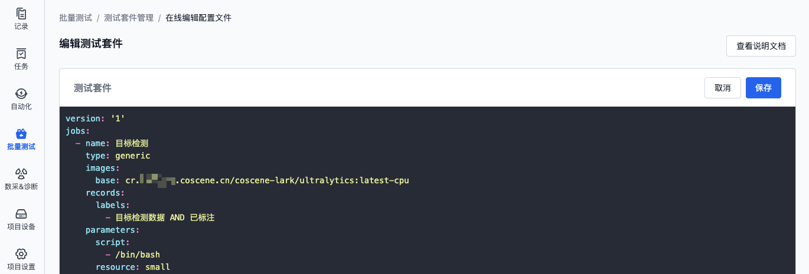

# 测试套件
## 简介
测试套件是一组相关联的测试用例集合，提供统一的配置管理界面，支持设置测试名称、运行环境（镜像）、测试数据（记录）等参数，实现测试用例的标准化管理。


## 管理测试套件
### 前提条件
1. 请确保已将测试数据按[记录](../../collaboration/record/1-quick-start-record.md)存储，并给每条记录打上了标签

    

2. 请确保已准备好测试环境（镜像），并将其推送至公开平台或[刻行时空镜像仓库](../../image/1-intro.md)。
    推荐在镜像中定义测试用例：
    - 测试用例（testcase）支持解析，详见[定义测试结果](./6-status-and-output.md#定义测试结果)
    - 批量测试的输入与输出目录，详见[系统目录](./1-intro.md#系统目录)

### 创建测试套件
1. 在项目左侧边栏，选择「批量测试」，点击按钮进入「测试套件管理」页面：

  - 首次编辑测试套件

    

  - 非首次编辑测试套件

    

2. 点击【编辑】，进入测试套件编辑页面：

   
   

3. 填写测试套件名称、运行环境、测试数据等信息：

    ```yaml
    # 示例文件

    # 版本号，当前支持的版本为"1"
    version: '1'

    # 测试名称为 workflow name
    name: 'workflow name'

    # 一个 job 由一个或多个测试套件组成，这些测试套件可以并行测试
    jobs:
      # 第一个测试套件的名称为"test-1"
      - name: 'test-1'
        # 测试类型为"generic"
        type: 'generic'

        # 镜像地址
        images:
          # 根据测试类型，输入镜像地址
          base: cr.coscene.cn/coscene-hello/position:v1.0.0

        # 关联记录
        records:
          # 该测试套件的关联记录标签为"sample"
          labels:
            - 'sample'

        # 该测试套件的运行命令
        parameters:
          script:
            - /bin/sh
            - -c
            - 'echo hello'

        # 测试套件"test-1"的消息通知模板
        notifications:
          # 通知到钉钉群
          - dingTalkBot:

      # 第二个测试套件的名称为"test-2"
      - name: 'test-2'

    # 控制何时自动触发该测试
    on:
      # 当上传测试程序时，满足以下条件则会触发
      bundlePush:
        # 条件：测试程序种类为"test"
        category:
          - test
    ```

    - **version**：版本号，当前支持的版本为`'1'`。
    - **name**：测试名称
    - **jobs**：测试套件列表
      - **name**：测试套件名称
      - **type**：测试类型，当前支持的类型为`'generic'`
      - **images**：测试套件运行的镜像，支持使用刻行时空镜像仓库或公开平台的镜像
      - **records**：运行该测试套件时使用的记录，通过标签关联记录
      - **parameters**：运行该测试套件时使用的参数
      - **notifications**：测试套件运行完成后发送的消息通知模版
    - **on**：自动触发测试
      - **bundlePush**：当上传测试程序时，其「种类」满足条件则会触发
    
    具体格式详见 [配置文件格式与样例](./9-yaml-sample.md)。

4. 点击【保存】，保存测试套件配置文件。

    

### 上传、下载与编辑
> 测试套件的配置文件为 cos.yaml，支持直接上传、下载与编辑。

1. 在项目左侧边栏，选择「批量测试」，点击按钮进入「测试套件管理」页面：

    

2. 上传、下载或直接编辑配置文件：

    

3. 点击【保存】，保存测试套件配置文件。

    

### 查看
配置文件校验通过后，测试套件管理页面将展示解析结果，包括测试套件的基本信息、运行环境、数据关联及触发条件等配置详情。

- 测试名称与测试套件名称

  

- 测试类型与镜像

  

- 关联记录

  

- 关联触发条件

  

- 通知模板样式

  

### 使用
在运行批量测试时，可选择测试套件，系统将根据测试套件配置信息运行测试。


## 了解更多
- [配置文件格式与样例](./9-yaml-sample.md)
- [测试程序](./4-test-bundle-management.md)
- [管理测试结果](./6-status-and-output.md)
- [运行批量测试](./5-run.md)

## 常见问题
1. **问：无法保存测试套件，提示”记录错误:标签不存在:sample“**

   答：请检查名为「sample」的测试套件，是否存在错误的标签，如标签不存在或书写错误。此处仅支持使用已存在的标签。了解[如何给记录添加标签](../../collaboration/record/3-manage-records.md#编辑)
  
2. **问：无法保存测试套件，提示”请检查 yaml 文件格式“**

   答：请检查测试套件配置文件格式是否正确，如配置文件格式错误，可参考[配置文件格式与样例](./9-yaml-sample.md)


