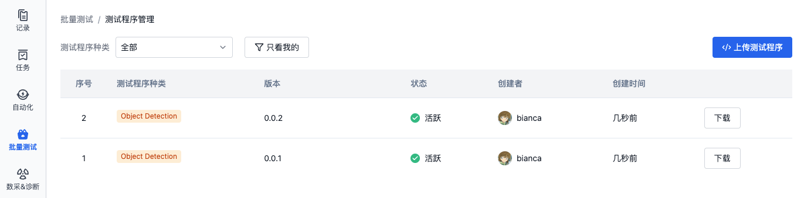
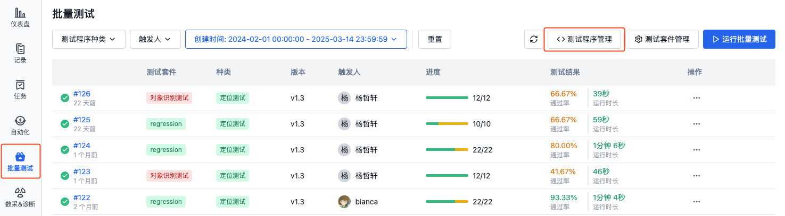
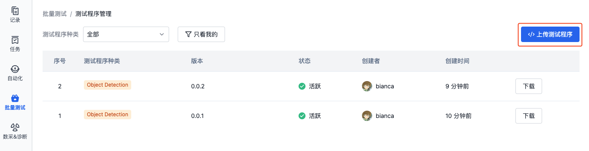
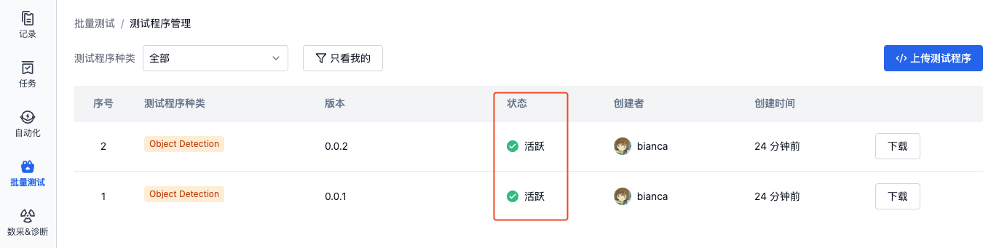
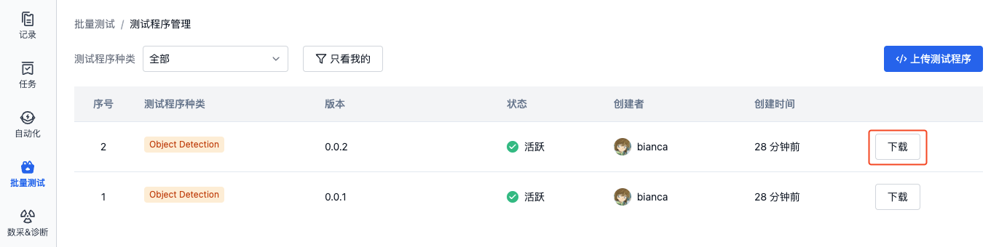

# 测试程序
## 简介
测试程序是被测试的代码文件，可以是一个.deb 格式的文件或.zip /.tgz /.tar.gz 格式的压缩文件。

## 管理测试程序
### 上传测试程序
1. 在项目左侧边栏，选择「批量测试」，点击按钮进入「测试程序管理」页面：

- 首次上传测试程序

  

- 非首次上传测试程序

  

2. 点击【上传测试程序】：

    

3. 上传测试程序，填写测试种类与版本：

    

  - **测试程序种类**：自定义输入种类信息，或选择已有的测试种类。

  - **测试程序版本**：自定义输入版本信息，如`v0.1`
  
    测试种类与版本信息可用于自动触发测试。详见[配置文件格式与样例-自动触发测试](./9-yaml-sample.md#auto-triggering)

4. 上传测试程序后，列表「状态」栏显示为「活跃」，即表示该测试程序上传成功：

    

### 下载
1. 在项目左侧边栏，选择「批量测试」，点击按钮进入「测试程序管理」页面：

    

2. 点击列表中测试程序的「下载」按钮，即可下载测试程序：

    

### 使用
在运行批量测试时，可选择特定版本的测试程序执行测试任务。可以通过测试程序的序号、种类、版本号来识别所需的测试程序。

## 了解更多
- [运行批量测试](./5-run.md)
- [配置文件格式与样例](./9-yaml-sample.md)
- [管理测试结果](./6-status-and-output.md)
- [测试套件](./3-config-management.md)