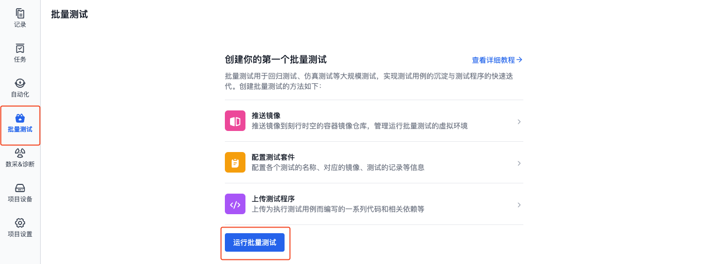
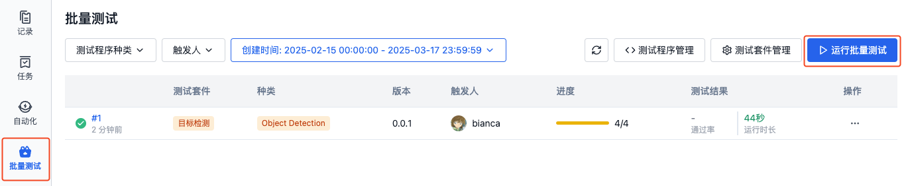
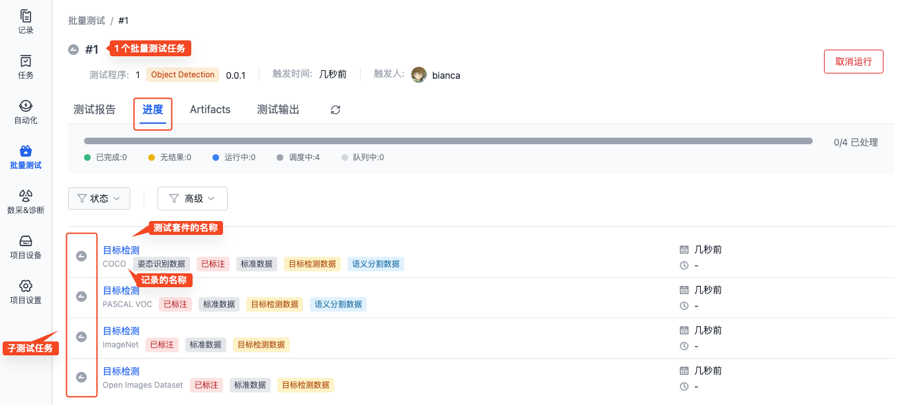
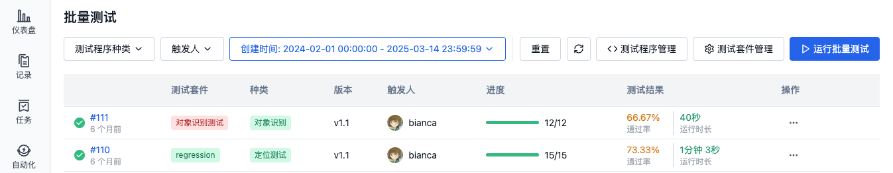
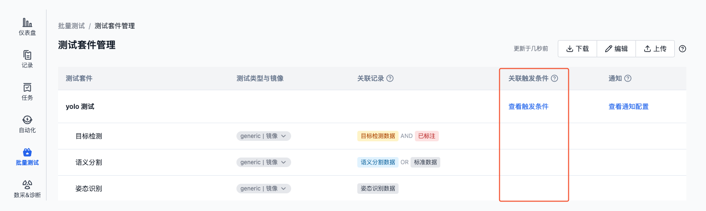
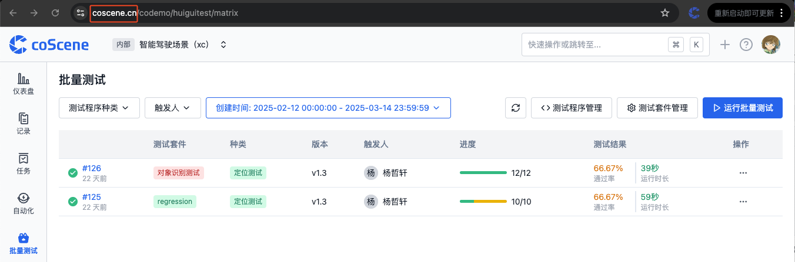
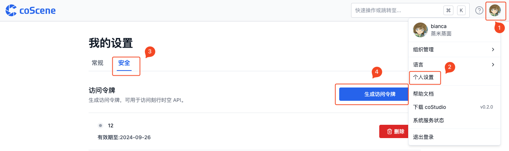
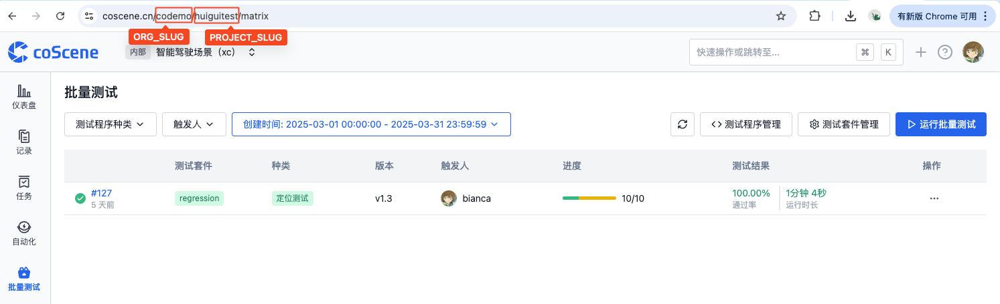

# 运行批量测试

> 了解如何运行批量测试，包括手动触发、自动触发、以及使用命令行在本地运行批量测试等。

## 前提条件
1. 已创建[测试套件](./3-config-management.md)
2. 已上传[测试程序](./4-test-bundle-management.md)

## 手动运行

1. 在项目左侧边栏，选择「批量测试」，点击【运行批量测试】按钮

- 首次运行批量测试

  

- 非首次运行批量测试

  

2. 在运行批量测试弹框中，选择测试程序、测试套件后，点击【确定】，运行批量测试。

    

3. 系统会为每个测试套件关联的记录创建独立的测试任务。例如，当一个测试套件关联了 10 条记录时，系统会创建 10 个子任务，每个任务会使用选定的测试程序和测试套件配置，对单条记录进行测试。

    

4. 运行完成后，在测试列表中可查看其运行结果。详见[管理测试结果](./6-status-and-output.md)。

    

## 自动触发
当上传的「测试程序」满足测试套件中[预设的触发条件](./9-yaml-sample.md#auto-triggering)时，系统会自动执行相关的测试套件。

查看测试套件的自动触发条件：
1. 进入「批量测试-测试套件管理」页面，找到带有「关联触发条件」标识的测试套件：

    

2. 点击【查看触发条件】，查看该测试套件的具体触发规则：

    

## 本地运行
除了使用 Web 界面，平台支持通过命令行工具（CLI）在本地运行批量测试。以下是详细的配置和使用说明。

### 下载与配置

1. 输入命令以下载所需文件，各操作系统对应命令如下：

- Linux

  ```bash
  curl https://coscene-artifacts-production.oss-cn-hangzhou.aliyuncs.com/cos/linux/amd64/latest/cos -o cos
  ```

- macOS

  ```bash
  curl https://coscene-artifacts-production.oss-cn-hangzhou.aliyuncs.com/cos/darwin/amd64/latest/cos -o cos
  ```

2. 通过以下命令进行配置：

   ```bash
   # 给 cos 可执行权限
   chmod +x cos

   # 创建配置目录
   mkdir $HOME/.cos

   # 创建配置文件
   cat << EOF > $HOME/.cos/config.yaml
   platform:
       endpoint: ${YOUR_DOMAIN}
       accessToken: ${YOUR_TOKEN}
       project: ${ORG_SLUG}/${PROJECT_SLUG}
   EOF

   # 验证配置
   cos config list
   ```

   其中各参数说明如下：

   - **`endpoint`**

      `${YOUR_DOMAIN}` 需替换成实际的网站地址。如下图的网址，`${YOUR_DOMAIN}` 为 `api.coscene.cn`

      

   - **`accessToken`**

      `${YOUR_TOKEN}` 的获取步骤如下所示：

      

      

      

   - **`project`**

      `ORG_SLUG` 和 `PROJECT_SLUG` 需根据实际替换：

      
    
### 运行
以下是常用的命令行示例，展示了不同场景下如何运行批量测试：

```bash
# 使用最新的测试程序运行项目下所有批量测试
cos test run

# 只用本地的配置文件 cos.yaml 运行批量测试
cos test run --test-config cos.yaml

# 使用最新的测试程序，对项目下名称为 sample-test-suite 的测试套件运行批量测试
cos test run -t sample-test-suite

# 使用指定的记录 定位采集数据 运行批量测试
cos test run -r 定位采集数据

# 使用标签为 v0.0.1 的测试程序，对项目下所有测试套件运行批量测试
cos test run --bundle-tag v0.0.1

# 使用种类为 sample-test-bundle 的测试程序，对项目下所有测试套件运行批量测试
cos test run --bundle-category sample-test-bundle

# 上传 bundle.zip 并运行批量测试
cos test run -b bundle.zip
```

## 了解更多
- [如何输出测试结果](./6-status-and-output.md)
- [如何查看运行信息](./6-status-and-output.md#查看运行进度与产物)
- [管理测试套件](./3-config-management.md)
- [管理测试程序](./4-test-bundle-management.md)
- [自动触发测试](./9-yaml-sample.md#auto-triggering)