# 管理测试结果
批量测试支持全面的测试结果管理能力，包括测试用例解析、运行状态追踪、日志收集及产物管理等。平台提供标准化的结果解析引擎，可视化的报告展示，以及丰富的数据分析功能。

## 定义测试结果
### 定义测试报告
批量测试支持解析 JUnit XML 格式的文件。 在 [Artifact](./1-intro.md#系统目录) 中输出测试结果文件，系统会自动解析并展示测试结果。示例如下：
- 在每条记录运行测试的 Artifacts 中输出 .xml 文件：

  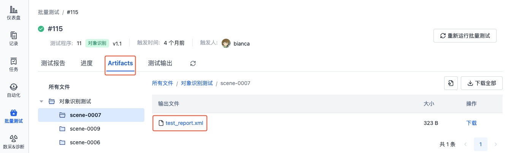

- 系统会自动解析并展示测试报告：

  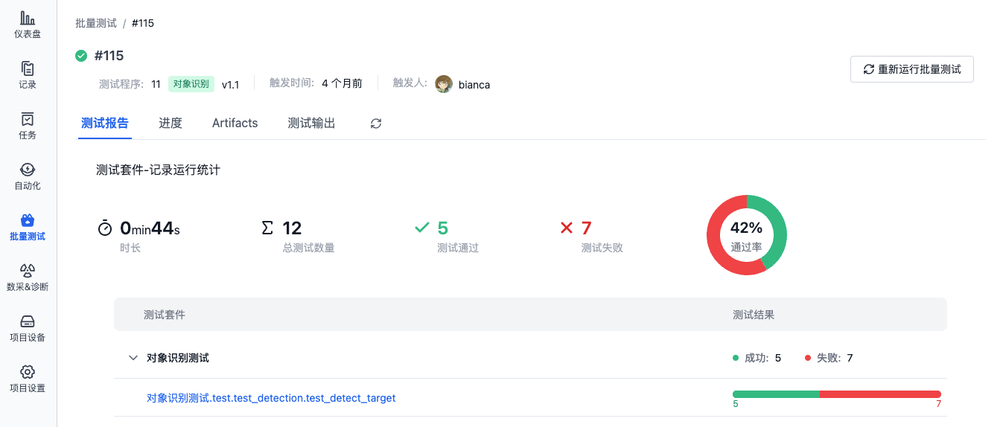

创建 JUnit XML 格式文件的方法有两种：
- 在代码中使用 `pytest` 库的 `pytest_junit` 插件
- 在配置文件中使用命令输出 xml 文件。详见 [配置文件格式与样例-输出测试结果文件](../regression/9-yaml-sample.md#save-artifacts)。

支持解析的测试结果文件示例如下:
> 其中结果数据到 JUnit XML 格式的映射请参考 [JUnit Mapping](https://www.ibm.com/docs/en/developer-for-zos/14.1?topic=formats-junit-xml-format#junitschema__table_junitmap)

```xml
<?xml version="1.0" encoding="UTF-8" ?>
  <testsuites id="20140612_170519" name="New_configuration (14/06/12 17:05:19)" tests="225" failures="1262" time="0.001">
    <testsuite id="codereview.cobol.analysisProvider" name="COBOL Code Review" tests="45" failures="17" time="0.001">
      <testcase id="codereview.cobol.rules.ProgramIdRule" name="Use a program name that matches the source file name" time="0.001">
        <failure message="PROGRAM.cbl:2 Use a program name that matches the source file name" type="WARNING">
          WARNING: Use a program name that matches the source file name
          Category: COBOL Code Review – Naming Conventions
          File: /project/PROGRAM.cbl
          Line: 2
        </failure>
      </testcase>
    </testsuite>
  </testsuites>
```

### 定义输出图表
JUnit XML 格式的测试结果文件中，支持添加以 "cos\_" 为前缀的自定义属性（如 `cos_customer_name`），系统会自动解析这些属性及其对应的指标值，并生成可视化图表（柱状图、箱线图）。

当前支持的数据类型为：布尔类型、浮点类型。在测试代码文件中输出图表的示例如下：

```python
  def test_romeo(record_xml_attribute):

    for i in (1, 2, 3):
      rand_float = random.uniform(1, 100)
      record_xml_attribute("cos_test_romeo_val" + str(i), rand_float)
    for i in (1, 2, 3):
      rand_bool = random.choice([True, False])
      record_xml_attribute("cos_test_romeo_bool" + str(i), rand_bool)

    assert __count('romeo') > 0
```

系统会自动解析并生成可视化图表：

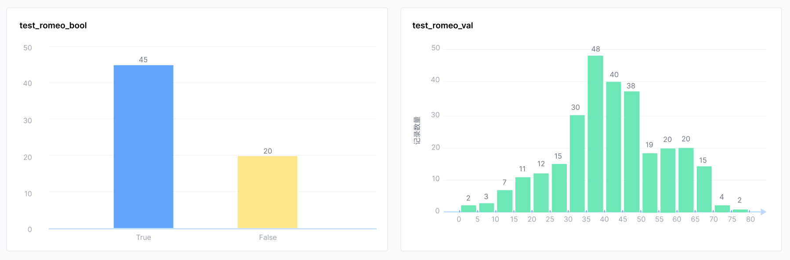


### 自定义输出文件
测试过程中生成的文件可输出至以下目录：
- Artifact：/cos/artifacts
- 测试输出：/cos/outputs

  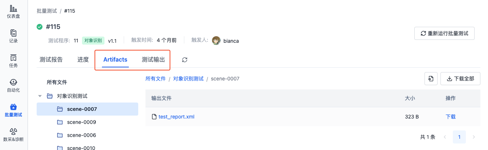

文件预览与播放支持：
- 「Artifacts」目录下的文件仅支持预览
- 「测试输出」目录下的文件支持预览与播放。其中，ROSbag 文件播放时将自动进入「影子模式」，与原始记录进行同步对比播放

### 创建一刻
批量测试支持在关键时间点（如机器偏移量异常、设备故障等）创建一刻，便于后续快速定位和分析问题。一刻可以：
- 标记重要的时间点
- 记录问题发生的具体时刻
- 提取关键片段用于分析

使用批量测试环境中内置的 `cos` 命令行工具来创建一刻，具体命令如下：

```yaml
/cos/bins/cos moment create \
    --display-name "急停" \ # moment 名字
    --description "机器急停" \ # moment 描述
    --trigger-time 1532402940 \ # moment 触发时间
    --duration 10 \ # moment 持续时长
    --customized-fields '{"key1": "value1"}' # moment 自定义字段
```

在可视化页面查看一刻，参见[一刻](../../viz/5-create-moment-viz.md)

## 查看测试结果
批量测试列表页展示所有测试的执行历史，包括测试状态、进度等信息。点击测试序号可进入详情页查看完整信息：

   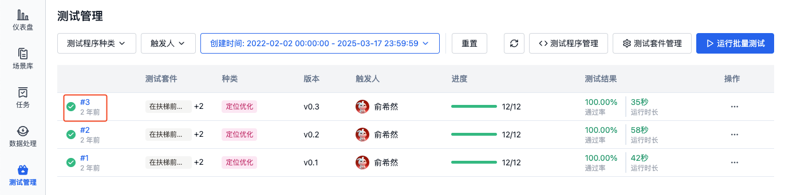

### 查看运行进度与产物
1. 在批量测试详情页的「进度」栏中，可查看所有子测试任务的运行状态与执行进度：

   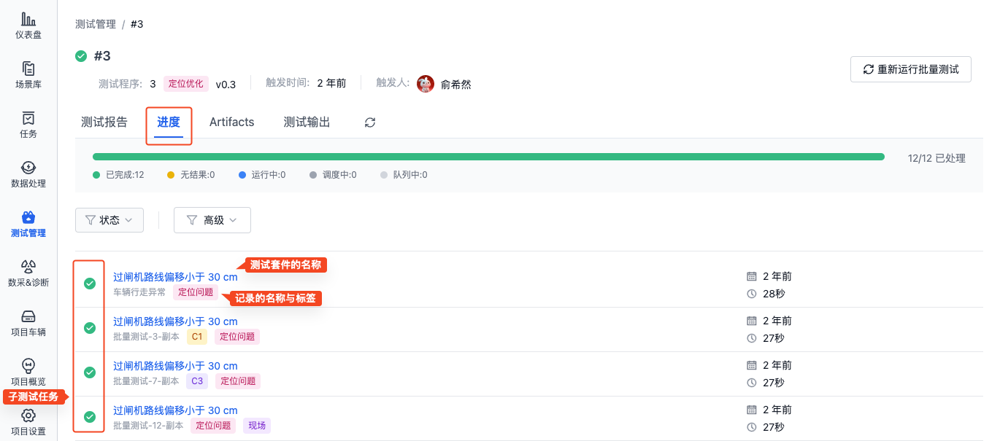

2. 点击子测试任务的标题，查看其详情页面:

   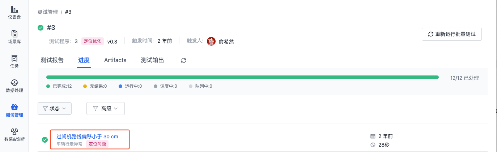

3. 在子测试任务详情页，可查看子测试任务的运行状态、进度、运行日志、测试产物等信息：
   - **记录**：点击记录名称，查看记录详情
   - **步骤**：点击步骤名称，查看运行日志
   - **Artifacts**：查看或下载测试过程中生成的结果文件，如测试报告
   - **测试输出**：播放测试过程中生成的需要可视化的文件，如 ROSbag 文件

   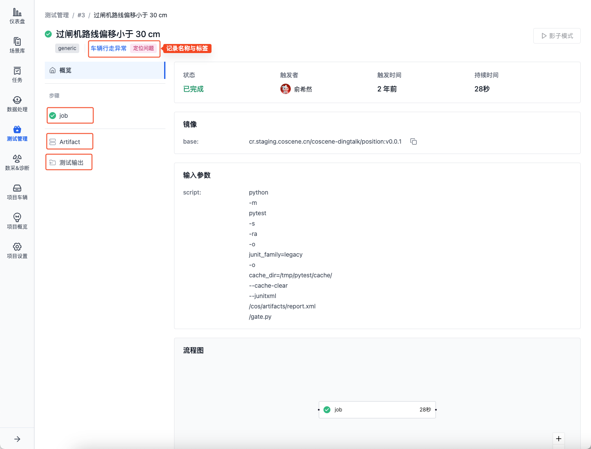

4. 在批量测试详情页的「Artifacts」中，可查看与下载该批量测试的所有 Artifacts。文件层级如下：
    
    ```plaintext
    所有 Artifacts
    ├── 测试套件 A
    │   ├── 记录 1
    │   │   ├── report.xml
    │   │   └── ...
    │   └── 记录 2
    │       └── ...
    └── 测试套件 B
        └── ...
    ```

   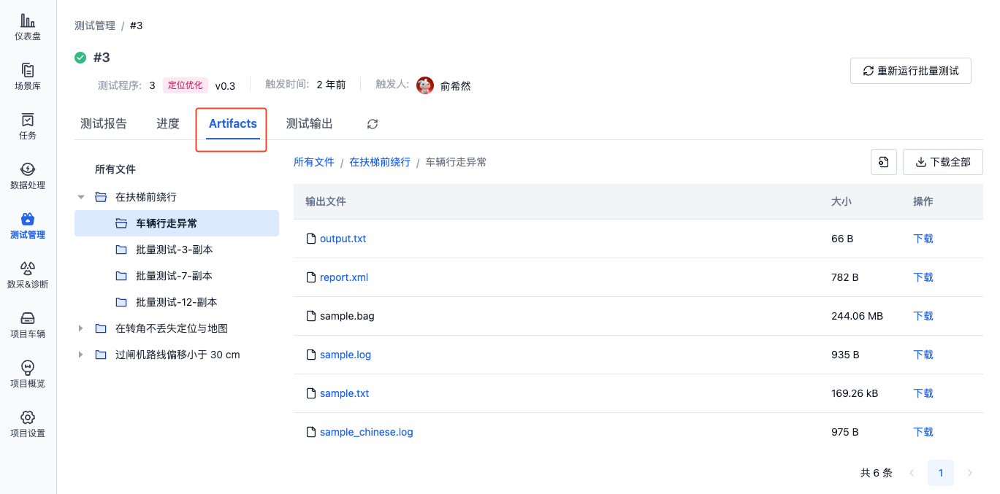

4. 在批量测试详情页的「测试输出」中，可查看与下载该批量测试的所有测试输出。文件层级如下：
   
    ```plaintext
    所有测试输出
    ├── 测试套件 A
    │   ├── 记录 1
    │   │   ├── test.bag
    │   │   └── ...
    │   └── 记录 2
    │       └── ...
    └── 测试套件 B
        └── ...
    ```

### 查看测试报告
当批量测试运行完成后，在「测试报告」中可查看测试套件运行结果统计，包括运行信息以及各测试套件运行解析出的测试用例等:

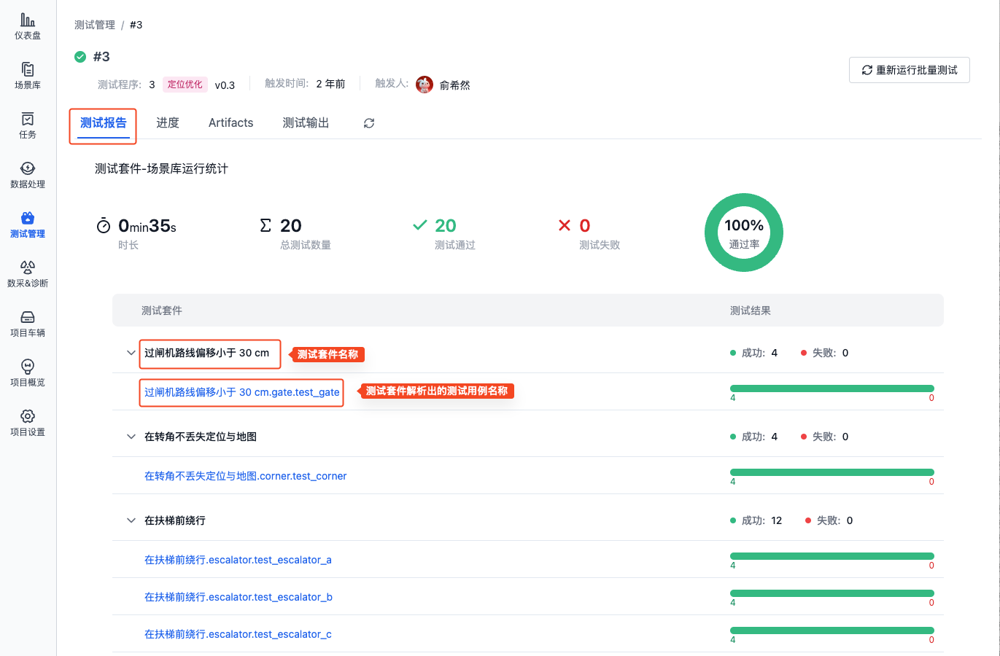

点击单个测试用例名称，可查看该测试用例的运行报告，包括各测试详情列表和输出图表等：

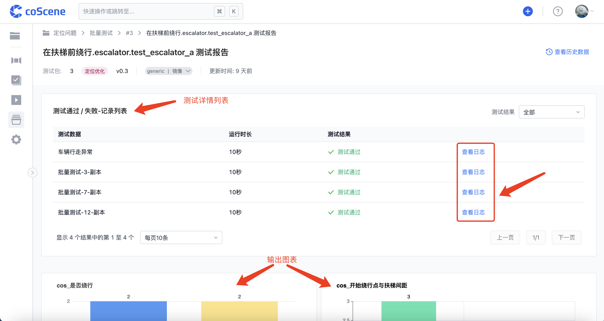

点击页面右上角的「查看历史数据」，可以查看该测试用例的历史结果数据统计，包括测试的运行结果矩阵、指标统计图等：

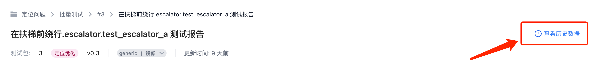

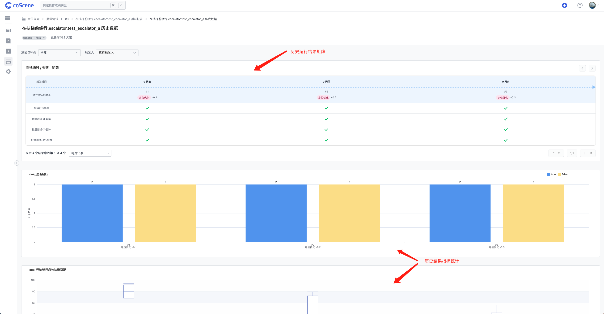

### 播放影子模式
若测试输出中有 ROSbag 文件，则可与原记录进行对比播放。

1. 在测试详情页的「测试输出」栏，选择对应的记录层级，点击右上角的「影子模式」按钮进入可视化界面：

    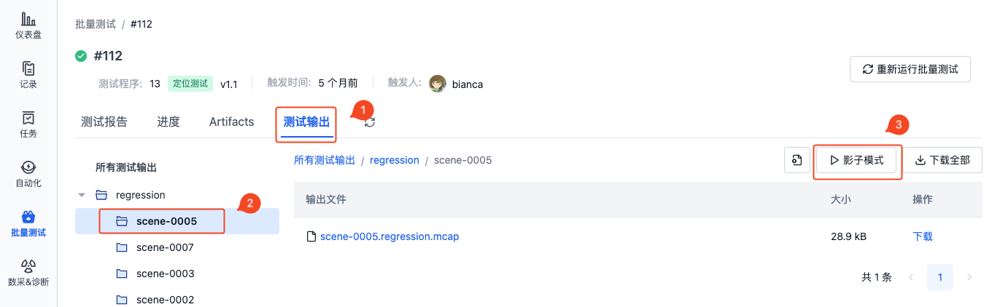

2. 测试输出文件将与原记录中的文件一起在可视化界面中对比播放。

    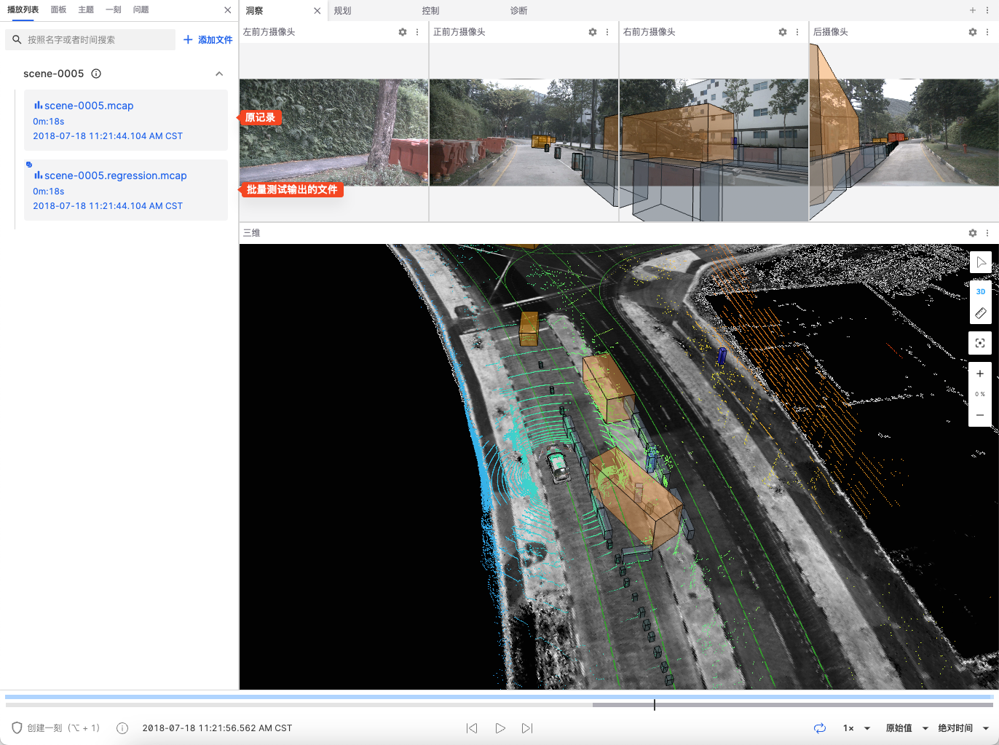

## 了解更多
- [测试程序](./4-test-bundle-management.md)
- [测试套件](./3-config-management.md)
- [运行批量测试](./5-run.md)
- [记录](../../collaboration/record/1-quick-start-record.md)
- [可视化](../../viz/1-about-viz.md)