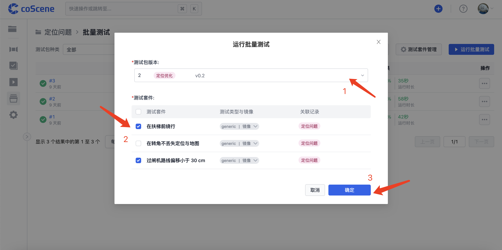
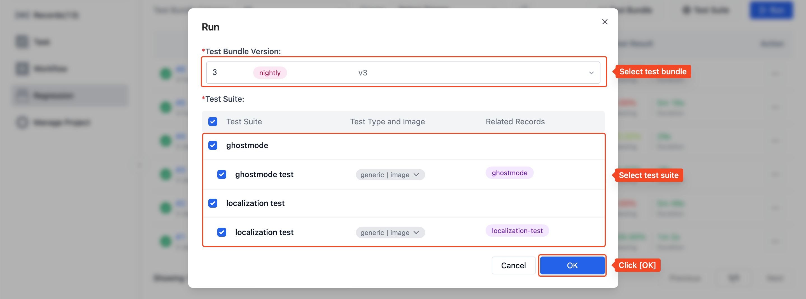
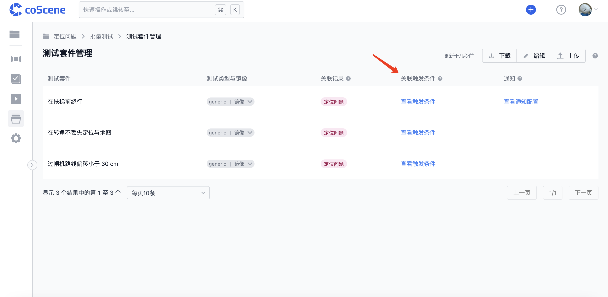
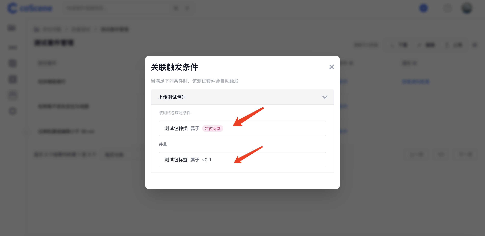

# 运行批量测试

> 了解如何运行批量测试，包括在网站上指定相关条件后触发、通过配置文件指定自动触发条件，以及使用命令行在本地运行批量测试等。

## 网页端运行批量测试

1. 点击进入「批量测试」页面：

- 首次运行批量测试

  

- 非首次运行批量测试

  

 

2. 选择测试包版本和需要执行的测试套件后，点击「确定」运行批量测试，会使用符合条件的关联记录作为测试数据执测试套件：

   

## 自动触发批量测试

上传的测试包种类或标签符配置文件中的预设条件时，测试包完成上传后会自动触发批量测试，使用该测试包文件执行符合条件的全部测试套件。

你可以在配置文件中的「on」字段对测试套件设置自动触发条件，具体格式与规则请参见 [配置文件格式与样例-自动触发测试](../regression/9-yaml-sample.md#auto-triggering)。

在「批量测试-测试套件管理」页面中，对于配置了自动触发条件的测试套件，其「关联触发条件」列会显示「查看触发条件」按钮：

你可以点击「查看触发条件」按钮，查看该测试套件自动触发对应的测试包条件：

