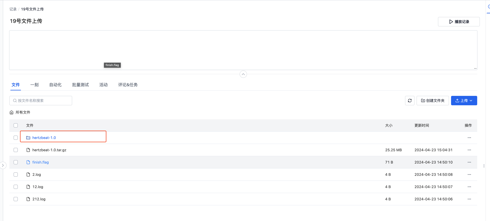

# 通用数据采集
## 背景
机器人行业的设备常见环境故障、软件故障和硬件故障等问题，运维人员**获取数据**排查问题需要**大量时间成本**。刻行时空平台提供了**基于时间段&文件路径**的通用数据采集方案，方便用户快速获取机器端数据。

本文将以运维人员远程采集现场数据为例，讲述如何通过刻行时空平台实现数据的远程采集与自动化处理。

假设 A 现场有一台名为 `coScene-device` 的设备在 2025-07-23 16:00 出现故障，运维人员需要获取故障发生前约 30 分钟的 bag、log 以及额外的 map 数据。主要操作步骤如下：

1. 配置采集目录
2. 添加设备到项目
3. 采集设备数据
4. 跟踪文件上传进度
5. 处理数据

## 准备工作
首先，登录刻行时空平台并创建项目：

1. 访问[官方网站 https://www.coscene.cn/](https://www.coscene.cn)，点击右上角的【快速登录】，选择登录方式进入平台。

   

2. 在平台创建一个「项目」。项目作为数据管理单元，负责数据的存储、管理、隔离及权限控制。

   

3. 确认用户的角色是否为「组织管理员」。出于数据安全考虑，只有组织管理员才有「启用设备」和「配置全局采集目录」的权限。若不是管理员，请联系组织管理员更新组织角色。

   

4. 准备一台机器人设备

## 采集数据
### 配置采集目录
1. 进入「组织管理-设备-设备配置」页面，配置全局的采集目录 `collect_dirs`。

   

2. 假设设备端的 bag 存放路径为 `/home/bag`，log 存放路径为 `/home/log`，则配置如下：

   ```yaml
   mod:
   # mod 名称，默认 default
   name: 'default'
   conf:
      # 是否启用，默认为 true
      enabled: true

      # （用于手动采集与规则采集）设备端的采集目录，作为项目中手动采集与规则采集的指定目录
      collect_dirs: 
         - /home/bag/
         - /home/log/
   ```

3. 具体的配置文件信息介绍，请查看文档[设备配置](../device/4-device-collector.md)

### 添加设备到项目
1. 在「项目-设备」页面，获取设备安装命令
   
   

2. 在设备端执行安装命令

   

3. 安装完成后，设备会自动添加到项目中。前往「组织管理-设备」页面启用此设备后，即可采集数据

   

### 采集设备数据
> 前景提要：A 现场有一台名为 `coScene-device` 的设备在 2025-07-23 16:00 出现故障，运维人员需要获取故障发生前约 30 分钟的 bag、log 以及额外的 map 数据

1. 在「项目-设备」页面，选择设备 `coScene-device`，点击采集数据

   

2. 选择需要采集的时间范围、采集路径、采集名称与记录名称，开始采集：

   - 时间范围为：2025-07-23 15:30 至 16:00
   - 采集路径为：/home/bag/、/home/log/
   - 附加文件路径为：/home/map.png
   - 采集名称&记录名称为：采集 A 现场数据

   上述配置表示：采集设备 `coScene-device` /home/bag/ 和 /home/log/ 路径下，**文件创建时间/文件最后修改时间**在 2025-07-23 15:30 至 16:00 范围内的文件以及 /home/map.png 文件，并将采集到的数据上传到记录 `采集 A 现场数据` 中

   

3. 设备会在收到采集指令时，查找符合要求的文件并生成上传清单，将其上传到记录中

### 跟踪文件上传进度
1. 采集过程中，可在设备执行历史中查看采集进度

   
   

2. 也可在设备端执行 `tail -f ~/.local/state/cos/logs/cos.log` 命令，查看客户端的实时日志，跟踪文件上传进度
3. 在采集完成后，采集详情中会自动关联记录，点击即可查看上传到记录中的文件

   

## 处理数据
当数据上传至平台后，用户可以结合平台提供的[自动化](../6-automation/1-quick-start-workflow.md)能力，对数据进行后续的处理，提升数据流转速度与研发效率。

以「自动解压缩」为例，当上传的数据包含压缩包时，通过自动化的能力自动的将压缩包文件解压，避免了下载数据 - 解压 - 上传解压数据的繁琐流程。

### 配置解压触发器
在「项目-自动化-触发器」页面，创建触发器：当上传文件到记录时，且文件通配符满足 `*.tar.gz`，则文件上传后会自动解压缩。

   

### 触发解压
1. 在「项目-记录」页面，创建记录并手动上传一个压缩包文件，即可在记录的自动化页面看到自动触发的解压工作流

   

2. 解压操作执行完成后，查看文件列表，可看到解压出的文件夹。打开对应文件夹，即可看到解压后的数据文件。

   

## 常见问题
**问：机器端对应时间的文件没有采集**

答：请确定在采集时间范围内有对应的文件：

- 数据采集的文件时间采用的是文件的创建时间与最后修改时间，部分系统可能无法获得文件创建时间，只能通过文件最后修改时间进行判断。（可在机器端通过命令 `ls -l --time-style=+"%Y-%m-%d %H:%M:%S"` 查看文件对应的修改时间）
- 根据时间范围采集数据不可预定未来的数据，请确认是否填写了未来的时间

## 总结
本文介绍了一个用户手动指定采集内容，机器端自动上传相关的文件至平台的场景流程。结合刻行时空平台的自动化能力，可以搭配创建数据诊断、数据处理等流程，快速的搭建一套符合自身业务的数据流转流程，大幅提升运维效率。
