# 云端仿真自动化算法验证

## 背景

在泛机器人研发过程中，针对算法和软件的反复测试与验证，是日常工作中最耗时、最容易出错的一环。

你是不是也经历过这样的日常？

- 算法改了一行代码，结果测了一整天  
- 本地仿真环境突然坏掉，重装又踩坑  
- 多人协作，各测各的，结果对不上…

尤其对于**移动机器人、具身智能**等领域的研发人员来说：

- 软件更新频繁  
- 仿真环境搭建复杂  
- 测试标准不统一  
- 本地测试排队严重  

这些问题导致本地测试效率低下、协作困难。

---

刻行时空一直在思考：有没有一种方法，只要修改完算法，就可以随时进行无痛进行效果验证，还能把测试结果标准输出？

刻行时空在**数据闭环**与**生产力工具**搭建方面拥有丰富经验，基于我们先进的 **ScenenOps 理念**，提供了一站式云端仿真平台：  
**简单五步，完成平台搭建，你只需上传程序，平台自动运行测试、生成可视化结果，全流程在线、零依赖！**


本文以 Ubuntu22.04 + ros2-humble + gazebo 环境为例，介绍如何在修改完算法程序后通过刻行时空平台进行直接仿真测试。

更多仿真软件的支持，请关注刻行时空官网：[刻行时空平台](https://www.coscene.cn/)。

---

## 🧱 Step 1：构建属于你自己的算法与软件测试底座

我们知道，每支团队的技术栈都不一样。  
因此，我们支持用户基于自己的系统依赖构建专属镜像并上传。

你可以使用如下 Dockerfile 模板来构建环境：

```Dockerfile
# syntax = docker/dockerfile:1.2
ARG BASE_IMAGE=osrf/ros:humble-desktop-full
FROM ${BASE_IMAGE} as base
...
WORKDIR /action/ros2_ws
```

开源示例项目 👉 [Regression_Test-Sample](https://github.com/coscene-io/Regression_Test-Sample/blob/main/Dockerfile)

构建完成后，打包推送至平台镜像仓库，全公司同事可复用这个稳定的测试环境，无需本地重复搭建。

1. 登录刻行时空平台，进入组织管理获取专属镜像仓库地址
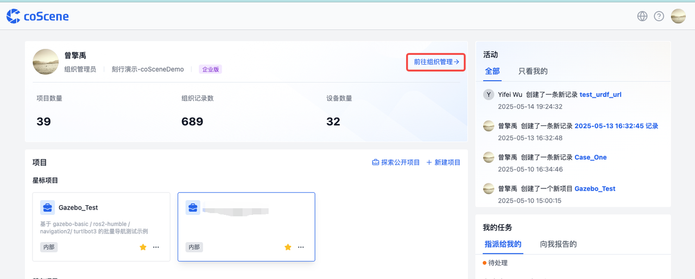
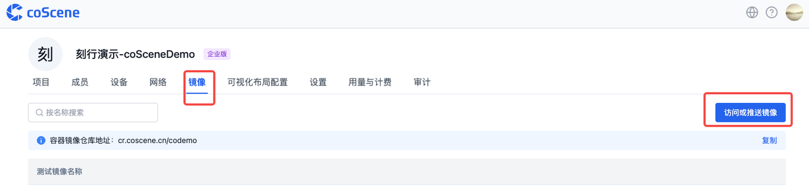
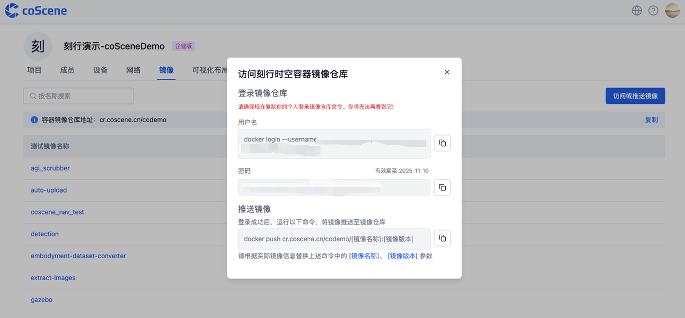

2. 登录 Docker 并打包推送镜像  
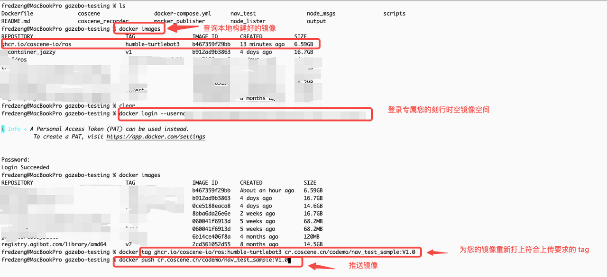

3. 登录平台查看镜像并获取链接  
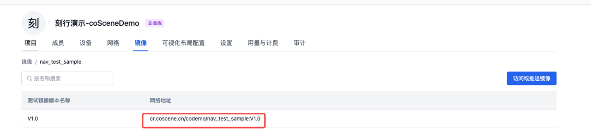

完成上述操作后，相当于为后续的各种仿真算法测试验证，搭建了一套完整的运行环境底座，里面包含了所有需要的测试软件依赖环境。

---

## 📦 Step 2：上传你的算法与测试程序

算法/软件代码修改完成后，对代码进行编译。


将其压缩为 `.zip` 或 `.tar.gz` 上传至平台，建议上传 `install` 目录的压缩包：

```bash
tar -czvf install.tar.gz ./install
```
进入平台项目，点击上传程序按钮，平台将自动解压并在后续执行测试时，在对应容器中运行。
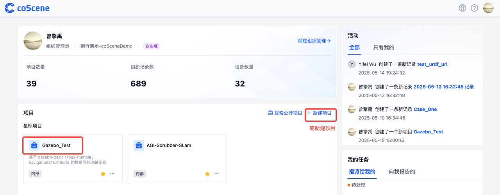

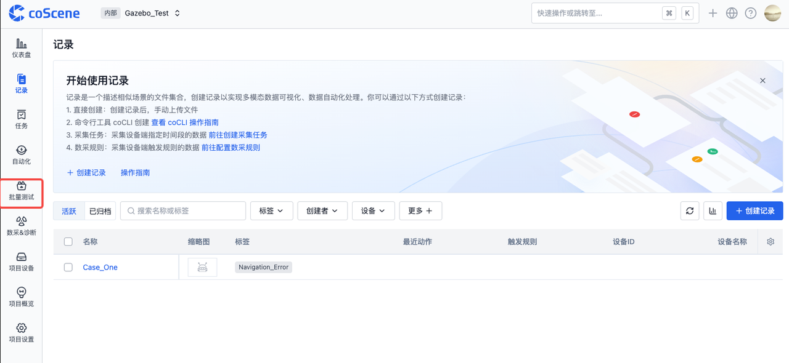

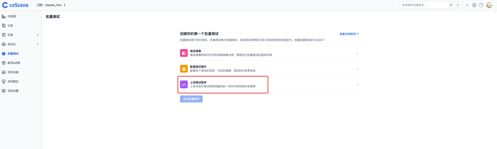

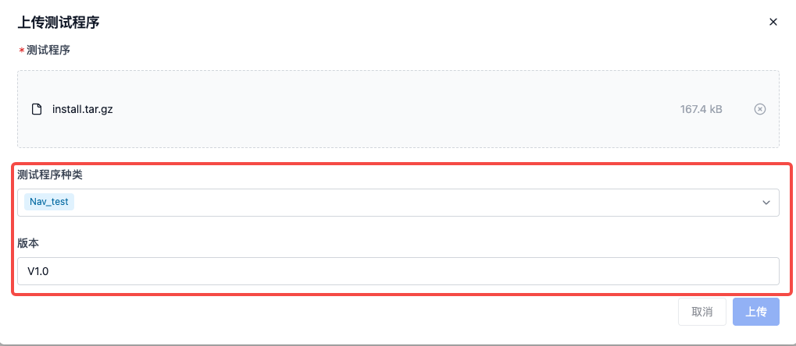

同时支持：

- 源码构建与编译后的可执行程序

可参考平台文档 👉 https://docs.coscene.cn/docs/sim-and-tests/regression/test-bundle-management

***对于企业用户，还支持 GitHub / GitLab 持续集成上传构建产物，跳过手动上传过程。***

---

## 🧪 Step 3：准备你的测试用例

平台支持通过 `组织 → 项目 → 记录` 的结构，配置多条测试用例。

每条测试记录就像一个预设的虚拟测试现场：

- 地图：`map.pgm` + `map.yaml`
- 机器人模型：如 `turtlebot3_waffle_pi`
- 配置文件：如 `case.yaml`
- Gazebo world 文件：定义仿真环境
- 其他测试依赖资源

测试记录文件结构示例：

```
test_case/
├── map.pgm
├── map.yaml
├── case.yaml
├── world.world
├── extra_configs/
```

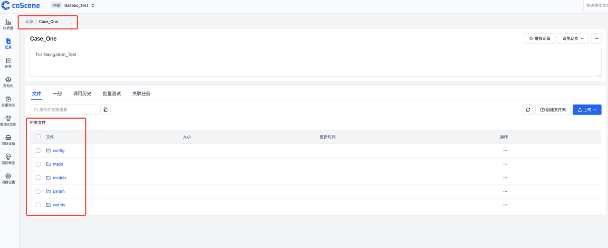

> ℹ️ **注意：**
> 
> 1. 上传文件时请遵循平台规定路径结构，文档参考：https://docs.coscene.cn/docs/sim-and-tests/regression/intro
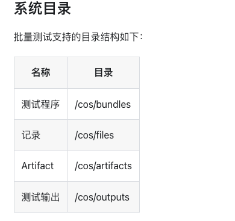  
> 2. 需要提前为记录添加标签（如 `Navigation_Error`），用于后续自动化测试筛选触发，参考下述流程：
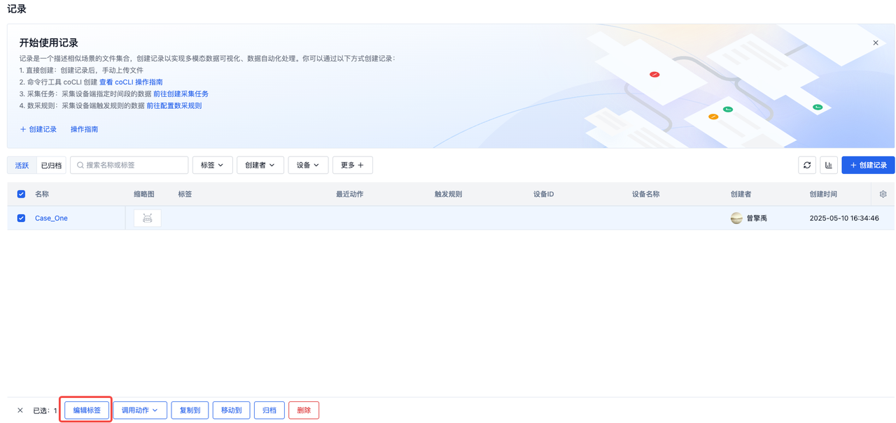
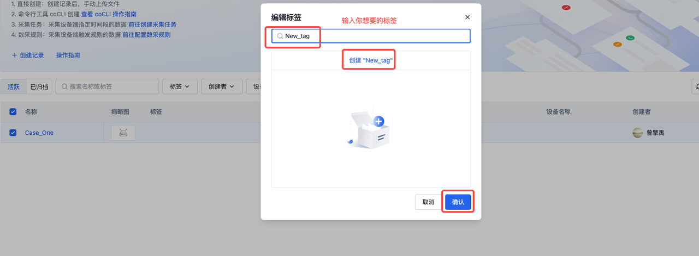
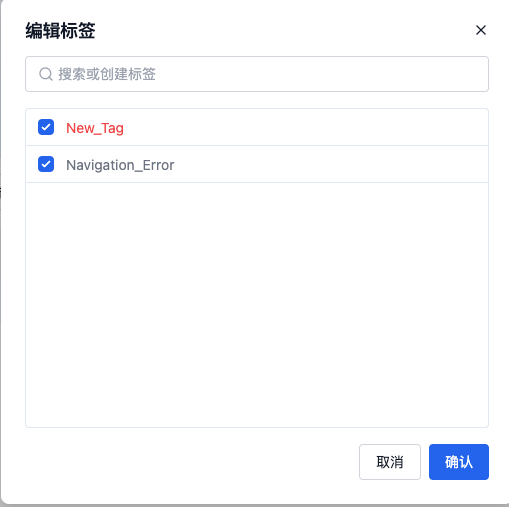
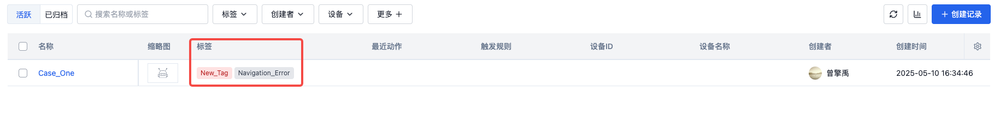
完成上述流程后，在下一步的配置页面中，我们就可以设置只有带有 'Navigation_Error' 标签的记录才会作为自动化测试的输入用例。
---

## ⚙️ Step 4：配置测试触发逻辑

每个项目都可以配置自动化触发策略：

- 每次上传算法自动触发测试  
- 手动选择记录执行  
- 按标签或版本筛选测试集    

详细配置参考 👉 https://docs.coscene.cn/docs/sim-and-tests/regression/config-management


---

## 📊 Step 5：运行测试，观测测试过程与结果

测试运行过程中支持：

- 实时查看可视化页面中机器人运行状态，支持导入 gazebo环境同步查看。  
- 自动录制测试过程数据。  
- 输出标准化测试报告。


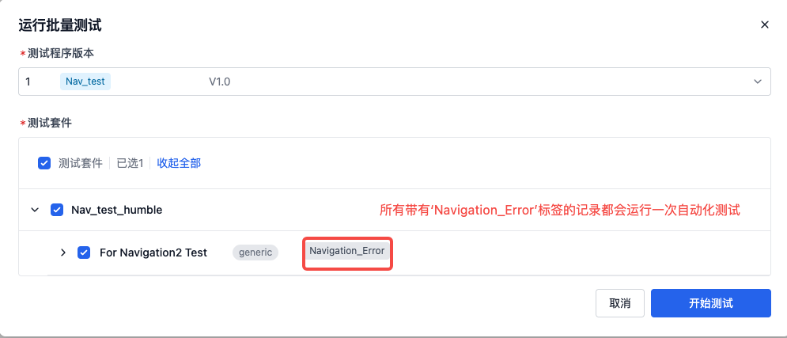


报告内容：

   - 📍 机器人运行轨迹
   - ✅ 成功 / 失败评分指标
   - 🪵 日志输出 / 异常信息
   - 🖼️ 可视化图表与统计
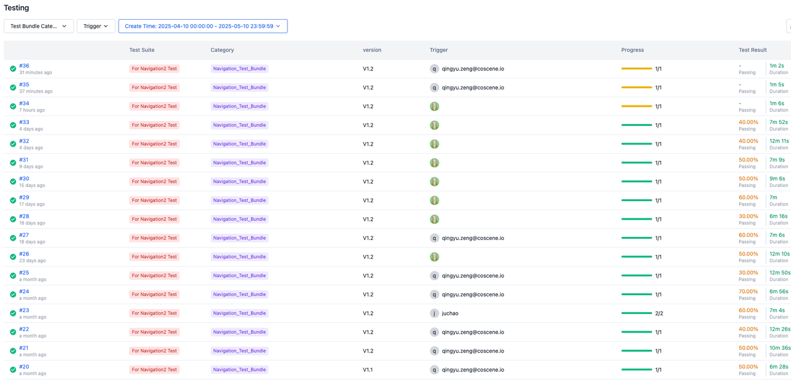
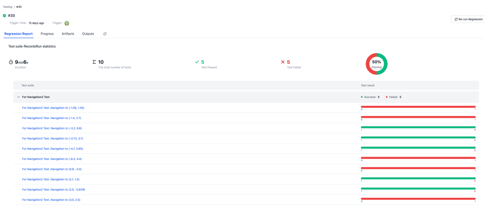

---

## 🚀 结语：把繁琐的测试交给刻行时空，轻装上阵搞研发

每次代码更新之后，你不再需要：

- 反复搭环境
- 重复运行脚本
- 对比日志找结果

只需一键上传，平台自动完成验证，全流程标准化、自动化，帮助你把更多时间投入到真正重要的工作中！

👉 欢迎注册体验：https://www.coscene.cn/