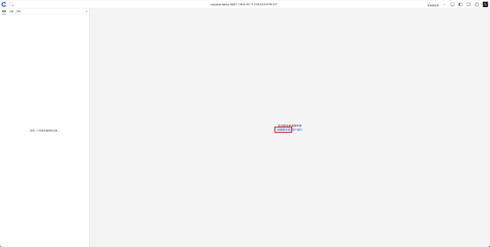
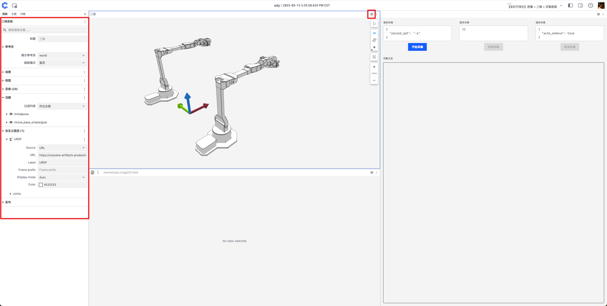
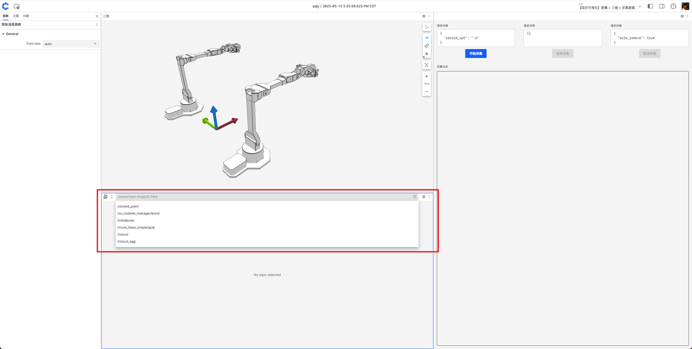
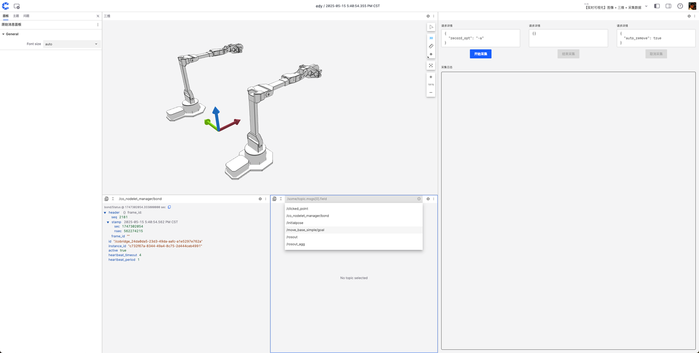
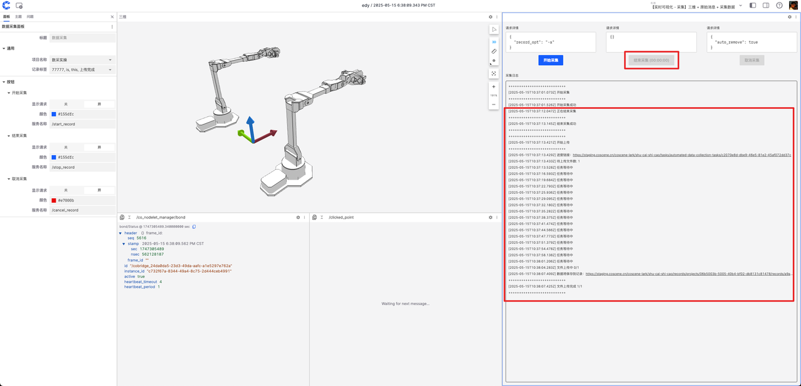

# 具身智能数据采集工厂接入刻行时空管理平台

## 背景
在具身智能领域，数据对于训练和优化智能体的行为、决策能力至关重要。当具身智能数据完成采集并整理好记录后，为了让这些数据能够精准地用于模型训练、算法优化等工作，需要对数据进行标注以便理解数据背后的含义，同时要经过审核保证数据的准确性和质量。刻行时空平台对此提供了一套完整的解决方案，兼容各种异构机器人，并支持多种数据的上传。 

本文主要介绍如下方法：
- **如何在机器人本体端安装集成刻行时空的端侧软件，以满足机器人本体接入平台。**
- **如何在机器人可视化的页面上进行数据采集与上传的操作。**

## 前提条件
1. **设备注册**
   - 安装命令（注意加 --beta）： 
     ```bash
     /bin/bash -c "$(curl -fsSL https://download.coscene.cn/coscout/v2/install.sh)" -s --mod="default" --org_slug="codemo" --server_url="https://openapi.coscene.cn" --coLink_endpoint="https://coordinator.coscene.cn/api" --coLink_network="fb899ea7-d71b-4cec-b531-0a5fb0015c61" --sn_file="/foo/bar/sn.txt" --sn_field="sn" --remove_config  --beta
     ```
   - sn_file：表示为机器的序列号文件存放的地址，需要手动配置，同时确保文件存在。 sn_field：表示在上一个文件里表示机器序列号的字段，举个例子，我的机器人序列号文件的路径是 /root/robot/sn.txt, sn.txt文件里的内容是sn:123456， 那么这里我需要配置的是：  --sn_file="/root/robot/sn.txt" --sn_field="sn"
   - --beta 表示我们目前是在使用刻行时空提供的测试版。

2. **安装 cobridge**
   - 下载 deb 包：[cobridge](https://github.com/coscene-io/cobridge/actions/runs/15103306677?pr=25) 根据机器人本体的计算平台选择对应的 deb 安装包
   - 安装命令：
     ```bash
     sudo dpkg -i ros-humble-cobridge_1.0.7-0focal_arm64.deb   #以实际下载的 deb 文件为准。
     ```

3. **对设备进行准入**
登录平台后，在首页即可看到“**前往组织管理**”的按钮，参考文档支持[设备准入](https://docs.coscene.cn/docs/device/manage-device#%E8%AE%BE%E5%A4%87%E5%87%86%E5%85%A5)

4. **创建项目**
登录平台后，在首页即可看到“**新建项目**”的按钮，参考文档支持[新建项目](https://docs.coscene.cn/docs/collaboration/project-collaboration/project)

5. **项目中添加采集设备**
完成以上动作后，我们需要将机器人本体关联到我们的项目中，参考文档支持[新建项目](https://docs.coscene.cn/docs/collaboration/project-collaboration/project)

---

## 准备与启动 ROS node

- 机器人本体上需要有可以提供 **service** 的**数据录制节点**，并且提供 **开始录制** （如/start_record）， **取消录制** （如/cancel_record）， **结束录制** （如/stop_record）之类的服务供刻行时空调用。 
- 启动 coBridge 前需 source **数据录制节点** 的 workspace 环境变量。
- 示例启动脚本（请根据实际情况修改）：
  ```bash
  #!/bin/bash
  set -e
  source ~/cos_ws/devel/setup.bash
  roslaunch cobridge cobridge.launch &
  sleep 3
  roslaunch record_ctrl record.launch &
  sleep 3
  ```

---

## 配置可视化布局
在进入实时可视化页面后，默认情况下是没有布局的，需要根据每个采集员的不同需求，将可视化面板添加至页面中。
若想快速开始，也可以联系刻行时空提供官方示例配置文件，按如下方法导入。


1. 进入实时可视化页面（方法参考[实时可视化](https://docs.coscene.cn/docs/device/device-remote-control)），点击【创建新布局】。


2. 选择【数据采集】面板及其他所需面板（如三维、原始消息）。


3. 拖拽面板标题栏调整布局，拖动分界线调整大小。


经过上述调整可以获得初步的可视化布局。

### 配置三维面板：
- 点击右上角【设置】，自定义图层可设置 URDF。



### 配置原始消息面板：
- 顶部选择关注的消息，可拆分/添加新面板。





### 配置采集数据面板：
   - 选择数据采集面板后，设置数据保存项目、记录标签、服务名称（如/start_record、/cancel_record、/stop_record）。
   
   
   - **服务名称，需要根据机器人本体上运行的数据录制节点提供的服务名称为准！**

### 布局管理
配置完成后可保存、重命名、与团队共享。


---

## 采集数据流程

1. 点击【开始采集】，日志提示“开始采集成功”即设备开始录制。（**具体日志内容，以服务提供的反馈为准！**）


2. 采集员操作机器人完成目标任务。

3. 任务完成后点击【结束采集】，日志提示“结束采集成功”并自动上传数据。（**具体日志内容，以服务提供的反馈为准！**）

   - 刻行时空在这里提供了数据上传的日志提示：日志报出「结束采集成功」---「开始上传」---「文件上传中 X / N」---「文件上传完成」即完成了数据采集在采集日志中，可查看记录链接、上传文件进度。 


4. 若误操作可点击【取消采集】丢弃数据。


5. 项目中可查看采集记录及数据。


---

## 常见问题解答

- **Q：采集数据面板的 service 可以自定义吗？**
  A：可以，平台提供模板，用户可自定义。

- **Q：还有哪些面板支持实时可视化？**
  A：所有面板均支持，只要机器人发出对应消息。

- **Q：还有哪些采集方式？**
  A：平台支持按时间范围采集、自动发现采集等，详见[相关文档](https://docs.coscene.cn/docs/category/use-case)。

---

以上为实时可视化采集数据的全部流程，如有疑问欢迎联系我们。
        