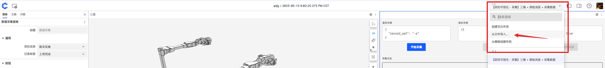
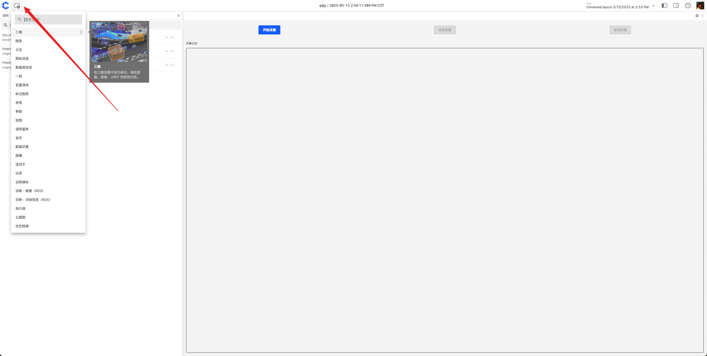
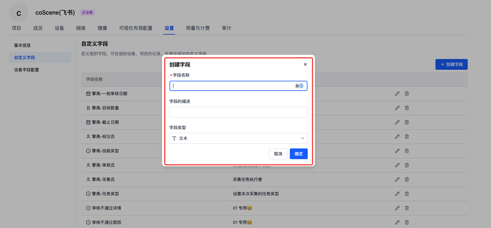

# 异构机器人数据采集工厂接入刻行时空平台

## 背景

在具身智能领域，数据对于训练和优化智能体的行为、决策能力至关重要。当具身智能数据完成采集并整理好记录后，为了让这些数据能够精准地用于模型训练、算法优化等工作，需要对数据进行标注以便理解数据背后的含义，同时要经过审核保证数据的准确性和质量。刻行时空平台对此提供了一套完整的解决方案，兼容各种异构机器人，并支持多种数据的上传。

本文主要介绍如下方法：

- **如何在机器人本体端安装集成刻行时空的端侧软件，以满足机器人本体接入平台。**
- **任务管理系统的搭建**
- **如何在机器人可视化的页面上进行数据采集与上传的操作。**

## 前提条件

1. **设备注册**
   参考如下官方链接：[登录刻行时空](../2-get-started/1-quick-start.md)，完成**登录刻行时空**部分
   参考如下官方链接：[设备注册](../device/2-create-device.md)
   - 安装命令（**以下代码仅供参考示例，请务必在您的组织中复制安装指令后再添加。**）：
     ```bash
     /bin/bash -c "$(curl -fsSL https://download.coscene.cn/coscout/v2/install.sh)" -s --mod="default" --org_slug="codemo" --server_url="https://openapi.coscene.cn" --coLink_endpoint="https://coordinator.coscene.cn/api" --coLink_network="fb899ea7-d71b-4cec-b531-0a5fb0015c61" --sn_file="/foo/bar/sn.txt" --sn_field="sn" --remove_config  --beta
     ```
   - sn_file：表示为机器的序列号文件存放的地址，需要手动配置，同时确保文件存在。 sn_field：表示在上一个文件里表示机器序列号的字段，举个例子，我的机器人序列号文件的路径是 /root/robot/sn.txt, sn.txt文件里的内容是sn:123456， 那么这里我需要配置的是： --sn_file="/root/robot/sn.txt" --sn_field="sn"

2. **安装 cobridge**
   - 下载 deb 包：[cobridge](https://github.com/coscene-io/cobridge/actions/runs/15103306677?pr=25) 根据机器人本体的计算平台选择对应的 deb 安装包（**注意科学上网进入 github 下载**）
   - 安装命令：
     ```bash
     sudo dpkg -i ros-humble-cobridge_1.0.7-0focal_arm64.deb   #以实际下载的 deb 文件为准。
     ```
   - 也可参考[使用 APT 源安装刻行端侧软件](../client/2-apt-source-install.md)

3. **对设备进行准入**

   登录平台后，在首页即可看到“**前往组织管理**”的按钮，参考文档支持[设备准入](../device/3-manage-device.md#enable-device)

4. **创建项目**

   登录平台后，在首页即可看到“**新建项目**”的按钮，参考文档支持[新建项目](../3-collaboration/project-collaboration/1-project.md)

5. **项目中添加采集设备**

   完成以上动作后，我们需要将机器人本体关联到我们的项目中，参考文档支持[新建项目](../3-collaboration/project-collaboration/1-project.md)

---

## 准备与启动 ROS node

- 机器人本体上需要有可以提供 **service** 的**数据录制节点**，并且提供 **开始录制** （如/start_record）， **取消录制** （如/cancel_record）， **结束录制** （如/stop_record）之类的服务供刻行时空调用。
  -- **注意：** 
  1. 目前只支持**service** 类型的消息。
  2. 消息的格式需要符合 ROS/ROS2 消息定义规范，如：
  ```
  std_srvs/Empty "start_record"
  std_srvs/Empty "cancel_record"
  std_srvs/Empty "stop_record"
  ```
  3. 各接口请求和返回，需要满足一定的要求，如：
  ```
  - /start_record
    - Request
      {
        "record_opt": "-a"  //可选，取决于您的服务是否支持传参
      }
    - Response
      {
        "success": true / false , // 表示是否成功启动录制，必须返回
        "message": ""
      }
  ```
  ```
  - /cancel_record
    - Request
      {
         "auto_remove": true  //可选，取决于您的服务是提供对应删除废弃数据的能力
      }
    - Response
      {
        "success": true / false, // 表示是否成功取消录制，必须返回
        "message": ""   // 可选，是否返回必要信息
      }
  ```
  ```
  - /stop_record
    - Request
      { } //可支持传参
    - Response
      {
          "success": true,   // 如果 success 为 true 则读取 type 来判断行为, 
          // "NORMAL" - 需要把生成的bag上传
          // "SKIP_CAPTURE" - 采集出现问题(e.g.: 未能通过bag质量检测),不需要上传，非必须。
          "type": "NORMAL" | "SKIP_CAPTURE"  ,
          "message": "",   // 可选，是否返回必要信息
          "record_name": "",  // 可选，是否要指定平台记录的名称
          "tags": ["01", "02"], // 可选，是否要指定平台记录的标签
          "files": [     // 必须返回此次录制数据的绝对路径
              "/home/cos/bags/1.bag",
              "/home/cos/bags/2.bag",
              "/home/cos/bags/3.bag"
          ]
      }

- 启动 coBridge 前需 source **数据录制节点** 的 workspace 环境变量。
- 示例启动脚本（请根据实际情况修改）：
  ```bash
  #!/bin/bash
  set -e
  source ~/cos_ws/devel/setup.bash   # 请根据实际情况修改
  roslaunch cobridge cobridge.launch &
  sleep 3
  roslaunch record_ctrl record.launch &  # 请根据实际情况修改，实际启动的是您的录包节点
  sleep 3
  ```

---

## 配置可视化布局

在进入实时可视化页面后，默认情况下是没有布局的，需要根据您的不同采集需求，将可视化面板添加至页面中。
若想快速开始，也可以联系刻行时空提供官方示例配置文件，按如下方法导入。


1. 进入实时可视化页面（方法参考[实时可视化](../device/5-device-remote-control.md)），点击【创建新布局】。
   

2. 选择【数据采集】面板及其他所需面板（如三维、原始消息）。
   
   

3. 拖拽面板标题栏调整布局，拖动分界线调整大小。
   
   
   经过上述调整可以获得初步的可视化布局。

### 配置三维面板：

- 点击右上角【设置】，自定义图层可设置 URDF。
  
  

### 配置原始消息面板：

- 顶部选择关注的消息，可拆分/添加新面板。
  
  
  
  

### 配置采集数据面板：

- 选择数据采集面板后，设置数据保存项目、记录标签、服务名称（如/start_record、/cancel_record、/stop_record）。
  
  
- **服务名称，需要根据机器人本体上运行的数据录制节点提供的服务名称为准！**

### 布局管理

配置完成后可保存、重命名、与团队共享。推荐个将配置好的布局设置为**项目默认布局**。


---

## 任务配置与管理

我们需要根据不同的业务需求，配置不同的任务管理系统，以支持我们的业务需求。刻行时空为不同的应用场景提供了灵活可配的字段、触发器、动作管理能力。


### 为任务系统配置自定义字段

在我们任务管理系统中，我们需要针对不同的任务配置不同的字段，以满足我们的业务需求。
以采集任务为例，我们需要配置如下字段：

- 采集员
- 任务类型
- 任务状态
- 采集的技能名称
- 任务截止日期
- 采集数量
- etc

登录平台后，在首页即可看到"**前往组织管理**"的按钮，点击进入组织管理，进去 **设置** 的界面，在左侧导航栏中选择 **自定义字段**。在页面中对各个字段进行自定义配置，且可配置是否为必填项。


此页面还可配置自定义的设备关联字段，以支持我们在任务管理系统中关联的设备，配置部分特定的筛选字段。

在完成组织全局字段的配置后，进入项目设置-高级页面，编辑项目字段配置，选择记录、任务、一刻需要使用的字段。


添加完成后，即可在对应的页面使用该字段。

### 为任务系统配置自动化流转触发器

触发器定义了动作的触发条件，当满足触发时机时，触发器会依据配置进行检查，并执行对应的动作。

在我们数据采集的场景中，通常我们需要根据任务的状态的变化来触发任务的流转。
以典型的异构数据采集任务为例，我们需要配置如下触发器：

- 采集员将任务状态修改为"完成"时，自动调用创建标注任务的动作。
  参考下图：


关于触发器的配置，具体可参考 [自动化-触发器](../6-automation/4-trigger.md)

### 为任务系统配置自动化动作

如我们在上一步中配置的自动化流转触发器，当采集员将任务状态修改为"完成"时，会自动调用创建标注任务的动作。

刻行时空提供了适用于数据工厂的部分自动化动作：**创建通用任务**，以支持我们的数据工厂的业务需求。同时我们也支持自定义的自动化动作，以支持更适合您的工作流。

可参考文档：[自动化-动作总览](../6-automation/2-action-overview.md)

**刻行时空后续将推出任务配置导入/导出功能，同时提供更丰富的官方任务系统模板。敬请期待！**

## 数据采集、标注、审核操作指南

### 采集数据

- 管理员登录平台后，进入相应的项目中，完成如下工作：
  - 任务配置与管理
  - 将设备与成员关联到项目中，参考文档：[项目设备/成员](../3-collaboration/project-collaboration/1-project.md)
  - 点击左侧导航栏中的**任务**，创建**通用任务**。（**注意！在此应用场景请创建通用任务，采集任务与标注任务无法满足实际需求。**）
    

- 采集员登录平台后，可以在**主页** ➡️ **我的任务** ➡️ **指派给我的** 中查看待采集的任务。点击此任务，即可进入任务详情页。
  
  进入详情页面，点击**关联设备**，选择采集设备，点击**实时可视化**，进入可视化页面，即可看到我们配置好的采集布局。
  

- 点击【开始采集】，日志提示"开始采集成功"即设备开始录制。（**具体日志内容，以服务提供的反馈为准！**）
  

- 采集员操作机器人完成目标任务。

- 任务完成后点击【结束采集】，日志提示"结束采集成功"并自动上传数据。（**具体日志内容，以服务提供的反馈为准！**）
  
  - 刻行时空在这里提供了数据上传的日志提示：日志报出「结束采集成功」---「开始上传」---「文件上传中 X / N」---「文件上传完成」即完成了数据采集在采集日志中，可查看记录链接、上传文件进度。
    

- 若误操作可点击【取消采集】丢弃数据。
  

- 项目中可查看采集记录及数据。
  

  

- 完成采集后，采集员在任务中添加关联记录（根据设备名称与创建时间过滤出采集上来的记录）

  

---

### 数据标注

标注员登录平台后，可以在**主页** ➡️ **我的任务** ➡️ **指派给我的** 中查看待标注的任务。


点击该任务，即可查看待标记的数据记录，点击记录，进入详情页面，点击**播放记录**开始对数据进行标注。


标注员完成标注工作后，将标注任务标记为"完成"，即可完成标注任务。同时根据管理员设置的自动化流转触发器，此时系统会自动创建审核任务，给到审核员，系统进入下一阶段。

### 数据审核

审核员登录平台后，可以在**主页** ➡️ **我的任务** ➡️ **指派给我的** 中查看待审核的任务。


点击该任务，即可查看待标记的数据记录，点击记录，进入详情页面，点击**播放记录**开始对数据进行审核。


审核员完成审核工作后，将审核任务标记为"完成"，即可完成审核任务。

若审核员发现数据采集有误、标注有误，可标注为**审核不通过**，并在备注中填写原因。同时，根据管理员设置的自动化流转触发器，此时系统会自动创建重新标注任务或采集任务，给到标注员或采集员，系统进入下一阶段。

## 数据应用

当我们需要使用审核通过的数据时，我们可以在**项目**中查看数据，通过**标签** 、 **自定义字段** 实现对数据的筛选点击，选择记录后 点击**下载**，即可下载数据（大于 2G 的数据请使用 [coCLI](/docs/category/cocli) 下载），也可分享给其他团队成员。


## 常见问题解答

- **Q：采集数据面板的 service 可以自定义吗？**
  A：可以，平台提供模板，用户可自定义。

- **Q：还有哪些面板支持实时可视化？**
  A：所有面板均支持，只要机器人发出对应消息。

- **Q：还有哪些采集方式？**
  A：平台支持按时间范围采集、自动发现采集等，详见[相关文档](/docs/category/use-case)。

---

以上为异构机器人数据采集工厂接入刻行时空平台的全部流程，如有疑问欢迎联系我们。
