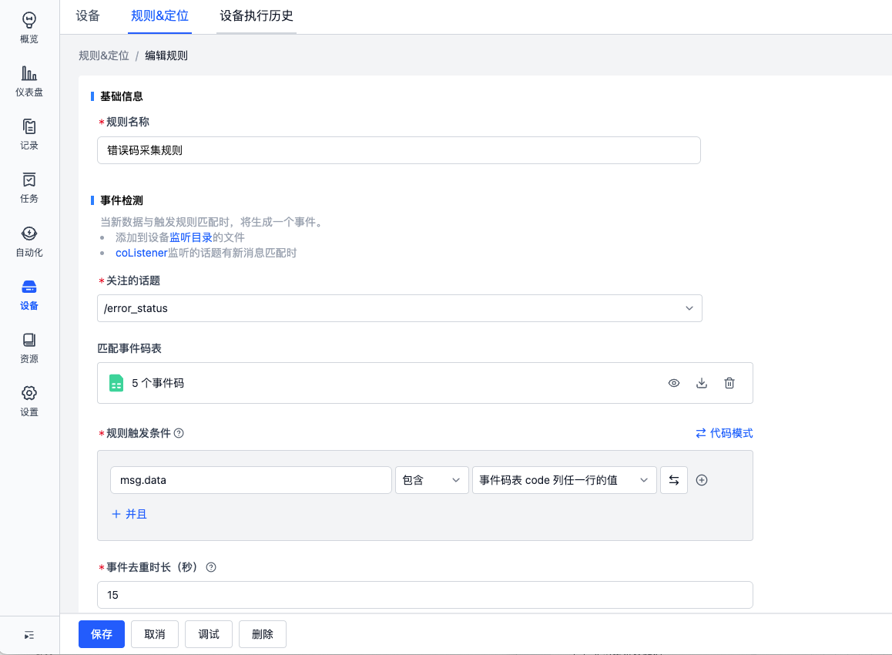
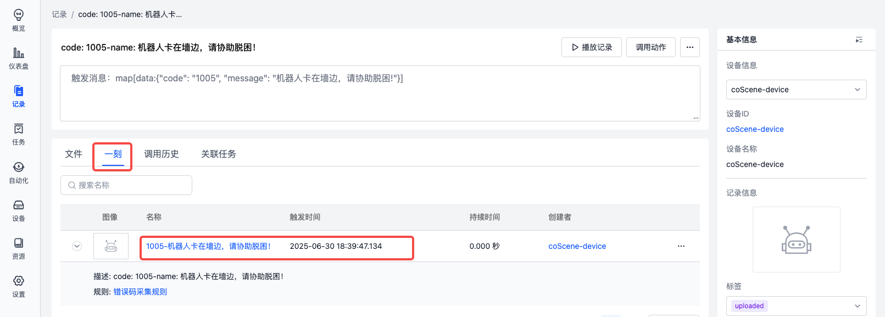

# 实现你的规则采集
以设定场景为例，快速上手自动采集流程：

- 当设备中新生成的 mcap 文件中包含 topic `/error_status`，且该 topic 的 `data` 字段中出现事件码 `1001 ~ 1005` 时，自动采集该时间点前 5 分钟后 1 分钟的数据，保存到记录。消息内容如下：

    

## 前提条件
1. 请准备好一台 linux 设备
2. 请创建名为 auto-upload 的项目
3. 请确认你的角色为「组织管理员」。若不是管理员，请联系组织管理员更新你的组织角色

   

## 设备配置

1. 进入「组织管理-设备-设备配置」页面，配置全局的规则采集信息

   

2. 假设设备端的 bag 存放路径为 `/home/bag`，需要监听的 topic 为 `/error_status`，则配置如下：

   ```yaml
   mod:
   # mod 名称，默认 default
   name: 'default'
   conf:
      # 是否启用，默认为 true
      enabled: true

      # （用于规则采集）设备端的监听目录，作为项目中规则的监听目录
      listen_dirs: 
         - /home/bag/

      # （用于手动采集与规则采集）设备端的采集目录，作为项目中手动采集与规则采集的指定目录
      collect_dirs: 
         - /home/bag/
         
   # （用于规则采集）话题，作为项目中规则触发话题的选项来源，以缩小规则匹配的范围
   # 假设存在 /error_status 话题
   topics:
   - /error_status
   ```

   更多配置参见[设备配置格式](../../device/4-device-collector.md#device-collector-format)


## 创建规则
1. 进入 auto-upload 项目

     

2. 在项目的「设备-规则&定位」页面，从规则模版创建规则

   

3. 选择错误码采集规则并下载示例 mcap 文件

   

4. 查看并保存规则

   

    - 输入事件检测信息
      - 关注的话题：选择需要监听的 topic `/error_status`
      - 事件码表：上传符合格式的 csv/json 文件，用于判断 topic 消息中是否包含 `code` 列中的内容，如下图：

        

      - 规则触发条件：mag.data 包含事件码表 code 列任一行的值
        
      上述信息表示：监听 topic `/error_status`，判断其字段 `data` 的消息中，是否包含关键词 `1001 ~ 1005`

    - 采集数据
      - 时间范围：
        - 采集 `collect_dirs` 中，在触发时间点前 5 分钟，后 1 分钟的文件
        - 时间判断依据：根据文件内容获取起止时间
      - 记录：用于标识每次采集将数据保存到的记录
        - 如：`code: {scope.code}-name: {scope.name}`，当触发了事件码 `1002` 时，本次采集的数据将生成一条名为「code:1002-name:目标点不可达！请协助」的记录
    - 关键时刻定位
      - 当数据上传到记录后，自动在触发时间点「创建一刻」，标记关键时刻，便于后续分析问题

5. 启用规则

   规则启用后，项目设备才会使用该规则进行数据监听

   

   \*更多规则条件样式参见[规则](./3-add-rule.md)

## 添加设备到项目
1. 在设备上创建文件监听与采集目录 `/home/bag/`

   ```
   cd /home
   mkdir bag
   ```

2. 在「项目-设备」页面，获取设备安装命令
   
   

3. 在设备端执行安装命令

   

4. 安装完成后，设备会自动添加到项目中。前往「组织管理-设备」页面启用此设备后，即可根据项目规则自动采集数据

   

## 在设备中写入文件
1. 确认设备已获取到规则

   - 在设备端执行命令查看日志

      ```bash
      tail -f ~/.local/state/cos/logs/cos.log
      ```

   - 当日志中出现 `received rules` 时，表示已成功获取到规则

     

2. 将本文「创建规则-第 3 步」中的 mcap 文件复制到设备端 `/home/bag/` 目录中

3. mcap 自动上传

   - 当日志中出现如下字段时，表示已检测到 mcap 文件触发了规则

     

   - 当日志中出现 `uploaded` 时，表示已成功上传 mcap 文件

     

## 查看创建的记录

1. 进入项目，查看自动创建的记录

   

2. 查看记录中上传的数据

   

3. 查看在触发时间点创建的一刻

   

## 了解更多

- [添加规则](./3-add-rule.md)
- 采集完成后自动发送通知
  - [创建发送通知的动作](../../6-automation/3-create-action.md#添加http-请求步骤创建动作)
  - [当采集完成后触发动作](../../6-automation/4-trigger.md#collect-status-change)
- [可视化回放数据](../../viz/1-about-viz.md)