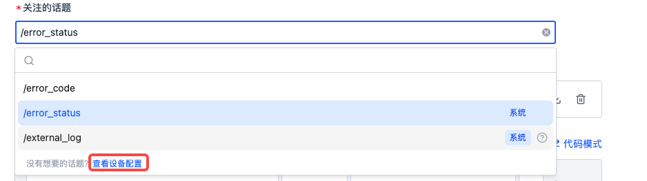

# 添加规则

> 权限：仅**项目管理员**和**组织管理员**可管理规则，其他角色仅能查看规则内容

在项目设备的规则&定位页面，可添加规则，实现项目设备数据的自动监听与采集。

## 特定数据格式

平台规则仅对特定格式的数据生效，这类数据需包含消息、时间戳、主题、消息类型，属于流数据。

目前支持的日志文本文件时间戳格式如下：

| 时间戳类型                                                                                            | 时间戳格式           | 示例                       |
| ----------------------------------------------------------------------------------------------------- | -------------------- | -------------------------- |
| 常规文件中的时间戳                                                                                    | %m%d %H:%M:%S.%f     | 0212 12:12:12.548513       |
|                                                                                                       | %b %d %H:%M:%S       | Dec 12 12:12:12            |
|                                                                                                       | %Y-%m-%d %H:%M:%S.%f | 2023-02-12 12:12:12.548513 |
|                                                                                                       | %H:%M:%S.%f          | 12:12:12.548513            |
| 特殊\*文件名 / 文件第一行中的时间&#x6233;_（用于文件中时间戳未全部包含年、月、日、时、分、秒的情况）_ | %Y-%m-%d %H:%M:%S    | 2023-02-12 12:12:12        |
|                                                                                                       | %Y/%m/%d %H:%M:%S    | 2023/02/12 12:12:12        |
|                                                                                                       | %Y%m%d%H             | 2023021212                 |

若有其他格式的时间戳需要支持的，请联系我们。

## 添加规则

规则组是规则的集合，用于对规则进行分类管理。规则用于定义触发数据采集的条件以及触发后的操作。

在项目的「设备-规则&定位」页面，点击【添加规则组】


在规则组中，可通过点击【创建空白规则】或【从规则模板创建】来添加新规则


规则由基础信息、事件检测、触发操作组成


## 事件检测

检测新生成的文件/数据，当内容符合事件匹配条件时，触发事件上报。处理的内容如下：

- 设备监听目录 `listen_dirs` 中的文件，详见[设备配置](../../device/4-device-collector.md)
- 设备端某个 topic 中的消息
  - 需安装并启用 ROS 套件，详见[添加设备](../../device/2-create-device.md)
- 记录中的文件
  - 需在记录中调用「数据定位」动作进行事件监测


### 关注的话题

> 建议将设备上的错误码统一发到一个 topic，如 /error_code topic，以便于实现标准化的错误码采集

系统默认提供了两个话题，分别是：

- `/error_status`：用于与规则模板「错误码采集规则」结合，快速实现规则采集，详见[实现你的规则采集](./2-get-started.md)
- `/external_log`：用于处理符合条件的 .log 文件

若需配置更多选项，可点击【查看设备配置】前往组织的[设备配置](../../device/4-device-collector.md)中设置



### 匹配事件码表

在事件码表中，可定义事件的 code 值、事件名称、等级、解决方案等信息，用于在事件与一刻中展示对应的信息


- 事件码表必须包含 code 列，作为事件的唯一标识符，可根据实际情况增加或删除列
  - 注：表头名称需为英文，且无空格
- 上传事件码表（支持 JSON 或 CSV 文件）后，还支持预览、下载、删除操作
  - 若要修改表内容，可先下载到本地电脑，删除规则中的原表后再上传修改后的表格

### 规则触发条件

根据设备消息字段与某个值的匹配关系判断事件是否触发。

假设存在 topic `/error_status`（消息类型为 `std_msgs/string`），示例如下：


- 若要检测 `data` 字段中是否出现事件码表中的 code 值，即 `1001~1005`：
  - 填写：msg.data 包含 事件码表 code 列任一行的值

  

- 若要检测 `data` 字段中是否出现事件码 `1001`：
  - 需切换为具体值输入
  - 填写：msg.data 等于 1001

  

- 若 data 字段为数组，要检测字段中是否出现事件码表中的 code 值，即 `1001~1005`：
  - 需切换为代码模式
  - 填写：`msg.data.exists(x, x.code.contains(scope.code))`

  
  

- 若要检测 log 文件中是否有关键词 `error 1`
  - 填写：msg.message 包含 error 1，并且「关注的话题」需选择 `/external_log`

  

### 事件去重时长

若新事件（同一事件）在上次合并事件后的设定时间内发生，则与原事件合并。每次新事件发生时，都重置时间，直到超出时间窗口都无新事件发生时，完成合并。

- 支持范围设置在 1 秒 \~ 86400 秒（1 天）之间


## 触发操作

触发操作是指规则条件满足后执行的操作，包括采集数据、关键时刻定位。

### 采集数据

设备端触发规则后，将自动采集对应时间的数据，并保存到记录。

该模块主要定义：上传文件时间范围、记录信息、采集限制、更多设置


- **上传文件的时间范围**
  - 定义需要采集触发时间点前后多长时间范围的文件。（数据采集目录的设置详见[设备配置](../../device/4-device-collector.md)）
- **记录信息**
  - 定义保存数据的记录名称、描述与标签信息，其中名称与描述支持使用变量（如：`{scope.code}`，详见下文）
  - 当数据上传完成后，将自动在记录中添加`上传完成`标签
- **采集限制**
  - 定义同一事件重复发生时，1 天最多采集多少次数据
  - 支持限制单台设备与所有设备，当达到任一限制峰值时，将不再采集数据
  - 若无限制，则发生的所有事件都会触发上传，建议添加限制
- **更多设置**
  - 筛选文件范围：
    - 默认情况下，所有在指定时间范围内的数据采集目录中的文件都会被上传
    - 支持利用[文件通配符](https://www.malikbrowne.com/blog/a-beginners-guide-glob-patterns/)设置上传白名单，对既定的文件上传清单进行二次筛选，仅上传在白名单中的文件，以减少设备流量开支
  - 具体附加文件：添加需要额外上传的设备文件/文件夹绝对路径，一般为地图、配置文件等非实时产生的设备文件

规则触发的自动采集示例：


采集数据自动上传至记录示例：


### 关键时刻定位

设备或记录触发规则后，在记录中自动创建一刻，标记关键时间点

- 从设备端采集数据保存到记录后，自动在规则触发时间点创建一刻
- 手动创建的记录可通过调用「数据定位」动作自动标记关键时间点。「数据定位」动作会聚合项目中勾选了「关键时刻定位」模块的所有规则，对记录中的文件进行规则匹配。

该模块主要定义：一刻信息、任务信息


- **一刻信息**
  - 定义触发时间点的一刻名称、描述、属性值等，支持使用代码变量（如：`{scope.code}`，详见下文）
- **任务信息**
  - 定义是否创建任务、任务经办人、是否[同步任务到工单系统](../../3-collaboration/integration/1-jira-integration.md)等信息，对触发规则的事件进行流转

记录中自动创建的一刻示例：


## 规则变量

在规则的触发操作中，支持使用变量或表达式来获取触发时的相关数据值。

以如下信息为例：

- 事件码表为：

  

- 触发事件为 `/error_status` topic 中的消息：

  ```
  {
    "code": "1001",
    "message": "定位丢失",
    "tags": ["定位问题", "版本:v1.0", "其他标签"],
    "files": ["/home/coscene/20250808_1.bag", "/home/coscene/20250808_2.bag"]
  }

  ```

规则变量书写规范见下表：

| 变量名                                                         | 含义                                                 | 示例                                                                            |
| -------------------------------------------------------------- | ---------------------------------------------------- | ------------------------------------------------------------------------------- |
| `{scope.code}`                                                 | 触发事件在事件码表中的 `code` 值                     | `{scope.code}` 为 `1001`                                                        |
| `{scope.name}`                                                 | 触发事件在事件码表中对应行的 `name` 值               | `{scope.name}` 为 `定位丢失`                                                    |
| `{msg}`                                                        | 触发规则的消息内容                                   | `{msg}` 为整条消息的内容                                                        |
| `{msg.tags}`                                                   | 触发规则的消息中的 `tags` 字段值                     | `{msg.tags}` 为`"定位问题","版本:v1.0","其他标签"`                              |
| `{msg.files}`                                                  | 触发规则的消息中的 `files` 字段值                    | `{msg.files}` 为`"/home/coscene/20250808_1.bag","/home/coscene/20250808_2.bag"` |
| `{topic}`                                                      | 触发规则的话题                                       | `{topic}` 为 `/error_status`                                                    |
| `{ts}`                                                         | 触发规则时的时间戳                                   | `{ts}` 为 `1751436062.133`                                                      |
| `{timestamp(ts).format("%Y-%m-%d %H:%M:%S", "Asia/Shanghai")}` | 将时间戳转为格式为 `%Y-%m-%d %H:%M:%S`的上海时区时间 | `2025-07-02 14:01:02`                                                           |

**注意：**

- 在规则条件中使用变量或表达式时，请直接使用，不要用 `{}` 包裹
- 在非规则条件中使用变量或表达式时，例如记录名称，记录描述等，请用 `{}` 包裹。
- 表达式的语法遵循 [CEL 语法](https://github.com/google/cel-spec/blob/master/doc/langdef.md)

规则变量的使用示例如下：

1. **记录名称：**
   - 输入：错误码:`{scope.code} @ {timestamp(ts).format("%Y-%m-%d %H:%M:%S", "Asia/Shanghai")}`
   - 输出：错误码:1001 @ 2025-07-02 14:01:02

2. **记录描述**
   - 输入：`{msg.message}`
   - 输出：定位丢失

3. **记录标签**
   - 输入：`{msg.tags}`
     - 若输入的消息字段类型为**数组/单个 string**，则可自动将其内容解析为记录标签
   - 输出：定位问题，版本:v1.0，其他标签

4. **更多设置-具体附加文件**
   - 输入：`{msg.files}`
     - 若输入的消息字段类型为**数组**，则可自动将其中的文件清单解析为附加文件进行上传
     - 若仅需上传消息中定义的文件清单`{msg.files}`，则无需在「组织-设备-设备配置」页面中设置采集路径 `collect_dirs`
   - 输出：/home/coscene/20250808_1.bag,/home/coscene/20250808_2.bag

5. **一刻名称**
   - 输入：`{scope.code}-{scope.name}`
   - 输出：1001-定位丢失

6. **一刻属性**
   - 输入：
     - 属性名称输入：错误等级
     - 属性值输入：`{scope.level}`
   - 输出：
     - 属性名称：错误等级
     - 属性值：P1

### 自定义函数

除了 [CEL 语法](https://github.com/google/cel-spec/blob/master/doc/langdef.md) 支持的函数，还额外支持了以下函数(以下定义参照 CEL)

- **timestamp** \- 将其他类型转换为时间戳类型 （CEL 已经支持了从时间戳类型和字符串类型转换为时间戳类型）
  - **函数签名（Signature）**
    - `timestamp(double) -> google.protobuf.Timestamp` (将 double 类型转为时间戳类型， 会自行判断单位为秒/毫秒/微妙/纳秒)
  - **例子:**

    ```
    timestamp(1738915780.123) -> timestamp("2025-02-07T08:09:40.123")
    ```

- **format** \- 将时间戳类型用指定格式转为字符串类型
  - **函数签名（Signature）**
    - `google.protobuf.Timestamp.format(string) -> string` （参数为格式化字符串）
    - `google.protobuf.Timestamp.format(string, string) -> string` （参数为格式化字符串和时区）
    - `google.protobuf.Timestamp.format(string, int) -> string` （参数为格式化字符串和时区偏移量，单位为秒）
  - **例子:**
    ```
    timestamp("2025-02-07T08:09:40.123").format("%Y-%m-%d %H:%M:%S") -> "UTC: 2025-02-07 08:09:40"
    timestamp("2025-02-07T08:09:40.123").format("%Y-%m-%d %H:%M:%S", "Asia/Shanghai") -> "2025-02-07 16:09:40"
    timestamp("2025-02-07T08:09:40.123").format("%Y-%m-%d %H:%M:%S", 8*60*60) -> "2025-02-07 16:09:40"
    ```

**注意：**

- 时间戳的格式化字符串遵循 `man 3 strftime` 的格式，[了解更多](https://linux.die.net/man/3/strftime)
- 时区支持 `UTC`、`Asia/Shanghai`、`America/New_York` 等 IANA 规范的时区，[了解更多](https://en.wikipedia.org/wiki/List_of_tz_database_time_zones)

## 后续操作

- [调试并启用规则](./4-manage-rule-group.md)
- [添加设备](../../device/2-create-device.md)
