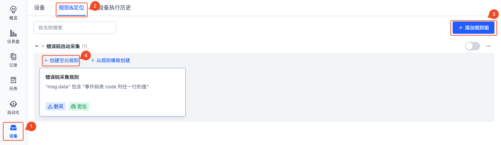
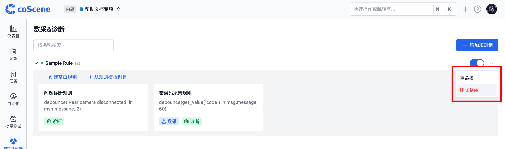
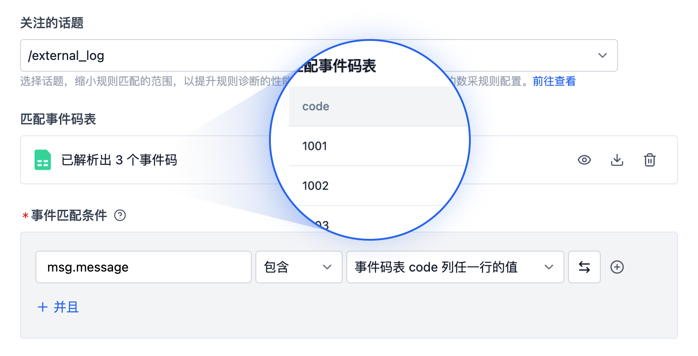
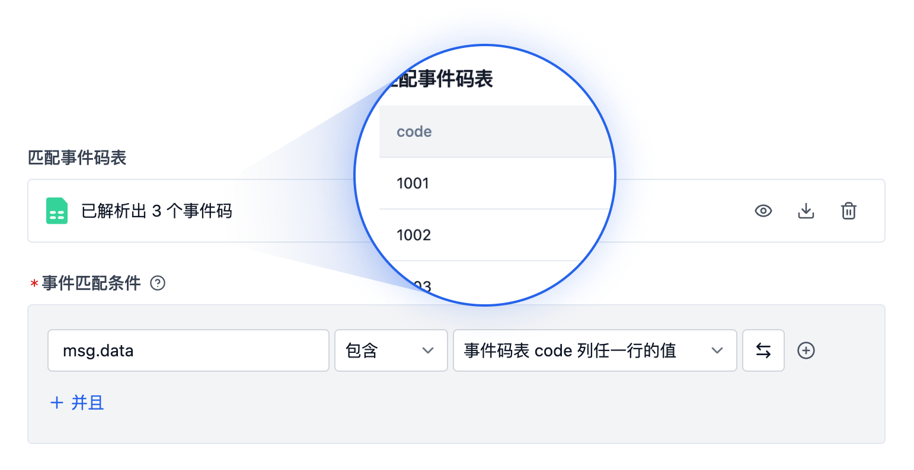

# 添加规则

> 只有**项目管理员**和**组织管理员**有权添加和编辑规则，其他权限角色仅能查看规则内容

## 数据格式要求

平台规则仅对特定格式的数据生效，这类数据需包含消息、时间戳、主题、消息类型，属于流数据。

文件要求：

- 后缀必须为：.log、.mcap、.bag
- 目前支持的 log 时间戳格式如下：

| 时间戳类型                                                                                   | 时间戳格式           | 示例                       |
| -------------------------------------------------------------------------------------------- | -------------------- | -------------------------- |
| 常规文件中的时间戳                                                                           | %m%d %H:%M:%S.%f     | 0212 12:12:12.548513       |
|                                                                                              | %b %d %H:%M:%S       | Dec 12 12:12:12            |
|                                                                                              | %Y-%m-%d %H:%M:%S.%f | 2023-02-12 12:12:12.548513 |
|                                                                                              | %H:%M:%S.%f          | 12:12:12.548513            |
| 特殊 _文件名/文件第一行中的时间戳_（用于文件中时间戳未全部包含年、月、日、时、分、秒的情况） | %Y-%m-%d %H:%M:%S    | 2023-02-12 12:12:12        |
|                                                                                              | %Y/%m/%d %H:%M:%S    | 2023/02/12 12:12:12        |
|                                                                                              | %Y%m%d%H             | 2023021212                 |

若有其他格式的时间戳需要支持，请联系我们。

## 规则组

规则组是规则的集合，用于对规则进行分类管理。

### 添加规则组

在项目中，进入「数采&诊断规则」分页，点击【添加规则组】，添加成功后，可在该规则组内添加具体规则。

### 启用规则组

新添加的规则组默认为「关闭」状态，若要对项目设备进行数据监听，需手动开启。

### 管理规则组

在【更多】操作中，支持对规则组进行：重命名、删除。

## 规则

规则是规则组中的单个规则，用于定义触发数据采集与诊断的条件，以及触发后的操作。

### 添加规则

在规则组中，可点击【创建空白规则】或【从规则模板创建】添加新规则。

### 规则内容

规则主要包含：基础信息、事件监听条件、触发操作。

#### 基础信息

为规则命名，规则名称用于区分不同规则，方便后续管理和识别。

#### 设备事件监听

> 对项目设备进行监控，当监听目录有新文件或设备安装的 [coListener](https://github.com/coscene-io/coListener) 监听话题有新消息匹配时，将自动上报事件并展示在项目仪表盘中。（若要使用仪表盘功能，请联系我们）

##### 关注的话题

- 关注的话题：缩小规则匹配范围，提高规则诊断的性能、速度和准确度
- 话题的选项来源：在组织的数采客户端配置中设置，详见[「数采客户端-存储设置」](https://docs.coscene.cn/docs/recipes/device/device-collector#%E8%A7%84%E5%88%99%E8%A7%A6%E5%8F%91%E8%AF%9D%E9%A2%98topic)
- 话题的类型：支持消息类型为`std_msgs/string`的话题
- 若需监听设备中日志类型的文件，请选择`/external_log`

##### 匹配事件码表

- 事件码表定义事件的 code 值、事件名称、等级、解决方案等信息。其中：
  - 事件码表：支持 JSON 或 CSV 文件
  - 事件码表必须包含 code 列，作为事件的唯一标识符；其他列的表头需为英文，内容可自定义，用于后续内容引用
- 管理事件码表：上传、预览、下载、删除

##### 事件匹配条件

> 根据设备消息字段与值的匹配关系，判断是否触发事件。若触发，则执行后续操作。

事件匹配条件包含：消息字段、逻辑关系、值。其中：

- 消息字段：填写需要监听的字段，如 msg.data（若监听 log 文件，则填写为 msg.message）
- 逻辑关系：选择「包含」或「等于」关系
- 值：填写需要匹配的具体值，默认引用事件码表中的 code（即当检测到 code 列中任一行的内容时，都会触发规则），点击【切换】图标可直接输入值
- 注意：多个条件间为「并且」关系

**示例 1：判断 log 文件中是否出现某些 code**

监听 log 文件中是否出现事件码表 code 列的值，按以下步骤操作：

1. 关注的话题：选择 `/external_log`
2. 事件码表：上传 csv 文件，其中 code 列输入需要匹配的内容
3. 事件匹配条件：msg.message 包含 事件码表 code 列任一行的值

当 log 文件中出现：1001、1002 或 1003 时（即事件码表中的 code 列任一行值），即可判断为事件匹配成功。

**示例 2：判断 log 文件中是否出现某个关键词**

监听 log 文件中是否出现关键词 DeviceError，按以下步骤操作：

1. 关注的话题：选择 `/external_log`
2. 事件匹配条件：msg.message 包含 DeviceError

当 log 文件中出现 DeviceError 时，即可判断为事件匹配成功。

**示例 3：判断 bag 文件中是否出现某些 code**

监听 bag 文件的 `/error_code` 话题（消息类型为 std_msgs/string）中的 msg.data 消息字段，判断是否出现事件码表 code 列的值，按以下步骤操作：

1. 事件码表：上传 csv 文件，其中 code 列输入需要匹配的内容
2. 事件匹配条件：msg.data 包含 事件码表 code 列任一行的值

当 bag 文件中出现：1001、1002 或 1003 时（即事件码表中的 code 列任一行值），即可判断为事件匹配成功。

**示例 4：判断 bag 文件中是否出现某个关键词**

监听 bag 文件的 `/error_code` 话题（消息类型为 std_msgs/string）中的 msg.data 消息字段，判断有否出现关键词 DeviceError，按以下步骤操作：

1. 事件匹配条件：msg.data 包含 DeviceError

当 bag 文件中出现 DeviceError 时，即可判断为事件匹配成功。

注意：如有多个条件需同时满足，请使用【+并且】。

##### 事件去重时长

> 若新事件（同一事件）在上次合并事件后的设定时间内发生，则与原事件合并。每次新事件发生时，都重置时间，直到超出时间窗口都无新事件发生时，完成合并。

- 支持范围：1 秒 ~ 86400 秒（1 天）

#### 触发操作

触发操作是指规则条件满足后触发后的操作，支持采集数据、诊断数据。

##### 采集数据

> 设备端触发规则后，将自动创建采集任务，采集对应时间的设备数据并保存到记录。

采集数据模块中包含：上传文件的时间范围、记录信息、采集限制、更多设置。其中：

- 上传文件的时间范围
  - 定义需要采集触发时间点前后多长时间范围的文件，采集目录的设置参考[数采客户端-存储设置](https://docs.coscene.cn/docs/recipes/device/device-collector#%E5%AD%98%E5%82%A8%E8%AE%BE%E7%BD%AEmod)
- 记录信息
  - 定义保存数据的记录名称、描述与标签信息，其中名称与描述支持使用变量（如：`{scope.code}`，详见下文）
  - 当数据上传完成后，将自动在记录中添加「上传完成」标签
- 采集限制
  - 定义同一事件重复发生时，1 天最多采集多少次数据
  - 支持限制单台设备与所有设备，当达到任一限制峰值时，将不再采集数据
  - 若无限制，则发生的所有事件都会触发上传，建议添加限制
- 更多设置
  - 筛选文件范围：利用文件通配符设置上传白名单，对既定的文件上传清单进行二次筛选，仅上传在白名单中的文件，以减少设备流量开支
  - 具体附加文件：添加需要额外上传的设备文件，一般为地图、配置文件等非实时产生的设备文件

规则触发的采集任务示例：

采集任务的关联记录示例：

##### 诊断数据

> - 从设备端采集数据保存到记录后，自动在规则触发时间点创建一刻
> - 手动创建的记录可通过调用「数据诊断」动作自动标记关键时间点。「数据诊断」动作会聚合项目中勾选了「自动诊断」模块的所有规则，对记录中的文件进行规则匹配。

诊断数据模块中包含：一刻信息、任务信息。其中：

- 一刻信息
  - 定义触发时间点的一刻名称、描述、属性值等，支持使用变量（如：`{scope.code}`，详见下文）
- 任务信息
  - 定义是否创建任务、任务经办人、是否同步任务到工单系统等信息，对触发规则的事件进行流转

记录中自动创建的一刻示例：

### 规则变量

规则支持使用变量，详见下表：

| 变量名             | 含义                       | 效果示例                                                                                                      |
| ------------------ | -------------------------- | ------------------------------------------------------------------------------------------------------------- |
| `{scope.code}`     | 事件码表中 code 列的值     | `ERROR-CODE-001`                                                                                              |
| `{scope.solution}` | 事件码表中 solution 列的值 | `尝试重启设备`                                                                                                |
| `{msg}`            | 触发规则的消息内容         | `{"timestamp": {"sec": 123456, "nsec": 789}, "message": "demo log message", "file": "demo.log", "level": 2} ` |
| `{topic}`          | 触发规则的话题             | `/error_code`                                                                                                 |
| `{ts}`             | 触发规则时的时间戳         | `1738915780.123`                                                                                              |

### 调试规则

#### 前提条件

准备一条记录，在记录中有可供调试的文件，即可触发规则的 mcap、bag 或 log 文件。

#### 调试步骤

1. 在规则详情中点击【调试】按钮，选择预准备的记录

2. 查看调试日志

3. 在调试日志的「输出」中，查看调试文件

### 管理规则

在规则列表中，可删除规则

