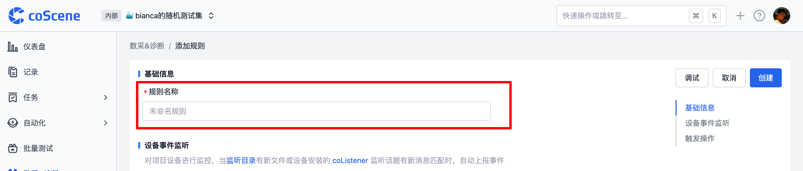
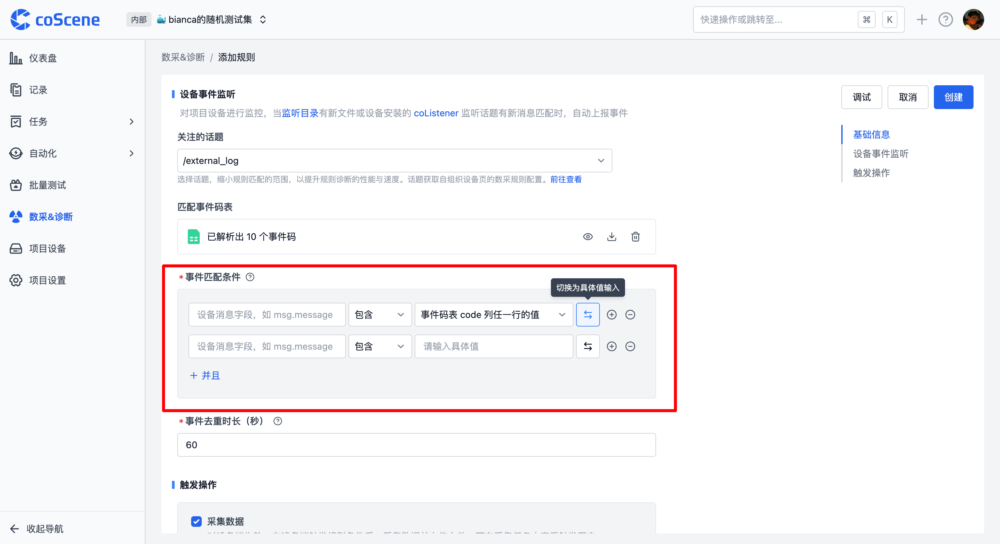
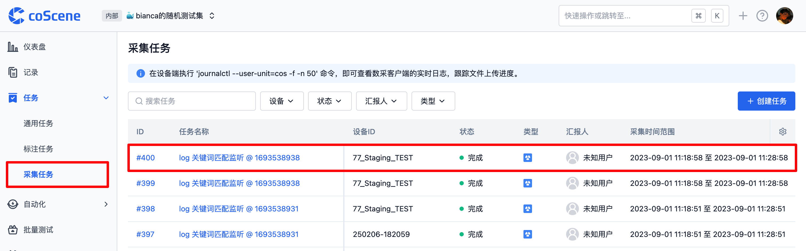

# 添加规则

在数采&诊断规则页面，可添加规则，实现项目设备数据的自动监听与采集。

## 权限说明

> 只有**项目管理员**和**组织管理员**有权添加和编辑规则，其他权限角色仅能查看规则内容

## 特定数据格式

平台规则仅对特定格式的数据生效，这类数据需包含消息、时间戳、主题、消息类型，属于流数据。

目前支持的日志文本文件时间戳格式如下：

| 时间戳类型                                                                                            | 时间戳格式           | 示例                       |
| ----------------------------------------------------------------------------------------------------- | -------------------- | -------------------------- |
| 常规文件中的时间戳                                                                                    | %m%d %H:%M:%S.%f     | 0212 12:12:12.548513       |
|                                                                                                       | %b %d %H:%M:%S       | Dec 12 12:12:12            |
|                                                                                                       | %Y-%m-%d %H:%M:%S.%f | 2023-02-12 12:12:12.548513 |
|                                                                                                       | %H:%M:%S.%f          | 12:12:12.548513            |
| 特殊\*文件名 / 文件第一行中的时间&#x6233;_（用于文件中时间戳未全部包含年、月、日、时、分、秒的情况）_ | %Y-%m-%d %H:%M:%S    | 2023-02-12 12:12:12        |
|                                                                                                       | %Y/%m/%d %H:%M:%S    | 2023/02/12 12:12:12        |
|                                                                                                       | %Y%m%d%H             | 2023021212                 |

若有其他格式的时间戳需要支持的，请联系我们。

## 规则组 {#rule-group}

规则组是规则的集合，用于对规则进行分类管理。

### 1. 添加规则组

在项目中，进入「数采&诊断规则」分页，点击【添加规则组】，添加成功后，可在该规则组内添加具体规则。


### 2. 规则组的启用与关闭

新添加的规则组默认处于「关闭状态」，若要让项目设备使用其中的规则进行数据监听，需手动开启；

若暂时不需要使用，但后续还会用到，也可将其设为「关闭状态」。


### 3. 规则组管理

在更多操作中，可进行规则组的重命名和删除操作。


## 规则创建与配置

规则是规则组中的单个规则，用于定义触发数据采集与诊断的条件，以及触发后的操作。

### 添加规则

在规则组中，可通过点击【创建空白规则】或【从规则模板创建】来添加新规则，下面主要介绍创建空白规则的步骤。


为规则命名，规则名称用于区分不同规则，方便后续管理和识别。

为规则命名，规则名称用于区分不同规则，方便后续管理和识别。



### 设备事件监听

> **模块示意**
>
> 此模块是对项目设备进行监控，当预先设定的监听目录有新文件或设备安装的 [coListener](https://github.com/coscene-io/coListener) 监听话题有新消息匹配时，将自动上报事件并记录到当前项目的仪表盘中。


#### 1. 关注的话题

- 设置关注的触发话题能缩小规则匹配范围，提高规则诊断的性能、速度和准确度。

- 若想监听设备中日志类型的文件，请选择`/external_log`。

- 其他话题选项可在组织的设备配置中设置，详情可参考[ 4-设备配置](../../device/4-device-collector.md)文档。

#### 3.2 匹配事件码表

- 在事件码表中，可定义事件的 code 值、事件名称、等级、解决方案等信息。事件码表必须包含 code 列，作为事件的唯一标识符。

- 上传事件码表（支持 JSON 或 CSV 文件）后，系统会自动解析，还支持预览、下载、删除操作。若要修改表内容，可先下载到本地电脑修改后再上传。


#### 3.3 事件匹配条件

- 根据设备消息字段与某个值的匹配关系判断事件是否触发。

- 点击【切换】按钮可在 code 表头和具体值输入框之间切换。

- 在预定义输入框中，设定了事件码表中的 code 值作为匹配变量。

- 在具体值输入框中，直接输入文字信息。

- 若要检测 log 文件中是否有关键词 error 1，则需填写：msg.message 包含 error 1，并且「关注的话题」一栏需要选择 /external_log。

- 若要检测 bag 文件的 /error_code 话题（消息类型为 std_msgs/string）中的 msg.data 消息字段中有关键词 error 1，则需要填写：msg.data 包含 error 1。

- 多行逻辑判断条件之间是并且关系，需同时满足才生效。



#### 3.4 事件去重时长

- 若新事件（同一事件）在上次合并事件后的设定时间内发生，则与原事件合并。每次新事件发生时，都重置时间，直到超出时间窗口都无新事件发生时，完成合并。

- 支持范围设置在 1 秒 \~ 86400 秒（1 天）之间。


当 log 文件中出现：1001、1002 或 1003 时（即事件码表中的 code 列任一行值），即可判断为事件匹配成功。

触发操作是指规则条件满足后触发后的操作，目前支持了采集数据、诊断数据两个模块。

#### 1. 采集数据

- 规则条件在设备端触发后，会在本项目中自动创建一条采集任务，采集对应时间的设备数据，采集完成后在记录中生成一条记录，包含触发条件满足时的数据。


- 可以设定上传文件的时间范围、记录名称、记录描述、记录标签、采集限制。

- 上传文件指上传数采目录中符合时间范围的所有文件。

- 记录名称、记录描述支持使用代码变量（使用 `{scope.表头名称}` 的格式）与正文穿插书写。


- 在更多设置中，可利用[文件通配符](https://www.malikbrowne.com/blog/a-beginners-guide-glob-patterns/)进行二次筛选。

- 若有具体的附加文件，如地图文件，可在此处写明具体文件所在地址。


#### 3.2 诊断数据

- 对已经采集到平台中的记录执行数据诊断动作，符合触发条件的时间点将自动创建一刻，可在采集后的记录中查看相关一刻。


- 支持设定一刻名称、一刻描述、一刻的属性值，以及是否为诊断出的一刻创建关联的通用任务进行流转。

- 一刻名称、一刻描述、一刻的属性值支持使用代码变量（使用 `{scope.表头名称}` 的格式）与正文穿插书写。


### 代码变量的使用

在规则的触发操作中部分文本输入框是可以使用代码变量来获取触发时的相关数据值，书写规范可参考以下表格：

| 含义                                   | 书写规范                                         | 写后翻译出来的效果示例                                                                                       |
| -------------------------------------- | ------------------------------------------------ | ------------------------------------------------------------------------------------------------------------ |
| 调用已上传至规则中的事件码表的 code 值 | `{scope.code}`                                   | `ERROR-CODE-001`                                                                                             |
| 调用已上传至规则中的事件码表的其他列值 | `{scope.solution}`注：表头名称需为英文，且无空格 | `尝试重启设备`                                                                                               |
|                                        | `{msg}`                                          | `{"timestamp": {"sec": 123456, "nsec": 789}, "message": "demo log message", "file": "demo.log", "level": 2}` |
|                                        | `{topic}`                                        | `/external_log`                                                                                              |
|                                        | `{ts}`                                           | `1738915780.123`                                                                                             |

---

完成规则内容填写后，点击保存按钮即可添加项目规则，实现项目设备数据的自动监听与采集。

> 设备端触发规则后，将自动创建采集任务，采集对应时间的设备数据并保存到记录。


采集数据模块中包含：上传文件的时间范围、记录信息、采集限制、更多设置。其中：

- 上传文件的时间范围
  - 定义需要采集触发时间点前后多长时间范围的文件，采集目录的设置参考[设备配置-存储设置](../../device/4-device-collector.md#存储设置mod)
- 记录信息
  - 定义保存数据的记录名称、描述与标签信息，其中名称与描述支持使用变量（如：`{scope.code}`，详见下文）
  - 当数据上传完成后，将自动在记录中添加「上传完成」标签
- 采集限制
  - 定义同一事件重复发生时，1 天最多采集多少次数据
  - 支持限制单台设备与所有设备，当达到任一限制峰值时，将不再采集数据
  - 若无限制，则发生的所有事件都会触发上传，建议添加限制
- 更多设置
  - 筛选文件范围：利用文件通配符设置上传白名单，对既定的文件上传清单进行二次筛选，仅上传在白名单中的文件，以减少设备流量开支
  - 具体附加文件：添加需要额外上传的设备文件，一般为地图、配置文件等非实时产生的设备文件

规则触发的采集任务示例：



采集任务的关联记录示例：


##### 诊断数据

> - 从设备端采集数据保存到记录后，自动在规则触发时间点创建一刻
> - 手动创建的记录可通过调用「数据诊断」动作自动标记关键时间点。「数据诊断」动作会聚合项目中勾选了「自动诊断」模块的所有规则，对记录中的文件进行规则匹配。


诊断数据模块中包含：一刻信息、任务信息。其中：

- 一刻信息
  - 定义触发时间点的一刻名称、描述、属性值等，支持使用变量（如：`{scope.code}`，详见下文）
- 任务信息
  - 定义是否创建任务、任务经办人、是否同步任务到工单系统等信息，对触发规则的事件进行流转

记录中自动创建的一刻示例：


### 规则变量

规则支持使用变量或表达式，**在非规则条件中使用变量时请用 `{}`** 包裹变量名或表达式，则被包裹的变量或表达式会被替换为实际的值，支持的变量详见下表：

| 表达式                                                          | 含义                                                           | 效果示例                                                                                                      |
| --------------------------------------------------------------- | -------------------------------------------------------------- | ------------------------------------------------------------------------------------------------------------- |
| `scope.code`                                                    | 事件码表中 code 列的值                                         | `ERROR-CODE-001`                                                                                              |
| `scope.solution`                                                | 事件码表中 solution 列的值                                     | `尝试重启设备`                                                                                                |
| `msg`                                                           | 触发规则的消息内容                                             | `{"timestamp": {"sec": 123456, "nsec": 789}, "message": "demo log message", "file": "demo.log", "level": 2} ` |
| `topic`                                                         | 触发规则的话题                                                 | `/error_code`                                                                                                 |
| `ts`                                                            | 触发规则时的时间戳                                             | `1738915780.123`                                                                                              |
| `timestamp(ts).format("%Y-%m-%d %H:%M:%S", "America/New_York")` | 将时间戳转为格式为 `%Y-%m-%d %H:%M:%S`的纽约时区（西五区）时间 | `2025-02-07 03:09:40`                                                                                         |

以上 `scope`，`msg`，`topic`，`ts` 变量的值使用的是触发规则时的事件码表行，触发消息，触发话题，触发时间点。

**注意：**

- 在规则条件中使用变量或表达式时，请直接使用，不要用 `{}` 包裹
- 在非规则条件中使用变量或表达式时，例如记录名称，记录描述等，请用 `{}` 包裹。
- 表达式的语法遵循 [CEL 语法](https://github.com/google/cel-spec/blob/master/doc/langdef.md)

#### 自定义函数

除了 [CEL 语法](https://github.com/google/cel-spec/blob/master/doc/langdef.md) 支持的函数，还额外支持了以下函数(以下定义参照 CEL)

**timestamp** \- 将其他类型转换为时间戳类型 （CEL 已经支持了从时间戳类型和字符串类型转换为时间戳类型）

**函数签名（Signature）**

- `timestamp(double) -> google.protobuf.Timestamp` (将 double 类型转为时间戳类型， 会自行判断单位为秒/毫秒/微妙/纳秒)

**例子:**

```
timestamp(1738915780.123) -> timestamp("2025-02-07T08:09:40.123")
```

**format** \- 将时间戳类型用指定格式转为字符串类型

**函数签名（Signature）**

- `google.protobuf.Timestamp.format(string) -> string` （参数为格式化字符串）
- `google.protobuf.Timestamp.format(string, string) -> string` （参数为格式化字符串和时区）
- `google.protobuf.Timestamp.format(string, int) -> string` （参数为格式化字符串和时区偏移量，单位为秒）

**例子：**

```
timestamp("2025-02-07T08:09:40.123").format("%Y-%m-%d %H:%M:%S") -> "UTC: 2025-02-07 08:09:40"
timestamp("2025-02-07T08:09:40.123").format("%Y-%m-%d %H:%M:%S", "Asia/Shanghai") -> "2025-02-07 16:09:40"
timestamp("2025-02-07T08:09:40.123").format("%Y-%m-%d %H:%M:%S", 8*60*60) -> "2025-02-07 16:09:40"
```

**注意：**

- 时间戳的格式化字符串遵循`man 3 strftime`的格式，[详见](https://linux.die.net/man/3/strftime)
- 时区支持`UTC`、`Asia/Shanghai`、`America/New_York`等 IANA 规范的时区，[详见](https://en.wikipedia.org/wiki/List_of_tz_database_time_zones)

### 调试规则

#### 前提条件

准备一条记录，在记录中有可供调试的文件，即可触发规则的 mcap、bag 或 log 文件。

#### 调试步骤

1. 在规则详情中点击【调试】按钮，选择预准备的记录


2. 查看调试日志


3. 在调试日志的「输出」中，查看调试文件


### 管理规则

在规则列表中，可删除规则


如果在操作过程中有任何疑问，随时联系我们获取帮助。
