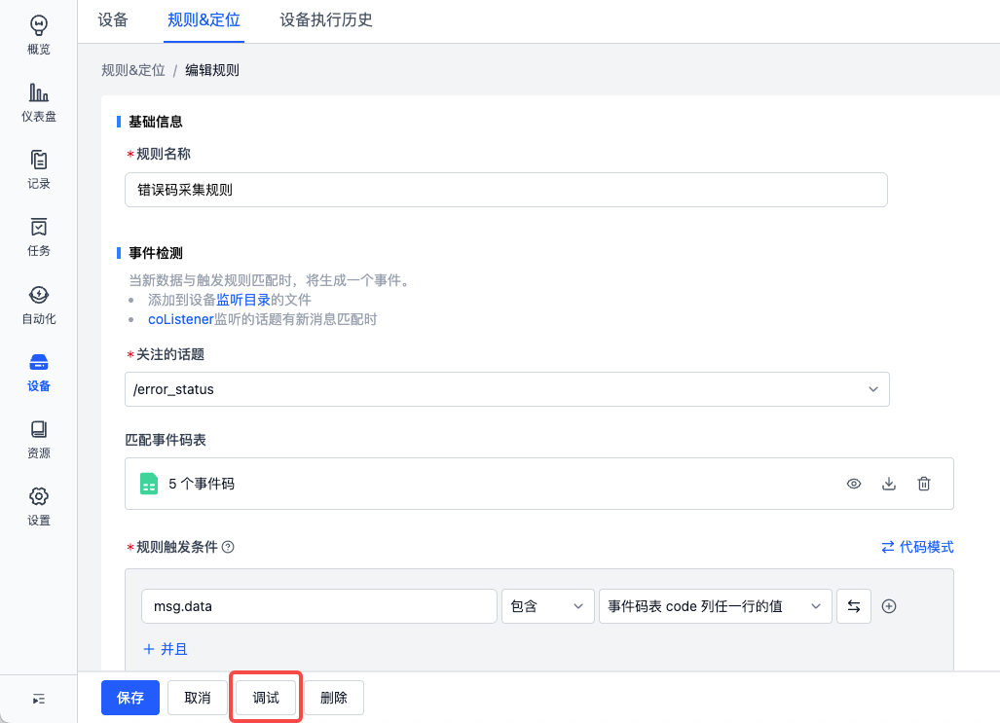
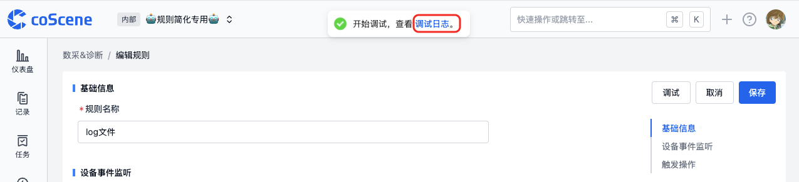
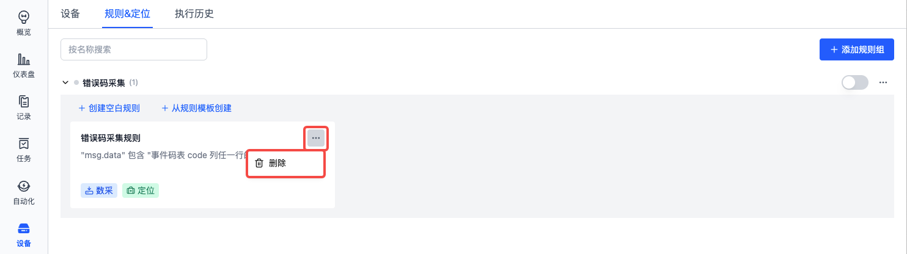

# 管理规则

## 启用

在使用规则组之前，需要先启用规则组。启用规则组后，规则组中的规则才会生效。
若在特定场景下暂时不需要使用规则组中的规则，也可以禁用规则组。

启用的规则组会在规则组状态列表中显示为蓝色，禁用的规则组状态会置灰。

下面是启用规则组的操作步骤：

- 进入项目「设备-规则&定位」分页，选择需要启用的规则组，启用开关。

下面是禁用规则组的操作步骤：

- 进入项目「设备-规则&定位」分页，选择需要禁用的规则组，关闭开关。
- 弹窗选择【确定】。

 

## 编辑

进入编辑规则组页面的操作如下图，具体编辑规则组规则的操作请参见[规则](./3-add-rule.md)。

- 进入项目「设备-规则&定位」分页，选择需要编辑的规则，点击规则名称。

 

## 调试
> 前提：准备一条记录，在记录中有可供调试的文件，即可触发规则的 mcap、bag 或 log 文件。

1. 在规则详情中点击【调试】按钮，选择预准备的记录

2. 查看调试日志

3. 在调试日志的「输出」中，查看调试文件

 

## 删除

若规则组中的规则不再需要使用，可以删除规则。

下面是删除规则的操作步骤：

- 进入项目「设备-规则&定位」分页，选择需要删除的规则，点击对应右侧的 `...` 按钮，选择【删除】。
- 二次确认弹窗选择【确定】。

在更多操作中，可进行规则组的重命名和删除操作。

