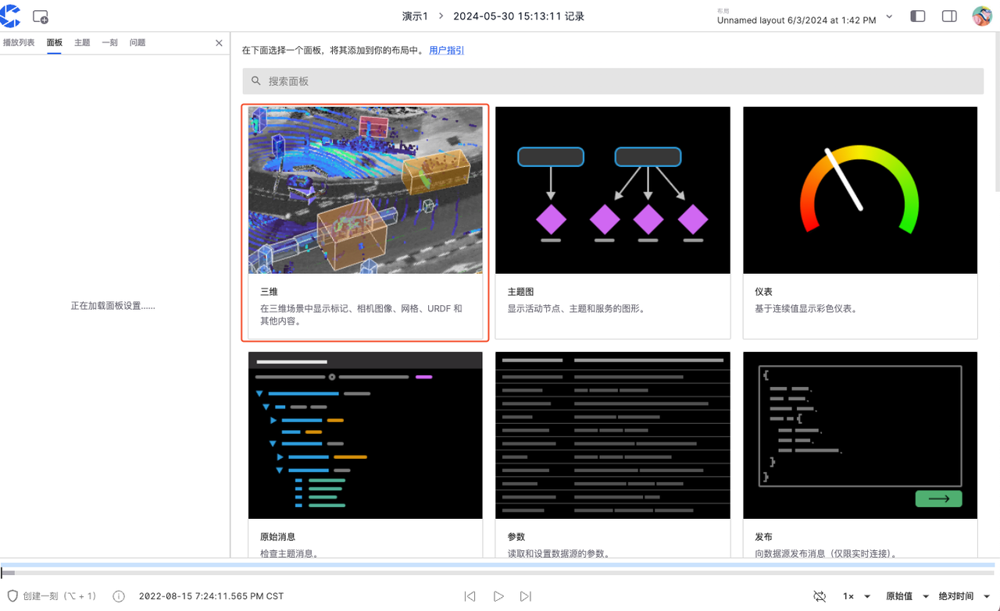
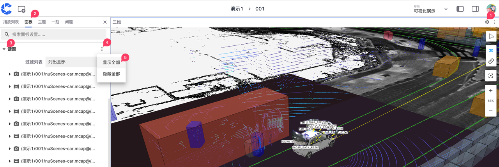

# 快速三维可视化数据

本章节将以 “[scene-0001.mcap](https://coscene-artifacts-prod.oss-cn-hangzhou.aliyuncs.com/docs/example/viz/scene-0001.mcap)” 文件为例，展示使用三维面板可视化数据的步骤。

## 前提条件

1. 浏览器为 Chrome 104 或更新的版本，请访问 [Chrome 官方网站](https://www.google.cn/chrome/)获取最新版本
2. 在项目中创建记录并上传 bag/mcap，播放记录。详见[创建记录](../collaboration/record/2-create-record.md)与[上传文件](../collaboration/record/4-upload-files.md)。

## 可视化数据

### 添加三维面板

1. 在可视化页面的【布局菜单栏】中选择【创建空白布局】

2. 选择「三维」面板添加到布局中

### 显示话题

1. 点击「面板顶栏」中的【设置】按钮，进入「左侧边栏」中的面板属性页面。
2. 点击【话题】右侧的【显示全部】按钮，展示所有话题。

### 播放

点击「时间轴」上的暂停按钮，播放数据：

## 了解更多

- [三维面板功能介绍](./4-panel/2-3d-panel.md)
- [导入地图与静态 TF](../collaboration/record/5-manage-file.md)

## 常见问题

1. **问：点击播放记录后，跳转到空白页面/页面没有显示内容**

   答：请检查浏览器版本是否为 Chrome 104 或更新的版本；请关闭所有浏览器插件。若更换浏览器版本、关闭插件后仍无法解决问题，请联系刻行时空技术支持。

2. **问：播放记录时，没有正确显示自定义的 topic**
   答：仅支持播放标准格式的 topic，若有自定义的 topic，可使用「原始消息」面板查看。
