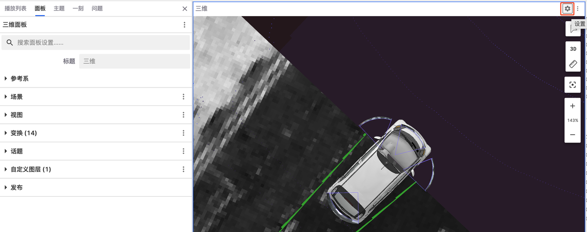
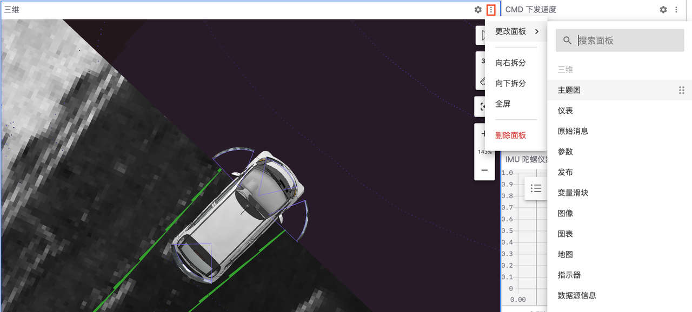
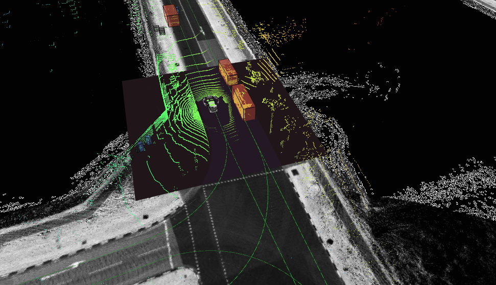
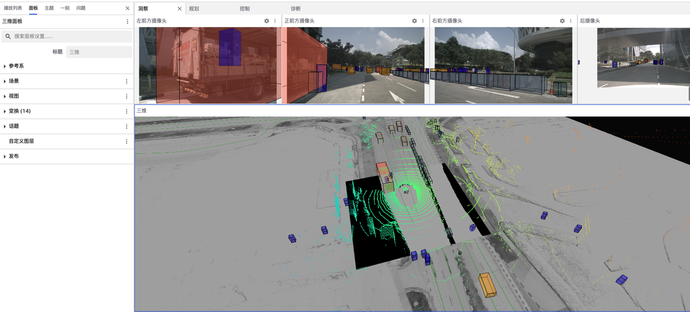
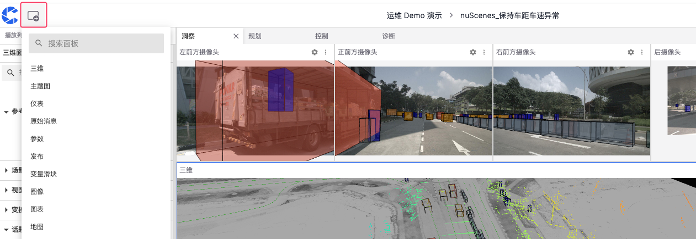
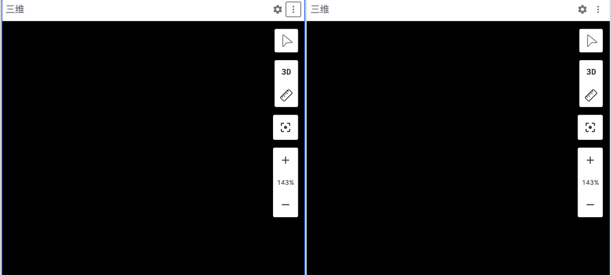

# 面板简介

「面板」是模块化的可视化界面，可以配置和排列成布局也可以被添加、编辑和拖放。本章节将介绍面板的基本元素、属性和添加方式。

## 面板中的基本元素

「面板」中的基本元素包括「面板顶栏」、「面板场景」。

### 面板顶栏

所有「面板」都可以通过「面板顶栏」进行设置和编辑，它包括 【设置】和【菜单】两个按钮。

#### 设置按钮

点击面板顶栏中的齿轮图标，即可「在侧边栏」中查看和编辑其设置。所选面板将以蓝色边框标记。

#### 菜单按钮

点击「面板顶栏」中的【菜单】按钮可以实现拆分和删除面板的操作。

### 面板场景

「面板场景」是指在可视化面板中显示的所有信息和数据的集合，不同类型的面板对应不同的场景。

## 如何设置面板属性

若要设置当前面板的属性详情，可前往左侧边栏中的「面板」，不同的面板有不同的属性值，可参考[三维面板](./2-3d-panel.md)、[日志面板](./3-log-panel.md)和[图表面板](./4-plot-panel.md)。

## 添加面板的方式

在刻行可视化界面可以通过直接添加、拆分面板和更改面板三种方式添加面板。

### 直接添加

1. 点击左上角的【添加面板】，单击任意面板名称即可将其添加到当前布局中。亦可将面板名称拖拽到当前布局中即可将其添加到特定位置。

2. 在【添加面板】菜单中查找可用面板的完整列表，将鼠标悬浮在右侧信息展开按钮中可以查看面板的视图和介绍。

### 拆分面板

1. 点击面板顶栏中的菜单栏中的 【向右拆分】/ 【向下拆分】

2. 点击【向右拆分】会向将当前面板的拆分成两个相同的面板

### 更改面板

点击面板的菜单栏中的【更改面板】可以更改面板类型

---
