# 三维面板

「三维面板」是指在 3D 场景中显示标记、实体、摄像机图像、网格、URDF 模型等内容的面板。该面板能够直观地展示和操作三维对象，提供了丰富的视觉和交互体验。本章节将介绍三维面板的各种属性值和工具栏，帮助用户更好使用三维面板可视化数据。

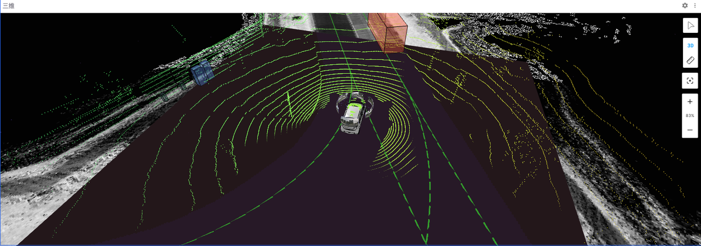

## 三维面板中的属性值

点击「三维面板」后在左侧边栏点击【面板】按钮，「三维面板」界面包括：参考系、场景、视图、变换、话题、自定义图层和发布属性。
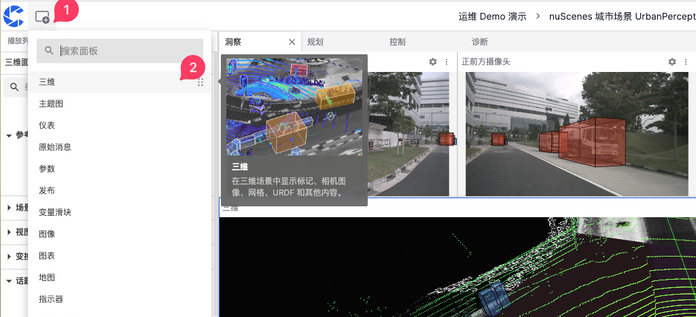
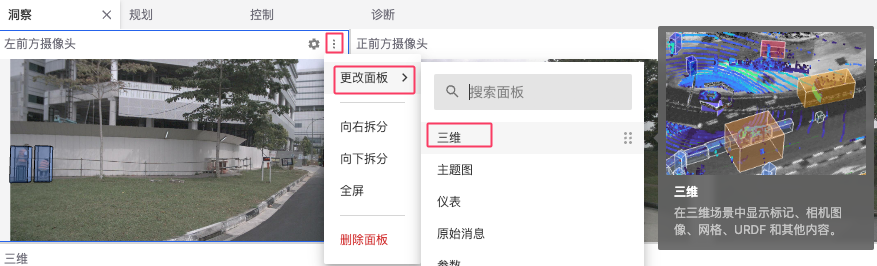

### 参考系

「参考系」是在三维可视化中用来定义数据和对象的位置和方向的坐标系统。它为场景中的所有元素提供了一个共同的基准，使得各种数据能够在同一个空间中正确显示和交互。

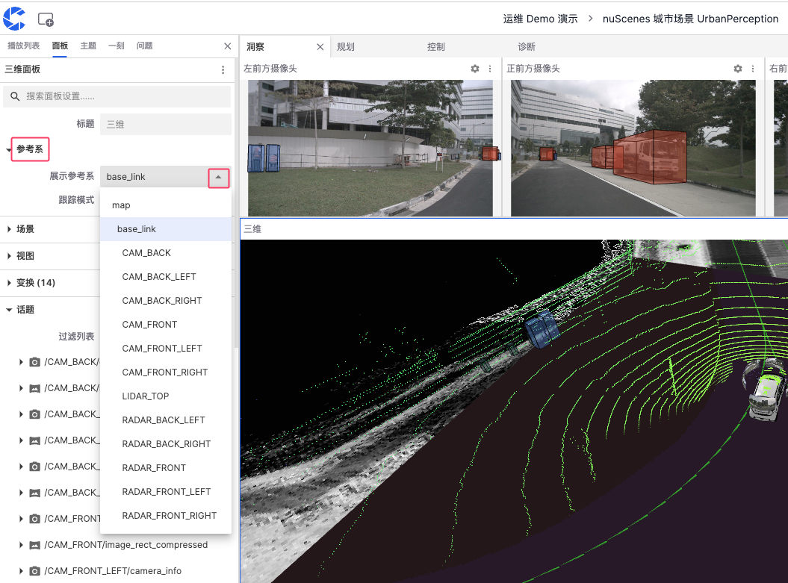

#### 展示参考系

- map：常用于全局坐标系，以地图为基准，适合展示全局定位数据。
- base_link：基于机器人或车辆中心点的参考系，通常位于车辆的几何中心，适用于展示相对于车辆本身的位置和运动数据。
- CAM：基于车辆不同位置的摄像头数据
- LIDAR：基于车辆不同位置的激光雷达数据

#### 跟踪模式

「跟踪模式」用于定义视图如何跟随选定的参考系，包括：姿态、位置和固定三种模式。
 

1. 姿态：视图会跟随参考系的位置和方向变化。如果参考系发生旋转或移动，视图也会相应地旋转和移动

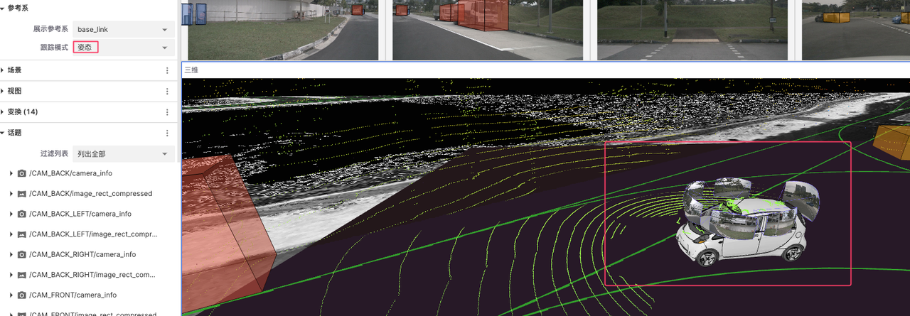

  

2. 位置：视图只会跟随参考系的位置变化，而不会跟随其方向变化

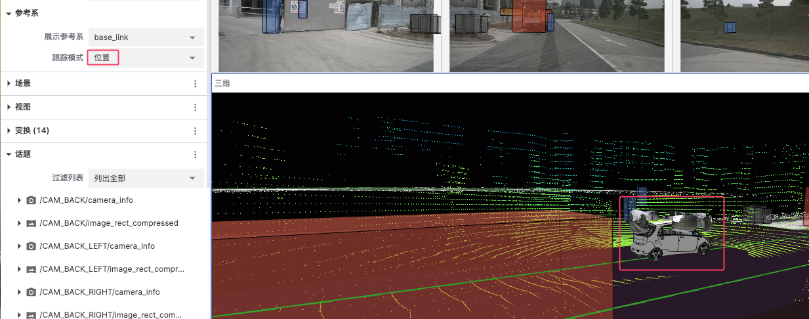

  

3. 固定：视图不会跟随参考系的任何变化，视角保持固定不变

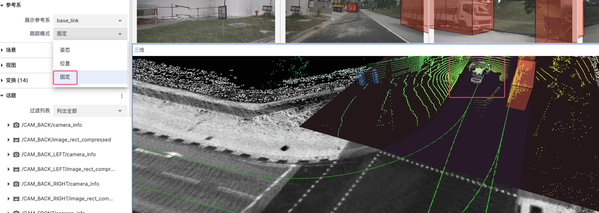

  

### 场景

「场景」是三维可视化界面中用于配置和展示数据的整体环境，通过调整渲染统计、背景、标签比例、忽略 COLLADA 和网格上轴属性来自定义和优化数据的显示效果。

#### 渲染统计

渲染统计用于显示或隐藏渲染统计信息，打开此选项可以看到当前渲染的帧率等性能指标。

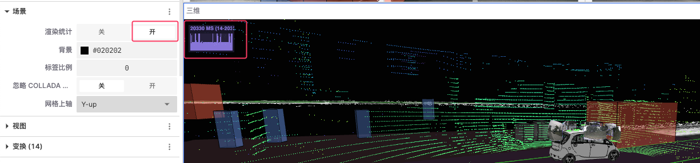

  

#### 背景

用于设置场景的背景颜色以提高对比数据的对比度和可视化效果

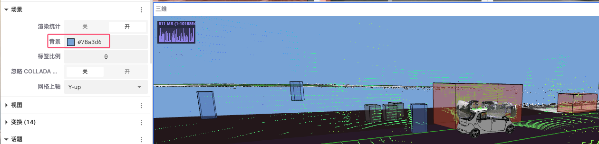

  

#### 标签比例

用于调整场景中显示的标签的比例大小

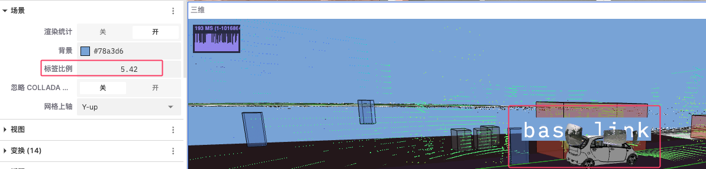
  

#### 忽略 COLLADA

用于选择是否忽略 COLLADA 模型的渲染，从而加快渲染速度或避免不必要的模型显示。

#### 网格上轴

用于设置场景中网格的上轴方向，这会影响整个场景的坐标系方向
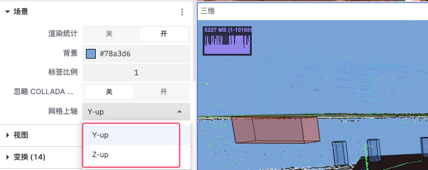
  

### 视图

「视图」是三维可视化中用于设置和调整摄像机视角和显示参数的功能模块。通过调整视图中的不同属性，用户可以获得更好的数据展示效果。
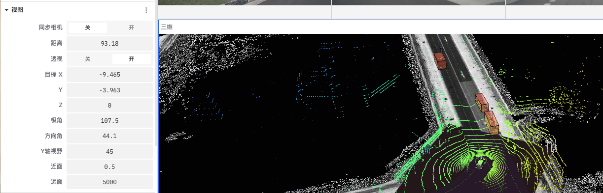
 

- **同步相机**
  使视图将与其他视图同步移动和旋转，便于多视图联动观察数据
   
- **距离**
  调整摄像机与目标物体的距离，达到拉近或拉远视角的效果
   
- **透视**
  打开透视后，近大远小的透视效果会被应用，使得三维场景更加真实
   
- **目标 X, Y, Z**
  用于调整摄像机的目标位置的坐标以改变其焦点位置
   
- **极角**
  摄像机绕目标点旋转的角度，用于调整摄像机围绕目标的上下旋转角度
   
- **方向角**
  摄像机围绕目标点的水平旋转角度，用于调整摄像机围绕目标的左右旋转角度
   
- **Y 轴视野**
  用于调整摄像机的垂直视野角度
   
- **近面**
  摄像机的近剪裁面距离，用于调整摄像机视图中最近的可见距离
   
- **远面**
  摄像机的远剪裁面距离，用于调整摄像机视图中最远的可见距离
   

### 变换

「变换」是对物体在三维空间中的位置、旋转和缩放进行调整，使其在三维面板中能够正确显示和操作。

#### 设置

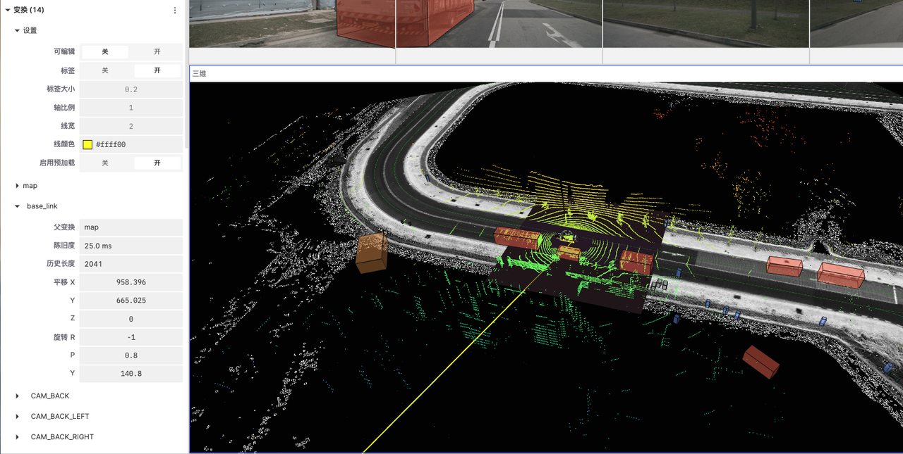
 

- **可编辑**
  控制是否允许编辑变换设置
   
- **标签**
  控制是否显示标签
   
- **标签大小**
  调整标签的大小
   
- **轴比例**
  调整轴的比例
   
- **线宽**
  设置线条的宽度
   
- **线颜色**
  选择线条的颜色
   
- **启用预加载**
  控制是否启用预加载功能，以提升显示性能
   

#### 变换
显示来自 ROSbag 文件中的坐标变换信息，以及用户[手动导入](../../collaboration/record/5-manage-file.md)的外部变换数据。

- base_link

  - **父变换**：设置当前变换的父参考系
  - **陈旧度**：上一帧数据距离当前的时间间隔
  - **历史长度**：缓存中的 tf 消息数量
  - **平移 (X, Y, Z)**：调整 X、Y、Z 轴上的位置
  - **旋转 (R, P, Y)**：调整横滚角、俯仰角和偏航角的旋转

### 话题

「话题」指的是数据流的类别或频道。每个话题代表一种特定类型的数据源或传感器数据，例如摄像头图像、激光雷达数据、注释信息等。
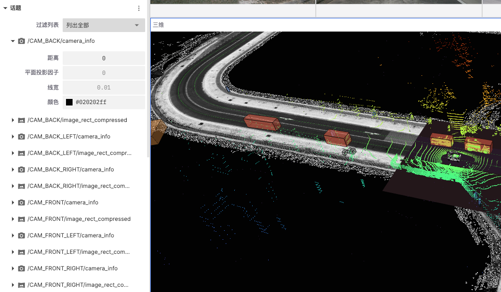

#### 过滤列表

「过滤列表」用于控制和管理用户界面上显示的话题，用户可以列出全部话题、列出可见话题及列出不可及话题。
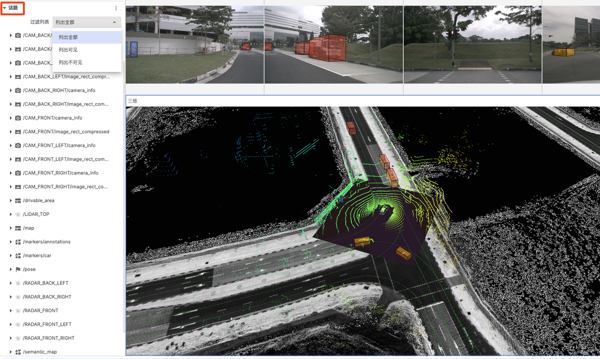

#### 话题分类和含义

##### 摄像头数据

表示不同方位摄像头的校准信息和压缩图像数据，用户可以点开摄像头数据话题对其可视化参数进行调整。  

- **距离**
  设定从摄像头到目标物体的距离
   
- **平面投射因子**
  调整图像在三维场景中的投射比例，影响图像如何贴合到场景中的平面上
   
- **线宽**
  调整图像或数据边界线条的粗细
   
- **颜色**
  调整图像或数据点的颜色
   

##### 激光雷达数据

表示不同方位的激光雷达数据，通常用点云表示，用户可以点开激光雷达数据话题对其可视化参数进行调整。
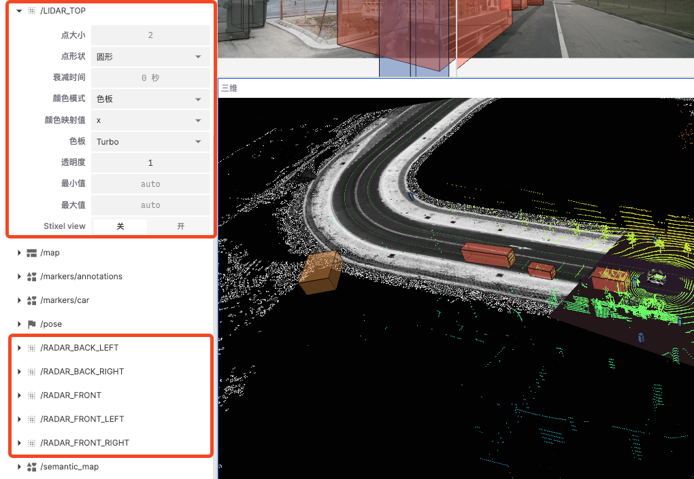
 

- **点大小**
  通过增加或减少点的大小，可以更清晰地显示点云数据的密度和结构。例如，较大的点可以更清晰地显示稀疏数据，而较小的点可以更好地展示细节
   
- **点形状**
  选择合适的点形状可以影响点云的视觉效果。例如，圆形点可能更适合模拟实际的物体形状，而方形点可以更好地显示边界
   
- **衰减时间**
  设置点云数据在显示器上消失之前的持续时间，帮助用户观察数据的变化动态
   
- **颜色模式**
  选择点云数据的着色模式，可以根据数据的不同属性为点云着色
   
- **颜色映射值**
  选择用于颜色映射的数据维度或属性，例如，选择 X 轴表示点云将根据其在 X 轴上的位置进行着色
   
- **色板**
  选择用于点云着色的色板，如 Turbo、Viridis 等
   
- **透明度**
  用于调整点云数据的透明度
   
- **最小值和最大值**
  设置用于颜色映射的最小值和最大值范围
   
- **Stixel View**
  是基于像素的立体视觉技术，用于显示和分析点云数据的立体结构和深度信息
   

##### 地理和位置数据

表示地理位置、路径和环境信息的数据，这些数据通常包括可行驶区域、全局地图、语义地图等。

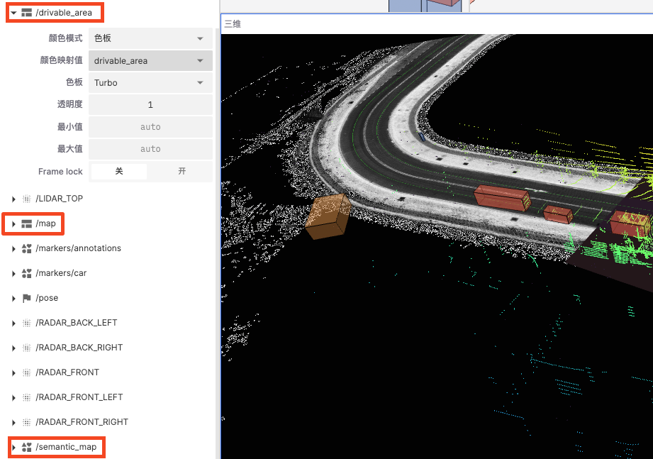

- **「drivable_area」和 「map」中的 Frame lock**

  锁定显示帧以减少抖动或不稳定情况，保证显示的一致性

- **「semantic_map」**
  - 显示轮廓：控制是否显示数据的轮廓以更清晰地看到数据边界
  - 选择变量：根据选择的变量来决定数据的显示方式

- **外部导入地图**

  若从记录中[导入地图数据](../../collaboration/record/5-manage-file.md)，需将对应地图的颜色模式设置为 RGBA，以确保地图数据的正确显示

  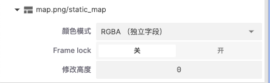

##### 标记和注释

用于在可视化场景中添加附加信息或标识。
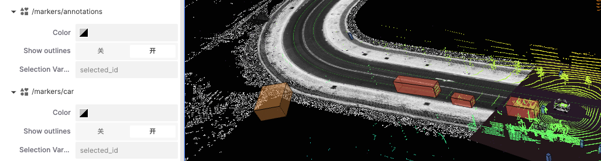
 

- **Color**
  用于显示标记的显示颜色
   
- **Show Outlines**
  选择是否显示周围轮廓，增强视觉效果
   
- **Selection Variable**
  用于显示数据变量
   

## 三维面板中的工具

「三维面板」右侧有一排工具栏用于控制和操作三维视图，从上到下分别是【检查对象】、【切换2D / 3D 摄像头】、【测距仪】、【重新局中】和「画面缩放」。

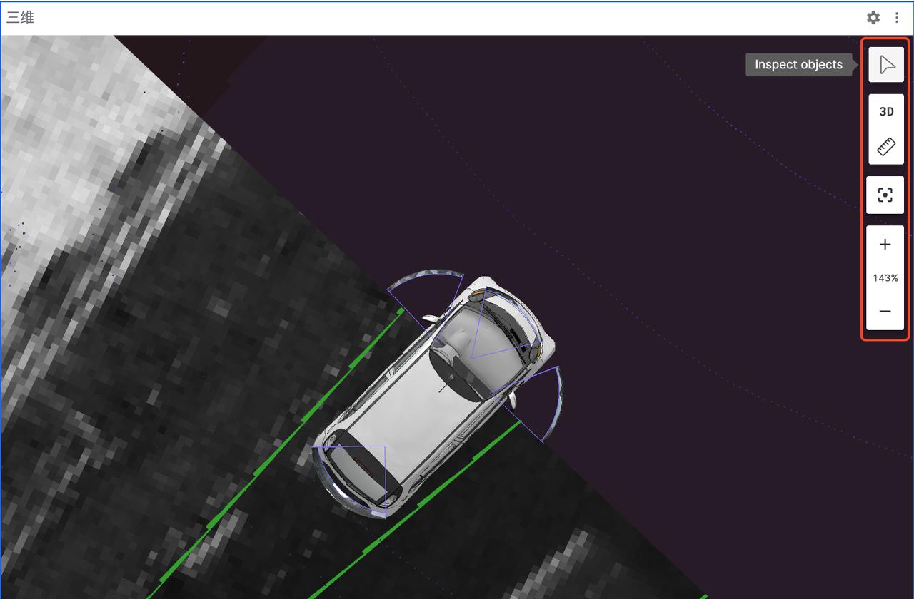

### 检查对象

用于显示三维场景中的物体信息
 

1. 点击工具栏中的 【检查对象】按钮
2. 点击需要查看的物体即会弹出该物体的主题等信息
3. 点击退出按钮

### 切换2D / 3D 摄像头

用于切换三维场景视图的显示模式
点击工具栏中【3D】按钮便可从 2D 与 3D 视角之间切换

### 测距仪

用于测量三维场景中两点之间的距离
 

1. 点击工具栏中的【测距仪】
2. 在需测量的起点位置轻点一下确定起点
3. 在测量终点位置轻点确定终点
4. 再次点击【测距仪】便可清除当前测量的距离

### 重新局中 & 画面缩放

用于控制三维视图的局中和缩放效果
 

1. 【重新局中】按钮会将画面大小调整至 100%
2. 点击 【+】和 【-】可以放大和缩小画面
3. 亦可通过键盘鼠标来放大和缩小画面

## 支持的消息类型

三维面板可以可视化各种不同类型的消息。要可视化一个话题，该话题上的消息必须符合以下列出的已知消息模式之一。

### 相机视场

场景相机的校准参数。

| 框架 | 模式 |
| --- | --- |
| ROS 1 | [sensor_msgs/CameraInfo](https://docs.ros.org/en/noetic/api/sensor_msgs/html/msg/CameraInfo.html) |
| ROS 2 | [sensor_msgs/msg/CameraInfo](https://github.com/ros2/common_interfaces/blob/master/sensor_msgs/msg/CameraInfo.msg) |
| 自定义 | [foxglove.CameraCalibration](../message-schemas/camera-calibration) |

### 网格

2D 彩色网格。

| 框架 | 模式 |
| --- | --- |
| ROS 1 | [nav_msgs/OccupancyGrid](https://docs.ros.org/en/noetic/api/nav_msgs/html/msg/OccupancyGrid.html) |
| ROS 2 | [nav_msgs/msg/OccupancyGrid](https://github.com/ros2/common_interfaces/blob/master/nav_msgs/msg/OccupancyGrid.msg) |
| 自定义 | [foxglove.Grid](../message-schemas/grid) |

#### `foxglove.Grid` 设置

| 字段 | 描述 |
| --- | --- |
| **颜色模式** | 以下之一：**Flat**：纯色**Color map**：预定义调色板**Gradient**：两个自定义颜色之间的平滑过渡**RGBA（单独字段）**：使用每个单元格的红色、绿色、蓝色和 alpha 字段中嵌入的颜色（[见下文](#rgba单独字段颜色模式)） |
| **纯色** | 仅在"颜色模式"设置为"Flat"时显示；每个单元格颜色的十六进制代码 |
| **按颜色** | 仅在"颜色模式"未设置为"Flat"时显示；用于着色逻辑的消息中的数字字段 |
| **颜色映射** | 仅在"颜色模式"设置为"Color map"时显示；"Turbo"（Google）或"Rainbow"（RViz）；用于将"按颜色"字段值映射到颜色 |
| **不透明度** | 仅在"颜色模式"设置为"Color map"或"BGR（打包）"时显示；设置所有单元格的 alpha 值 |
| **最小值** | 仅在"颜色模式"未设置为"Flat"时显示；用于规范化传入网格的"按颜色"字段值的最小值 |
| **最大值** | 仅在"颜色模式"未设置为"Flat"时显示；用于规范化传入网格的"按颜色"字段值的最大值 |
| **帧锁定** | "开启"表示网格锁定到其 frame_id 指定的帧，并将随着该帧的变换变化而移动。"关闭"表示网格相对于固定帧，在首次显示后将不会移动。 |

##### RGBA（单独字段）颜色模式

每个单元格可以在四个单独的字段中包含颜色信息，名为 `red`、`green`、`blue` 和 `alpha`，可以是任何数字类型：

* **浮点值** — 0–1 范围
* **无符号整数值** — 最大可能范围（例如，对于 `UINT8` 字段为 0–255）
* **有符号整数值** — `-max` 到 `max`（例如，对于 `INT8` 字段为 −127 到 127；−128 的值被视为与 −127 相同）

#### `nav_msgs/OccupancyGrid` 设置

| 字段 | 描述 |
| --- | --- |
| **颜色模式** | 以下之一：**Costmap**：预定义 RViz 调色板。无法进一步自定义设置。**Custom**：使用以下设置的自定义调色板 |
| **最小颜色** | 对应于最小单元格值（0）的颜色 |
| **最大颜色** | 对应于最大单元格值（100）的颜色。注意，值为 100 的单元格显示为完全透明。 |
| **未知颜色** | 对应于未知单元格值（−1）的颜色 |
| **回退颜色** | 对应于超出 −1 到 100 范围的单元格值的颜色 |
| **帧锁定** | "开启"表示网格锁定到其 frame_id 指定的帧，并将随着该帧的变换变化而移动。"关闭"表示网格相对于固定帧，在首次显示后将不会移动。 |

### 图像

使用相应的相机视场消息在 3D 场景中显示的图像。

| 框架 | 模式 |
| --- | --- |
| ROS 1 | [sensor_msgs/Image](https://docs.ros.org/en/noetic/api/sensor_msgs/html/msg/Image.html) |
| ROS 2 | [sensor_msgs/msg/Image](https://github.com/ros2/common_interfaces/blob/master/sensor_msgs/msg/Image.msg) |
| ROS 1 | [sensor_msgs/CompressedImage](https://docs.ros.org/en/api/sensor_msgs/html/msg/CompressedImage.html) |
| ROS 2 | [sensor_msgs/msg/CompressedImage](https://github.com/ros2/common_interfaces/blob/master/sensor_msgs/msg/CompressedImage.msg) |
| 自定义 | [foxglove.RawImage](../message-schemas/raw-image) |
| 自定义 | [foxglove.CompressedImage](../message-schemas/compressed-image) |

### 激光扫描

来自平面激光测距仪的单次扫描。

| 框架 | 模式 |
| --- | --- |
| ROS 1 | [sensor_msgs/LaserScan](https://docs.ros.org/en/noetic/api/sensor_msgs/html/msg/LaserScan.html) |
| ROS 2 | [sensor_msgs/msg/LaserScan](https://github.com/ros2/common_interfaces/blob/master/sensor_msgs/msg/LaserScan.msg) |
| 自定义 | [foxglove.LaserScan](../message-schemas/laser-scan) |

### ROS 多边形

由一系列连接点组成的带时间戳的多边形。

| 框架 | 模式 |
| --- | --- |
| ROS 1 | [geometry_msgs/PolygonStamped](https://docs.ros.org/en/noetic/api/geometry_msgs/html/msg/PolygonStamped.html) |
| ROS 2 | [geometry_msgs/msg/PolygonStamped](https://github.com/ros2/common_interfaces/blob/master/geometry_msgs/msg/PolygonStamped.msg) |

### ROS 标记

类似于场景实体，这些 `Marker` 消息描述了基本形状或网格。

| 框架 | 模式 |
| --- | --- |
| ROS 1 | [visualization_msgs/Marker](https://docs.ros.org/en/noetic/api/visualization_msgs/html/msg/Marker.html) |
| ROS 2 | [visualization_msgs/msg/Marker](https://github.com/ros2/common_interfaces/blob/master/visualization_msgs/msg/Marker.msg) |
| ROS 1 | [visualization_msgs/MarkerArray](https://docs.ros.org/en/noetic/api/visualization_msgs/html/msg/MarkerArray.html) |
| ROS 2 | [visualization_msgs/msg/MarkerArray](https://github.com/ros2/common_interfaces/blob/master/visualization_msgs/msg/MarkerArray.msg) |

#### 网格标记

具有 `mesh_resource` 字段的标记支持以下 URL 方案：

* `http(s)://`
* `package://`（仅限Studio）
* `file://`（仅限Studio）

以及文件格式：

**glTF (.glb)** 

这是首选的格式，因为它在所有支持的文件类型中具有最佳性能。

二进制 glTF 文件将所有必需的资源捆绑到一个文件中，支持嵌入式网格、压缩，并使用与可视化相同的基于物理的材质系统。因此，您的模型在可视化中的显示效果应该与在其他 3D 程序中的显示效果相似。

**STL (.stl)**

一种简单的三角网格格式，不包含材质信息。可视化将使用标记的颜色属性来渲染 STL 模型。

**COLLADA (.dae)**

一种基于 XML 的格式，支持材质、纹理和动画。可视化目前仅支持 COLLADA 的几何和材质部分。

**Wavefront OBJ (.obj)**

一种简单的文本格式，通常与 MTL 文件一起使用来定义材质。可视化将尝试加载关联的 MTL 文件，如果找不到，将使用标记的颜色属性。

**glTF (.glb)**

这是首选的格式，因为它在所有支持的文件类型中具有最佳性能。二进制 glTF 文件将所有必需的资源打包到一个文件中，支持嵌入网格、压缩以及可视化中使用的相同基于物理的材质系统。因此，您的模型在可视化中的显示方式应该与其他 3D 程序中的显示方式相似。

**STL (.stl)**

STL 文件在可视化中得到良好支持，但缺少 glTF 的一些可视化功能。STL 的主要优势是能够在硬件制造过程和机器人可视化工具之间共享相同的文件。

STL 是为 3D 打印和 CAD 应用程序设计的，不包含材质或网格层次结构。虽然它们可以用二进制编码表示，但 STL 文件通常用 ASCII 字符表示，这会导致文件更大。

**COLLADA (.dae)**

作为 glTF 的前身，COLLADA 具有类似的功能集。尽管如此，它确实有较大的基于 XML 的文件，没有压缩，并且有额外的处理开销。

RViz 中存在一个错误，即忽略 up-axis 元数据，导致许多 .dae 文件在 ROS 环境中方向不正确。为了解决这个问题，3D 面板有一个忽略 COLLADA \<up_axis\> 设置，可以在观察 \<up-axis\> 标签或像 RViz 一样忽略它之间切换。

**Wavefront OBJ (.obj)**

OBJ 是一种简单的 ASCII 格式，早于所有其他支持的格式。它具有大文件大小、无材质支持、无网格层次结构、无压缩和额外的处理开销。

材质支持是作为单独的 .mtl 文件添加到 OBJ 格式中的，但可视化不读取这些文件。

### 路径

一个在指定坐标系中、带有时间戳的姿态数组，表示一个物体在空间中的路径。

| 框架 | 模式 |
| --- | --- |
| ROS 1 | [nav_msgs/Path](https://docs.ros.org/en/noetic/api/nav_msgs/html/msg/Path.html) |
| ROS 2 | [nav_msgs/msg/Path](https://github.com/ros2/common_interfaces/blob/master/nav_msgs/msg/Path.msg) |
| 自定义 | [foxglove.PosesInFrame](../message-schemas/poses-in-frame) |

### 点云

一个 N 维点的集合，可能包含附加字段，如法线(normals)、强度(intensity)等信息。

| 框架 | 模式 |
| --- | --- |
| ROS 1 | [sensor_msgs/PointCloud2](https://docs.ros.org/en/noetic/api/sensor_msgs/html/msg/PointCloud2.html) |
| ROS 2 | [sensor_msgs/msg/PointCloud2](https://github.com/ros2/common_interfaces/blob/master/sensor_msgs/msg/PointCloud2.msg) |
| 自定义 | [foxglove.PointCloud](../message-schemas/point-cloud) |

#### 设置

| 字段 | 描述 |
| --- | --- |
| **点形状** | 每个渲染点的形状：`圆形(Circle)`、`方形(Square)`或`立方体(Cube)`。默认：`圆形(Circle)` |
| **点大小** | 每个渲染点的像素大小。仅当点形状为 `圆形(Circle)` 或 `方形(Square)` 时显示。 |
| **立方体大小** | 每个立方体在 3D 场景中的大小。仅当点形状为 `立方体(Cube)` 时显示。 |
| **显示轮廓** | 切换是否在立方体周围显示线框轮廓。仅当点形状为 `立方体(Cube)` 时显示。默认：`关闭` |
| **衰减时间** | 每个点保持渲染状态的持续时间（秒） |
| **颜色模式** | 以下之一： `Flat`：纯色  `Color map`：预定义调色板 `Gradient`：两个自定义颜色之间的平滑过渡 `BGR (packed)`：仅适用于 `sensor_msgs/PointCloud2`；使用每个点的 rgb 字段中嵌入的颜色([见下文](#rgba-颜色模式))  `BGRA (packed)`：仅适用于 `sensor_msgs/PointCloud2`；使用每个点的 rgba 字段中嵌入的颜色（[见下文](#rgba-颜色模式)） `RGBA (separate fields)`：仅适用于 `foxglove.PointCloud`；使用每个点的红色、绿色、蓝色和 alpha 字段中嵌入的颜色（[见下文](#rgba-颜色模式)） |
| **纯色** | 仅在"颜色模式"设置为`平面(Flat)`时显示；每个点颜色的十六进制代码 |
| **按颜色** | 仅在"颜色模式"未设置为`平面(Flat)`时显示；用于`颜色映射(Color map)`着色逻辑的值；消息中的任何数字字段，如 x、y、z、\<距离\>（坐标的 L2 范数）或自定义定义字段 |
| **颜色映射** | 仅在"颜色模式"设置为`颜色映射(Color map)`时显示；`Turbo`（Google）或`Rainbow`（RViz）；用于将"按颜色"字段值映射到颜色 |
| **不透明度** | 仅在"颜色模式"设置为`颜色映射(Color map)`或`BGR（打包）(BGR (packed))`时显示；设置所有点的 alpha 值 |
| **最小值** | 仅在"颜色模式"未设置为`平面(Flat)`时显示；用于规范化传入点的"按颜色"字段值的最小值 |
| **最大值** | 仅在"颜色模式"未设置为`平面(Flat)`时显示；用于规范化传入点的"按颜色"字段值的最大值 |
| **Stixel 视图** | 将点可视化为从点的 z 位置延伸到 0 的 stixel |

##### RGBA 颜色模式

当使用 `BGR (packed)`, `BGRA (packed)`, and `RGBA (separate fields)` 颜色模式时，您的点云消息必须包含某些字段以显示每个点的颜色信息。

##### RGBA (separate fields)

对于 foxglove.PointCloud 消息，每个点可以在四个单独的字段中包含颜色信息，名为 `red`、`green`、`blue` 和 `alpha`，可以是任何数字类型：

* **浮点值** — 0–1 范围
* **无符号整数值** — 最大可能范围（例如，对于 `UINT8` 字段为 0–255）
* **有符号整数值** — `-max` 到 `max`（例如，对于 `INT8` 字段为 −127 到 127；−128 的值被视为与 −127 相同）

##### BGR (packed) and BGRA (packed)

对于 sensor_msgs/PointCloud2 消息，每个点可以在一个名为 `rgb` 或 `rgba` 的单字段中包含颜色信息：

- 必须使用 sensor_msgs/PointField 中的 4 字节类型（推荐使用 UINT32，值为 6）
- 每个红色、绿色、蓝色和 alpha 值由一个字节表示，范围为 0–255
- 字节必须按 [0xBB, 0xGG, 0xRR, 0xAA] 顺序打包（即 (0xAA \<\< 24) | (0xRR \<\< 16) | (0xGG \<\< 8) | 0xBB 以小端顺序）。此顺序与 RViz 兼容。

如果使用 "BGR" 模式，alpha 值必须仍然存在，但被忽略。

### 姿态

在命名坐标系中带有时间戳的姿态数据。

| 框架 | 模式 |
| --- | --- |
| ROS 1 | [geometry_msgs/PoseStamped](https://docs.ros.org/en/noetic/api/geometry_msgs/html/msg/PoseStamped.html) |
| ROS 2 | [geometry_msgs/msg/PoseStamped](https://github.com/ros2/common_interfaces/blob/master/geometry_msgs/msg/PoseStamped.msg) |
| 自定义 | [foxglove.Pose](../message-schemas/pose) |

### 场景实体

用于显示从基本包围框到复杂 3D 决策树或道路网络的任何内容的一系列基本形状（立方体、球体、文本、网格、线条等）。

场景实体必须包装在 `SceneUpdate` 消息中。

| 框架 | 模式 
| --- | --- |
| 自定义 | [foxglove.SceneEntity](../message-schemas/scene-entity) |
| 自定义 | [foxglove.SceneUpdate](../message-schemas/scene-update) |

### 变换

3D 空间中两个参考坐标系之间的变换（平移和旋转）。

| 框架 | 模式 |
| --- | --- |
| ROS 1 | [tf/tfMessage](https://docs.ros.org/en/noetic/api/tf2_msgs/html/msg/TFMessage.html) |
| ROS 1 | [tf2_msgs/TF2Error](https://docs.ros.org/en/noetic/api/tf2_msgs/html/msg/TF2Error.html) |
| ROS 2 | [tf2_msgs/msg/TFMessage](https://github.com/ros2/common_interfaces/blob/master/tf2_msgs/msg/TFMessage.msg) |
| 自定义 | [foxglove.FrameTransform](../message-schemas/frame-transform) |

### Velodyne 扫描

来自 Velodyne ROS 驱动程序或 coStudio 的 Velodyne 激光雷达扫描数据包。

| 框架 | 模式 |
| --- | --- |
| ROS1 | [velodyne_msgs/VelodyneScan](https://docs.ros.org/en/noetic/api/velodyne_msgs/html/msg/VelodyneScan.html) |
| ROS2 | [velodyne_msgs/msg/VelodyneScan](https://github.com/ros-drivers/velodyne/blob/ros2/velodyne_msgs/msg/VelodyneScan.msg) |
