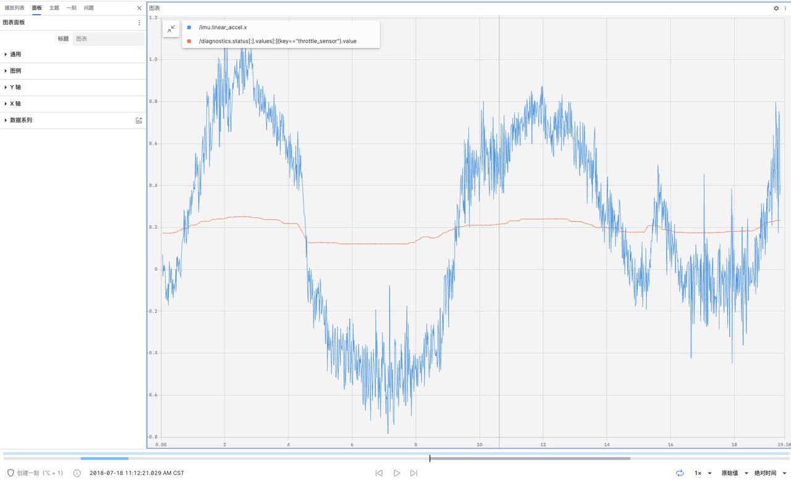
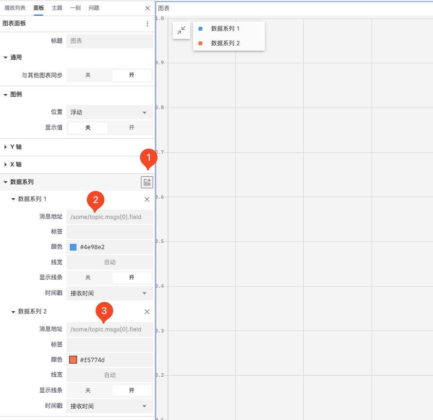
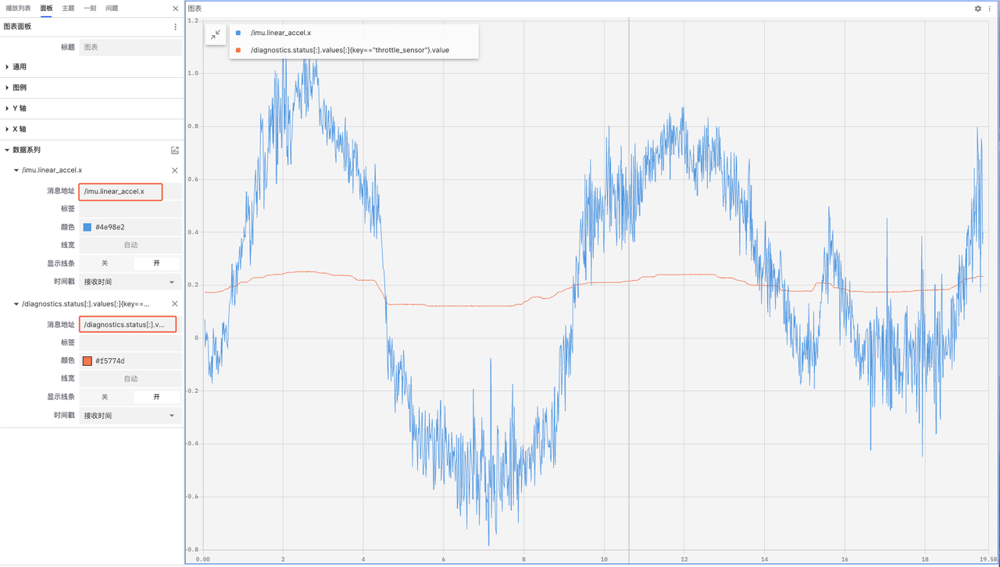
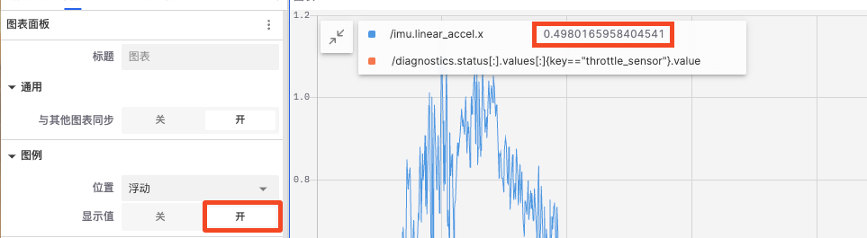
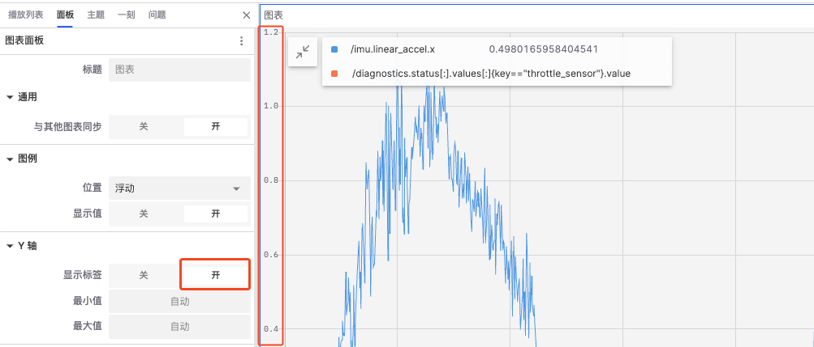
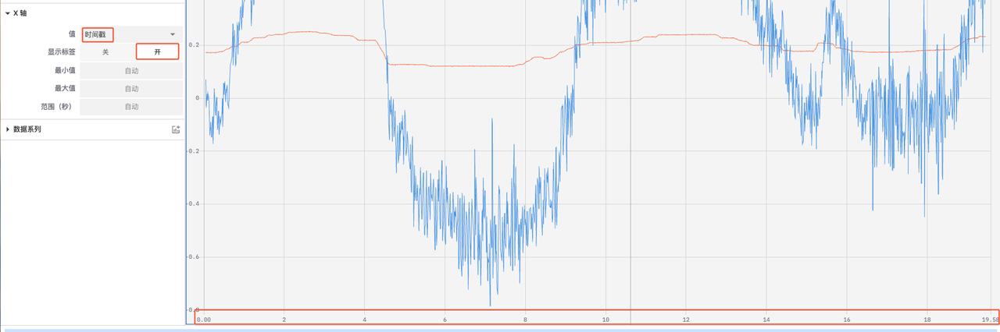
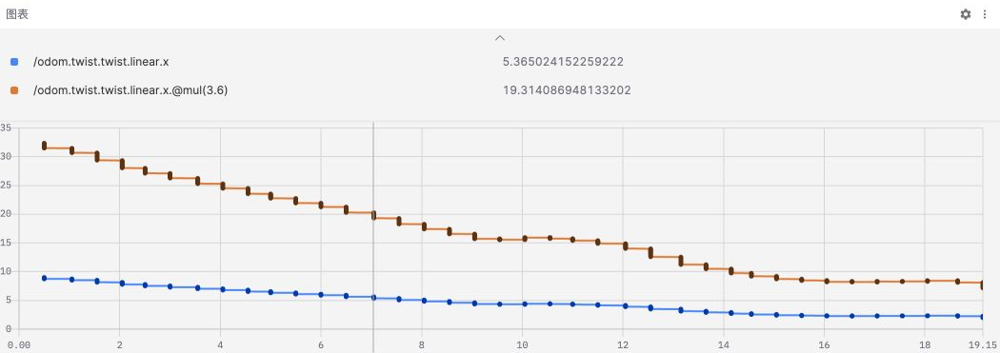
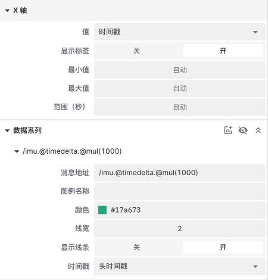
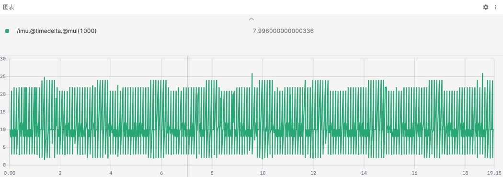

# 图表面板

「图表面板」用于绘制和展示数据随时间或其他变量变化的可视化工具。它允许用户配置多个数据系列，并通过图表的形式直观地展示这些数据的变化趋势。



## 图表面板中的属性值

图表面板中含数据系列、通用、图例、Y轴和 X轴 四类属性值可以设置。

### 数据系列

1. 添加新的数据系列



2. 输入消息地址



3. 配置数据系列

- 标签：设置数据系列的标签文本
- 颜色：设置数据系列的颜色
- 线宽：设置数据系列的线条宽度
- 显示线条：启用或禁用数据点之间的连线
- 时间戳：时间戳用于标记数据点的时间位置，确保数据按时间顺序在图表中正确绘制
  - 接收时间：使用接收时间作为时间戳，可以显示数据到达系统的实际时间
  - 头时间戳：使用头时间戳可以显示数据在源设备上的实际发生时间

### 通用

- 与其他图表同步：在多图表视图中，启用此选项可以使多个图表同步缩放和移动，便于对比和分析数据

### 图例



- 位置：设置图例的位置，可以选择浮动、左、上和隐藏
- 显示值：如图示，启用后可以在图例中直接看到数据点的数值

### Y轴



- 显示标签：控制是否在 Y 轴显示刻度标签
- 最小值和最大值：设置 Y 轴的起始值和结束值

### X轴



- 值：选择 X 轴显示的值，可以从时间戳、索引、地址（当前）和地址（累计）中选择
- 显示标签：控制是否在 X 轴显示刻度标签
- 最大值和最小值：设置 X 轴的起始值和结束值
- 范围（秒）：控制 X 轴显示的时间段长度

## 使用消息路径函数 {#message-path-functions}

【消息地址】支持字段选择、数组切片、比较过滤和函数链。完整语法见[消息路径语法](../message-path-syntax.md)。

### 单位换算

添加两个数据系列，分别输入：

```text
/odom.twist.twist.linear.x
/odom.twist.twist.linear.x.@mul(3.6)
```

第一条显示原始线速度（m/s），第二条显示转换后的速度（km/h）。在【图例】中开启【显示值】，可比较同一时刻的结果。



也可以使用 `/odom.twist.twist.linear.@norm.@mul(3.6)` 先求速度向量的模长。要绘制姿态角，可使用 `/odom.pose.pose.orientation.@ypr.yaw.@degrees`；旋转顺序与输出字段见[四元数与欧拉角](../message-path-syntax.md#rotation-functions)。

### 时间序列计算 {#time-series-functions}

`@delta`、`@derivative` 和 `@timedelta` 使用相邻样本计算变化量、每秒变化率和时间间隔。使用前，将【X 轴】的【值】设置为【时间戳】。索引、地址（当前）和地址（累计）模式不支持这些函数。

以查看 IMU 消息间隔为例：

1. 在【消息地址】中输入 `/imu.@timedelta.@mul(1000)`，将间隔从秒转换为毫秒。
2. 在该数据系列的【时间戳】中选择【接收时间】或【头时间戳】。
3. 播放或定位记录，查看间隔曲线。截图使用【头时间戳】。





两种时间来源的含义不同：接收时间反映消息被接收或记录的时间；头时间戳读取消息的 `header.stamp`。数据批量到达时，两种来源可能产生不同的间隔曲线。选择头时间戳前，确认消息包含有效的 `header.stamp`。

可直接对话题计算间隔，也可先按消息字段过滤：

```text
/imu.@timedelta
/imu{header.frame_id=="imu_link"}.@timedelta.@mul(1000)
```

第二条仅适用于 `header.frame_id` 为 `imu_link` 的消息。间隔基于相邻的匹配消息计算；如果过滤后不足两条消息，就没有有效的间隔结果。

每条路径最多包含一个时间序列函数，之后只能接数值函数或带参数运算：

| 表达式                                          | 是否有效                           |
| ----------------------------------------------- | ---------------------------------- |
| `/odom.twist.twist.linear.x.@derivative.@abs`   | 有效：计算变化率后取绝对值         |
| `/imu.@timedelta.@mul(1000)`                    | 有效：将时间间隔转换为毫秒         |
| `/odom.twist.twist.linear.x.@delta.@derivative` | 无效：包含两个时间序列函数         |
| `/imu.@timedelta.@norm`                         | 无效：时间序列函数后不能接向量函数 |

首个样本没有有效的差分结果；相同时间戳的样本不能产生有效导数。CSV 导出包含时间序列函数及其后续运算的计算结果。详细公式见[时间序列函数](../message-path-syntax.md#time-series)。
