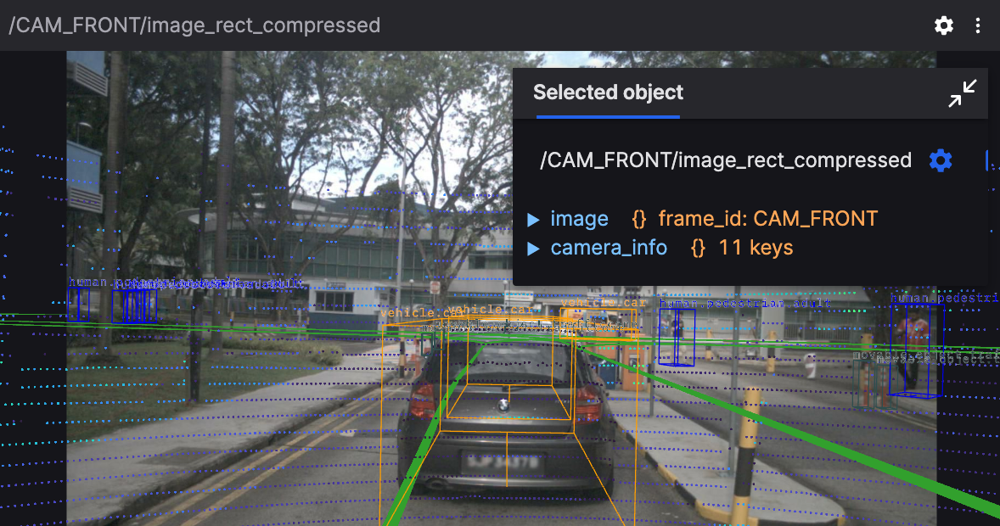
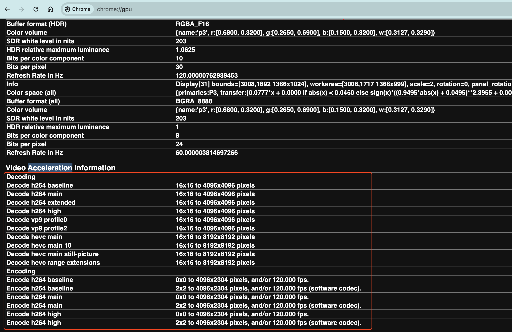
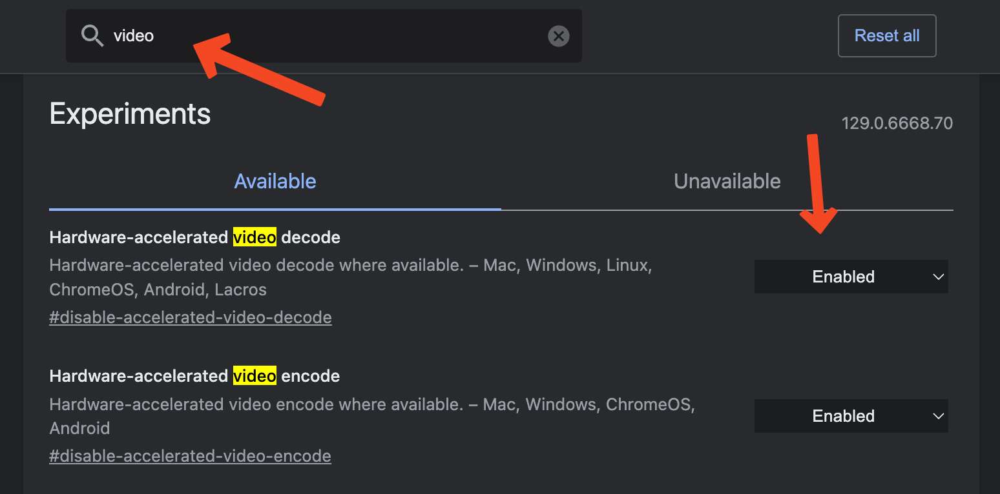

# 图像面板

显示原始及压缩后的图像和视频，并附带二维注释，如文本标签、圆形和点。同时叠加三维标记，以提供额外的上下文信息。

## 设置

### 一般设置

- 话题:「话题」指的是数据流的类别或频道。每个话题代表一种特定类型的数据源或传感器数据，例如摄像头图像、激光雷达数据、注释信息等。
- 校准：用于失真和 3D 主题的校准
- 同步注释：仅在图像和 2D 标注的时间戳匹配时才显示它们。新接收到的 2D 标注消息将被缓存，直到找到匹配的图像集可以显示。目前尚不支持压缩视频主题。
- 水平翻转：沿垂直轴翻转图像
- 垂直翻转：沿水平轴翻转图像
- 旋转： 图像旋转的角度（0°、90°、180° 或 270°）
- 颜色模式：
  - 色彩映射 - 预定义的颜色调色板
  - 渐变 - 两种自定义颜色之间的平滑过渡
- 颜色映射：仅在"颜色模式"设置为"颜色映射"时显示。用于将 mono16 和 16UC1 图像值映射到颜色：
  - Turbo（谷歌）
  - Rainbow（RViz）
- 梯度: 仅当"颜色模式"设置为"渐变"时显示。为单色 16 位和 16 位无符号单通道图像指定渐变色值。
- 最小值：单通道 16 位和 16 位无符号单通道深度图像的最小缩放值（默认值：0）。
- 最大值：单通道 16 位和 16 位无符号单通道深度图像的最大缩放值（默认值：10000）。

### 场景

- 渲染统计：在面板角落显示渲染性能统计信息
- 背景：图像背后的背景颜色
- 标签比例：文字标签的大小
- 忽略 COLLADA 的 \<up_axis\>：在 COLLADA 文件中忽略 \<up_axis\> 标签
- 网格上轴：加载没有方向信息的网格模型（STL、OBJ 格式）时"向上"的方向（"Y 向上"、"Z 向上"）

### 图像注释

2D 图像标注标记显示的主题。

> 其他设置详见 [3d 面板](./2-3d-panel.md)

## 用户交互

右键点击图片以将其下载为 PNG 文件格式。

点击任何显示的图像标记以查看其详细信息

滚动鼠标滚轮来缩放，拖动来平移。缩放时注释会重新渲染以保持清晰。

## 画面撕裂及卡顿

当画面呈现撕裂和卡顿时，可能的原因是视频解码导致的延迟, 当浏览器无法使用硬件加速解码时会使用系统 CPU 解码，CPU 解码性能会显著低于硬件解码并且此时系统 CPU 负载和功耗也会影响到解码效率。硬件加速解码通常更快且性能开销更少, 请确认已启用该功能。

## 检查硬件加速:

您可以通过打开 Google Chrome 并在地址栏中输入 <code>chrome://gpu</code> 来检查您的平台是否支持硬件加速视频解码。如果在此页面上未看到 <code>Video Decode: Hardware accelerated</code> 或 <code>Video Acceleration</code> 部分为空，则代表当前未开启硬件加速解码。

<table>
  <tr>
    <td>
    
    </td>
    <td>
    
    </td>
  </tr>
</table>

## 启用硬件加速:

访问 <code>chrome://settings</code>，搜索 <code>acceleration</code>，确保 <code>Use graphics acceleration when available</code> 切换已启用。

访问 <code>chrome://flags</code>，搜索 <code>video</code>，确保 <code>Hardware-accelerated video decode</code> 已启用。

MacOS：

对于 MacOS，当在基于 Chromium 的浏览器中将图形后端(graphics backend) 更改为使用 <code>Metal</code> 时，观察到显著的性能提升。您可以在 <code>about://flags</code> 中进行更改。

Linux：

- 请注意，Chrome/Chromium 默认不支持 Linux 上的视频加速，可能需要使用自定义 Chrome/Chromium 标记来启用 GPU。
- 确保您的图形驱动程序已更新并正确安装。

## 支持的消息类型

想要使用图像面板,你的数据源必须提供 3D 标记类型的消息或者以下支持的消息类型。

### `RawImage`

| 框架   | 消息类型                                                                                             |
| ------ | ---------------------------------------------------------------------------------------------------- |
| ROS 1  | [sensor_msgs/Image](https://docs.ros.org/en/noetic/api/sensor_msgs/html/msg/Image.html)              |
| ROS 2  | [sensor_msgs/Image](https://github.com/ros2/common_interfaces/blob/master/sensor_msgs/msg/Image.msg) |
| 自定义 | [foxglove.RawImage](../message-schemas/raw-image)                                                    |

### `CompressedImage`

| 框架   | 消息类型                                                                                                                 |
| ------ | ------------------------------------------------------------------------------------------------------------------------ |
| ROS 1  | [sensor_msgs/CompressedImage](https://docs.ros.org/en/noetic/api/sensor_msgs/html/msg/CompressedImage.html)              |
| ROS 2  | [sensor_msgs/CompressedImage](https://github.com/ros2/common_interfaces/blob/master/sensor_msgs/msg/CompressedImage.msg) |
| 自定义 | [foxglove.CompressedImage](../message-schemas/compressed-image)                                                          |

### `CameraCalibration`

提供可选的相机校准数据以在图像面板中渲染 3D 实体，或在 3D 面板中渲染图像。校准数据不是必需的，因为 ImageAnnotations 使用像素坐标。

可视化支持 plumb_bob 和 rational_polynomial 畸变模型。

| 框架   | 消息类型                                                                                                       |
| ------ | -------------------------------------------------------------------------------------------------------------- |
| ROS 1  | [sensor_msgs/CameraInfo](https://docs.ros.org/en/noetic/api/sensor_msgs/html/msg/CameraInfo.html)              |
| ROS 2  | [sensor_msgs/CameraInfo](https://github.com/ros2/common_interfaces/blob/master/sensor_msgs/msg/CameraInfo.msg) |
| 自定义 | [foxglove.CameraCalibration](../message-schemas/camera-calibration)                                            |

### `ImageAnnotations`

| 框架   | 消息类型                                                                                                                       |
| ------ | ------------------------------------------------------------------------------------------------------------------------------ |
| ROS 1  | [visualization_msgs/ImageMarker](https://docs.ros.org/en/noetic/api/visualization_msgs/html/msg/ImageMarker.html)              |
| ROS 2  | [visualization_msgs/ImageMarker](https://github.com/ros2/common_interfaces/blob/master/visualization_msgs/msg/ImageMarker.msg) |
| 自定义 | [foxglove.ImageAnnotations](../message-schemas/image-annotations)                                                              |
