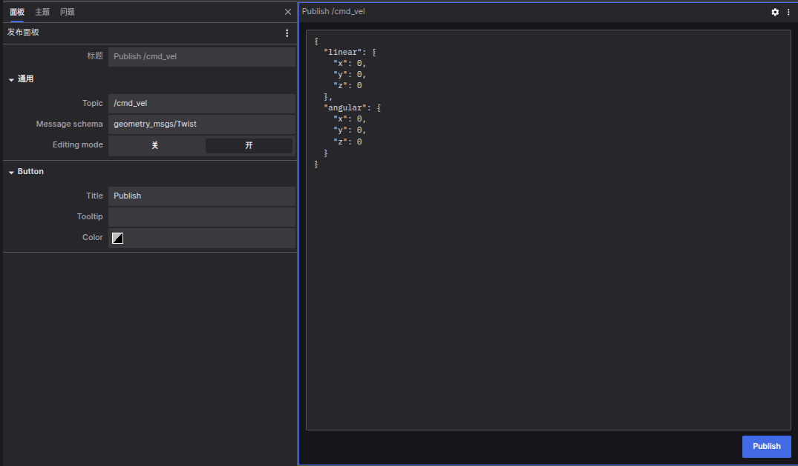

# 发布面板

发布面板（Publish Panel）是一个用于向「指定主题（Topic）」发布消息的工具，它通过 [coBridge](https://github.com/coscene-io/coBridge) 将信息传递给您的机器人系统。

## 设置选项

- 编辑模式（Editing Mode）：开启时可编辑消息内容，关闭时仅显示发布按钮
- 按钮标题（Button Title）：自定义发布按钮的显示文本
- 按钮提示（Button Tooltip）：设置鼠标悬停时显示的提示信息
- 按钮颜色（Button Color）：自定义按钮的显示颜色

## 使用步骤

1. 输入主题：在主题栏中输入目标主题名称，系统会自动识别对应的消息架构并生成 JSON 模板
2. 选择架构：点击架构选择框可查看常用 ROS 架构列表，选择后将自动生成对应的 JSON 模板
3. 编辑消息：根据需求修改 JSON 模板内容
4. 发送消息：点击发布按钮将消息发送至指定主题

## 使用须知

- Web 端必须连接至支持发布功能的机器端，否则发布按钮将处于禁用状态
- 机器端的 coBridge 配置需要启用 clientPublish 功能，才能支持从 Web 端发布主题消息

发布面板为您提供了一个直观的界面，让您能够方便地与机器人系统进行消息交互，提升操作效率。
