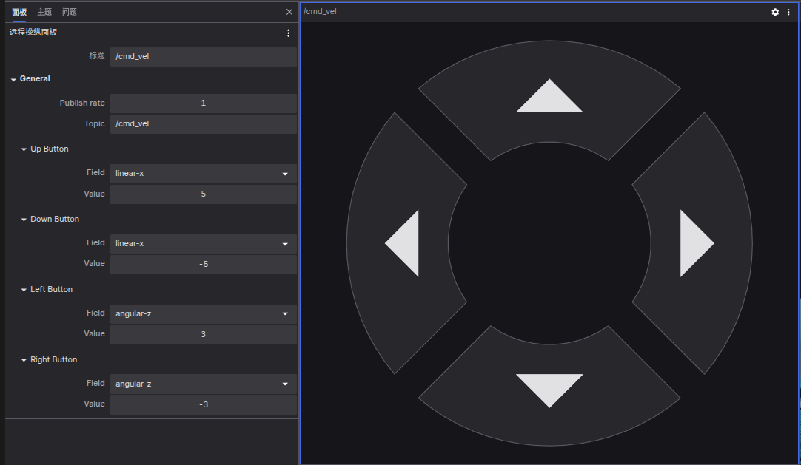

# 远程操控面板

远程操控面板使您能够通过发布 `geometry_msgs/Twist` 或 `geometry_msgs/msg/Twist` 消息到指定主题（Topic）来控制机器人。要使用此面板远程操控机器人，您需要先通过 [coBridge](https://github.com/coscene-io/cobridge) 建立与机器人的通信连接。

## 配置参数

- 发布频率 (Publish rate)：控制 Twist 消息的发送频率
- 主题名称 (Topic)：指定发布 Twist 消息的目标主题
- 方向控制按钮：配置上/下/左/右按钮对应的运动参数
  - 可分别设置线性速度（x、y、z）和角速度的对应数值

## 支持的消息类型

要使用此面板，您的数据源必须提供符合以下支持的消息类型。

`Twist`

| 框架 | 消息类型 |
| --- | --- |
| ROS 1 | [geometry_msgs/Twist](https://docs.ros.org/en/noetic/api/std_msgs/html/msg/ColorRGBA.html) |
| ROS 2 | [geometry_msgs/msg/Twist](https://github.com/ros2/common_interfaces/blob/master/geometry_msgs/msg/Twist.msg) |

## 技术实现

远程操控面板是一个专用的发布器面板，其核心功能是通过 coBridge 向机器人发送控制指令。要实现远程操控功能，机器人端需要配置相应的组件来处理接收到的控制消息。
