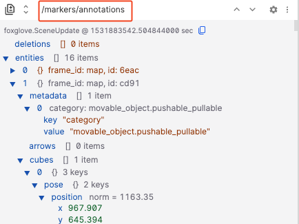
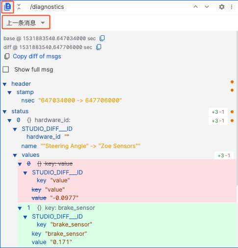
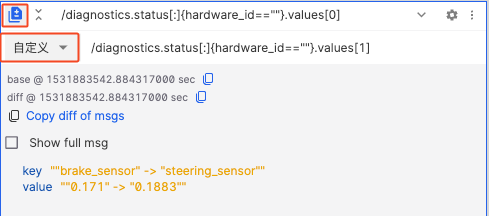
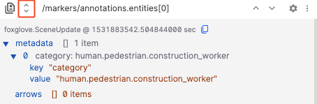
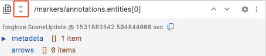
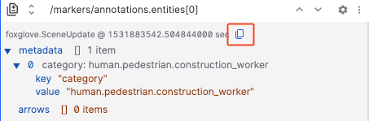

# 原始消息面板

在数据源中查看指定的消息路径。

当该路径有新消息进入时，折叠树会自动更新并只显示最新消息。您可以根据需要展开或收起各个键，展开/收起的状态在回放时也会被保留。

## 设置

| 字段 | 说明 |
| --- | --- |
| 字体大小 | 文本显示的字体大小 |

## 快捷方式

### 对比模式
通过显示字段的新增（绿色）、删除（红色）和修改（黄色）来对比消息，分为两类：

- `上一条消息` – 对比指定消息路径的连续消息
- `自定义` – 对比指定时间点不同 topic 的消息

### 展开全部
单击消息路径旁边的图标可展开或折叠显示消息中的所有嵌套字段。

| 展开全部 | 收起全部 |
| --- | --- |
|  |  |

### 逐帧查看
当消息数量较多时，可使用该功能逐条查看消息。
通过点击按钮，或选中面板后使用快捷键 `上箭头` 和 `下箭头` 查看。

### 复制消息
点击【复制消息】按钮，将当前主题消息复制到剪贴板

