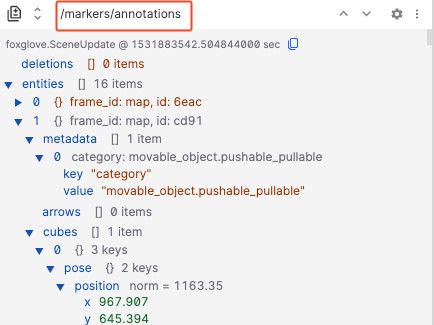
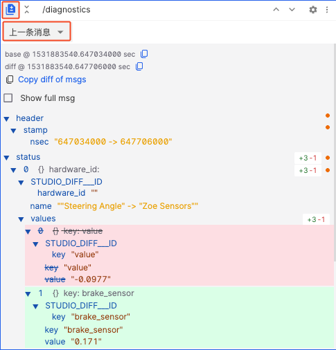
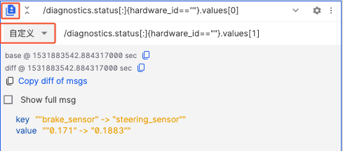
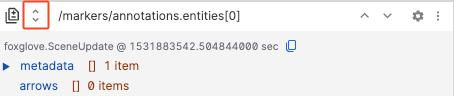
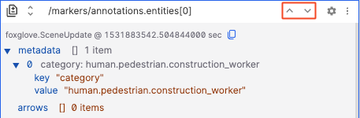

# 原始消息面板

在数据源中查看指定的消息路径。

当该路径有新消息进入时，折叠树会自动更新并只显示最新消息。您可以根据需要展开或收起各个键，展开/收起的状态在回放时也会被保留。



## 选择、过滤和转换消息 {#message-paths}

顶部输入框支持[消息路径语法](../message-path-syntax.md)。可以查看整个话题，也可以只选择需要的字段：

```text
/odom
/odom.twist.twist.linear.x
```

使用切片和过滤条件选择数组元素，再提取字段。例如，下面两条表达式分别显示前 6 个目标的 ID，以及其中大于或等于 `40000` 的 ID：

```text
/markers/annotations.markers[0:5].id
/markers/annotations.markers[0:5]{id>=40000}.id
```

过滤前后的对比截图见[数组过滤](../message-path-syntax.md#filters)。对于带有枚举定义的诊断状态，还可使用 `/diagnostics.status[:]{level==OK}.name`。

函数可转换单条消息的结果，例如 `/imu.linear_acceleration.@norm` 计算加速度模长，`/odom.pose.pose.orientation.@ypr` 显示转换后的欧拉角对象。追加 `.yaw.@degrees` 可只显示角度制航向角。

本面板不支持 `@delta`、`@derivative` 或 `@timedelta`。需要比较相邻样本的数值或时间差时，请使用[图表面板的时间序列函数](./4-plot-panel.md#time-series-functions)。

## 设置

| 字段     | 说明               |
| -------- | ------------------ |
| 字体大小 | 文本显示的字体大小 |

## 快捷方式

### 对比模式

通过显示字段的新增（绿色）、删除（红色）和修改（黄色）来对比消息，分为两类：

- `上一条消息` – 对比指定消息路径的连续消息
- `自定义` – 对比指定时间点不同 topic 的消息




### 展开全部

单击消息路径旁边的图标可展开或折叠显示消息中的所有嵌套字段。

| 展开全部                                         | 收起全部                                         |
| ------------------------------------------------ | ------------------------------------------------ |
|  |  |

### 逐帧查看

当消息数量较多时，可使用该功能逐条查看消息。
通过点击按钮，或选中面板后使用快捷键 `上箭头` 和 `下箭头` 查看。



### 复制消息

点击【复制消息】按钮，将当前主题消息复制到剪贴板


