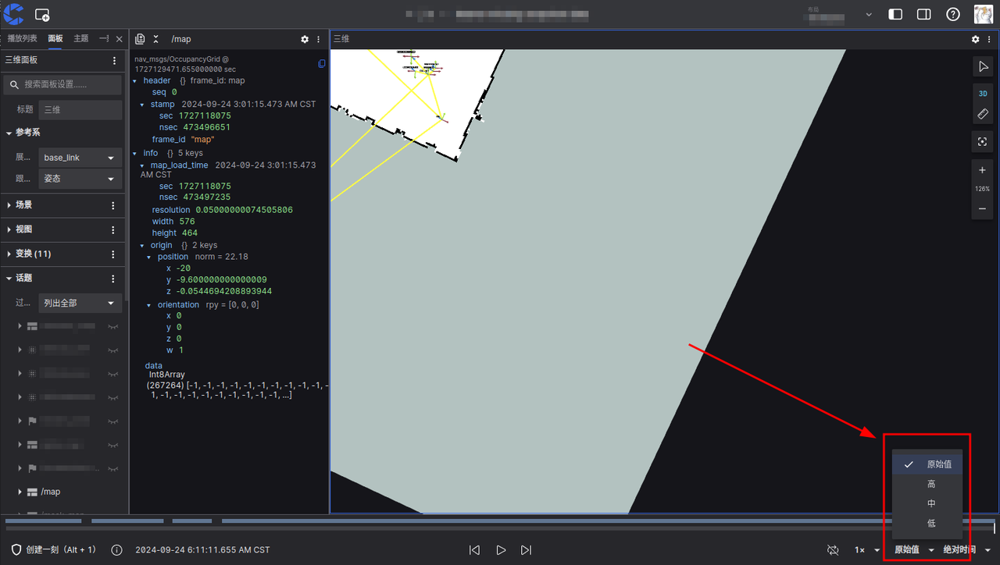

# 帧率优化选项

「帧率优化选项」用于在数据量较大且带宽受限的情况下，通过主动调整 `topic` 数据的帧率来实现流畅的播放效果。

## 设置

「帧率优化选项」位于可视化界面右下角，提供四个预设档位：

| 档位   | 目标帧率                       |
| ------ | ------------------------------ |
| 原始值 | 保持原始数据帧率，不做任何处理 |
| 高     | 60 fps                         |
| 中     | 30 fps                         |
| 低     | 10 fps                         |

:::warning

以下类型的消息不会进行任何帧率的调整：

- `transform` 类型消息
- 帧间存在依赖关系的数据（如 `CompressedVideo` 中的 `H.264` 编码视频流）

:::