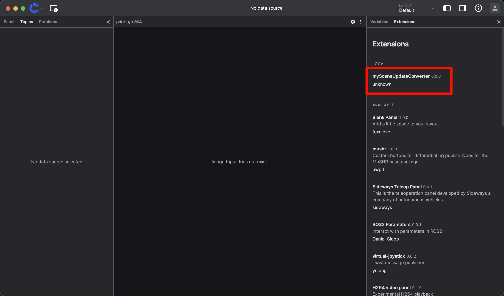
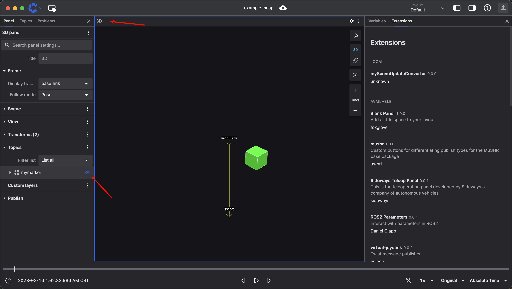

# 使用消息转换器在 3D 面板中显示 3D 标记

通过编写您自己的消息转换器，您可以使用可视化的现有面板来可视化您的自定义消息，即使这些消息的定义不被现有面板支持。

## 为什么要使用消息转换器

虽然每次想要可视化某些特定数据时，您都可以构建自定义面板，但只需编写消息转换器即可节省大量时间和精力。消息转换器将数据转换为支持的格式，然后现有的面板来完成对应的需求，而无需从头构建另一个面板。

## 我们的目标

我们将创建一个消息转换器，将自定义的 `my.Marker` 消息转换为 `foxglove.SceneUpdate` 消息，然后使用 3D 面板显示这些标记。您可以从这里下载本次教程的[示例 mcap 文件](https://download.coscene.cn/assets/bags/example.mcap)。

## 开始之前

在开始之前，需要您自行了解/安装以下基础概念/环境：

- 一些基础的机器人概念
- 刻行时空可视化功能的基础使用
- [js/ts 的基础语法](https://www.typescriptlang.org/docs/handbook/basic-types.html)
- [npm 等前端包管理工具的基础使用](https://docs.npmjs.com/)
- [当前设备安装 nodejs 14 及以上版本](https://nodejs.org/en/download/)

## 初始化项目

使用 [create-coscene-extension](https://github.com/coscene-io/create-coscene-extension) 创建一个项目：

```bash
npm init coscene-extension@latest mySceneUpdateConverter
```

这条命令将创建一个 `mySceneUpdateConverter` 目录，里面包含一些模板源代码。

## 编写转换器

src/index.ts 是插件源代码的入口点。它导出一个 `activate` 函数，它接受单个 [`ExtensionContext`](/docs/viz/extensions/api/entry-point/extension-context) 类型的参数。

首先，让我们将 `@foxglove/schemas` 包添加到我们的项目中。`@foxglove/schemas` 是 foxglove 的 schema 定义库，您可以在这里找到所有 foxglove 支持的 schema 定义：

```bash
npm install @foxglove/schemas
```

然后，打开 `src/index.ts` 文件，导入以下包：

```ts
// 导入 coscene 的插件上下文
import { ExtensionContext } from '@coscene/extension';
// 导入 foxglove 的 schema 定义
import { CubePrimitive, SceneUpdate } from '@foxglove/schemas';
// 导入 foxglove 定义的时间类型
import { Time } from '@foxglove/schemas/schemas/typescript/Time';
```

并且声明我们自定义的 `my.Marker` 消息类型：

```ts
// 声明我们自定义的 `my.Marker` 消息类型
type DetectedObject = {
  position: [number, number, number];
  markerType: 'adult' | 'car' | 'truck';
  scale: [number, number, number];
  timestamp: Time;
  frameId: string;
};
```

要注册消息转换器，我们需要调用 `extensionContext` 中的 `registerMessageConverter` 函数，`registerMessageConverter` 函数需要三个参数：

- fromSchemaName: mcap 中定义的需要转换的消息类型
- toSchemaName: 转换后的消息类型
- converter: 执行转换的函数，该函数接受 fromSchemaName 中注册的对应的消息，我们需要在函数中将消息转换为 toSchemaName 中注册的对应的消息

```ts
// 注册消息转换器
export function activate(extensionContext: ExtensionContext) {
  extensionContext.registerMessageConverter({
    fromSchemaName: 'my.Marker',
    toSchemaName: 'foxglove.SceneUpdate',
    converter: (inputMessage: DetectedObject): SceneUpdate => {
      // 从 my.Marker 转换为 foxglove.SceneUpdate 的转换逻辑
    },
  });
}
```

填写 converter 函数，将 `my.Marker` 消息转换为 `foxglove.SceneUpdate` 消息。我们将所有检测到的对象显示为彩色立方体：

- 蓝色表示成年人
- 红色表示汽车
- 绿色表示卡车

```ts
converter: (inputMessage: DetectedObject): SceneUpdate => {
  const { position, scale, markerType, timestamp, frameId } = inputMessage;
  const colorMap = {
    adult: { r: 0, g: 0, b: 1, a: 1 },
    car: { r: 1, g: 0, b: 0, a: 1 },
    truck: { r: 0, g: 1, b: 0, a: 1 },
  };

  const cubePrimitive: CubePrimitive = {
    pose: {
      position: { x: position[0], y: position[1], z: position[2] },
      orientation: { x: 0, y: 0, z: 0, w: 1 },
    },
    size: { x: scale[0], y: scale[1], z: scale[2] },
    color: colorMap[markerType],
  };

  const sceneUpdateMessage = {
    deletions: [],
    entities: [
      {
        id: 'detectedObjects-entities',
        timestamp,
        frame_id: frameId,
        lifetime: { sec: 10, nsec: 0 },
        frame_locked: false,
        metadata: [],
        arrows: [],
        cubes: [cubePrimitive],
        spheres: [],
        cylinders: [],
        lines: [],
        triangles: [],
        texts: [],
        models: [],
      },
    ],
  };

  return sceneUpdateMessage;
};
```

## 测试插件

要在 coStudio 中构建和安装用于本地测试的插件，请在插件目录中运行以下命令：

```bash
npm run local-install
```

在 coStudio 中，打开右侧的插件列表，您现在将看到 `mySceneUpdateConverter` 已安装插件的列表中：


现在，打开我们的示例 mcap 文件，您可以打开 3D 面板，您将看到所有检测到的对象都被显示为彩色立方体：


## 分享您的插件

要与他人分享您的插件，您需要将其打包为 .coe 文件。为此，请在插件目录中运行以下命令：

```bash
npm run package
```

您将在插件目录中找到一个 `unknown.mySceneUpdateConverter-0.0.0.coe` 文件。您可以将其分发给其他人，他们可以通过拖拽将其安装到他们的 coStudio 中。
