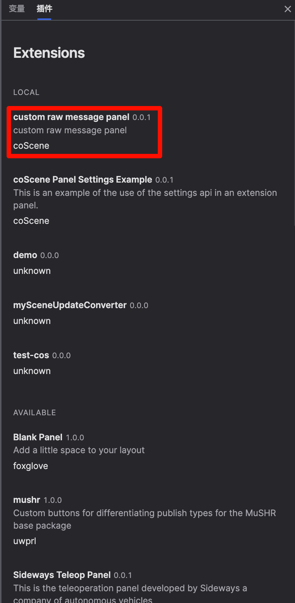
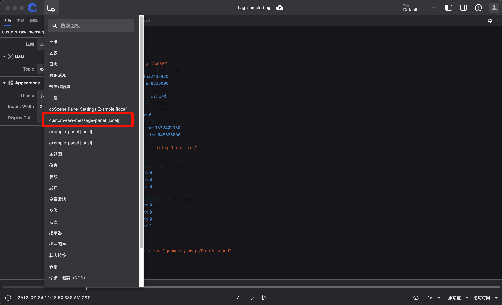
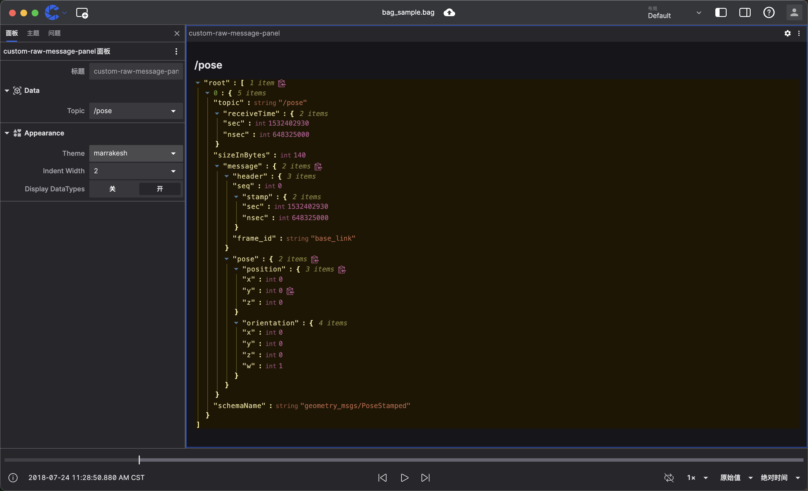

# 自定义面板 
通过编写您自己的面板，您可以更灵活地控制面板的外观和行为，以满足您的特定需求。

## 为什么要使用自定义面板
当现有面板不支持您想要可视化的需求时，自定义面板非常有用，您可以完全控制面板的外观和行为，以满足您的特定需求。

## 我们的目标
我们将创建一个自定义面板，在这个面板中我们将原始消息面板，使用 [react-json-view](https://github.com/microlinkhq/react-json-view) 来展示对应话题的原始消息。

## 开始之前
在开始之前，需要基础的概念/环境需要您自行了解/安装：
- 一些基础的机器人概念
- 刻行时空可视化功能的基础使用
- [js/ts 的基础语法](https://www.typescriptlang.org/docs/handbook/basic-types.html)
- [react 的基础使用](https://react.dev/)
- [npm 等前端包管理工具的基础使用](https://docs.npmjs.com/)
- [当前设备安装 nodejs 14 及以上版本](https://nodejs.org/en/download/)

## 初始化项目
使用 [create-coscene-extension](https://github.com/coscene-io/create-coscene-extension) 创建一个项目：
```bash
npm init coscene-extension@latest custom-raw-message-panel 
```
这条命令将创建一个 `custom-raw-message-panel` 目录，里面已经包含一些模板源代码

然后，我们需要安装一些依赖包，到我们的项目中
- `@microlink/react-json-view` 是用于展示 json 数据的 react 组件：
- `immer` 是一个用于处理不可变（immutable）状态的 JavaScript 库 
- `lodash` 是知名的 JavaScript 工具库，提供了许多实用的函数，包括数组操作、对象操作等

```bash
npm install @microlink/react-json-view
```

然后我们打开package.json 文件，修改 `displayName` 和 `description` 字段为 `custom raw message panel`，修改后的 `package.json` 文件内的内容应该如下。
```json
{
  "name": "custom-raw-message-panel",
  "displayName": "custom raw message panel",
  "description": "custom raw message panel",
  ...
}

```

## 编写自定义面板
现在在您选择的编辑器中打开 `custom-raw-message-panel` 文件夹, 然后打开其中的 `src/index.ts` 文件, 您将看到文件中已经注册了一个示例面板，该面板已注册为 `example-panel`, 第一步我们将这个示例面板的名称修改为 `custom-raw-message-panel`，修改后的 `index.ts` 文件内的内容应该如下。
```ts
import { ExtensionContext } from "@coscene/extension";

import { initExamplePanel } from "./ExamplePanel";

export function activate(extensionContext: ExtensionContext): void {
  extensionContext.registerPanel({
    name: "custom-raw-message-panel",
    initPanel: initExamplePanel,
  });
}
```

然后我们打开 src/ExamplePanel.tsx 文件，在 src/ExamplePanel.tsx 文件中，你会看到一个简单的 ExamplePanel 组件，我们需要先解释一下这个文件中的代码，然后根据我们的需求，修改这个文件，这个文件中它使用 React 的状态管理来跟踪订阅的主题、消息及其渲染状态。
```ts
function ExamplePanel({ context }: { context: PanelExtensionContext }): JSX.Element {
  const [topics, setTopics] = useState<readonly Topic[] | undefined>();
  const [messages, setMessages] = useState<readonly MessageEvent<unknown>[] | undefined>();

  const [renderDone, setRenderDone] = useState<(() => void) | undefined>();
```

示例中当检测到相关更新时将运行 `onRender` 事件 
```ts
useLayoutEffect(() => {
  context.onRender = (renderState: RenderState, done) => {
    setRenderDone(() => done);
    setTopics(renderState.topics);
    setMessages(renderState.currentFrame);
  };
}, [context]);
```
onRender 函数中会接受最新的面板状态：
- `done` 新的渲染完成后的回调函数, 当渲染完成时，需要调用 `done` 函数, 标识面板已经完成上一个渲染周期
- `renderState.topics` 最新的主题列表
- `renderState.currentFrame` 订阅主题的新消息

接下来，使用 `context.watch` 函数来告知上下文哪些状态需要监听，当状态发生变化时，会触发 `onRender` 事件，`context.watch` 监听 [`RenderState`](/docs/viz/extensions/api/custom-panels/render-state) 中的 key 值，您可以从 [`RenderState`](/docs/viz/extensions/api/custom-panels/render-state) 中查看所有可以被监听的 key 值
```ts
context.onRender = (renderState: RenderState, done) => {
  // ...
};
// 告诉面板上下文我们关心 RenderState 中的 _topic_ 字段的变化
context.watch("topics");
// 告诉面板上下文我们想要订阅当前帧的消息
context.watch("currentFrame");
```

然后我们需要使用 `context.subscribe` 函数来订阅主题数组，这些主题的消息将填充到 `renderState.currentFrame` 中
```ts
context.subscribe(["/some/topic"]);
```

最后，当面板完成渲染后，我们需要调用 `renderDone` 函数，标识面板已经完成上一个渲染周期
```ts
useEffect(() => {
  renderDone?.();
}, [renderDone]);
```

在函数的底部，我们看到如何使用所有这些逻辑来呈现数据源主题和模式名称的表
```ts
return (
  <div style={{ padding: "1rem" }}>
    <h2>Welcome to your new extension panel!</h2>
    // ...
    {(topics ?? []).map((topic) => (
      <>
        <div key={topic.name}>{topic.name}</div>
        <div key={topic.datatype}>{topic.datatype}</div>
      </>
    ))}
    // ...
  </div>
);
```


根据我们的需求，在设置中我们需要让用户自定义用户选择要展示的话题(Topic)，并且我们可以让用户自定义 `@microlink/react-json-view` 中支持的主题(Theme)，锁进(Indent Width)，以及是否展示数据类型(Display DataTypes)

所以我们需要先定义设置的 ts 类型：State，以及 `@microlink/react-json-view` 支持的主题 ThemeOptions。

```ts
// @microlink/react-json-view 支持的主题
const ThemeOptions = [
  "apathy",
  "apathy:inverted",
  "ashes",
  "bespin",
  "brewer",
  "bright:inverted",
  "bright",
  "chalk",
  "codeschool",
  "colors",
  "eighties",
  "embers",
  "flat",
  "google",
  "grayscale",
  "grayscale:inverted",
  "greenscreen",
  "harmonic",
  "hopscotch",
  "isotope",
  "marrakesh",
  "mocha",
  "monokai",
  "ocean",
  "paraiso",
  "pop",
  "railscasts",
  "rjv-default",
  "shapeshifter",
  "shapeshifter:inverted",
  "solarized",
  "summerfruit",
  "summerfruit:inverted",
  "threezerotwofour",
  "tomorrow",
  "tube",
  "twilight",
].map((key) => ({ value: key, label: key }));

// 这是我们将在渲染面板时使用的类型，并持久化到布局中。
type State = {
  data: {
    label: string;
    topic?: string;
    visible: boolean;
  };
  appearance: {
    displayDataTypes: boolean;
    indentWidth: string;
    theme: string;
  };
};
```

然后我们需要使用 `React` 的 `useState` 来管理设置状态，并且声明一个函数来更新设置状态。
```ts
import { produce } from "immer";
import { set } from "lodash";

// 从上下文的 initialState 构建我们的面板状态，填充任何可能缺失的值。
const [state, setState] = useState<State>(() => {
  const partialState = context.initialState as Partial<State>;
  return {
    data: {
      label: partialState.data?.label ?? "Data",
      topic: partialState.data?.topic ?? "/pose",
      visible: partialState.data?.visible ?? true,
    },
    appearance: {
      displayDataTypes: partialState.appearance?.displayDataTypes ?? true,
      theme: partialState.appearance?.theme ?? "rjv-default",
      indentWidth: partialState.appearance?.indentWidth ?? "2",
    },
  };
});

// 响应来自设置面板的编辑操更新我们的状态。
const actionHandler = useCallback(
  (action: SettingsTreeAction) => {
    if (action.action === "update") {
      const { path, value } = action.payload;

      // 我们结合使用了 immer 和 lodash 来生成新的状态对象，这样 React 就能重新渲染面板。
      // 由于我们的数据节点包含了 label 和 visibility 属性，这种组合方式可以自动处理标签编辑和节点可见性切换，
      // 而不需要编写特殊的处理逻辑。
      setState(produce((draft) => set(draft, path, value)));

      // 如果主题被更改，更新我们的订阅。
      if (path[1] === "topic") {
        context.subscribe([{ topic: value as string }]);
      }
    }
  },
  [context],
);
```

接下来，我们使用 `context.updatePanelSettingsEditor` 来将设置注册到我们的面板中，并且当设置的状态变化时，使用`context.saveState` 将状态保存到布局中。
```ts
// 每次我们的状态或可用主题列表发生变化时更新设置编辑器。
useEffect(() => {
  // 保存当前状态到布局中
  context.saveState(state);

  const topicOptions = (topics ?? []).map((topic) => ({ value: topic.name, label: topic.name }));

  // 我们设置我们的设置树来镜像面板状态的形状，以便我们可以使用设置树中的路径来直接更新我们的状态。
  context.updatePanelSettingsEditor({
    actionHandler,
    nodes: {
      data: {
        // 我们的标签来自状态中的标签，并会更新以反映状态中值的变化。
        label: state.data.label,
        // 设置此值为 true 允许用户编辑此节点的标签。
        renamable: true,
        // 一个非未定义的值在这里允许用户切换此节点的可见性。
        visible: state.data.visible,
        icon: "Cube",
        fields: {
          topic: {
            label: "Topic",
            input: "select",
            options: topicOptions,
            value: state.data.topic,
          },
        },
      },
      appearance: {
        label: "Appearance",
        icon: "Shapes",
        fields: {
          theme: {
            label: "Theme",
            input: "select",
            value: state.appearance.theme,
            options: ThemeOptions,
          },
          indentWidth: {
            label: "Indent Width",
            input: "select",
            value: state.appearance.indentWidth,
            options: [
              { value: "2", label: "2" },
              { value: "4", label: "4" },
              { value: "8", label: "8" },
            ],
          },
          displayDataTypes: {
            label: "Display DataTypes",
            input: "boolean",
            value: state.appearance.displayDataTypes,
          },
        },
      },
    },
  });
}, [context, actionHandler, state, topics]);
```

然后我们需要作两处小的改动
- 判断 `renderState.currentFrame` 是否为 undefined，如果为 undefined，保留上一帧的数据，不要讲 message 置空。
- 在初始化时就去监听设置中设置的 topic
```ts
useLayoutEffect(() => {
  context.onRender = (renderState, done) => {
    ...

    // 如果 currentFrame 为 undefined，保留上一帧的数据，不要讲 message 置空。
    if (renderState.currentFrame) {
      setMessages(renderState.currentFrame);
    }
  };


  // 添加渲染处理程序后，必须指明渲染状态 (RenderState) 中的哪些字段会触发更新。
  // 如果不监听任何字段，面板上下文会认为您不需要任何更新，因此面板将不会渲染。

  // 告诉面板上下文我们关心 RenderState 中的 _topic_ 字段的变化
  context.watch("topics");

  // 告诉面板上下文我们想要订阅当前帧的消息
  context.watch("currentFrame");

  // 订阅我们初始的话题
  if (state.data.topic) {
    context.subscribe([{ topic: state.data.topic }]);
  }
}, [context, state.data.topic]);
```

最后只需要在 `return` 中使用 `@microlink/react-json-view` 绘制对应的消息即可。
```ts
return (
  <div style={{ padding: "1rem", display: "flex", flexDirection: "column", maxHeight: "100%" }}>
    <h2>{state.data.topic ?? "Choose a topic in settings"}</h2>
    <div
      style={{
        overflowY: "auto",
        flex: 1,
      }}
    >
      <ReactJson
        src={messages ?? {}}
        displayDataTypes={state.appearance.displayDataTypes}
        theme={state.appearance.theme as ThemeKeys}
        indentWidth={Number(state.appearance.indentWidth)}
      />
    </div>
  </div>
);
```

> 你可以在 [这里](https://github.com/coscene-io/create-coscene-extension/tree/main/examples/panel-settings) 找到完整的代码

## 测试插件
要在 coStudio 中构建和安装用于本地测试的插件，请在插件目录中运行以下命令：

```bash
npm run local-install
```

在 coStudio 中，打开右侧的插件列表 您现在将看到 `custom raw message panel` 已安装插件的列表中：


面板列表中也将多出一个 `custom-raw-message-panel` 的面板，添加我们的面板，并且打开任意文件，你就使用我们自定义的 `custom-raw-message-panel` 面板了：


你可以设置中选择你要查看的话题,并且自定义面板的外观，并且在面板中查看到对应话题的消息：


## 分享您的插件
要与他人分享您的插件，您需要将其打包为 .coe 文件。为此，请在插件目录中运行以下命令：
```bash
npm run package
```

您将在插件目录中找到一个 `unknown.custom-raw-message-panel-0.0.0.coe` 文件。您可以将其分发给其他人，他们可以通过拖拽将其安装到他们的 coStudio 实例中.