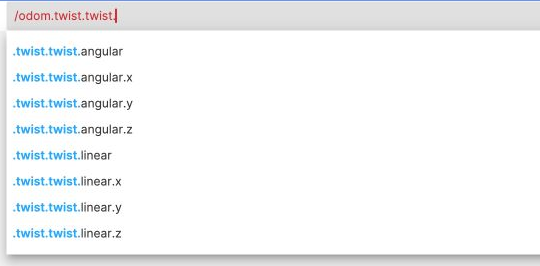
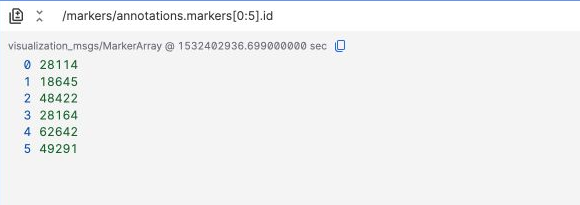
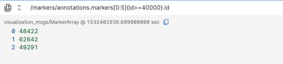
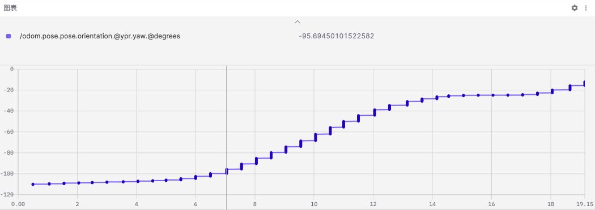
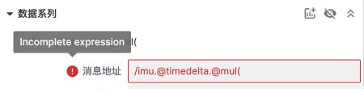

# 消息路径语法

消息路径用于选择话题中的字段、筛选消息或数组元素，并通过函数转换结果。例如，`/odom.twist.twist.linear.x.@mul(3.6)` 读取里程计消息中的 X 方向线速度，再将单位从 m/s 转换为 km/h。

在[图表面板](./4-panel/4-plot-panel.md)的【消息地址】或[原始消息面板](./4-panel/9-raw-messages.md)顶部的输入框中输入表达式即可使用。仪表、指示器和状态转换面板也支持消息路径，但可用函数和变量支持存在差异，详见[面板支持范围](#panel-support)。

## 快速开始 {#quick-start}

1. 打开一条记录，添加原始消息或图表面板。
2. 输入话题名，如 `/odom`，再用 `.` 逐层选择字段。
3. 在数值字段后追加 `.@函数名`，例如 `.@abs` 或 `.@mul(3.6)`。
4. 播放或定位到包含该话题消息的时间，查看结果。

输入时会根据数据源的消息结构提供字段和函数补全。示例中的话题与字段需要在当前数据源中存在；请按自己的消息结构调整路径。



## 话题与字段 {#topics-and-fields}

以 `/robot_state` 的这条示例消息为例：

```json
{
  "speed": 2.5,
  "status": 1,
  "objects": [
    { "id": 101, "confidence": 0.96 },
    { "id": 102, "confidence": 0.65 },
    { "id": 103, "confidence": 0.89 }
  ]
}
```

| 表达式                               | 结果     |
| ------------------------------------ | -------- |
| `/robot_state`                       | 整条消息 |
| `/robot_state.speed`                 | `2.5`    |
| `/robot_state.objects[0].confidence` | `0.96`   |

点号用于访问嵌套对象，例如 `/odom.pose.pose.orientation`。消息路径不是通用脚本：使用下面列出的字段、切片、过滤和函数语法，不支持直接输入 `speed * 3.6` 这样的算术表达式。

## 数组索引与切片 {#arrays}

数组索引从 `0` 开始，负索引从数组末尾计数。切片写成 `[起始索引:结束索引]`，**包含结束位置**。

| 表达式                           | 基于上述示例消息的结果 |
| -------------------------------- | ---------------------- |
| `/robot_state.objects[0].id`     | `101`                  |
| `/robot_state.objects[-1].id`    | `103`                  |
| `/robot_state.objects[0:1].id`   | `101, 102`             |
| `/robot_state.objects[:].id`     | `101, 102, 103`        |
| `/robot_state.objects[-2:-1].id` | `102, 103`             |

省略起始索引表示从开头开始，省略结束索引表示到末尾结束。索引超出数组范围或切片范围内没有元素时，不返回值。

切片后的字段访问会作用于每个选中的元素。例如，下面的实际回放截图显示 `/markers/annotations.markers[0:5].id` 选中的前 **6** 个目标 ID。



## 过滤 {#filters}

在话题或选中的对象后添加 `{字段 运算符 值}`。支持 `==`、`!=`、`<`、`<=`、`>` 和 `>=`，可比较数值、字符串和布尔字段。

### 过滤整条消息

```text
/robot_state{speed>=2}.speed
```

只有 `speed` 大于或等于 `2` 的消息才返回其速度。条件不满足时跳过该消息，不会输出一个 `0`。

过滤条件中的字段相对于当前对象解析，嵌套字段也可用点号访问：

```text
/odom{twist.twist.linear.x>0}.twist.twist.linear.x
```

### 过滤数组元素

先用切片选择元素，再添加过滤条件：

```text
/robot_state.objects[:]{confidence>=0.8}.id
```

该表达式对上述示例消息返回 `101, 103`。实际回放中，下面的表达式在前 6 个目标中保留 ID 大于或等于 `40000` 的元素：

```text
/markers/annotations.markers[0:5]{id>=40000}.id
```



### 多个条件和字符串

连续添加过滤条件表示同时满足所有条件，即 AND：

```text
/robot_state.objects[:]{confidence>=0.8}{id!=101}.id
```

该表达式返回 `103`。字符串值需要引号，布尔值使用不带引号的 `true` 或 `false`：

```text
/diagnostics.status[:]{name=="Zoe Sensors"}.level
/robot_state{enabled==true}.speed
```

最后一条表达式要求消息中存在布尔字段 `enabled`。过滤字符串可以使用单引号或双引号，但不支持在字符串内部转义引号；包含一种引号时，用另一种引号包围字符串。

### 枚举名称 {#enum-filters}

当消息结构为字段提供枚举定义时，可以使用不加引号的枚举名称。名称区分大小写，必须与该字段的定义一致。

例如，诊断状态的 `OK` 对应数值 `0`：

```text
/diagnostics.status[:]{level==OK}.name
/diagnostics.status[:]{level==0}.name
```


`{level==OK}` 表示枚举比较，`{name=="OK"}` 表示字符串比较。不能仅凭字段中出现一个数值就推断其枚举名称；如果数据源没有提供可识别的枚举定义，请使用数值过滤。

:::note
过滤补全目前主要提供等值比较示例。其他比较运算符和枚举名称可以手动输入。
:::

## 变量 {#variables}

在右侧变量栏中设置变量后，可用 `$变量名` 引用切片索引、过滤值或运算参数。例如，设置 `start = 0`、`end = 1`、`target_id = 101` 和 `scale = 3.6`：

```text
/robot_state.objects[$start:$end].id
/robot_state.objects[:]{id==$target_id}.confidence
/robot_state.speed.@mul($scale)
```

切片索引应为整数，过滤变量使用数值或字符串，运算参数变量必须为有限数值。变量不能用于替换话题名、字段名或函数名。仪表和指示器不支持路径中的变量，请使用字面值。

## 函数 {#functions}

在路径末尾追加 `.@函数名`。无参数函数不需要括号；带参数的函数使用 `.@函数名(参数)`。函数必须与输入数据类型匹配。

### 数值函数

以下函数接收数值并返回数值。三角函数的角度单位为弧度。

| 函数                      | 作用                                       |
| ------------------------- | ------------------------------------------ |
| `@abs`                    | 绝对值                                     |
| `@negative`               | 取相反数                                   |
| `@sign`                   | 符号，返回 `-1`、`0` 或 `1`                |
| `@ceil`                   | 向上取整                                   |
| `@round`                  | 四舍五入到最近整数，半整数向正无穷方向取整 |
| `@trunc`                  | 截去小数部分                               |
| `@sqrt`                   | 平方根                                     |
| `@log`                    | 自然对数                                   |
| `@log1p`                  | `1 + x` 的自然对数                         |
| `@log2`                   | 以 2 为底的对数                            |
| `@log10`                  | 以 10 为底的对数                           |
| `@sin`、`@cos`、`@tan`    | 正弦、余弦、正切，输入为弧度               |
| `@asin`、`@acos`、`@atan` | 反三角函数，输出为弧度                     |
| `@degrees`                | 弧度转换为角度                             |
| `@radians`                | 角度转换为弧度                             |

```text
/imu.linear_acceleration.x.@abs
/imu.angular_velocity.z.@degrees
```

### 带参数的运算

| 函数      | 作用     |
| --------- | -------- |
| `@add(n)` | 加上 `n` |
| `@sub(n)` | 减去 `n` |
| `@mul(n)` | 乘以 `n` |
| `@div(n)` | 除以 `n` |

参数需要是有限数值，或面板支持的数值变量。单位换算示例：

```text
/odom.twist.twist.linear.x.@mul(3.6)
```

该表达式将 m/s 转换为 km/h。完整操作与对比曲线见[图表面板中的单位换算](./4-panel/4-plot-panel.md#message-path-functions)。

### 数组长度与向量模长

| 函数      | 输入                                                | 结果                     |
| --------- | --------------------------------------------------- | ------------------------ |
| `@length` | 数组或类型化数组                                    | 数组长度，空数组返回 `0` |
| `@norm`   | 数值数组，或具有数值 `x`、`y`（可选 `z`）字段的对象 | 欧几里得模长             |

```text
/markers/annotations.markers.@length
/odom.twist.twist.linear.@norm
```

`@length` 应直接作用于数组。`markers[:].@length` 会对切片选中的每个元素求长度，并不统计选中元素的数量。空数组或包含非有限数值的输入不能用于 `@norm`。

### 四元数与欧拉角 {#rotation-functions}

转换四元数时，输入为具有数值 `x`、`y`、`z`、`w` 字段的单位四元数对象。输出的 `roll`、`pitch`、`yaw` 使用弧度，不同函数采用不同旋转顺序：

| 函数    | 输入 → 输出                                        | 旋转顺序 |
| ------- | -------------------------------------------------- | -------- |
| `@rpy`  | 四元数 → `roll`、`pitch`、`yaw`                    | XYZ      |
| `@ypr`  | 四元数 → `roll`、`pitch`、`yaw`                    | ZYX      |
| `@yrp`  | 四元数 → `roll`、`pitch`、`yaw`                    | ZXY      |
| `@quat` | 弧度制 `roll`、`pitch`、`yaw` → `x`、`y`、`z`、`w` | ZYX      |

需要单个数值时，在结构转换后追加字段名，再继续转换单位：

```text
/odom.pose.pose.orientation.@ypr.yaw.@degrees
```



`@quat` 后可访问 `.x`、`.y`、`.z` 或 `.w`。原始消息面板可以直接查看转换后的整个对象；图表等需要数值的面板应选择相应字段。

:::note
`@quat` 使用 ZYX 顺序，不是采用 XYZ 顺序的 `@rpy` 的逆变换。欧拉角逐条消息独立计算，不会自动展开为连续累计角度；跨越角度边界时可能跳变，接近万向节锁位置时也可能出现明显变化。
:::

### 连续使用函数 {#function-chains}

函数按从左到右的顺序执行，后一步接收前一步的结果：

```text
/odom.twist.twist.linear.@norm.@mul(3.6)
/imu.linear_acceleration.x.@abs.@add(1)
```

第一条先计算线速度向量的模长，再转换为 km/h。结构转换后只能访问对应的输出字段，例如 `@ypr.yaw`；不要在数值结果后继续访问对象字段。

## 时间序列函数 {#time-series}

时间序列函数使用相邻样本计算结果，**仅适用于图表面板，且 X 轴必须选择时间戳**。

| 函数          | 计算方式                            | 用途                         |
| ------------- | ----------------------------------- | ---------------------------- |
| `@delta`      | `y[n] - y[n-1]`                     | 相邻样本的数值变化           |
| `@derivative` | `(y[n] - y[n-1]) / (t[n] - t[n-1])` | 每秒变化率                   |
| `@timedelta`  | `t[n] - t[n-1]`                     | 相邻样本的时间间隔，单位为秒 |

`t` 取自数据系列的【时间戳】设置：接收时间或头时间戳。第一条样本没有前一条样本可比较，因此没有有效计算结果；时间差为 `0` 时，导数也没有有效结果。

每条路径最多使用一个时间序列函数，其后只能追加数值函数或带参数运算。例如：

```text
/odom.twist.twist.linear.x.@derivative.@abs
/imu.@timedelta.@mul(1000)
```

`@timedelta` 支持直接接在话题名后，无需选择数值字段。使用过滤时，间隔和变化量基于相邻的匹配样本，而不是所有消息。

设置步骤、时间来源说明和间隔曲线见[图表面板中的时间序列计算](./4-panel/4-plot-panel.md#time-series-functions)。

## 面板支持范围 {#panel-support}

| 能力                                 | 图表                           | 原始消息             | 状态转换     | 仪表         | 指示器       |
| ------------------------------------ | ------------------------------ | -------------------- | ------------ | ------------ | ------------ |
| 字段、切片和比较过滤                 | 支持                           | 支持                 | 支持         | 支持         | 支持         |
| 枚举名称过滤                         | 支持，依赖消息结构中的枚举定义 | 同左                 | 同左         | 同左         | 同左         |
| 数值、带参数运算、数组长度、向量模长 | 支持                           | 支持                 | 支持         | 支持         | 支持         |
| 四元数与欧拉角转换                   | 选择输出字段                   | 可查看整个对象或字段 | 选择输出字段 | 选择输出字段 | 选择输出字段 |
| `$变量`                              | 支持                           | 支持                 | 支持         | 不支持       | 不支持       |
| 时间序列函数                         | 仅时间戳 X 轴                  | 不支持               | 不支持       | 不支持       | 不支持       |

函数可用不代表任意结果都适合该面板。例如，仪表需要数值，不能直接显示结构转换产生的整个对象。本页说明的是上述可视化面板中的消息路径，不适用于搜索条件或表格函数。

## 常见问题 {#troubleshooting}

- **路径没有结果**：检查话题、字段和回放时间；确认数组索引有效、过滤条件有匹配数据，并检查枚举定义是否可识别。
- **表达式标红**：检查括号、参数和函数名称。`@mul(` 是未完成的表达式，不能执行为一个有效的转换。
- **时间序列函数不可用**：确认当前为图表面板，X 轴选择时间戳，且路径中只有一个时间序列函数。
- **切换头时间戳后无数据**：确认消息提供有效的 `header.stamp`。
- **函数结果不是有效数值**：检查输入类型和数学定义域，如负数开平方或除以 `0`。这类结果不能当作正常测量值使用，图表可能出现空缺。


