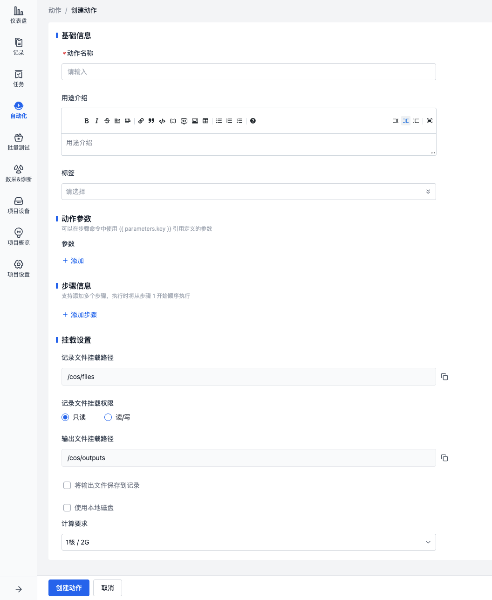
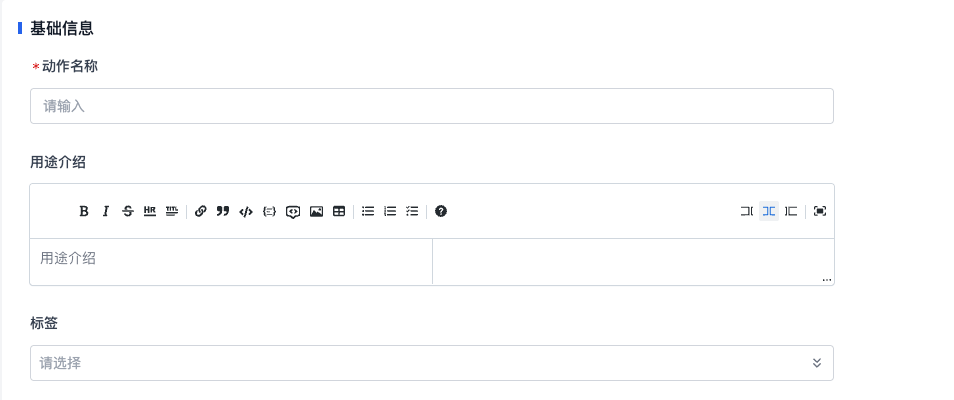
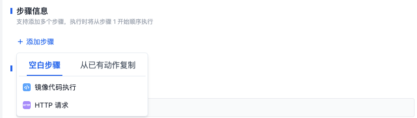
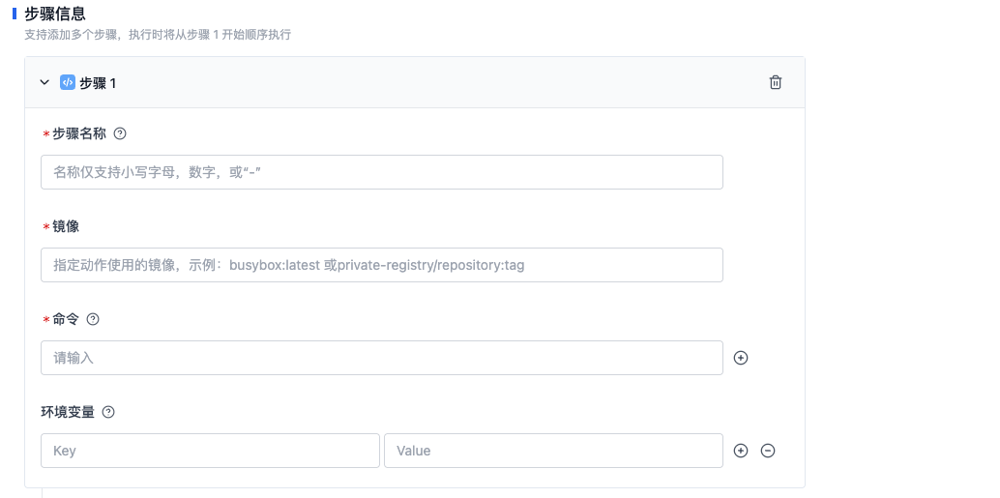
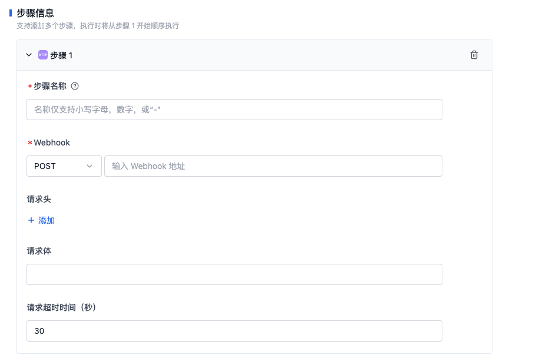
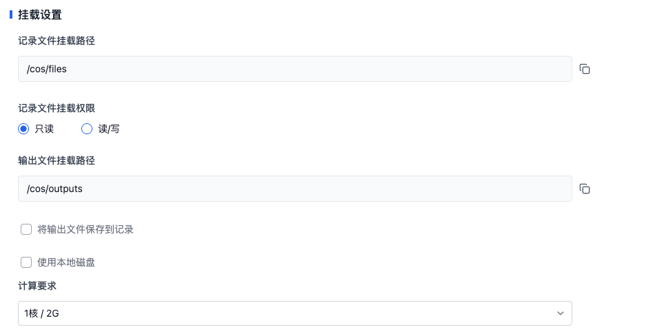

# 关于动作

动作是自动化流程的基本构建块，它代表了一个具体的任务。借助动作，可以对数据开展一系列处理操作，涵盖数据清洗、预处理、训练以及测试等环节。通过对记录调用相应的动作，即可完成数据处理流程。



## 动作基础信息



- **动作名称**

  用于标识动作的具体功能或目的。

- **用途介绍**

  对动作的功能和用途进行详细描述，帮助用户理解动作的作用。

- **标签**
  用于对动作进行分类或标记，便于快速查找和筛选相关动作。

## 动作参数


参数包含 Key 和 Value，在步骤的命令中可使用 `{{parameter.key}}` 引用参数。

例如：Key 为 `input`，Value 为 `hello world`，则在步骤的命令中可使用 `{{parameter.input}}` 引用参数。

## 步骤类型及信息

一个动作可添加多个步骤，平台支持两种步骤类型：镜像代码执行、HTTP 请求。

- 「镜像代码执行」步骤是在指定的镜像环境中执行自定义的代码逻辑。
- 「HTTP 请求」步骤是向指定的 URL 发送 HTTP 请求，并获取响应结果。



### 镜像代码执行



- **步骤名称**

  用于标识步骤的具体功能

- **镜像**

  镜像作为动作的执行环境，集成了运行动作所需的全部依赖与工具。目前，支持以下两种镜像操作方式：
  - **自定义镜像**：将自定义镜像上传至平台，然后使用对应的镜像地址。详细操作说明请参考[镜像](../../image/1-about-docker-image.md)。
  - **公开镜像**：使用公开可访问的镜像地址，例如 Docker Hub 上的各类开放镜像。

- **命令**

  定义镜像运行之后执行的命令信息。请依据自定义镜像的实际需求修改，注意命令和相关的参数等均需要独立成行。

  例如，`ls -al` 的命令需要拆分为两行填写为：

  ```
  ls
  -al
  ```

- **环境变量**

  平台在运行镜像代码执行步骤时，会自动注入环境变量，方便动作在运行时和平台进行数据交换。

  请参考[动作运行时信息](./3-action-runtime.md#environment-variables)了解环境变量。

### HTTP 请求



- **步骤名称**

  用于标识步骤的具体功能。

- **Webhook**

  设置请求方法与请求 URL。

- **请求头**

  设置请求头信息，允许输入多个键值对。

- **请求体**

  设置请求体信息。

- **请求超时时间**

  设置请求超时时间，默认为 30 秒。

## 挂载设置



- **记录文件挂载路径**

  调用动作时，系统会将记录挂载到镜像的 `/cos/files` 目录下，用户可以在镜像中对记录进行操作。

- **记录文件挂载权限**

  定义镜像对记录文件的访问权限。目前，支持两种权限：
  - **只读**：镜像只能读取记录文件，但不能对记录文件进行修改。
  - **读写**：镜像可以读取和修改记录文件。

- **输出文件挂载路径**

  调用动作时，支持将需要输出的文件保存到 `/cos/outputs` 目录下，该目录为一次调用的输出目录。

- **将输出文件保存到记录**

  定义是否将输出到 `/cos/outputs` 目录下的文件保存到记录中。
  - **添加到原记录**：将输出到 `/cos/outputs` 目录下的文件上传到记录中。若有同名文件时，可选择覆盖同名文件或保留同名文件。
  - **覆盖原记录**：删除原记录中的文件，将输出到 `/cos/outputs` 目录下的文件上传到记录中。

- **使用本地磁盘**

  本地盘是实例所在物理机上的本地硬盘设备，具有低时延、高随机 IOPS、高吞吐量的优势。定义本地盘的挂载路径，用户可以在镜像中对本地盘进行操作。

- **计算要求**

  定义动作的计算资源要求，包括 CPU 和内存。1 核代表最高可以使用 1 虚拟核的 CPU，2G 代表最大使用 2G 的内存。当程序使用超过配置的计算资源时，可能会导致程序被系统终止，请预估使用资源并配置合理的计算要求。

  动作提供了四种默认配置：1核/2G，2核/4G，4核/8G，8核/16G。若有更高的需求，请联系我们。
