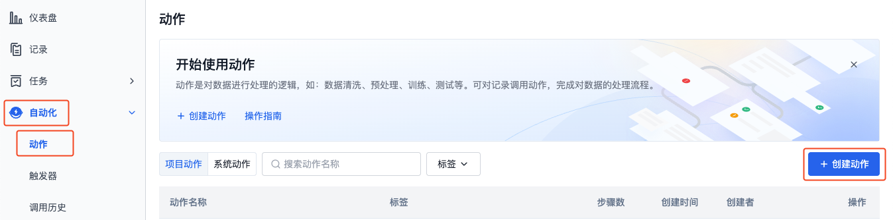
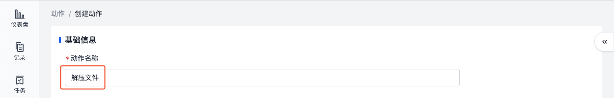
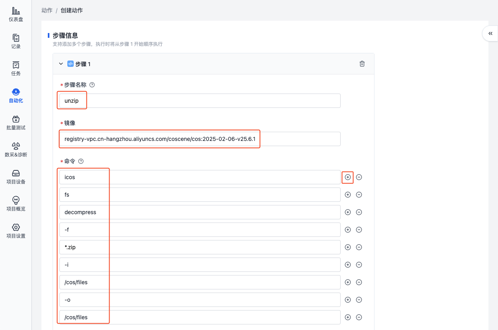
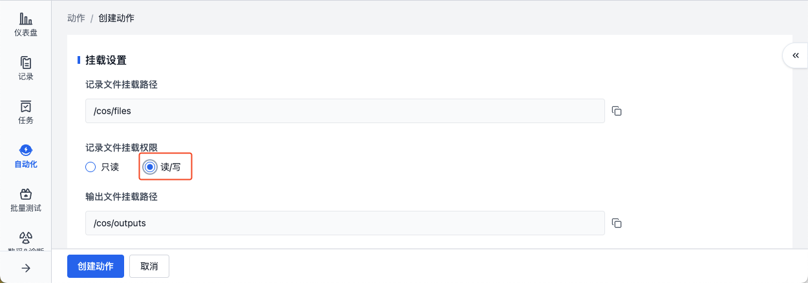
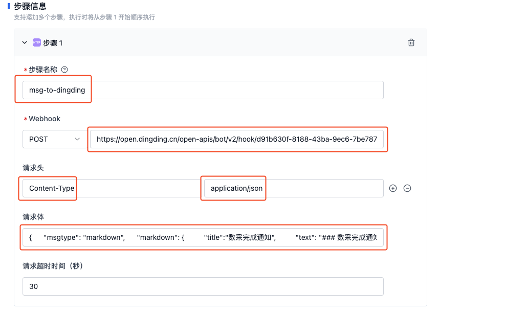
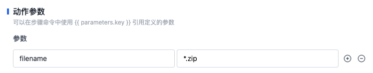

# 创建动作
当需要执行一个具体的任务时，可以在项目中创建一个动作。以下是创建动作的两种方式：
1. 添加空白步骤创建动作
2. 从已有动作复制步骤创建动作


## 添加空白步骤创建动作
### 添加「镜像代码执行」步骤创建动作
以创建一个「解压文件」的动作为例，介绍如何通过添加「镜像代码执行」步骤创建动作。

1. 进入项目，在「自动化-动作」页面，点击【创建动作】按钮。

    

2. 在创建动作页面，填写动作名称、步骤等信息。

- 动作名称：解压文件

    

- 添加「镜像代码执行」步骤：

    

- 步骤名称：unzip
- 镜像：registry-vpc.cn-hangzhou.aliyuncs.com/coscene/cos:2025-02-06-v25.6.1
    - 该镜像为刻行时空提供的镜像，内置 `icos` 工具，仅支持在平台内部使用，了解[镜像](../../image/1-about-docker-image.md)
- 命令：icos fs decompress f *.zip -i /cos/files -o /cos/files
    - 调用 `icos` 工具，对 `/cos/files` 目录（记录）下名称符合 `*.zip` 的文件进行解压，将其输出到原记录
    - 需一行填写一个参数，如第一行填写 `icos`，第二行填写 `fs`，以此类推

    
   
- 记录文件挂载权限：读/写
    - 允许该动作在执行期间对原记录进行读写操作
  
    

3. 点击【创建动作】按钮，完成动作创建。调用此动作可对记录中名称符合 `*.zip` 的文件进行解压。
   
    

### 添加「HTTP 请求」步骤创建动作
以创建一个「发送钉钉通知」的动作为例，介绍如何通过添加「HTTP 请求」步骤创建动作。

1. 进入项目，在「自动化-动作」页面，点击【创建动作】按钮。

    

2. 在创建动作页面，填写动作名称、步骤等信息。

- 动作名称：发送钉钉通知

   

- 添加「HTTP 请求」步骤：

   

- 步骤名称：msg-to-dingding

- Webhook：从钉钉自定义机器人中获取 Webhook 地址，具体步骤如下：
    1. 创建钉钉群
    2. 进入钉钉群，创建自定义机器人。详见[钉钉开发平台自定义机器人接入](https://open.dingtalk.com/document/robots/custom-robot-access)
    3. 复制机器人的 Webhook 地址

- 请求头：`Content-Type:application/json`

- 请求体： 
    
    ```markdown
    {
     "msgtype": "markdown",
     "markdown": {
         "title":"数采完成通知",
         "text": "### 数采完成通知 \n #### 任务名称：{{task.title}} \n #### 点击 [查看记录]({{record.link}}) \n"
        }
    }
    ```

  - 其中，`{{task.title}}` 和 `{{record.link}}` 为平台内置的变量，分别代表任务名称和记录链接。
  - 此动作一般用于发送任务完成通知，可根据实际需求修改请求体内容，详见钉钉的[帮助文档](https://open.dingtalk.com/document/orgapp/custom-bot-send-message-type)

  

3. 点击【创建动作】按钮，完成动作创建。调用此动作可发送钉钉通知。

   
   
## 从已有动作复制步骤创建动作
以创建一个「解压文件」的动作为例，介绍如何通过从已有动作复制步骤创建动作。
1. 进入项目，在「自动化-动作」页面，点击【创建动作】按钮。

       
   
2. 在创建动作页面，填写动作名称、从已有动作复制步骤。

- 动作名称：解压文件
- 添加步骤：从已有系统动作「解压文件」复制「main」步骤

  

- 添加参数：添加参数 `filename`，值为 `*.zip`，供命令 `{{parameters.filename}}` 引用此参数，表示对指定目录下名称符合 `*.zip` 的文件进行解压

  
 
3. 点击【创建动作】按钮，完成动作创建。调用此动作可对记录中名称符合 `*.zip` 的文件进行解压，并将结果输出到「调用详情」的「输出」页面。
 