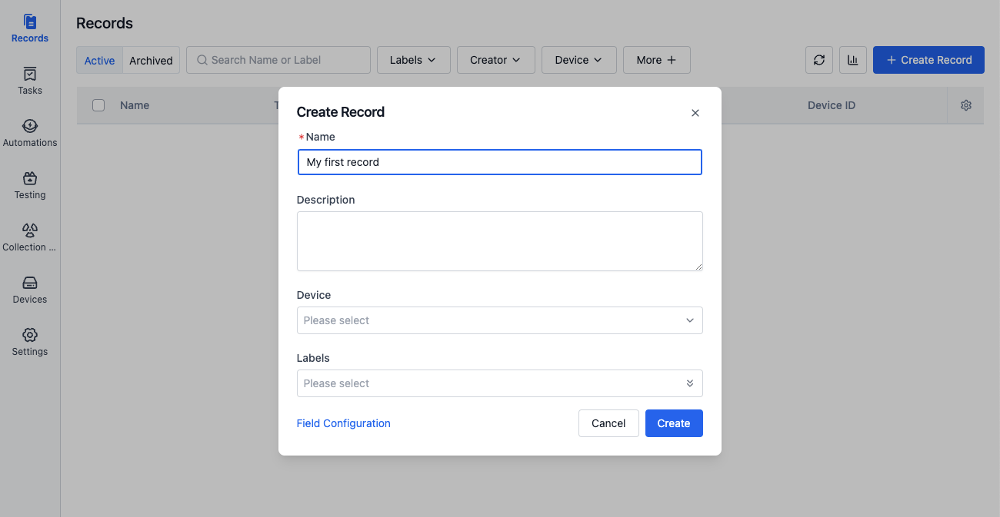
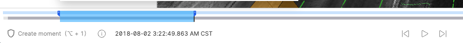
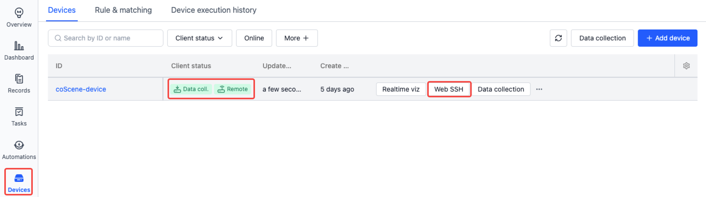

# Quick Start

## Login to coScene

coScene has two types of users: administrators and regular users. You can create or join an organization based on your role.

### Administrator

1. Visit [coScene Platform https://www.coscene.io/](https://www.coscene.io/) through your browser, click the【Login】button in the top right corner to enter the login page.

   

2. Choose a login method: Email or Google Workspace.

   

3. Fill in the "Organization Name" and "Organization ID", check "Agree", and click the【Create Organization】button.

   

4. After successful creation, you will automatically enter the organization homepage. You can start [managing your organization](../3-collaboration/organization/1-organizations.md) now.

### Regular User

> First, please contact your organization administrator to invite you to join the organization.

1. Visit [coScene Platform https://www.coscene.io/](https://www.coscene.io/) through your browser, click the【Login】button in the top right corner to enter the login page.

   

2. Choose the login method that matches your organization (Email or Google Workspace).

   

3. Select your organization to begin your data journey.

   

## Managing Multimodal Data

### Create Project

A project is the unit of data management, where data storage, management, isolation, and application take place. A project can represent a department, a project team, or a business line. For more information about projects, please refer to [Project](../3-collaboration/project-collaboration/1-project.md).

Click the "Create Project" button on the homepage and follow the guided steps to complete project creation.


### Create Record and Upload Files

A record is a collection of files describing similar scenarios, used for storing, managing, and visualizing data. A record can contain data generated during device failures, task execution data, small datasets for annotation, such as ROS Bags, logs, maps, configuration files, images, and videos. For more information about records, please refer to [Record](../3-collaboration/record/1-quick-start-record.md).

1.  In the project's left sidebar, select "Records" and click the【Create Record】button.

        

2.  Enter the record name and related information in the popup window, then click the【Create】button.

        

3.  After creation, you will automatically enter the record details page. Click the【Upload】button to upload bag/mcap files, or click [download sample file](https://coscene-download.s3.us-east-1.amazonaws.com/docs/example/viz/scene-0001.mcap) first.

        

### Visualize and Play Records

The data visualization interface uses configurable "panels" and "layouts" to present device data in an intuitive visual way, helping users efficiently analyze and diagnose various issues. For more information about visualization, please refer to [Visualize Data](../viz/1-about-viz.md).

1.  After uploading a bag/mcap file to the record, click【Play】to enter the visualization page.

        

2.  In the layout bar of the visualization page, select【Import from File】and import the <a href="https://coscene-download.s3.us-east-1.amazonaws.com/docs/example/viz/nuScenes.json" download="nuScenes.json">sample layout</a>.

        

3.  Click the【Play】button at the bottom to start playing the data. You can switch between different panels (such as 3D view, line chart, state transition diagram, table, etc.) to view the data. For more panel instructions, please refer to [Panel Introduction](../viz/4-panel/1-panel-overview.md).

        

### Create and Share Moments

While playing data in the visualization interface, you can create "moments" to mark important time points or periods. Moments help you track key data changes (such as device anomalies, performance fluctuations) and other noteworthy information for later review and analysis. For more information about moments, please refer to [Moment](../viz/5-create-moment-viz.md).

1.  While playing a record in visualization, click【Create Moment】in the lower left corner to mark the start point of a moment.

        

2.  Click【Create Moment】again to mark the end point. A moment creation window will automatically pop up, with the blue area indicating the moment's time range.

        

3.  Fill in the relevant information and click【Create Moment】to complete. View all moments of the current record in the moment panel on the left.

    

4.  Click the share button to share the current moment's link with other members for collaborative analysis.

        

## Remote Device Connection

Devices can establish connections with real devices, see [Device](../device/1-device.md) for details.

### Add Device

> Prerequisites: Supports Linux devices, see [Device supported versions](../device/2-create-device.md#supported-versions)

1.  Through the top-right "My Account", enter the "Organization Management-Devices" page and click the [Add Device] button.

      

2.  In the popup window, select [System Generated ID], click the [Copy] button to copy the installation command.
    - To use a custom ID, see [Device ID Configuration](../device/2-create-device.md#device-id-configuration)

      

3.  Open a shell terminal on the real device, execute the installation command. When the device shows `Installation completed successfully 🎉`, the installation is successful.

4.  Wait for 1-2 minutes, the device will automatically appear in the device list. Contact the organization administrator to grant device usage permissions.

    

5. Add device to project.

   

### Web SSH

After the device is granted access, find the device on the "Project-Devices" page and click the [Web SSH] button to open a new tab in the browser for remote device connection. For more details, please refer to [Web SSH](../device/5-device-remote-control.md#web-ssh).




### Real-time Visualization

> Prerequisites:
>
> 1. Install coBridge component
>    - coBridge is a standalone ROS node that transmits device data to the frontend in real-time via WebSocket protocol
>    - Supported ROS versions:
>      - ROS1: <u>Noetic Ninjemys</u>, <u>Melodic Morenia</u>
>      - ROS2: <u>Foxy Fitzroy</u>, <u>Galactic Geochelone</u>, <u>Humble Hawksbill</u>
>    - [View coBridge source code (C++)](https://github.com/coscene-io/coBridge)
> 2. After starting the coBridge node, you can view real-time device data on the web

After the device is granted access, find the device on the "Organization Management-Devices" page and click the【Realtime Viz】button to view the device's operating status and data in real-time through the browser. For more details, please refer to [Real-time Visualization](../device/5-device-remote-control.md#real-time-visualization).


In the real-time visualization page, you can debug devices more intuitively by configuring panels such as 3D view, raw messages, service calls, and remote control. For more details, please refer to [Panel Introduction](../viz/4-panel/1-panel-overview.md).


## Collect Device Data

Devices can establish connections with real devices as data collection targets. In related records, you can add device information to achieve precise retrieval and comprehensive statistics of data uploaded from that device, see [Device](../device/1-device.md) for details.

### Add Device

> Prerequisites: Supports Linux devices, arm64 and x86_64 architectures.

1.  Through the top-right "My Account", enter the "Organization Management-Devices" page and click the【Add Device】button.

      

2.  In the popup window, select【System Generated ID】, click the【Copy】button to copy the installation command.
    - To use a custom ID, see [Device ID Configuration](../device/2-create-device.md#device-id-configuration)
      

3.  Open a shell terminal on the real device, execute the installation command. When the device shows `Installation completed successfully 🎉`, the installation is successful.

4.  Wait for 1-2 minutes, the device will automatically appear in the device list. Contact the organization administrator to grant device usage permissions.

    

5. Add device to project.

   

### Manual Data Collection

1. **Configure Collection Directory**: Enter the organization device configuration page, set `collect_dirs` as the directories for storing data on the device, such as: `/home/bag/` and `/home/log/`.

   

   ```yaml
   mod:
     name: 'default'
     conf:
       enabled: true
       # Device collection directories, used as specified directories for project data collection tasks and rule collection
       collect_dirs:
         - /home/bag/
         - /home/log/
   ```

2. **Create Collection Task**: Enter the "Project-Devices" page to collect data.

   

   Choose the time range, collection path, collection name, and record name to begin data collection.

   

   - Time Range for Collection
      - Time basis: file creation time and last modified time
      - Note: Some file systems may not support file creation time. In such cases, only the last modified time is used.
   - Paths for Time Range Collection
      - Default paths are from `collect_dirs`; you can also input absolute file paths like `/home/bag2/`. The system will collect all files within this path (including subfolders) that match the time range.
   - Additional Specific File Paths
      - Input absolute paths of extra files/folders to be collected regardless of time range, e.g., `/home/map/`, `/home/device/config.yaml`. The system will collect the specified file or all files in the folder.
   - Collection Name & Record Name
      - Collection Name: used to identify this specific data collection task
      - Record Name: identifies the record where collected data is saved

3. **View Collection Results**: While collecting, you can view progress in the device execution history. The collected data will be automatically saved to the designated record.

   
   

### Automatic Data Collection

Automatic data collection uses predefined rules to continuously monitor device logs and automatically collect relevant data when specific conditions are triggered, enabling automatic analysis of device failures and early warning of potential risks. For more details, please refer to [Data Collection & Diagnosis](../use-case/data-diagnosis/3-add-rule.md).

1. **Configure Monitoring and Collection Directories**: Enter the organization device configuration page, set `listen_dirs`, `collect_dirs` and `topics`

   Note:

   - Ensure files exist in the configured directories. Only files directly under these directories are handled by default. To process nested subfolders, set   `recursively_walk_dirs` to `true`.
   - If you're using real-time topic listening, install and start the ROS node (see [Add Device](../device/2-create-device.md)).

   

   ```yaml
   mod:
     name: 'default'
     conf:
       enabled: true
       # Device collection directories, used as specified directories for project data collection tasks and rule collection
      
       # (Used for rule-based collection) Monitoring directories on the device side, used as the monitoring directories for rules in the project
      listen_dirs: 
         - /home/bag/

       # (Used for rule-based collection) When the current time exceeds the file update time by more than {skip_period_hours} hours, the file will not be monitored
       skip_period_hours: 2

       # (Used for rule-based & manual collection) Collection directories on the device side, used as specified directories for data collection tasks and rule collection in the project
       collect_dirs: 
          - /home/bag/
          - /home/log/

       # (Used for rule-based collection) Recursive directory traversal setting - whether to traverse all nested subdirectories for listen_dirs and collect_dirs, defaults to false
       recursively_walk_dirs: false
   ```

3. **Create Rule**:

   Suppose mcap files are continually generated in `/home/bag/`. To collect data based on these files:
   
   - Condition: If topic `/error_status` in an mcap file contains a data field with event codes 1001~1005
   - Action: Automatically collect files in `/home/bag/` from 5 minutes before to 1 minute after the event, and save to a record
   - Message Example:

      

   Rule Setup:
   | You can directly use the "Error Code Collection Rule" template

   - Add and enable the rule in your project via "Device - Rules & matching"

      
      

   - Input event detection details
      - Monitored topic: `/error_status`
      - Upload a CSV file as the event code table (used to verify whether topic messages contain codes listed in the `code` column)

         
      - Rule Trigger Condition: mag.data contains any value from the `code` column in the uploaded table

      This means: if `/error_status` topic's data field contains a keyword like `1001~1005`, the rule will be triggered.

   - Data Collection
      - Time Range: 
         - collect files in `collect_dirs` from 5 minutes before to 1 minute after the event
         - Time basis: based on timestamps within file contents
      - Record: identifies where collected data is saved, e.g., `code: {scope.code}-name: {scope.name}`. If event 1002 triggers, the record name will be: code:1002-name:Goal point unreachable! Please assist.
   - Key Moment Tagging
      - Once data is uploaded to the record, a "moment" will be created at the trigger time to help with later analysis

   - Enable Rule
      - Devices in the project will only follow the rule once it’s enabled

         

   - View Results
      - When a new mcap file appears in /home/bag/ and meets the rule conditions, data will be automatically uploaded
      - You can download [sample mcap file](https://coscene-download.s3.us-east-1.amazonaws.com/sample_data/example_code.mcap), copy it to /home/bag/, and wait 3-5 minutes to trigger the upload

         

## Learn More

- [Automate Data Processing](../6-automation/1-quick-start-workflow.md)
- [Changelog](https://docs.coscene.io/changelog)


