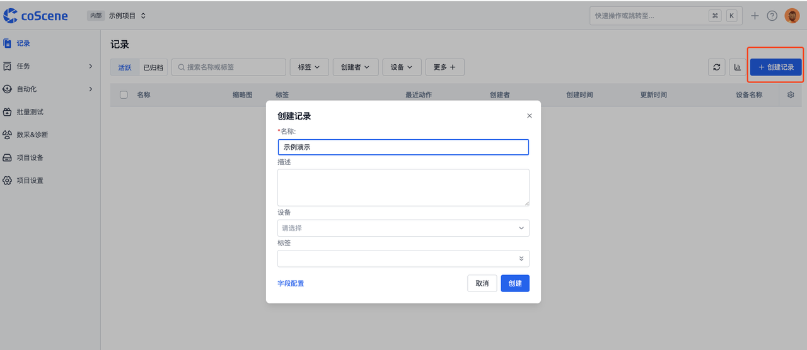
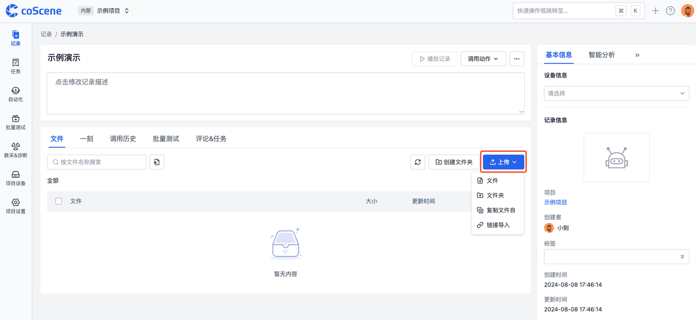
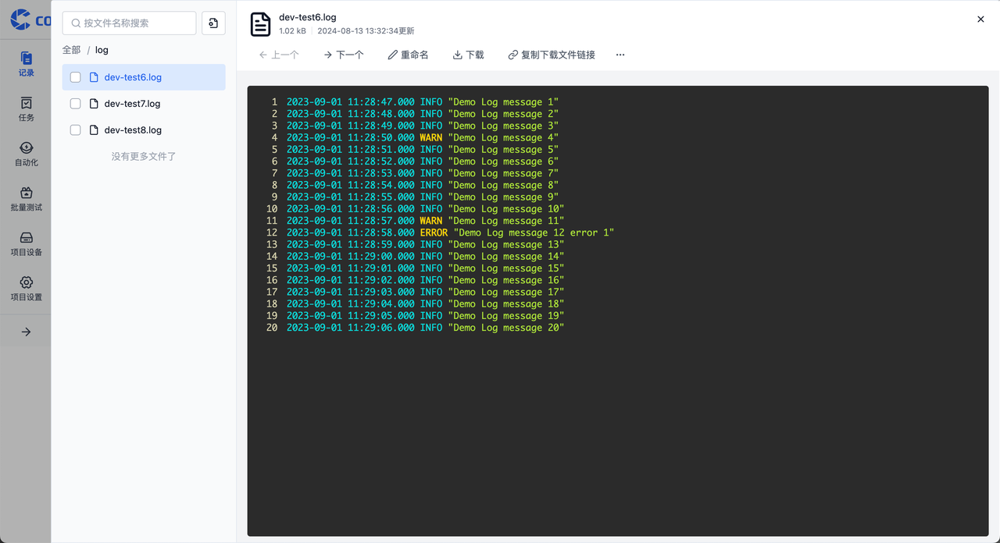
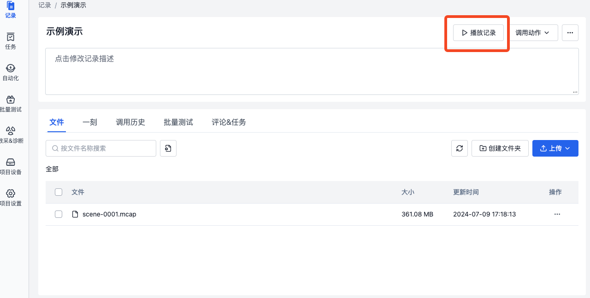
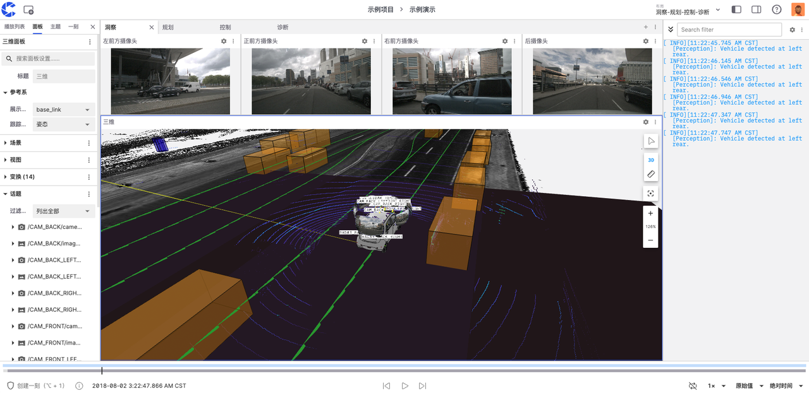

# Create and Visualize Records

After creating a project, you can create and manage records within it.

A record is a collection of data from similar scenarios over a period of time. You can upload, modify, edit, and visualize data supported by coScene within records. For detailed concepts about records, please refer to the [Records section in the Data Models chapter](../3-concepts/1-data-models.md#record).

## Creating a Record

On the records table page, click the [Create Record] button to manually create a record. For other creation methods, please refer to [Creating Records](../recipes/record/1-create-record.md).

## Uploading Files

### Uploading Files from Local

Click on the record name to enter the record details, then click the [Upload] button and choose a method to upload files.

After the file is successfully uploaded, we can see the recently uploaded file in the file list.

#### Preview of Common Files

For common file types such as text files, Excel spreadsheets, PDF documents, and images, the platform provides a default file preview method. This method is intuitive and easy to understand, allowing you to quickly browse the file contents.

#### Preview of Multimodal Data

For complex files containing multimodal data, such as ROS Bag and MCAP, the platform provides a record playback function. This feature allows you to sequentially view various data recorded in the file (such as sensor data, images, audio, etc.) as if playing a video, which is very suitable for data playback, event recreation, or analysis of complex interaction scenarios.

## Visualizing Data

Please create an [Autonomous Driving Sample Project] to obtain sample data for visualization.

In the record, click on Play Record to enter the visualization playback interface.

For more detailed tutorials on visualization, please refer to [Data Visualization](../4-recipes/6-viz/1-about-viz.md)
