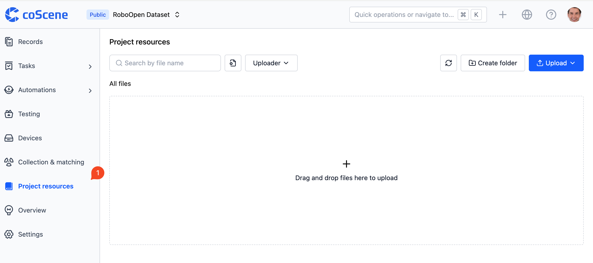

# Common Resource Storage

In the coScene platform, common robot data is typically stored within project records.

During actual usage, certain information may need to be shared across multiple entities or datasets, such as project documentation, map files, URDF files, TF configurations, layout files, and more. This information can be stored in the Common Resource Storage, making it available for sharing across multiple entities or datasets.

Common Resource Storage provides a convenient storage space that supports sharing across multiple entities or datasets. You can find the [Common Resources] feature in any project and upload the files you need.

Common use cases include referencing shared URDF files in visualizations and uploading project documentation to common resources.
