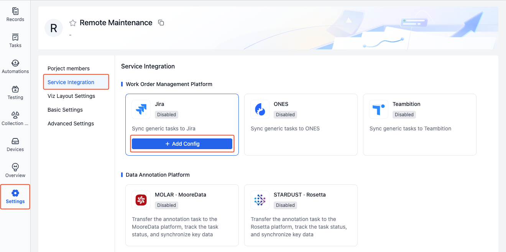
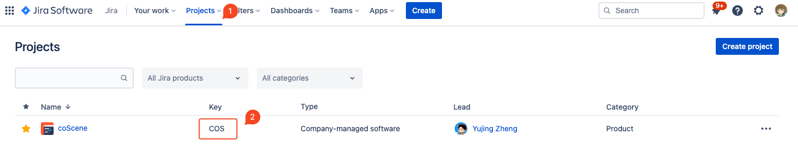
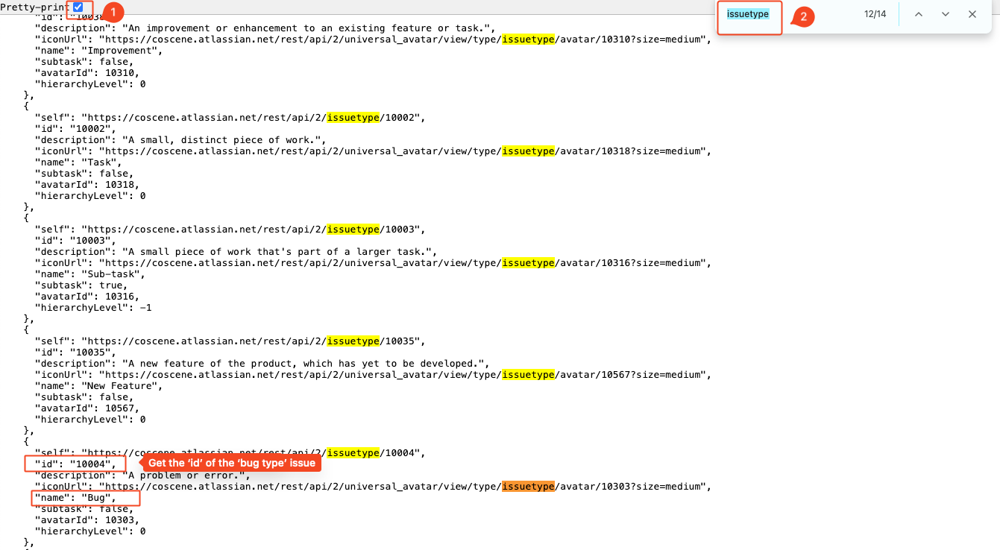
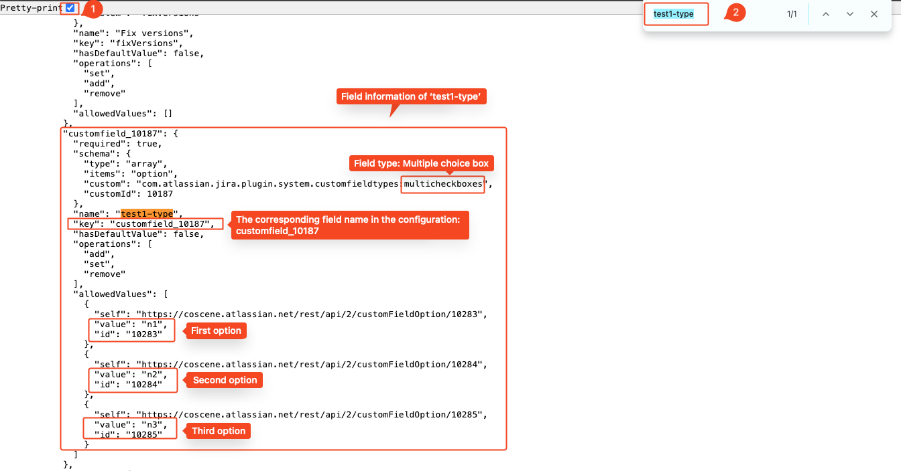
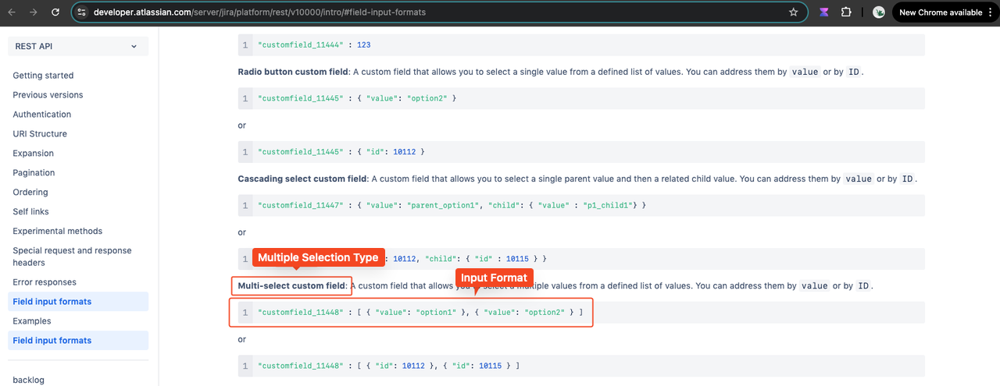
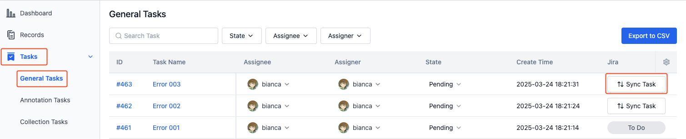
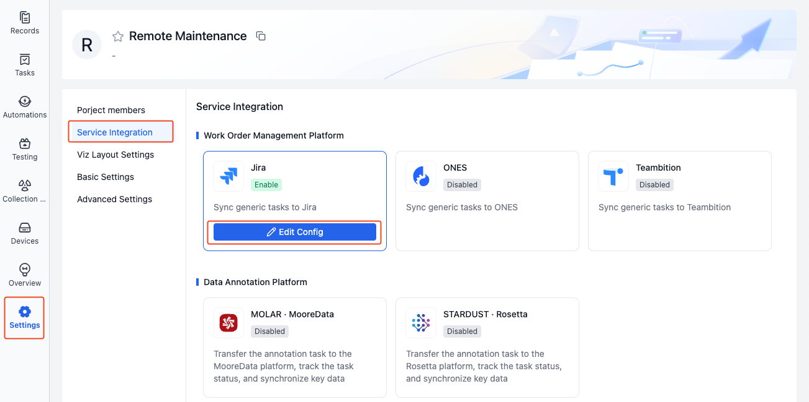
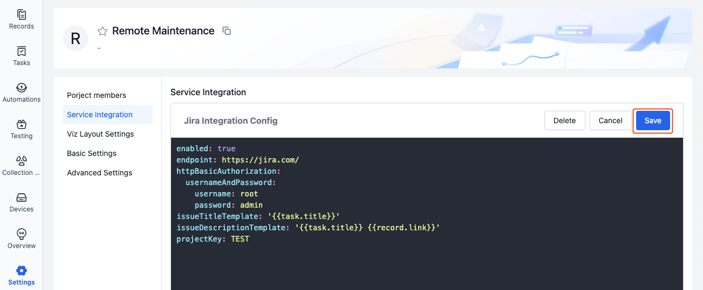
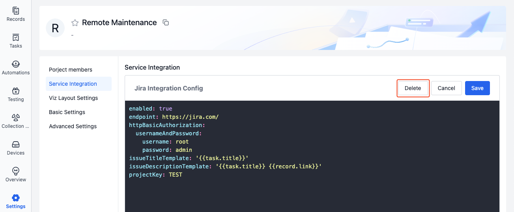

# Jira Integration

## Introduction

After configuring Jira integration, you can synchronize project tasks to Jira for unified task management on the enterprise ticketing platform. Here are typical use cases:

1. When device issues occur, automatically upload data and create tasks in Jira
2. During data visualization analysis, create tasks at key timestamps and sync them to Jira

## Operation Process

### Configure Integration

> Each project is configured independently, and only project administrators can edit

1. Enter the project that needs integration configuration, go to Project Settings - Service Integration - Jira, and click the [Add Config] button.

   

2. Fill in the integration configuration and save. Field descriptions are as follows:

   ```yaml
   enabled: true # Enable configuration

   endpoint: https://jira.com/ # Jira URL
   httpBasicAuthorization:
     usernameAndPassword:
       username: root # Jira username
       password: admin # Jira password

   projectKey: TEST # Jira project Key
   issueType: 'Bug' # Jira issue type
   issueTitleTemplate: '{{task.title}}' # Jira issue title, e.g., task name
   issueDescriptionTemplate: | # Issue description
     [Task Name]: {{task.title}}
     [Device ID]: {{device.id}}
     [Record Link]: {{record.link}}

   customFields: # Issue custom fields
     customfield_1:
       id: '88888' # Field 1 (dropdown style), select option with id 88888
     customfield_2: TEST # Field 2 (text box style), enter content as TEST
     customfield_3: # Field 3, enter P1
       value: P1
   ```

- **enabled**

  Jira integration status, enable/disable (true/false). Enabled by default, when disabled tasks cannot be synced to Jira

- **endpoint**

  Jira URL, e.g., `https://www.atlassian.com/`

- **username**

  Jira username, used to create issues and get issue information in Jira projects with this user's identity

- **password**

  Password corresponding to the Jira username

- **projectKey**

  Jira project Key, create issues in this project. The project Key needs to be looked up on the Jira platform, as shown:

  

- **issueType**

  Issue type, configure what type of issue to create (bug/task/other), obtain as follows:

  1. Open browser, modify as needed and enter the following URL to get information about all issue types in the Jira project.

     ```Plain Text
     {jira_endpoint}/rest/api/2/project/{projectKey}
     ```

     Where:

     - `{jira_endpoint}`: Jira URL, e.g., https://www.atlassian.com/
     - `{projectKey}`: Jira project Key

  2. After getting all issue type information, use ctrl + f shortcut to quickly find the id corresponding to the issue type you need to configure, e.g., find the id value for `issuetype` `Bug`

     

  3. After finding the id corresponding to the issue type, configure it in the `issueType` field.

     ```yaml
     issueType: '10004' # Jira issue type
     ```

- **issueTitleTemplate**

  Jira issue title template, can be customized or use variables, defaults to using the general task title, i.e., `'{{task.title}}'`

- **issueDescriptionTemplate**

  Jira issue description template, can be customized or use variables

- **customFields**

  Issue custom fields, can be customized or use variables. Get custom field names and values as follows:

  1. Open browser, modify as needed and enter the following URL to get information about all fields in the Jira project.

     ```Plain Text
     {jira_endpoint}/rest/api/2/issue/createmeta?projectKeys={projectKey}&expand=projects.issuetypes.fields
     ```

     Where:

     - `{jira_endpoint}`: Jira URL, e.g., https://www.atlassian.com/
     - `{projectKey}`: Jira project Key

  2. After getting all field information, use ctrl + f shortcut to quickly find the custom field name you need to configure, e.g., find the name and value of field `test1-type`

     

  3. Enter the corresponding field format according to the [Jira Official Documentation](https://developer.atlassian.com/server/jira/platform/rest/v10000/intro/#field-input-formats), enter the field name and value in the Jira configuration. Taking the multi-select box `test1-type` as an example:

     - Find "Multi-select Type" in the Jira official documentation, copy the format

       

     - Under custom fields in the Jira configuration, paste the "Multi-select Type" format, replace the content with the previously found `test1-type` field name and value

       ```yaml
       customFields:
         'customfield_10187': [{ 'value': 'n1' }, { 'value': 'n2' }]
       ```

### Variable Description

Task information in integration supports using variables, see the table below:

| Variable Name            | Meaning            |
| ------------------------ | ------------------ |
| `{{task.title}}`         | Task name          |
| `{{record.title}}`       | Record name        |
| `{{record.description}}` | Record description |
| `{{record.labels}}`      | Record labels      |
| `{{record.link}}`        | Record link        |
| `{{device.id}}`          | Device ID          |
| `{{device.title}}`       | Device name        |

### Synchronize Tasks to Jira

> After Jira integration configuration is complete, general tasks in the project can be synchronized to Jira. Learn about [General Tasks](../project-collaboration/2-general-task.md)

1. Enter the project's "General Tasks" page, click the [Sync Task] button corresponding to the task

   

2. After successful synchronization, the created Jira link and status will be displayed. Click the status button to jump to Jira to view issue details.

## Managing Jira Integration

> Only project administrators can manage Jira integration

### Edit Integration

1. In the project, go to "Project Settings - Service Integration" page, click [Edit Config] for Jira.

   

2. After completing the configuration, click [Save].

   

### Delete Integration

1. In the project, go to "Project Settings - Service Integration" page, click [Edit Config] for Jira.

   

2. Click [Delete], confirm again to delete the integration information. After deletion, tasks cannot be synchronized to Jira.

   
