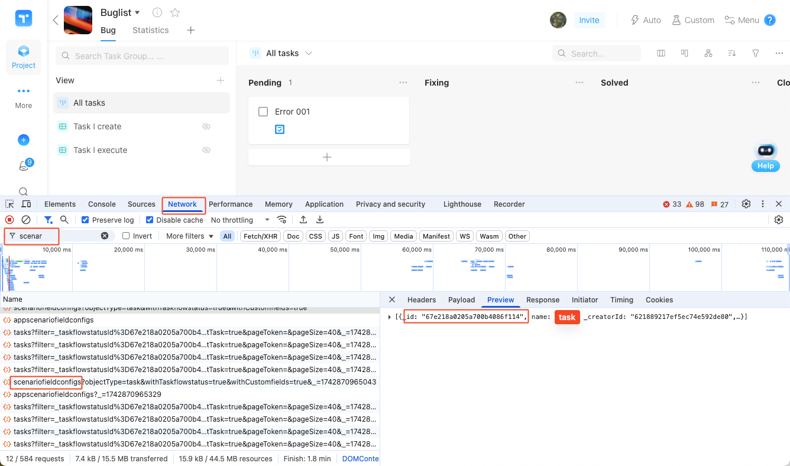

# Teambition Integration

## Introduction
After configuring Teambition integration, you can synchronize project tasks to Teambition for unified task management on the enterprise ticketing platform. Here are typical use cases:
1. When device issues occur, automatically upload data and create tasks in Teambition
2. During data visualization analysis, create tasks at key timestamps and sync them to Teambition

## Prerequisites
Ensure your Teambition enterprise has published an "Enterprise Internal Application". Follow these steps:

1. Go to [Teambition Open Platform](https://open.teambition.com/app), create a new application - Enterprise Internal Application, see [Teambition Application Publishing Documentation](https://open.teambition.com/docs/documents/5d89d63f8acc9d00143ac733)

2. Go to Application Development - Permission Management page, enable the following permissions:
    - Task - Task View Permission
    - Task - Task Creation Permission
    - Project - Project View Permission
    - Project - Get Bug Category List
    - Workflow Node - Search Enterprise Workflow

3. Publish the application on the application publishing page and contact enterprise administrator for review

4. Copy the App ID and App Secret from the Application Credentials and Basic Information page for later project integration

## Operation Process
### Configure Integration
> Only project administrators and organization administrators have edit permissions, other roles cannot view

1. Enter the project that needs integration configuration, go to Project Settings - Service Integration - Teambition, click [Add Config] button.

     

2. Fill in the integration configuration and save. Field descriptions are as follows:

    ```yaml
    enabled: true # Enable configuration
    endpoint: https://teambition.com # Teambition application web address
    apiEndpoint: https://open.teambition.com/api/ # Teambition API address
    appCredential:
    appId: xxxxxxxxxxxxxxxxxxxxxxxx # Teambition application unique identifier (App ID)
    appSecret: xxxxxxxxxxxxxxxxxxxxxxxx # Teambition application security key (App Secret)
    userId: xxxxxxxxxxxxxxxxxxxxxxxx # Teambition task creator's UID
    orgId: xxxxxxxxxxxxxxxxxxxxxxxx # Teambition organization ID
    projectId: xxxxxxxxxxxxxxxxxxxxxxxx # Teambition project ID

    issueTitleTemplate: '{{task.title}}' # Teambition title is task name
    issueDescriptionTemplate: |
    [Task Name]: {{task.title}}
    [Record Name]: {{record.title}}
    [Record Description]: {{record.description}}
    [Record Labels]: {{record.labels}}
    [Device ID]: {{device.id}}
    [Record Link]: {{record.link}}
    assignee: '{{moment.customFields.assignee}}' # Teambition task assignee's UID, from moment custom field 'assignee'
    deadline: '{{moment.triggerTime}}' # Teambition task deadline, from moment trigger time
    sprintId: '{{device.customFields.sprint}}' # Teambition sprint ID, from device custom field 'sprint'
    scenarioFieldConfigId: xxxxxxxxxxxxxxxxxxxxxxxx # Teambition task type (requirement/bug/task) ID
    customFields:
    - id: xxxxxxxxxxxxxxxxxxxxxxxx # Teambition custom field ID
        type: commongroup # Teambition custom field type
        values:
        - title: '{{moment.customFields.bug}}' # Teambition custom field value, from moment custom field 'bug'
    ```

- **enabled**
  
  Whether to enable the configuration, default is `true`

- **endpoint**

  Teambition application web address, default is `https://teambition.com`

- **apiEndpoint**

  Teambition API address, default is `https://open.teambition.com/api/`

- **appId**

  Teambition application unique identifier (App ID), available on the "Application Credentials and Basic Information" page of [Teambition Open Platform](https://open.teambition.com/app).

- **appSecret**

  Teambition application security key (App Secret), available on the "Application Credentials and Basic Information" page of [Teambition Open Platform](https://open.teambition.com/app).
  
  

- **userId**

  Teambition task creator's UID, available in Account Settings - Personal Account Center.

  |  |  |
  |:---:|:---:|

- **orgId**

  Teambition organization ID, available in browser URL.

  

- **projectId**

  Teambition project ID, available in browser URL after entering the project.

  

- **issueTitleTemplate**

  Teambition task title, can be customized, defaults to using task title, i.e., `'{{task.title}}'`

- **issueDescriptionTemplate**

  Teambition task notes, can be customized or use variables

- **assignee**

  Teambition task assignee's UID, available in Account Settings - Personal Account Center (same as userId).

- **deadline**

  Teambition task deadline, defaults to moment trigger time, i.e., `'{{moment.triggerTime}}'`

- **scenarioFieldConfigId**

  Teambition task type (requirement/bug/task), get corresponding id in browser developer mode in project.
  
  

- **customFields**

  Teambition task custom fields, configuration for one custom field is as follows:

  ```yaml
    - id: 67b****e93d23d # Custom field ID
    values:
        - title: **** # Custom field value
  ```

    - Custom field ID can be obtained in browser developer mode
    
    

  - Custom field values can be customized or use variables

  - For "Bug Category" field, add field type `type: commongroup`

    ```yaml
    customFields:
    - id: 67b2c****015 # Field ID
        type: commongroup # Field type, not needed for other custom fields
        values:
        - title: **** # Field value
    ```

### Variables
Task information in integration supports using variables, see the table below:

| Variable Name | Meaning |
|--------|------|
| `{{task.title}}` | Task name |
| `{{record.title}}` | Record name |
| `{{record.description}}` | Record description |
| `{{record.labels}}` | Record labels |
| `{{record.link}}` | Record link |
| `{{device.id}}` | Device ID |
| `{{device.title}}` | Device name |
| `{{moment.customFields.name}}` | Value of moment custom field `name` |
| `{{moment.triggerTime}}` | Moment trigger time |

### Synchronize Tasks to Teambition
1. Go to the configured Data Collection & Diagnosis rules, set "Create General Task" and "Sync Generic Tasks to Teambition" to "Yes" in the "Diagnostic Data" module

    

2. When device triggers rules, it will automatically upload data and create tasks in Teambition.