# General Tasks
Task workflow is a crucial method of project collaboration. You can create tasks in records and assign them to team members, combining "Comments" and "Moment" features to efficiently complete collaborative workflows.

## Creating Tasks
### Creating in Records
In the record details page's "Related Tasks" module, you can view tasks associated with the record. Click the "Create" button to create a new task.

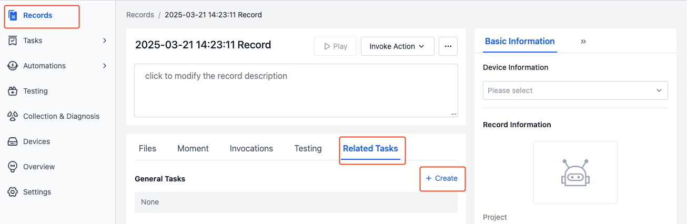

### Creating in Visualization Interface
While playing record content in the visualization interface, you can create a "Moment" to mark key frames and check "Create a New Task" to streamline work progress.

1. While playing the record, click the [Create Moment] button in the lower left corner to mark the start time point

     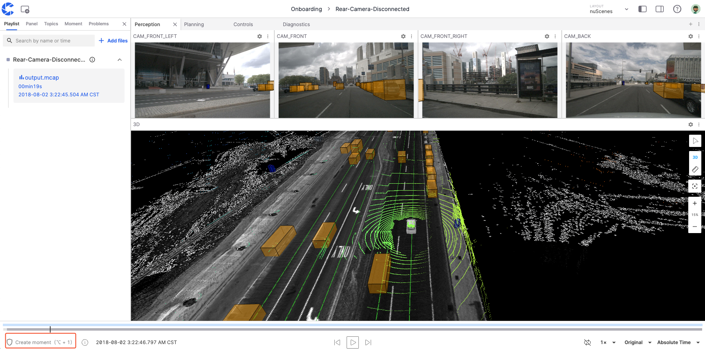

     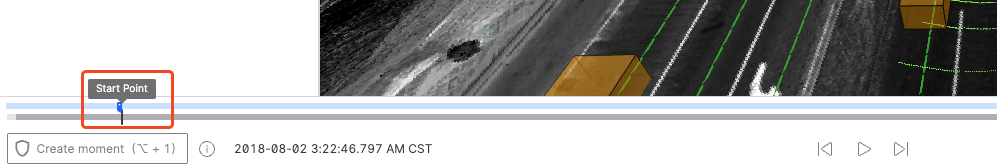

2. Continue playing and click the [Create Moment] button again at the desired time point to set the endpoint. The blue section on the timeline represents the "Moment" time range.

     

3. In the Create Moment dialog, check [Create a new task] and enter task information such as name and assignee.

     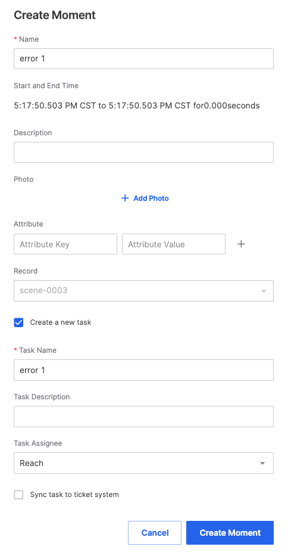

4. After successful creation, click [to view] in the success notification to view task details.

     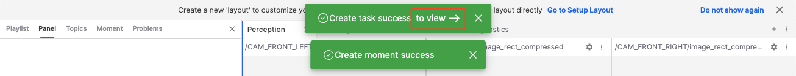

5. The created task will automatically reference the "Moment" in its description, helping to quickly locate key frames. Click the moment to play content at that time point.

     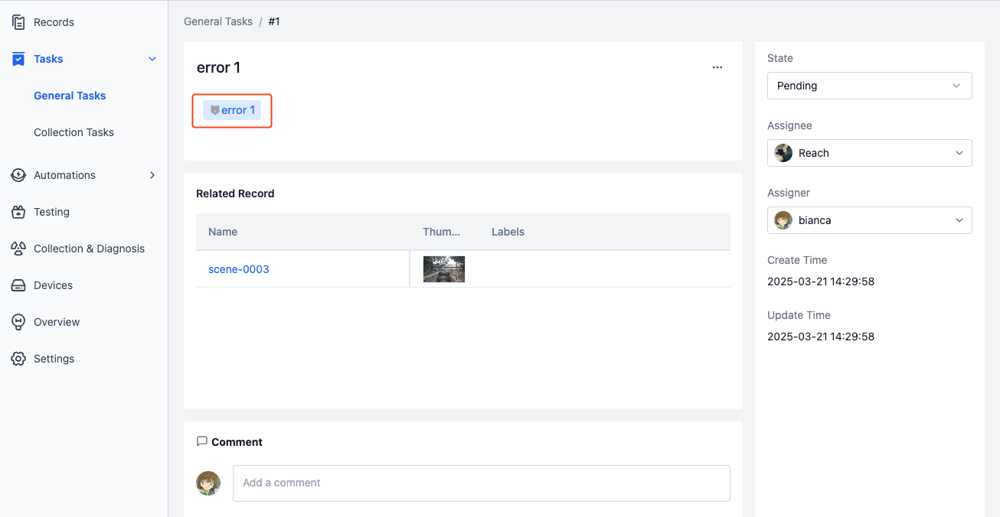

## Viewing Tasks
### Viewing My Tasks
In the homepage's "My Tasks" section, you can view your incomplete task list. Click the task name to jump to the corresponding task details page for viewing information and processing.

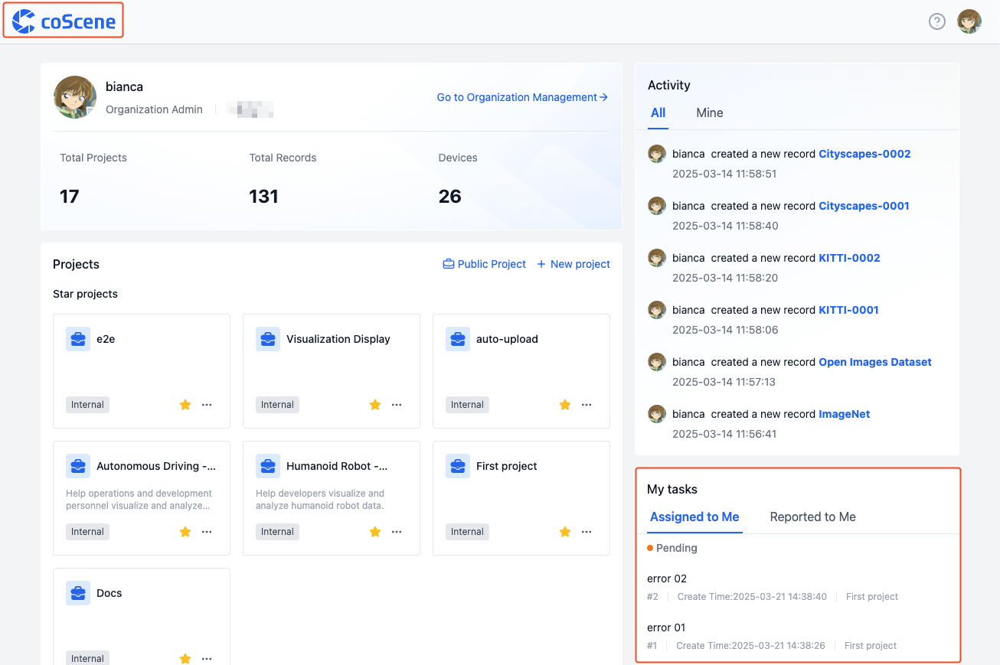

### Viewing Project Tasks
In the project's "Tasks - General Tasks" section, you can view all tasks in the project. Click the task name to view detailed information.

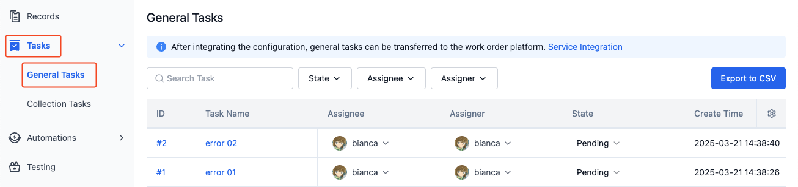

### Viewing Task-Related Records
On the task details page, you can view all records associated with the task. Click the record name to jump to the corresponding record details page.

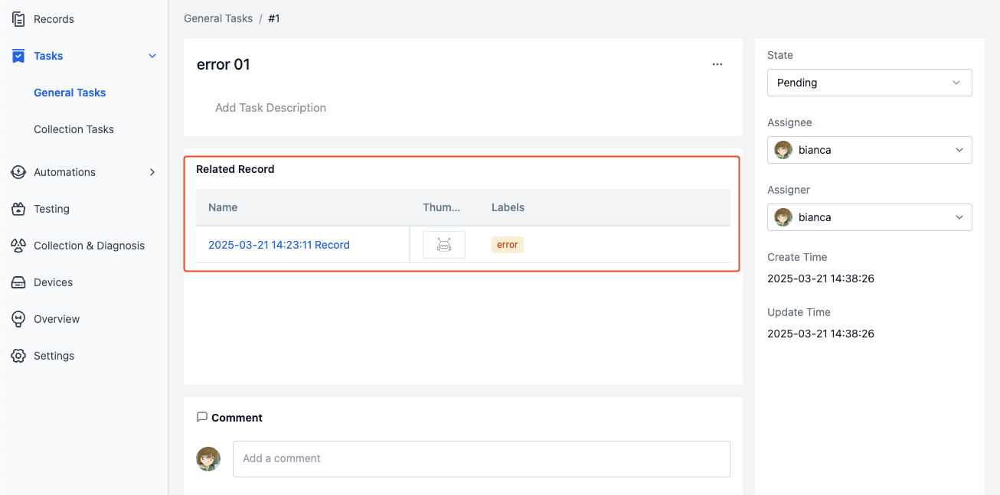

## Processing Tasks
### Changing State
General tasks have three states:
- Pending: Default status
- Progressing: Indicates the task is being processed
- Done: Completed tasks will no longer appear in the homepage "My Tasks" list

On the task details page, click "State" on the right to modify the task state:

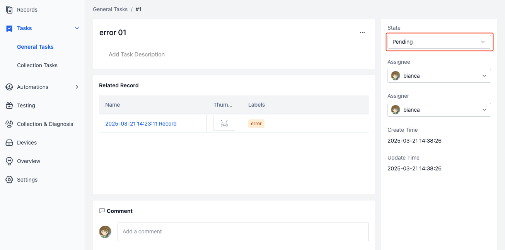

### Assigning Tasks
When you need to transfer a task to another member for processing, you can modify the task assignee.

On the task details page, click "Assignee" to assign the task to other members:

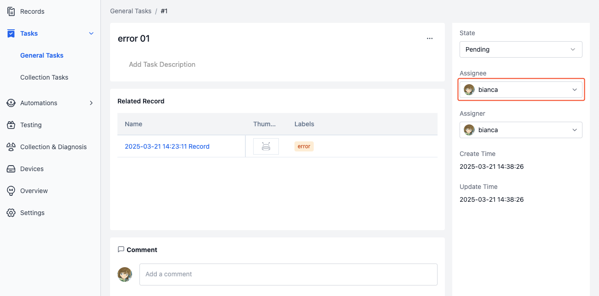

### Editing Tasks
On the task details page, click the title or description to edit task information:

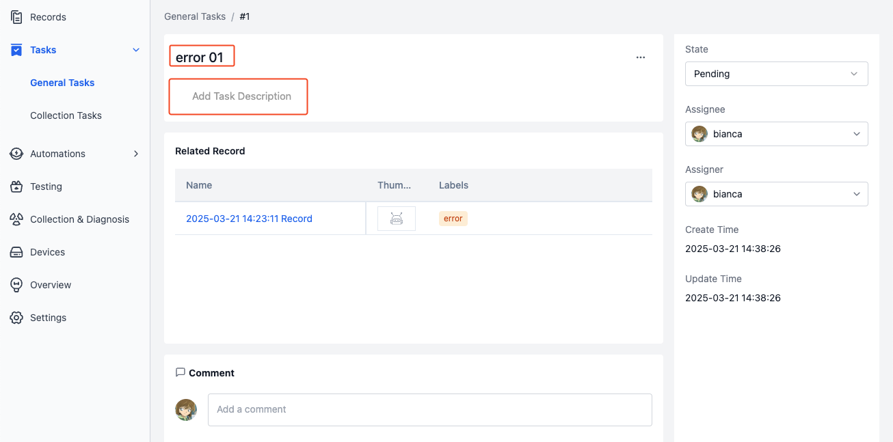

### Commenting on Tasks
On the task details page, you can view all comments associated with the task. Click the "Comment" input box to post a comment:

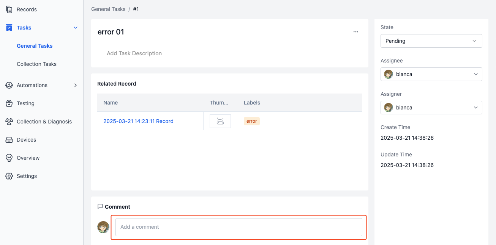

### Deleting Tasks
On the task details page, click [Delete] in the "More Actions" menu to delete the task.

## Learn More
- [Records](../record/1-quick-start-record.md)
- [Moment](../../viz/5-create-moment-viz.md)
