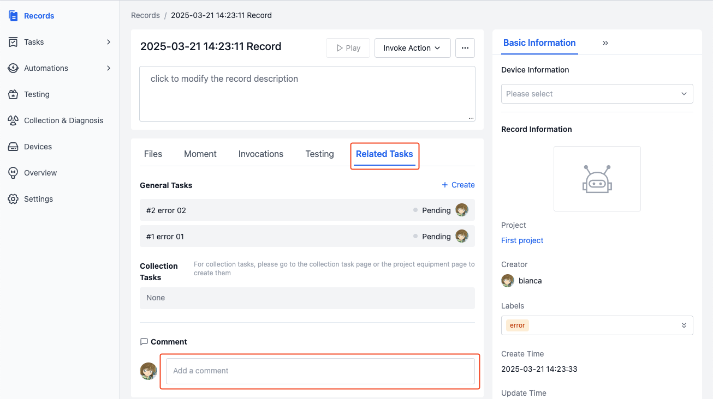
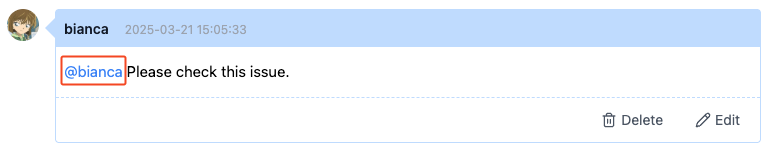
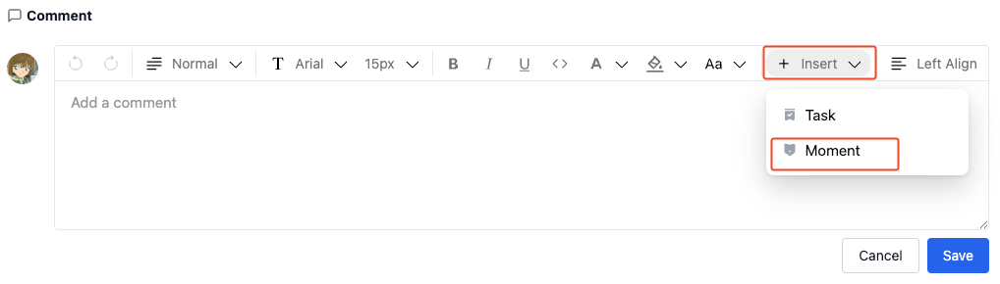
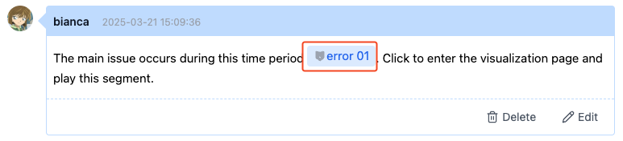
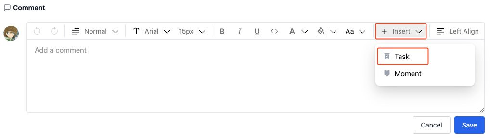
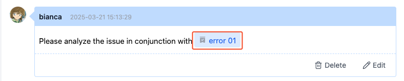
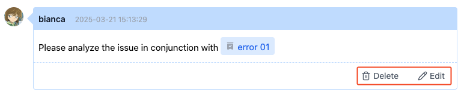

# Managing Comments in Records
After creating a record, team members may need to collaborate on data processing. Through the "Comments" feature, members can publish and receive relevant information for efficient collaboration.

## Adding Comments
View comments related to the record in the "Related Tasks" module on the record details page. Click the comment input box to post a comment.

Comments support features like @ mentioning users, referencing "Moments" and task links to help team members collaborate and communicate more efficiently.

### Mentioning Users in Comments
Enter the @ symbol in the comment input box to search and select members you want to mention.

### Referencing "Moments" in Comments
After adding a "Moment" link in a comment, members can click the moment to jump directly to the corresponding key frame position for visualization playback. Learn about ["Moments"](../../viz/5-create-moment-viz.md)

1. Click the [Insert Moment] button and select the "Moment" you want to reference in the "Insert Moment" window that appears.

     

2. After posting the comment, click the moment name to enter the visualization page and play the "Moment".
    
     

### Referencing "General Tasks" in Comments
After adding a "General Task" link in a comment, members can click the link to jump directly to the corresponding task details page. Learn about [General Tasks](./2-general-task.md)

1. Click the [Insert Task] button and select the "General Task" you want to reference in the "Insert Task" window that appears.

     

2. After posting the comment, click the task name to enter the task details page.

     

## Managing Comments
> Only project administrators or comment authors can edit or delete comments.

Click the [Edit] or [Delete] button in the lower right corner of the comment to manage comments.

