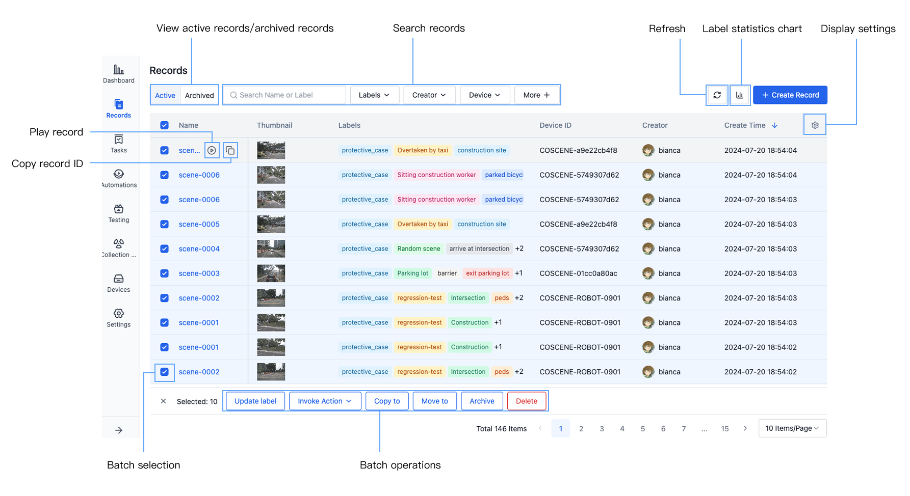
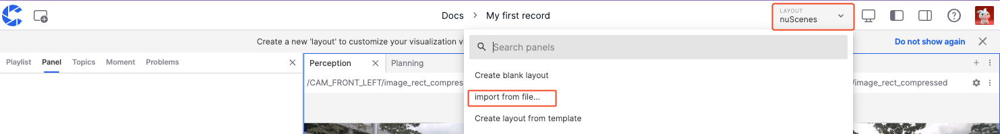
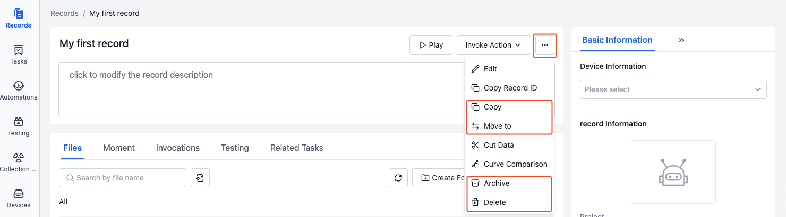

# Quick Start with Records

## Understanding Records

Records are collections of files describing similar scenarios, used for storing, managing, and visualizing data. A record can store data generated during a device failure, data produced during a device task execution, or a small segment of a dataset pending annotation, such as ROS Bags, logs, maps, configuration files, images, and videos.

## Record Interface

### Record List Page

### Record Detail Page

- **Files**: Files uploaded to the record
- **Moments**: Key timestamps in the record, e.g., when a failure occurred
- **Invocations**: History of actions called in the record for data processing
- **Testing**: History of batch tests performed on the record data
- **Related Tasks**: General tasks, collection tasks, annotation tasks, and comments associated with the record

## Getting Started with Records

### Create a Record and Upload Files

1. Enter the project, select "Records" from the left sidebar, and click the [Create Record] button.

2. Enter the record name and related information in the popup window, then click [Create].
3. After creation, you'll automatically enter the record details page. Click the [Upload] button to upload bag/mcap files, or click [Download Sample File](https://coscene-download.s3.us-east-1.amazonaws.com/docs/example/viz/scene-0001.mcap) to download and upload.

### Play Records

1. After uploading a bag/mcap file to the record, click [Play Record] to enter the visualization page.

2. In the layout panel of the visualization page, select [Import from File] to import the <a href="https://coscene-download.s3.us-east-1.amazonaws.com/docs/example/viz/nuScenes.json" download="nuScenes.json">Sample Layout</a>.

3. Click the [Play] button at the bottom to visualize the data. For more operations, see [Data Visualization](../../viz/1-about-viz.md).

### Edit Records

On the record details page, you can edit record information such as name, description, device, and labels.

1. Click to directly edit the record name and description.

2. In the record basic information section, you can select devices and labels.

- **Device**: Select the project device associated with the record
- **Labels**: Add, edit, or delete labels

### Manage Records
In the [More] operations of the record, you can perform the following actions:

- **Copy Record**: Copy the record to the current project or other projects
- **Move Record**: Move the record to other projects
- **Archive Record**: Archive the record, no longer used as common data
- **Delete Record**

For more operations, see the subsequent documentation.
