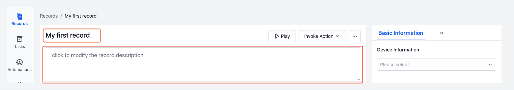

# Managing Records

Records support the following operations:

- **Basic operations**: view, edit, copy, move, archive, delete
- **Data processing**: invoke actions, annotation
- **Search and filter**: Filter records

## Basic Operations

### View

On the record list page, you can view record information including name, thumbnail, device, labels, recent actions, custom fields, etc.

- Click the record name to enter the record details page
- Click the thumbnail to view it in full size
- Click the device ID to enter the project device details page
- Click recent actions to view details of the most recent action
- Click the [Settings] button in the upper right corner of the table to set the display fields and sorting method

  

### Edit

On the record details page, you can edit record information such as name, description, device, labels, etc.

1. Click to directly edit the record name and description.

   

2. In the record basic information section, you can select devices and labels.

- Device: Select the project device associated with the record
- labels: add, edit, and delete labels

  

### Copy and Move

Copy/move records to specified projects for data reclassification and organization.

1. In the more operations menu of the record details, select [Copy to]/[Move to].

   

2. Select the target project in the popup window, click [OK] to view the corresponding record in the target project.

   

### Archive

The archive function can convert analyzed data to read-only status and remove it from the active list for long-term management of historical data. Use cases include:

- Data analysis is complete and results need long-term preservation
- Phase experimental data needs to be archived
- Historical data needs to be managed separately from active data
- Important data needs protection from accidental modifications

1. Select [Archive] from more operations in record details. The record will be archived after secondary confirmation.

   

2. View archived records in the archive column of the record list.

   

3. In archived record details, click [Unarchive] in the "More" operations to convert the record from archived to active status.

   

### Delete

> After deletion, records cannot be recovered.

Select [Delete] from more operations in record details. The record will be deleted after secondary confirmation.

### Batch Operations

On the record list page, select records to perform batch operations like edit labels, copy to, move to, archive, delete, etc.

## Data Processing

### Invoke actions

On the record details page, you can invoke actions to process record, such as: data trimming, automatic diagnostics, data comparison, etc.

1. On the record details page, click the [Invoke action] button and select the operation to perform on the record.

   

2. If you need to make a large - scale batch call of the same action for records:
  - Select multiple records in the record list，and click the [Invoke action] button and select the operation to perform on the records
  - You can also perform filtering, and then use the [Invoke Action for All Records under the Current Filter] button in the upper - right corner of the page to carry out the operation.

  

3. When the action is complete, you can view the results in the "Invocations". See [Automated actions](../../6-automation/1-quick-start-workflow.md) chapter for details.

### Annotation

> Only available for projects configured with annotation integration. Contact coScene for details.

On the record list page, select records to annotate and click the [Create Annotation Task] button to generate annotation tasks on the corresponding annotation platform.

## Search and filter

### Search

  You can search of the record list, enter keywords from the record name for a fuzzy search. You can view the number of search results in the lower - right corner of the page.

  

### Filter

  1. In the record list, you can filter records by record labels, creator, device, record custom fields, device custom fields, and other properties:

  

  2. Add more filtering conditions by clicking "Add Condition" and "Add Condition Group":
  - Multiple filtering conditions are supported.
  - Operators for filtering conditions are supported, such as equals, does not equal, contains, does not contain, etc.
  - Up to 3 layers of nested condition groups can be added.
  - By default, the relationship between each condition is "AND", and it can be manually switched to "OR".
  - Click the cross at the end of each row of conditions to delete that condition.
  - Click the delete button at the end of each group of conditions to delete that group of conditions.

   

3. Set the filter conditions and click the "Query" button to filter the records. 
 - The system will display the filtered records in the record list.
 - Click the "Clear" button to clear all filter conditions.

   