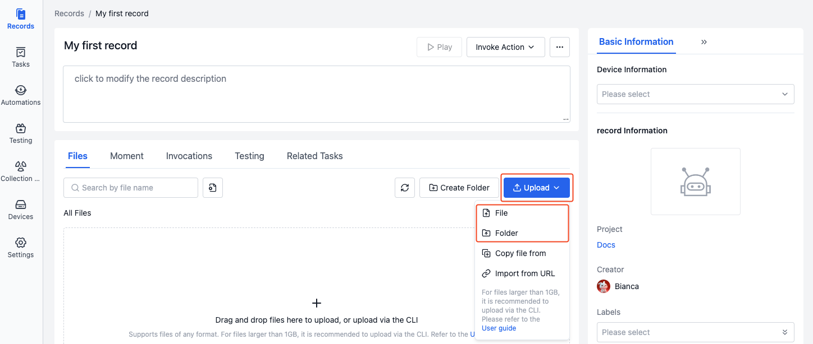

# Upload Files

## Introduction
> Only project members and above can upload files

After [creating a record](2-create-record.md), you can upload files in the following ways:
1. Upload directly
2. Copy from other records
3. Import from URL
4. Upload using coCLI command line tool

## Local Upload
Upload local files/folders to records by dragging and dropping or clicking the [Upload] button.

- **Upload via [Upload] button**

  On the record details page, click the [Upload] button and select files/folders to upload.

    

- **Upload via drag and drop**

  On the record details page, drag and drop files/folders to the file list area to upload.

    

## Copy from Other Records
Copy files from other records to the current record for quick file reuse.

1. On the record details page, click [Copy file from] in the [Upload] menu.

    

2. In the popup window, select which record to copy files from, check the files/folders, and click [OK] .

    

## Import from URL
Import remote files to records by pasting file URLs.

1. On the record details page, click [Import from URL] in the [Upload] menu.

    

2. In the popup window, paste the file URL and click [OK] .

    

3. When the "Upload From URL" action is complete, you can view the imported file in the file list.

    

## Upload Using coCLI Command Line Tool

To batch upload local files to records, you can use the [coCLI command line tool](../../developers/coSceneCli/1-cli-install.md).

## Learn More
- [Manage Files](5-manage-file.md)

## FAQ
1. **Q: What happens when uploading files with the same name?**

    A: When uploading local files with the same name, they will automatically overwrite existing files. Files generated through system actions, such as decompression or URL import, will be automatically renamed by adding a suffix to the filename.

2. **Q: What should I do if the file upload fails due to network interruption?**

    A: When a file upload fails, the upload progress dialog will show a "Upload Failed" status. You'll need to re-upload the file.

3. **Q: Why are files uploaded twice when dragging and dropping a folder?**

    A: If the folder is expanded during drag and drop, and both the folder and files within it are selected, they will be uploaded separately. To resolve this, only drag and drop the folder itself.
    
4. **Q: What should I do if link import fails?**

    A: Please check if the link is correct and publicly accessible.