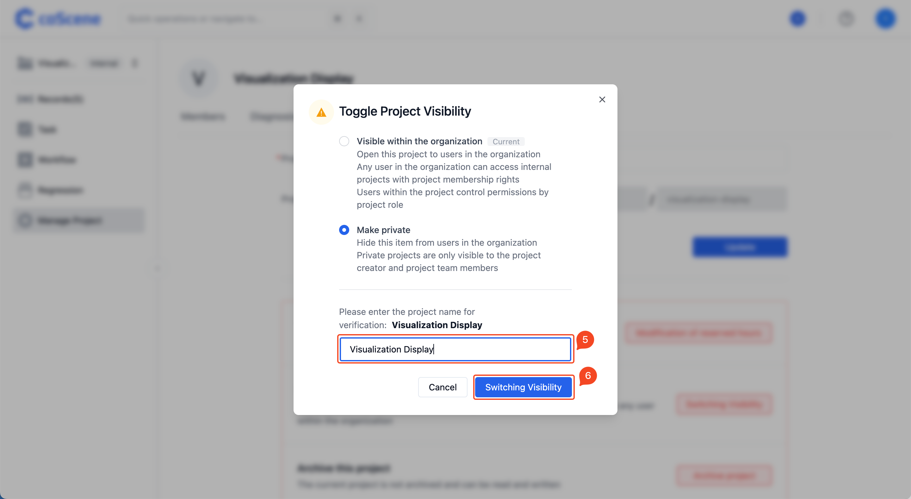
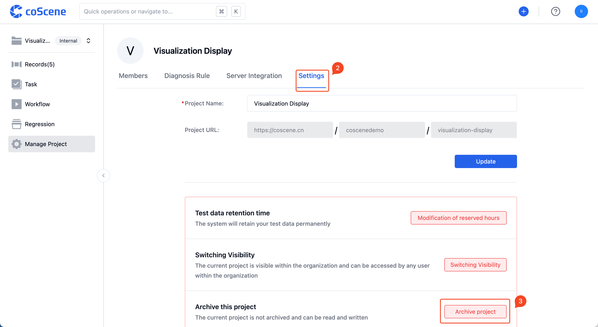
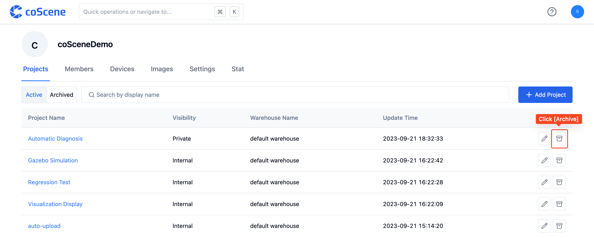

# 项目

## 1. 创建项目

### 1.1 创建项目的权限

组织中的「管理员」和「成员」在组织中有权限创建新的项目；组织「只读成员」只能加入已存在的项目。

### 1.2 如何创建一个新项目

- 点击首页左上角的【创建项目】按钮，即可开始创建。

  <video src="https://coscene-artifacts-prod.oss-cn-hangzhou.aliyuncs.com/docs/en/2-get-started/Creating-a-project.mp4" controls="controls" width="700" height="400"></video>

---

## 2.项目的可见性

在 coScene 中，您可以选择谁能访问您的项目。

> 谁可以使用这个功能 
> 仅组织管理员和项目管理员可设置项目可见性

### 2.1 关于项目可见性

我们建议您在更改项目可见性之前查看以下注意事项。

**将项目设为私有**

- 仅组织管理员和项目内部用户可访问。

- 项目内部用户的权限受项目角色控制。

**将项目设为内部**

- 组织内任意用户都能够访问，且在内部项目中具有项目成员权限。

- 项目内部用户的权限受项目角色控制。

### 2.2 修改项目可见性

- 在项目中，点击【管理项目】。

  

- 在【设置】中，点击【切换可见性】。

  
  

- 选择可见性，验证更改的项目可见性是否正确。

  

- 键入要更改其可见性的项目名称后，点击【切换项目可见性】。

  

---

## 3.项目成员的权限
> 谁可以使用这个功能 
> 仅组织管理员和项目管理员可设置项目成员角色

### 3.1 关于项目成员角色

项目中有三种角色，分别为：项目管理员、项目成员、项目只读成员。

- 项目管理员：具有项目内全部操作权限，能够为成员分配角色
- 项目成员：能够创建并访问项目中的数据，有读写权限
- 项目只读成员：支持访问项目内数据，有只读权限

### 3.2 修改项目成员角色

- 在项目中，点击【管理项目】。

  

- 在【成员】中，点击成员对应的项目角色，即可切换成员角色
  
  
  
---

## 4. 归档与取消归档项目

在 coScene 中，您可以归档项目来存放低活跃度的数据，以供他人查看和参考。

> 谁可以使用这个功能 
> 仅组织管理员和项目管理员可归档项目

### 4.1 归档项目

> 项目归档后，变为只读状态，项目内所有数据不再更新。

- 在项目中，点击【管理项目】。

  

- 在【设置】下，点击【归档项目】。

  

### 4.2 取消归档项目

> 项目取消归档后，恢复可读可写状态。

- 在项目中，点击【管理项目】。

  

- 在【设置】下，点击【取消归档项目】。

  

### 4.3 更多方法

- 在主页，点击【组织管理】，进入组织管理页面中默认的「项目列表」页面。

  

**归档项目**

- 在【活跃】的项目下，鼠标悬停在目标项目，点击【归档】按钮。

  

**取消归档项目**

- 在【项目】下，点击【已归档】，切换到已归档的项目列表。鼠标悬停在目标项目，点击【取消归档】按钮。

  

